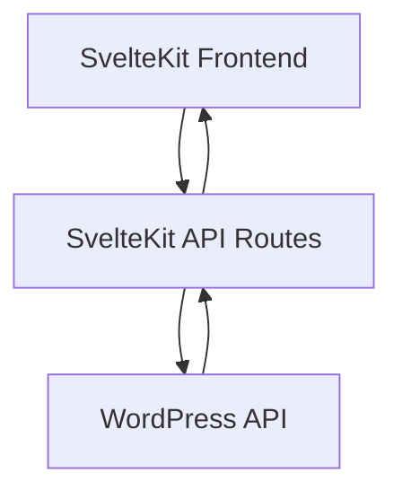

# SvelteKit Proxy Endpoints for WordPress API

This document outlines the implementation of proxy endpoints in SvelteKit to communicate with the WordPress API. These proxy endpoints handle authentication, data transformation, and error handling to provide a consistent API for the frontend.

## Architecture



## Implementation Pattern

All proxy endpoints follow a consistent pattern:

1. **Authentication Check**: Verify the user is authenticated and has the appropriate permissions
2. **Request Transformation**: Transform the request from the SvelteKit format to the WordPress API format
3. **API Call**: Make the request to the WordPress API
4. **Response Transformation**: Transform the response from the WordPress API format to the SvelteKit format
5. **Error Handling**: Handle any errors that occur during the process

## Authentication

Authentication is handled using JWT tokens stored in cookies. The `getTokenFromCookie` utility function retrieves the token from the cookie and includes it in the request to the WordPress API.

```typescript
import { getTokenFromCookie } from '$lib/utils/cookie-auth';

// In the request handler
const token = getTokenFromCookie(cookies);

if (!token) {
  return json({
    success: false,
    message: 'Authentication required'
  }, { status: 401 });
}

// Include token in WordPress API request
const response = await fetch(`${process.env.WP_API_URL}/wp/v2/endpoint`, {
  headers: {
    'Authorization': `Bearer ${token}`
  }
});
```

## Access Control

Access control is handled using the `accessControlService` to verify the user has the appropriate permissions.

```typescript
import { accessControlService } from '$lib/services/access-control-service';

// In the request handler
if (!accessControlService.hasAdminAccess()) {
  return json({
    success: false,
    message: 'Unauthorized: Admin access required'
  }, { status: 403 });
}
```

## Error Handling

Error handling is consistent across all endpoints, with appropriate status codes and error messages.

```typescript
try {
  // API call
} catch (error) {
  console.error('Error:', error);
  
  return json({
    success: false,
    message: error instanceof Error ? error.message : 'An unexpected error occurred'
  }, { status: 500 });
}
```

## Audit Logging

Audit logging is implemented for all write operations to track changes made by administrators.

```typescript
import { auditLogService } from '$lib/services/audit-log-service';

// After successful API call
await auditLogService.logAction(
  'update',
  'entity_type',
  entity_id,
  { field: { from: originalValue, to: newValue } }
);
```

## Implemented Endpoints

### User Management

- `GET /api/users` - List all users with pagination, sorting, and filtering
- `GET /api/users/:id` - Get a specific user's details
- `PUT /api/users/:id` - Update a user's information
- `POST /api/users` - Create a new user
- `DELETE /api/users/:id` - Delete a user
- `POST /api/users/:id/reset-password` - Reset a user's password

### Tribute Management

- `GET /api/tributes` - List all tributes with pagination, sorting, and filtering
- `GET /api/tributes/:id` - Get a specific tribute's details
- `PUT /api/tributes/:id` - Update a tribute's information
- `POST /api/tributes` - Create a new tribute
- `DELETE /api/tributes/:id` - Delete a tribute
- `GET /api/tributes/:id/html` - Get the HTML content of a tribute
- `PUT /api/tributes/:id/html` - Update the HTML content of a tribute

### Audit Logging

- `GET /api/audit-logs` - List audit logs with pagination, sorting, and filtering
- `GET /api/audit-logs/:id` - Get a specific audit log's details
- `POST /api/audit-logs` - Create a new audit log entry

## Data Transformation

Data transformation is handled to convert between the WordPress API format and the frontend format.

```typescript
// Transform WordPress user data to our format
const user = {
  id: wpUser.id,
  username: wpUser.username,
  name: wpUser.name || '',
  display_name: wpUser.name || wpUser.username,
  email: wpUser.email,
  roles: wpUser.roles || [],
  status: wpUser.status || 'active',
  created_at: wpUser.registered_date || new Date().toISOString(),
  last_login: wpUser.last_login || null
};
```

## Pagination, Sorting, and Filtering

Pagination, sorting, and filtering are implemented consistently across all list endpoints.

```typescript
// Get query parameters
const page = parseInt(url.searchParams.get('page') || '1');
const perPage = parseInt(url.searchParams.get('per_page') || '20');
const search = url.searchParams.get('search') || '';
const sortBy = url.searchParams.get('sort_by') || 'id';
const sortDirection = (url.searchParams.get('sort_direction') || 'asc') as 'asc' | 'desc';

// Build WordPress API URL with query parameters
let wpApiUrl = `${process.env.WP_API_URL}/wp/v2/endpoint?`;
wpApiUrl += `page=${page}&per_page=${perPage}`;

// Add search if provided
if (search) {
  wpApiUrl += `&search=${encodeURIComponent(search)}`;
}

// Add ordering
wpApiUrl += `&orderby=${sortBy}&order=${sortDirection}`;

// Get total counts from headers
const totalItems = parseInt(response.headers.get('X-WP-Total') || '0');
const totalPages = parseInt(response.headers.get('X-WP-TotalPages') || '0');

// Return pagination information
return json({
  success: true,
  items,
  pagination: {
    page,
    per_page: perPage,
    total_items: totalItems,
    total_pages: totalPages
  }
});
```

## Best Practices

1. **Consistent Response Format**: All endpoints return responses in a consistent format with `success` and either `message` or data.
2. **Error Handling**: All endpoints handle errors consistently with appropriate status codes and error messages.
3. **Audit Logging**: All write operations are logged for audit purposes.
4. **Access Control**: All endpoints check for appropriate permissions before processing the request.
5. **Data Transformation**: All data is transformed between the WordPress API format and the frontend format.
6. **Pagination**: All list endpoints support pagination, sorting, and filtering.
7. **Environment Variables**: API URLs and other configuration are stored in environment variables.
8. **Type Safety**: TypeScript is used for type safety and better developer experience.

## Example Implementation

```typescript
// /api/users/+server.ts
import { json } from '@sveltejs/kit';
import type { RequestHandler } from './$types';
import { accessControlService } from '$lib/services/access-control-service';
import { getTokenFromCookie } from '$lib/utils/cookie-auth';

export const GET: RequestHandler = async ({ request, cookies, url }) => {
  try {
    // Check if user has admin access
    if (!accessControlService.hasAdminAccess()) {
      return json({
        success: false,
        message: 'Unauthorized: Admin access required'
      }, { status: 403 });
    }
    
    // Get query parameters
    const page = parseInt(url.searchParams.get('page') || '1');
    const perPage = parseInt(url.searchParams.get('per_page') || '20');
    
    // Get WordPress token from cookie
    const token = getTokenFromCookie(cookies);
    
    if (!token) {
      return json({
        success: false,
        message: 'Authentication required'
      }, { status: 401 });
    }
    
    // Fetch users from WordPress API
    const response = await fetch(`${process.env.WP_API_URL}/wp/v2/users?page=${page}&per_page=${perPage}`, {
      method: 'GET',
      headers: {
        'Authorization': `Bearer ${token}`
      }
    });
    
    if (!response.ok) {
      throw new Error(`WordPress API error: ${response.status} ${response.statusText}`);
    }
    
    // Get total counts from headers
    const totalUsers = parseInt(response.headers.get('X-WP-Total') || '0');
    const totalPages = parseInt(response.headers.get('X-WP-TotalPages') || '0');
    
    // Parse response data
    const wpUsers = await response.json();
    
    // Transform WordPress user data to our format
    const users = wpUsers.map((wpUser: any) => ({
      id: wpUser.id,
      username: wpUser.username,
      name: wpUser.name || '',
      display_name: wpUser.name || wpUser.username,
      email: wpUser.email,
      roles: wpUser.roles || [],
      status: wpUser.status || 'active',
      created_at: wpUser.registered_date || new Date().toISOString(),
      last_login: wpUser.last_login || null
    }));
    
    return json({
      success: true,
      users,
      pagination: {
        page,
        per_page: perPage,
        total_users: totalUsers,
        total_pages: totalPages
      }
    });
  } catch (error) {
    console.error('Error fetching users:', error);
    
    return json({
      success: false,
      message: error instanceof Error ? error.message : 'An unexpected error occurred'
    }, { status: 500 });
  }
};