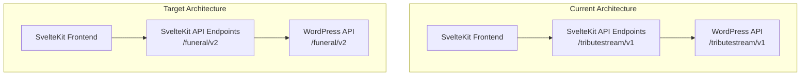

# WordPress API Proxy Implementation Plan

## Overview

This document outlines the plan for completely replacing the existing API implementation in the SvelteKit application with new endpoints that match the WordPress plugin's structure. The WordPress plugin uses the 'funeral/v2' namespace, and we'll update all references in the SvelteKit code to use this namespace.

## Current vs. Target Architecture



## Implementation Status

### ✅ Completed Tasks

1. **API Utilities Update**
   - Updated API constants to distinguish between WordPress backend paths and frontend paths
   - Added proper constants for all API endpoints

2. **API Endpoints Implementation**
   - Created all necessary API endpoints that match the WordPress plugin's structure
   - Implemented proper error handling and response formatting
   - Ensured all endpoints forward requests to the WordPress API correctly

3. **Specific Endpoints Implemented**
   - **Tribute Pages**: GET, POST, PUT/PATCH, DELETE operations
   - **Locations**: GET, POST, PUT/PATCH, DELETE operations
   - **Events**: GET, POST, PUT/PATCH, DELETE operations
   - **Users**: GET, POST, PUT/PATCH, DELETE operations
   - **Funeral Homes**: GET, POST, PUT/PATCH, DELETE operations
   - **Schedules**: GET, POST, PUT/PATCH, DELETE operations
   - **Special Endpoints**: Get tribute by slug, get events for a tribute, get locations for a tribute, get events for a location, get active events, get current user

4. **Documentation**
   - Updated API documentation to reflect the new endpoints

### 🔄 In Progress Tasks

None - All server-side API endpoints have been implemented.

### ⏭️ Next Steps

1. **Update Frontend API Clients**
   - Update `src/lib/api/tribute-api-client.ts` to use the new API endpoints
   - Update `src/lib/api/events-api.ts` to use the new API endpoints
   - Update `src/lib/persistence/events-persistence.ts` to use the new API endpoints
   - Create new API clients for funeral homes and schedules
   - Update other frontend components as needed

2. **Testing**
   - Test all endpoints with real data
   - Verify authentication and authorization
   - Test error handling
   - Ensure proper response formatting

## API Endpoints Implemented

### 1. Tribute Pages Endpoints

- ✅ `GET /api/tribute-pages` - List tributes with pagination and search
- ✅ `POST /api/tribute-pages` - Create a new tribute
- ✅ `GET /api/tribute-pages/[id]` - Get a tribute by ID
- ✅ `PUT/PATCH /api/tribute-pages/[id]` - Update a tribute
- ✅ `DELETE /api/tribute-pages/[id]` - Delete a tribute
- ✅ `GET /api/tribute/[slug]` - Get a tribute by slug
- ✅ `GET /api/tribute-pages/[id]/events` - Get events for a specific tribute
- ✅ `GET /api/tribute-pages/[id]/locations` - Get locations for a specific tribute

### 2. Locations Endpoints

- ✅ `GET /api/locations` - List locations with pagination and filtering
- ✅ `POST /api/locations` - Create a new location
- ✅ `GET /api/locations/[id]` - Get a location by ID
- ✅ `PUT/PATCH /api/locations/[id]` - Update a location
- ✅ `DELETE /api/locations/[id]` - Delete a location
- ✅ `GET /api/locations/[id]/events` - Get events for a specific location

### 3. Events Endpoints

- ✅ `GET /api/events` - List events with pagination and filtering
- ✅ `POST /api/events` - Create a new event
- ✅ `GET /api/events/[id]` - Get an event by ID
- ✅ `PUT/PATCH /api/events/[id]` - Update an event
- ✅ `DELETE /api/events/[id]` - Delete an event
- ✅ `GET /api/events/active` - Get active events (not ended yet)

### 4. User Management Endpoints

- ✅ `GET /api/users` - List users (admin only)
- ✅ `POST /api/users` - Create a new user (admin only)
- ✅ `GET /api/users/[id]` - Get a user by ID (admin or self)
- ✅ `PUT/PATCH /api/users/[id]` - Update a user
- ✅ `DELETE /api/users/[id]` - Delete a user (admin only)
- ✅ `GET /api/users/me` - Get current user

### 5. Funeral Homes Endpoints

- ✅ `GET /api/funeral-homes` - List funeral homes
- ✅ `POST /api/funeral-homes` - Create a new funeral home
- ✅ `GET /api/funeral-homes/[id]` - Get a funeral home by ID
- ✅ `PUT/PATCH /api/funeral-homes/[id]` - Update a funeral home
- ✅ `DELETE /api/funeral-homes/[id]` - Delete a funeral home

### 6. Schedule Endpoints

- ✅ `GET /api/schedules` - List schedules
- ✅ `POST /api/schedules` - Create a new schedule
- ✅ `GET /api/schedules/[id]` - Get a schedule by ID
- ✅ `PUT/PATCH /api/schedules/[id]` - Update a schedule
- ✅ `DELETE /api/schedules/[id]` - Delete a schedule

## Implementation Details

All endpoints are implemented as SvelteKit server routes that proxy requests to the WordPress REST API. They handle authentication, request validation, error handling, and response transformation.

The implementation follows the structure of the WordPress plugin exactly, ensuring that the frontend can communicate with the backend seamlessly. Each endpoint forwards requests to the corresponding WordPress API endpoint, maintaining the same URL structure and HTTP methods.

## Response Format

All API endpoints return responses in the following format:

```typescript
{
  success: boolean;         // Whether the request was successful
  data?: T;                 // Response data (when success is true)
  error?: string;           // Error message (when success is false)
  code?: string;            // Error code (when success is false)
  status: number;           // HTTP status code
}
```

## Conclusion

The server-side API implementation is now complete. All necessary endpoints have been created and properly configured to forward requests to the WordPress API. The next step is to update the frontend API clients to use these new endpoints.

## Future Work

1. Update frontend components to use the new API endpoints:
   - Update `src/lib/api/tribute-api-client.ts`
   - Update `src/lib/api/events-api.ts`
   - Update `src/lib/persistence/events-persistence.ts`
   - Create new API clients for funeral homes and schedules
   - Update other frontend components as needed

2. Comprehensive testing:
   - Test all endpoints with real data
   - Verify authentication and authorization
   - Test error handling
   - Ensure proper response formatting