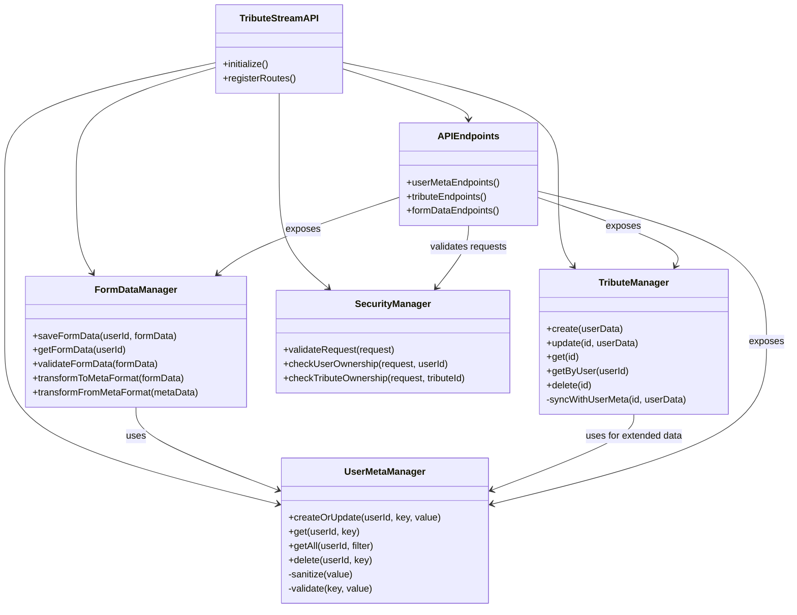
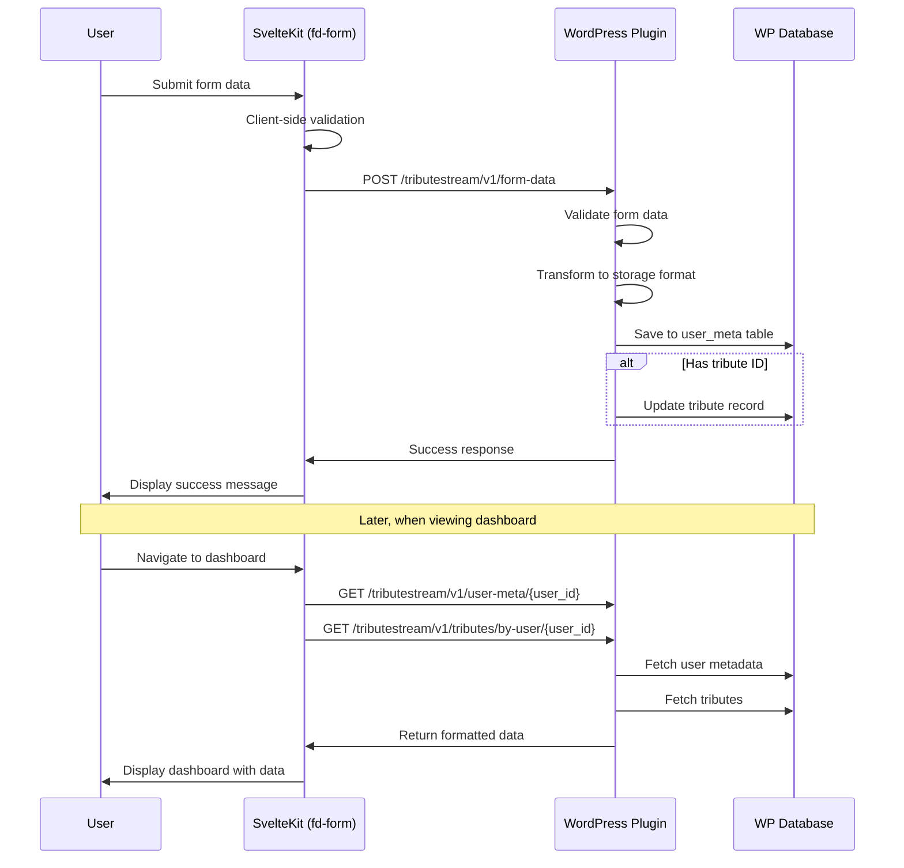

# Persistence Layer Enhancement Plan for TributeStream WordPress Plugin

## Overview

This document outlines a comprehensive plan for developing a robust and efficient persistence layer within the TributeStream WordPress plugin. The goal is to seamlessly handle user metadata with a focus on ensuring full compatibility between the `fd-form` and `my-portal` dashboard components.

## Current System Analysis

From examining the existing codebase, I've identified the following components and patterns:

### WordPress Plugin Components

- **User Metadata Management**:
  - REST API endpoints for CRUD operations under `/user-meta`
  - Metadata is stored using WordPress's native `get_user_meta()` and `update_user_meta()` functions
  - JSON-encoded complex objects are stored as single metadata entries

- **Tribune Data Storage**:
  - Custom `wp_tributes` table for storing core tribute information
  - Associated endpoints for managing tributes (`/tributes`)
  - Extended tribune data stored as user metadata

- **Authentication**:
  - JWT-based authentication for secure API access
  - Authorization checks based on user ownership and admin status

### Frontend Integration Points

- **fd-form**:
  - Collects detailed memorial information
  - Uses client-side validation
  - Data is submitted via form action

- **my-portal Dashboard**:
  - Displays user information, tributes, and memorial data
  - Fetches data via multiple API calls
  - Renders extended data when available

- **edit-form**:
  - Updates existing user metadata
  - Transforms form data into structured metadata
  - Updates related tribute records

### Current Data Flow

1. User submits form data through `fd-form`
2. SvelteKit processes the form submission in `+page.server.ts`
3. Data is transformed into structured JSON format
4. WordPress plugin endpoints receive the data
5. Data is stored in user metadata and/or tribune records
6. Dashboard retrieves and displays the data

## Persistence Layer Architecture

To enhance the persistence layer, I propose the following architecture:



### Core Components

#### 1. UserMetaManager

Responsible for all user metadata operations, providing a clean interface for storing and retrieving data:

```php
class UserMetaManager {
    /**
     * Create or update user metadata with improved validation and type handling
     *
     * @param int $user_id WordPress user ID
     * @param string $meta_key Metadata key
     * @param mixed $meta_value Value to store (arrays/objects will be JSON encoded)
     * @return array|WP_Error Result of operation
     */
    public function createOrUpdate($user_id, $meta_key, $meta_value) {
        // Validate user exists
        if (!get_userdata($user_id)) {
            return new WP_Error('invalid_user', 'User does not exist');
        }
        
        // Validate meta key format
        if (!$this->validateMetaKey($meta_key)) {
            return new WP_Error('invalid_meta_key', 'Meta key contains invalid characters');
        }
        
        // Pre-process value based on type
        $processed_value = $this->preprocessValue($meta_value);
        
        // Update the metadata
        $result = update_user_meta($user_id, $meta_key, $processed_value);
        
        if (false === $result) {
            return new WP_Error('update_failed', 'Failed to update user metadata');
        }
        
        return [
            'success' => true,
            'user_id' => $user_id,
            'meta_key' => $meta_key
        ];
    }
    
    /**
     * Get user metadata for a specific key
     *
     * @param int $user_id WordPress user ID
     * @param string $meta_key Metadata key
     * @return mixed|WP_Error Metadata value or error
     */
    public function get($user_id, $meta_key) {
        if (!get_userdata($user_id)) {
            return new WP_Error('invalid_user', 'User does not exist');
        }
        
        $value = get_user_meta($user_id, $meta_key, true);
        
        // Auto-detect and decode JSON values
        return $this->postprocessValue($value);
    }
    
    /**
     * Process value before storage
     *
     * @param mixed $value Value to process
     * @return mixed Processed value
     */
    private function preprocessValue($value) {
        if (is_array($value) || is_object($value)) {
            return wp_json_encode($value);
        }
        
        return $value;
    }
    
    /**
     * Process value after retrieval
     *
     * @param mixed $value Value to process
     * @return mixed Processed value
     */
    private function postprocessValue($value) {
        if (is_string($value) && $this->isJson($value)) {
            $decoded = json_decode($value, true);
            if (json_last_error() === JSON_ERROR_NONE) {
                return $decoded;
            }
        }
        
        return $value;
    }
    
    /**
     * Check if a string is valid JSON
     *
     * @param string $string String to check
     * @return bool True if valid JSON
     */
    private function isJson($string) {
        if (!is_string($string) || empty($string)) {
            return false;
        }
        
        // Quick check for JSON format
        $first = substr(trim($string), 0, 1);
        $last = substr(trim($string), -1);
        
        if (($first === '{' && $last === '}') || ($first === '[' && $last === ']')) {
            json_decode($string);
            return (json_last_error() === JSON_ERROR_NONE);
        }
        
        return false;
    }
    
    /**
     * Validate meta key format
     *
     * @param string $key Meta key to validate
     * @return bool True if valid
     */
    private function validateMetaKey($key) {
        return is_string($key) && !empty($key) && !preg_match('/[^a-zA-Z0-9_-]/', $key);
    }
}
```

#### 2. FormDataManager

Specializes in handling form data operations, with knowledge of form structure and validation requirements:

```php
class FormDataManager {
    /** @var UserMetaManager */
    private $userMetaManager;
    
    /** @var string The meta key for memorial form data */
    private $formMetaKey = 'memorial_form_data';
    
    /**
     * Constructor
     *
     * @param UserMetaManager $userMetaManager User meta manager instance
     */
    public function __construct($userMetaManager) {
        $this->userMetaManager = $userMetaManager;
    }
    
    /**
     * Save form data for a user
     *
     * @param int $user_id WordPress user ID
     * @param array $formData Raw form data
     * @return array|WP_Error Result of operation
     */
    public function saveFormData($user_id, $formData) {
        // Validate form data
        $validation = $this->validateFormData($formData);
        if (is_wp_error($validation)) {
            return $validation;
        }
        
        // Transform to storage format
        $storageData = $this->transformToMetaFormat($formData);
        
        // Save to user metadata
        return $this->userMetaManager->createOrUpdate($user_id, $this->formMetaKey, $storageData);
    }
    
    /**
     * Get form data for a user
     *
     * @param int $user_id WordPress user ID
     * @return array|WP_Error Form data or error
     */
    public function getFormData($user_id) {
        $metaData = $this->userMetaManager->get($user_id, $this->formMetaKey);
        
        if (is_wp_error($metaData)) {
            return $metaData;
        }
        
        if (empty($metaData)) {
            // Return default empty form structure
            return $this->getDefaultFormData();
        }
        
        // Transform from storage format to fd-form format
        return $this->transformFromMetaFormat($metaData);
    }
    
    /**
     * Transform raw form data to storage format
     *
     * @param array $formData Raw form data
     * @return array Structured data for storage
     */
    public function transformToMetaFormat($formData) {
        return [
            'director' => [
                'firstName' => $formData['director-first-name'] ?? '',
                'lastName' => $formData['director-last-name'] ?? '',
            ],
            'familyMember' => [
                'firstName' => $formData['family-member-first-name'] ?? '',
                'lastName' => $formData['family-member-last-name'] ?? '',
                'dob' => $formData['family-member-dob'] ?? '',
            ],
            'deceased' => [
                'firstName' => $formData['deceased-first-name'] ?? '',
                'lastName' => $formData['deceased-last-name'] ?? '',
                'dob' => $formData['deceased-dob'] ?? '',
                'dop' => $formData['deceased-dop'] ?? '',
            ],
            'contact' => [
                'email' => $formData['email-address'] ?? '',
                'phone' => $formData['phone-number'] ?? '',
            ],
            'memorial' => [
                'locationName' => $formData['location-name'] ?? '',
                'locationAddress' => $formData['location-address'] ?? '',
                'time' => $formData['memorial-time'] ?? '',
                'date' => $formData['memorial-date'] ?? '',
            ],
            'meta' => [
                'version' => '1.0',
                'lastUpdated' => current_time('mysql'),
            ],
        ];
    }
    
    /**
     * Transform storage format to fd-form format
     *
     * @param array $metaData Stored metadata
     * @return array Form data format
     */
    public function transformFromMetaFormat($metaData) {
        return [
            'director-first-name' => $metaData['director']['firstName'] ?? '',
            'director-last-name' => $metaData['director']['lastName'] ?? '',
            'family-member-first-name' => $metaData['familyMember']['firstName'] ?? '',
            'family-member-last-name' => $metaData['familyMember']['lastName'] ?? '',
            'family-member-dob' => $metaData['familyMember']['dob'] ?? '',
            'deceased-first-name' => $metaData['deceased']['firstName'] ?? '',
            'deceased-last-name' => $metaData['deceased']['lastName'] ?? '',
            'deceased-dob' => $metaData['deceased']['dob'] ?? '',
            'deceased-dop' => $metaData['deceased']['dop'] ?? '',
            'email-address' => $metaData['contact']['email'] ?? '',
            'phone-number' => $metaData['contact']['phone'] ?? '',
            'location-name' => $metaData['memorial']['locationName'] ?? '',
            'location-address' => $metaData['memorial']['locationAddress'] ?? '',
            'memorial-time' => $metaData['memorial']['time'] ?? '',
            'memorial-date' => $metaData['memorial']['date'] ?? '',
        ];
    }
    
    /**
     * Get default empty form data
     *
     * @return array Default form data
     */
    private function getDefaultFormData() {
        return [
            'director-first-name' => '',
            'director-last-name' => '',
            'family-member-first-name' => '',
            'family-member-last-name' => '',
            'family-member-dob' => '',
            'deceased-first-name' => '',
            'deceased-last-name' => '',
            'deceased-dob' => '',
            'deceased-dop' => '',
            'email-address' => '',
            'phone-number' => '',
            'location-name' => '',
            'location-address' => '',
            'memorial-time' => '',
            'memorial-date' => '',
        ];
    }
    
    /**
     * Validate form data
     *
     * @param array $formData Form data to validate
     * @return true|WP_Error True if valid, error otherwise
     */
    public function validateFormData($formData) {
        $errors = [];
        
        // Required fields
        $requiredFields = [
            'director-first-name' => "Director's first name is required",
            'director-last-name' => "Director's last name is required",
            'deceased-first-name' => "Deceased's first name is required",
            'deceased-last-name' => "Deceased's last name is required",
            'email-address' => "Email address is required",
            'location-name' => "Memorial location name is required",
        ];
        
        foreach ($requiredFields as $field => $message) {
            if (empty($formData[$field])) {
                $errors[$field] = $message;
            }
        }
        
        // Email validation
        if (!empty($formData['email-address']) && !is_email($formData['email-address'])) {
            $errors['email-address'] = "Invalid email format";
        }
        
        // Phone number validation
        if (!empty($formData['phone-number']) && !preg_match('/^[0-9\-\+\(\)\s]{7,20}$/', $formData['phone-number'])) {
            $errors['phone-number'] = "Invalid phone number format";
        }
        
        // Date validations
        $dateFields = ['deceased-dob', 'deceased-dop', 'memorial-date', 'family-member-dob'];
        foreach ($dateFields as $field) {
            if (!empty($formData[$field])) {
                $timestamp = strtotime($formData[$field]);
                if ($timestamp === false) {
                    $errors[$field] = "Invalid date format";
                }
            }
        }
        
        if (empty($errors)) {
            return true;
        }
        
        return new WP_Error(
            'form_validation_error',
            'Form validation failed',
            ['fields' => $errors]
        );
    }
}
```

#### 3. TributeManager

Manages tribute records and ensures synchronization with user metadata:

```php
class TributeManager {
    /** @var string The tributes table name */
    private $tableName;
    
    /** @var UserMetaManager */
    private $userMetaManager;
    
    /**
     * Constructor
     *
     * @param string $tableName Tributes table name
     * @param UserMetaManager $userMetaManager User meta manager instance
     */
    public function __construct($tableName, $userMetaManager) {
        $this->tableName = $tableName;
        $this->userMetaManager = $userMetaManager;
    }
    
    /**
     * Create a new tribute record
     *
     * @param array $tributeData Tribute data
     * @return array|WP_Error New tribute ID or error
     */
    public function create($tributeData) {
        global $wpdb;
        
        // Validate required fields
        $requiredFields = ['user_id', 'loved_one_name', 'phone_number'];
        foreach ($requiredFields as $field) {
            if (!isset($tributeData[$field]) || empty($tributeData[$field])) {
                return new WP_Error(
                    'missing_field',
                    sprintf('Missing required field: %s', $field),
                    ['status' => 400]
                );
            }
        }
        
        // Generate slug if not provided
        if (empty($tributeData['slug'])) {
            $tributeData['slug'] = sanitize_title($tributeData['loved_one_name']);
        } else {
            $tributeData['slug'] = sanitize_title($tributeData['slug']);
        }
        
        // Prepare data for insertion
        $insertData = [
            'user_id' => intval($tributeData['user_id']),
            'loved_one_name' => sanitize_text_field($tributeData['loved_one_name']),
            'slug' => $tributeData['slug'],
            'phone_number' => sanitize_text_field($tributeData['phone_number']),
            'created_at' => current_time('mysql'),
            'updated_at' => current_time('mysql'),
        ];
        
        // Add optional fields if present
        if (isset($tributeData['custom_html'])) {
            $insertData['custom_html'] = wp_kses_post($tributeData['custom_html']);
        }
        
        if (isset($tributeData['number_of_streams'])) {
            $insertData['number_of_streams'] = intval($tributeData['number_of_streams']);
        }
        
        // Insert record
        $inserted = $wpdb->insert($this->tableName, $insertData);
        
        if ($inserted === false) {
            return new WP_Error(
                'db_insert_error',
                'Failed to insert tribute record',
                ['status' => 500]
            );
        }
        
        $tributeId = $wpdb->insert_id;
        
        // Store extended data if provided
        if (isset($tributeData['extended_data'])) {
            $this->storeExtendedData($tributeId, $tributeData['user_id'], $tributeData['extended_data']);
        }
        
        return [
            'success' => true,
            'id' => $tributeId,
            'slug' => $tributeData['slug'],
        ];
    }
    
    /**
     * Update an existing tribute record
     *
     * @param int $tributeId Tribute ID
     * @param array $tributeData Updated tribute data
     * @return array|WP_Error Result or error
     */
    public function update($tributeId, $tributeData) {
        global $wpdb;
        
        // Fetch existing tribute to verify it exists
        $tribute = $this->get($tributeId);
        
        if (is_wp_error($tribute)) {
            return $tribute;
        }
        
        // Prepare updateable fields
        $updateData = [];
        $allowedFields = [
            'loved_one_name' => 'sanitize_text_field',
            'slug' => 'sanitize_title',
            'custom_html' => 'wp_kses_post',
            'phone_number' => 'sanitize_text_field',
            'number_of_streams' => 'intval',
        ];
        
        foreach ($allowedFields as $field => $sanitizer) {
            if (isset($tributeData[$field])) {
                $updateData[$field] = $sanitizer($tributeData[$field]);
            }
        }
        
        if (empty($updateData)) {
            return new WP_Error(
                'no_update_data',
                'No valid fields to update',
                ['status' => 400]
            );
        }
        
        // Always update the updated_at timestamp
        $updateData['updated_at'] = current_time('mysql');
        
        // Update record
        $updated = $wpdb->update(
            $this->tableName, 
            $updateData, 
            ['id' => $tributeId]
        );
        
        if ($updated === false) {
            return new WP_Error(
                'db_update_error',
                'Failed to update tribute record',
                ['status' => 500]
            );
        }
        
        // Update extended data if provided
        if (isset($tributeData['extended_data'])) {
            $this->storeExtendedData($tributeId, $tribute['user_id'], $tributeData['extended_data']);
        }
        
        return [
            'success' => true,
            'updated_rows' => $updated
        ];
    }
    
    /**
     * Get a tribute record by ID
     *
     * @param int $tributeId Tribute ID
     * @return array|WP_Error Tribute data or error
     */
    public function get($tributeId) {
        global $wpdb;
        
        $tribute = $wpdb->get_row(
            $wpdb->prepare(
                "SELECT * FROM {$this->tableName} WHERE id = %d",
                $tributeId
            ),
            ARRAY_A
        );
        
        if (!$tribute) {
            return new WP_Error(
                'tribute_not_found',
                'Tribute not found',
                ['status' => 404]
            );
        }
        
        // Get extended data
        $extendedData = $this->getExtendedData($tributeId, $tribute['user_id']);
        if (!is_wp_error($extendedData)) {
            $tribute['extended_data'] = $extendedData;
        }
        
        return $tribute;
    }
    
    /**
     * Store extended tribute data
     *
     * @param int $tributeId Tribute ID
     * @param int $userId User ID
     * @param array $data Extended data
     * @return array|WP_Error Result or error
     */
    private function storeExtendedData($tributeId, $userId, $data) {
        // Ensure tribute_reference is set
        $data['tribute_reference'] = $tributeId;
        
        // Store in user meta
        $metaKey = 'tributestream_extended_data_' . $tributeId;
        return $this->userMetaManager->createOrUpdate($userId, $metaKey, $data);
    }
    
    /**
     * Get extended tribute data
     *
     * @param int $tributeId Tribute ID
     * @param int $userId User ID
     * @return array|WP_Error Extended data or error
     */
    private function getExtendedData($tributeId, $userId) {
        $metaKey = 'tributestream_extended_data_' . $tributeId;
        return $this->userMetaManager->get($userId, $metaKey);
    }
}
```

#### 4. API Endpoints

Enhanced REST API endpoints for interacting with the persistence layer:

```php
class APIEndpoints {
    /** @var UserMetaManager */
    private $userMetaManager;
    
    /** @var FormDataManager */
    private $formDataManager;
    
    /** @var TributeManager */
    private $tributeManager;
    
    /** @var SecurityManager */
    private $securityManager;
    
    /** @var string API namespace */
    private $namespace = 'tributestream/v1';
    
    /**
     * Constructor
     *
     * @param UserMetaManager $userMetaManager User meta manager
     * @param FormDataManager $formDataManager Form data manager
     * @param TributeManager $tributeManager Tribute manager
     * @param SecurityManager $securityManager Security manager
     */
    public function __construct(
        $userMetaManager,
        $formDataManager,
        $tributeManager,
        $securityManager
    ) {
        $this->userMetaManager = $userMetaManager;
        $this->formDataManager = $formDataManager;
        $this->tributeManager = $tributeManager;
        $this->securityManager = $securityManager;
    }
    
    /**
     * Register all API endpoints
     */
    public function registerEndpoints() {
        // User Meta endpoints
        register_rest_route($this->namespace, '/user-meta', [
            [
                'methods' => 'POST',
                'callback' => [$this, 'createOrUpdateUserMeta'],
                'permission_callback' => [$this->securityManager, 'checkUserMetaOwnership'],
            ],
        ]);
        
        register_rest_route($this->namespace, '/user-meta/(?P<user_id>\d+)', [
            [
                'methods' => 'GET',
                'callback' => [$this, 'getUserMetaAll'],
                'permission_callback' => [$this->securityManager, 'checkUserOwnershipOrAdmin'],
            ],
        ]);
        
        register_rest_route($this->namespace, '/user-meta/(?P<user_id>\d+)/(?P<meta_key>[\w-]+)', [
            [
                'methods' => 'GET',
                'callback' => [$this, 'getUserMetaSingle'],
                'permission_callback' => [$this->securityManager, 'checkUserOwnershipOrAdmin'],
            ],
            [
                'methods' => 'DELETE',
                'callback' => [$this, 'deleteUserMetaSingle'],
                'permission_callback' => [$this->securityManager, 'checkUserOwnershipOrAdmin'],
            ],
        ]);
        
        // Form Data specific endpoints
        register_rest_route($this->namespace, '/form-data', [
            [
                'methods' => 'POST',
                'callback' => [$this, 'createOrUpdateFormData'],
                'permission_callback' => [$this->securityManager, 'checkJwtAuth'],
            ],
        ]);
        
        register_rest_route($this->namespace, '/form-data/(?P<user_id>\d+)', [
            [
                'methods' => 'GET',
                'callback' => [$this, 'getFormData'],
                'permission_callback' => [$this->securityManager, 'checkUserOwnershipOrAdmin'],
            ],
        ]);
        
        // Tribute endpoints
        // (existing tribute endpoints would be adapted to use the TributeManager)
    }
    
    /**
     * Create or update user meta
     *
     * @param WP_REST_Request $request API request
     * @return WP_REST_Response|WP_Error API response
     */
    public function createOrUpdateUserMeta($request) {
        $body = json_decode($request->get_body(), true);
        
        // Validate required parameters
        if (!isset($body['user_id']) || !isset($body['meta_key'])) {
            return new WP_Error(
                'missing_parameters',
                'Missing required parameters: user_id and meta_key',
                ['status' => 400]
            );
        }
        
        $userId = intval($body['user_id']);
        $metaKey = sanitize_key($body['meta_key']);
        $metaValue = $body['meta_value'] ?? '';
        
        $result = $this->userMetaManager->createOrUpdate($userId, $metaKey, $metaValue);
        
        if (is_wp_error($result)) {
            return $result;
        }
        
        return rest_ensure_response($result);
    }
    
    /**
     * Get all user meta
     *
     * @param WP_REST_Request $request API request
     * @return WP_REST_Response|WP_Error API response
     */
    public function getUserMetaAll($request) {
        $userId = intval($request['user_id']);
        
        $result = $this->userMetaManager->getAll($userId);
        
        if (is_wp_error($result)) {
            return $result;
        }
        
        return rest_ensure_response(['meta' => $result]);
    }
    
    /**
     * Create or update form data
     *
     * @param WP_REST_Request $request API request
     * @return WP_REST_Response|WP_Error API response
     */
    public function createOrUpdateFormData($request) {
        $body = json_decode($request->get_body(), true);
        
        // Validate required parameters
        if (!isset($body['user_id']) || !isset($body['form_data'])) {
            return new WP_Error(
                'missing_parameters',
                'Missing required parameters: user_id and form_data',
                ['status' => 400]
            );
        }
        
        $userId = intval($body['user_id']);
        $formData = $body['form_data'];
        
        // Save form data
        $result = $this->formDataManager->saveFormData($userId, $formData);
        
        if (is_wp_error($result)) {
            return $result;
        }
        
        // Update tribute if needed
        if (isset($body['tribute_id']) && !empty($body['tribute_id'])) {
            // Create tribute data from form data
            $tributeData = [
                'loved_one_name' => $formData['deceased-first-name'] . ' ' . $formData['deceased-last-name'],
                'phone_number' => $formData['phone-number'] ?? '',
            ];
            
            $this->tributeManager->update($body['tribute_id'], $tributeData);
        }
        
        return rest_ensure_response([
            'success' => true,
            'message' => 'Form data saved successfully'
        ]);
    }
}
```

### Data Flow Diagram

The following diagram illustrates the data flow in the enhanced persistence layer:



## Implementation Plan

I recommend a phased approach to implementation:

### Phase 1: Core Components (1-2 Days)

1. Create the `UserMetaManager` class
   - Implement CRUD operations with improved validation
   - Add type handling for complex data structures
   - Unit test each method

2. Create the `FormDataManager` class
   - Implement form data transformation methods
   - Add validation specific to memorial forms
   - Unit test each method

3. Refactor the `TributeManager` class
   - Adapt existing code to use the new UserMetaManager
   - Ensure proper synchronization with user metadata
   - Unit test each method

### Phase 2: API Endpoints (1-2 Days)

1. Create the `APIEndpoints` class
   - Refactor existing endpoints to use the new managers
   - Add dedicated form data endpoints
   - Implement improved error handling

2. Create the `SecurityManager` class
   - Refactor existing permission callbacks
   - Add nonce verification for extra security
   - Implement rate limiting for API endpoints

### Phase 3: Integration & Testing (1-2 Days)

1. Integrate with fd-form
   - Test creating new memorial forms
   - Test updating existing memorial data
   - Ensure all validations work properly

2. Integrate with my-portal dashboard
   - Test fetching and displaying user metadata
   - Test loading tribute data with extended information
   - Verify data consistency between views

3. System Testing
   - Perform end-to-end testing
   - Verify error handling and edge cases
   - Test performance with varying data sizes

### Phase 4: Documentation & Deployment (1 Day)

1. Create developer documentation
   - Document class structure and APIs
   - Include usage examples for frontend developers
   - Document data schemas and validation rules

2. Deploy to staging environment
   - Test in a realistic environment
   - Verify compatibility with production data
   - Perform final QA

3. Deploy to production
   - Monitor for any issues
   - Gather feedback for future improvements

## Key Benefits

The proposed persistence layer provides several advantages:

1. **Improved Data Integrity**
   - Stronger validation at every level
   - Consistent data transformations
   - Better error handling and reporting

2. **Enhanced Performance**
   - Optimized data storage formats
   - Reduced duplication of data
   - More efficient API endpoints

3. **Better Developer Experience**
   - Clear separation of concerns
   - Well-documented API interfaces
   - Consistent error handling

4. **Future Scalability**
   - Modular architecture allows for easy extensions
   - Versioned data structures for future compatibility
   - Clear integration points for new features

## Conclusion

This persistence layer enhancement provides a robust foundation for the TributeStream WordPress plugin, ensuring seamless interaction between the fd-form and my-portal dashboard components. By focusing on data integrity, performance, and developer experience, this implementation will support both current needs and future expansions of the platform.

The modular design allows for easy maintenance and extension, while the comprehensive validation ensures that data remains consistent across all parts of the system. With this implementation, user metadata management will be more reliable, efficient, and scalable.