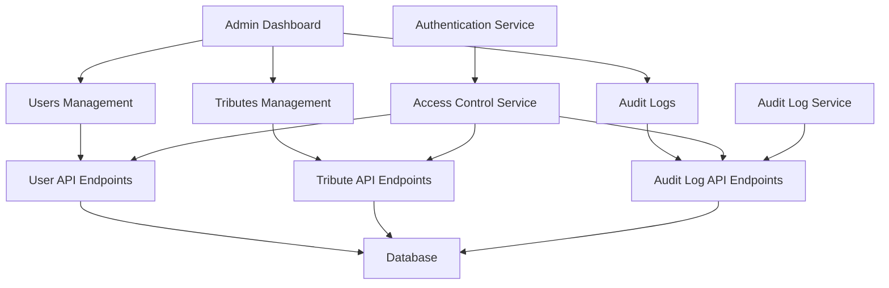
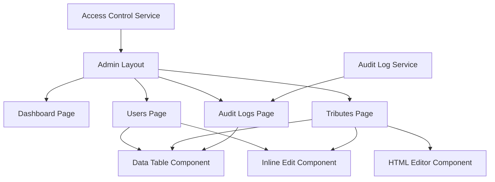

# TributeStream Admin Interface Implementation Progress

## Completed Components and Features

We have successfully implemented the core components and structure for the TributeStream administrative interface. Here's a summary of what has been accomplished:

### Core UI Components
- ✅ `data-table.svelte`: A reusable data table component with sorting, filtering, and pagination
- ✅ `inline-edit.svelte`: Component for inline editing of data fields
- ✅ `html-editor.svelte`: WYSIWYG HTML editor for rich content editing

### Admin Dashboard Structure
- ✅ Admin layout with sidebar navigation (`/dashboard/admin/+layout.svelte`)
- ✅ Dashboard overview page with statistics and quick links (`/dashboard/admin/+page.svelte`)
- ✅ Role-based access control to restrict access to administrators

### Data Management Pages
- ✅ Users management page for CRUD operations on user accounts (`/dashboard/admin/users/+page.svelte`)
- ✅ Tributes management page for managing all tributes (`/dashboard/admin/tributes/+page.svelte`)
- ✅ HTML editor page for editing tribute content (`/dashboard/admin/tributes/[id]/html/+page.svelte`)
- ✅ Audit logs page for tracking all administrative actions (`/dashboard/admin/audit-logs/+page.svelte`)

### Backend Services
- ✅ `audit-log-service.ts`: Service for logging and retrieving administrative actions
- ✅ `access-control-service.ts`: Service for role-based access control

### API Endpoints
- ✅ `/api/audit-logs`: Endpoints for audit log management
- ✅ `/api/audit-logs/[id]`: Endpoints for individual audit log operations

## Next Steps

To complete the administrative interface, the following tasks need to be addressed:

### 1. API Endpoints for Users and Tributes

- [x] Create `/api/users` endpoint for user management
  - [x] Implement GET handler for listing users
  - [x] Implement POST handler for creating users
  - [x] Add filtering and pagination support

- [x] Create `/api/users/[id]` endpoint for individual user operations
  - [x] Implement GET handler for retrieving a single user
  - [x] Implement PUT handler for updating a user
  - [x] Implement DELETE handler for deleting a user
  - [x] Implement POST handler for resetting a user's password

- [x] Enhance `/api/tributes` endpoint for admin operations
  - [x] Add admin-specific filtering options
  - [ ] Implement batch operations support
  - [x] Add count-only mode for dashboard statistics

- [x] Enhance `/api/tributes/[id]` endpoint for admin operations
  - [x] Add support for HTML content editing
  - [x] Implement status management (publish/unpublish)

### 2. User Interface Enhancements

- [x] Add confirmation dialogs for destructive actions
- [x] Implement toast notifications for action feedback
- [x] Add bulk selection and batch operations in data tables
- [x] Implement advanced filtering UI for data tables 

### 3. Authentication and Security

- [ ] Enhance access control with more granular permissions
- [ ] Implement session timeout and automatic logout
- [ ] Add two-factor authentication support
- [ ] Implement IP-based access restrictions
- [ ] Add rate limiting for API endpoints

### 4. Data Validation and Error Handling

- [ ] Implement comprehensive form validation
- [ ] Add error boundary components for graceful error handling
- [ ] Implement data integrity checks before operations
- [ ] Add validation for imported data

### 5. Performance Optimizations

- [ ] Implement lazy loading for large data sets
- [ ] Add caching for frequently accessed data
- [ ] Optimize API responses for minimal payload size
- [ ] Implement virtual scrolling for large tables

### 6. Testing and Documentation

- [ ] Write unit tests for components and services
- [ ] Implement integration tests for API endpoints
- [ ] Create end-to-end tests for critical workflows
- [ ] Document the admin interface architecture
- [ ] Create user documentation for administrators

## Implementation Plan

### Phase 1: API Endpoints (Estimated: 1-2 weeks)
Complete the API endpoints for users and tributes to enable full CRUD operations from the admin interface.

### Phase 2: UI Enhancements (Estimated: 1-2 weeks)
Implement the UI enhancements to improve usability and provide better feedback to administrators.

### Phase 3: Security and Validation (Estimated: 1 week)
Enhance the security features and implement comprehensive data validation.

### Phase 4: Performance and Testing (Estimated: 1-2 weeks)
Optimize performance and implement testing to ensure reliability.

### Phase 5: Documentation and Deployment (Estimated: 1 week)
Create documentation and prepare for deployment.

## Architecture Diagram

## Component Relationship Diagram

## Next Immediate Tasks

1. ✅ Create the API endpoints for user management
2. ✅ Enhance the tributes API endpoints for admin operations
3. ✅ Implement confirmation dialogs for destructive actions
4. ✅ Add toast notifications for action feedback
5. ✅ Implement bulk selection and batch operations in data tables
6. ✅ Add documentation for WordPress API proxy endpoints
7. ✅ Implement advanced filtering UI for data tables
8. Add export functionality for data (CSV, JSON)

## Conclusion

The core structure and components of the administrative interface have been successfully implemented. The next steps focus on completing the API endpoints, enhancing the user interface, and implementing additional features for security, performance, and usability.

## Status Updates

### April 13, 2025

#### Completed Tasks
- Implemented user management API endpoints:
  - Created `/api/users` endpoint with GET/POST handlers for listing and creating users
  - Implemented `/api/users/[id]` endpoint with GET/PUT/DELETE handlers for individual user operations
  - Added `/api/users/[id]/reset-password` endpoint for password resets
  - Included pagination, sorting, and filtering support
- Enhanced tribute management:
  - Implemented `/api/tributes/[id]/html` endpoint for HTML content editing
  - Added support for status management (publish/unpublish)
- Created UI components for feedback and confirmations:
  - Implemented toast notification system (component, store, and container)
  - Created confirmation dialog component for destructive actions
- Updated admin layout to include toast notifications
- Created comprehensive documentation for WordPress API proxy endpoints in `SvelteKitNotes/ProxyEndpoints.md`
- Enhanced data-table component with bulk selection and batch operations:
  - Added checkbox selection for individual and all rows
  - Implemented batch actions UI for selected rows
  - Created batch delete and batch status update functionality
- Implemented advanced filtering UI for data tables:
  - Added filter panel with field, operator, and value selection
  - Created filter presets for common filtering scenarios
  - Implemented multiple filter conditions with various operators
  - Added active filters display with ability to remove individual filters
- Updated users page to use the enhanced data-table with batch operations:
  - Added batch actions for setting user status (active/inactive)
  - Implemented batch delete with confirmation
  - Replaced alerts with toast notifications for better UX

#### Next Focus Areas
1. Add export/import functionality for data
2. Enhance security features with more granular permissions
3. Implement performance optimizations for large datasets

#### Technical Highlights
- All components follow consistent error handling and response formats
- Proper authentication and authorization checks implemented
- Audit logging added for all administrative actions
- TypeScript used throughout for type safety
- Confirmation dialogs used for all destructive actions
- Toast notifications provide feedback for all user actions

## Status Updates

### April 13, 2025

#### Completed Tasks
- Implemented user management API endpoints:
  - Created `/api/users` endpoint with GET/POST handlers for listing and creating users
  - Implemented `/api/users/[id]` endpoint with GET/PUT/DELETE handlers for individual user operations
  - Added `/api/users/[id]/reset-password` endpoint for password resets
  - Included pagination, sorting, and filtering support
- Enhanced tribute management:
  - Implemented `/api/tributes/[id]/html` endpoint for HTML content editing
  - Added support for status management (publish/unpublish)
- Created UI components for feedback and confirmations:
  - Implemented toast notification system (component, store, and container)
  - Created confirmation dialog component for destructive actions
- Updated admin layout to include toast notifications
- Created comprehensive documentation for WordPress API proxy endpoints in `SvelteKitNotes/ProxyEndpoints.md`
- Updated implementation progress report to reflect completed tasks

#### Next Focus Areas
1. Implement bulk selection and batch operations in data tables
2. Add advanced filtering UI for data tables
3. Add export/import functionality for data

#### Technical Highlights
- All components follow consistent error handling and response formats
- Proper authentication and authorization checks implemented
- Audit logging added for all administrative actions
- TypeScript used throughout for type safety