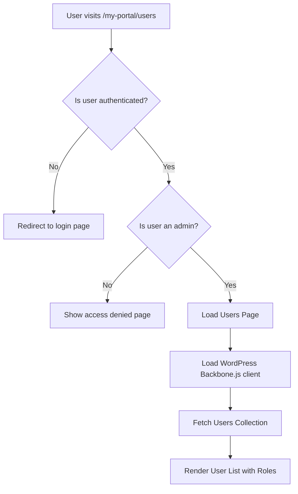

# User Management Implementation Plan

## Overview

This document outlines the implementation plan for adding a user management subpage to the Tributestream portal. The page will display users and their roles using the WordPress Backbone JavaScript client.

## Requirements

- Create a new page at `/my-portal/users`
- Make the page accessible only to administrators
- Use the WordPress Backbone JavaScript client to fetch and display users
- Show user information including roles
- Integrate with the existing my-portal layout and authentication system

## Architecture

The implementation follows a client-server architecture:



## Implementation Steps

### 1. Create the Directory Structure

Create the necessary files for the new users subpage:

```
TributestreamDev-Version03/src/routes/my-portal/users/
├── +page.server.ts  # Server-side logic for authentication and admin check
└── +page.svelte     # Client-side component for displaying users
```

### 2. Implement Server-Side Logic

The server-side logic will:

- Check if the user is authenticated
- Verify if the user has administrator privileges
- Redirect or show access denied if necessary

#### File: `+page.server.ts`

```typescript
// src/routes/my-portal/users/+page.server.ts
import { redirect } from '@sveltejs/kit';
import type { PageServerLoad } from './$types';
import { getUserFromCookies } from '$lib/utils/auth-helpers';

export const load: PageServerLoad = async ({ cookies, fetch }) => {
  // Check if user is authenticated
  const user = getUserFromCookies(cookies);
  
  if (!user) {
    // Redirect to login page if not authenticated
    throw redirect(302, '/my-portal');
  }
  
  // Check if user is an administrator
  // We'll need to fetch the user's roles from WordPress
  try {
    const response = await fetch(`/api/user-roles?user_id=${user.id}`);
    if (!response.ok) {
      throw new Error('Failed to fetch user roles');
    }
    
    const data = await response.json();
    const isAdmin = data.roles?.includes('administrator') || false;
    
    if (!isAdmin) {
      // Return access denied flag if not an admin
      return {
        user,
        accessDenied: true
      };
    }
    
    // User is authenticated and is an admin
    return {
      user,
      accessDenied: false
    };
  } catch (error) {
    console.error('Error checking user roles:', error);
    return {
      user,
      accessDenied: true,
      error: 'Failed to verify administrator access'
    };
  }
};
```

### 3. Implement Client-Side Component

The client-side component will:

- Load the WordPress Backbone.js client
- Use it to fetch the Users collection
- Display users and their roles in a table or card layout
- Handle loading states and errors

#### File: `+page.svelte`

```svelte
<!-- src/routes/my-portal/users/+page.svelte -->
<script lang="ts">
  import { onMount } from 'svelte';
  import { browser } from '$app/environment';
  
  interface PageData {
    user: { id: string; name: string; email: string } | null;
    accessDenied: boolean;
    error?: string;
  }
  
  let { data } = $props<{ data: PageData }>();
  
  // State
  let users = $state([]);
  let isLoading = $state(true);
  let error = $state<string | null>(null);
  
  // Load WordPress Backbone.js client and fetch users
  onMount(() => {
    if (browser && !data.accessDenied) {
      loadWordPressClient();
    }
  });
  
  async function loadWordPressClient() {
    try {
      // Load the WordPress API client script dynamically
      const script = document.createElement('script');
      script.src = 'https://wp.tributestream.com/wp-includes/js/wp-api.min.js';
      script.onload = initWpApi;
      script.onerror = () => {
        error = 'Failed to load WordPress API client';
        isLoading = false;
      };
      document.head.appendChild(script);
    } catch (err) {
      error = 'Error loading WordPress API client';
      isLoading = false;
    }
  }
  
  function initWpApi() {
    // Wait for the client to be ready
    window.wp.api.loadPromise.done(() => {
      fetchUsers();
    });
  }
  
  function fetchUsers() {
    try {
      // Create a collection of users
      const usersCollection = new window.wp.api.collections.Users();
      
      // Fetch users
      usersCollection.fetch().done((fetchedUsers) => {
        users = fetchedUsers.toJSON();
        isLoading = false;
      }).fail((err) => {
        error = 'Failed to fetch users';
        isLoading = false;
        console.error('Error fetching users:', err);
      });
    } catch (err) {
      error = 'Error initializing users collection';
      isLoading = false;
    }
  }
</script>

<svelte:head>
  <title>User Management | Tributestream</title>
  <meta name="description" content="Manage users and their roles in Tributestream." />
</svelte:head>

<div class="container min-h-screen px-4 py-16 mx-auto flex flex-col items-center justify-center">
  <div class="max-w-4xl w-full">
    <div class="bg-surface-100 rounded-lg shadow-lg overflow-hidden">
      <div class="p-6 md:p-8">
        <div class="flex justify-between items-center mb-8">
          <h1 class="text-3xl md:text-4xl font-bold" style="color: #D5BA7F;">
            User Management
          </h1>
          
          <a 
            href="/my-portal"
            class="px-4 py-2 bg-surface-200 text-surface-600 rounded-md hover:bg-surface-300 transition-colors"
          >
            Back to Portal
          </a>
        </div>
        
        {#if data.accessDenied}
          <div class="bg-red-100 border border-red-400 text-red-700 px-4 py-3 rounded">
            <p>Access denied. You need administrator privileges to view this page.</p>
          </div>
        {:else if isLoading}
          <div class="flex justify-center py-8">
            <div class="animate-spin rounded-full h-12 w-12 border-b-2 border-primary"></div>
          </div>
        {:else if error}
          <div class="bg-red-100 border border-red-400 text-red-700 px-4 py-3 rounded">
            <p>{error}</p>
          </div>
        {:else}
          <div class="overflow-x-auto">
            <table class="min-w-full bg-white">
              <thead>
                <tr>
                  <th class="py-2 px-4 border-b text-left">ID</th>
                  <th class="py-2 px-4 border-b text-left">Username</th>
                  <th class="py-2 px-4 border-b text-left">Email</th>
                  <th class="py-2 px-4 border-b text-left">Roles</th>
                </tr>
              </thead>
              <tbody>
                {#each users as user}
                  <tr class="hover:bg-gray-50">
                    <td class="py-2 px-4 border-b">{user.id}</td>
                    <td class="py-2 px-4 border-b">{user.username}</td>
                    <td class="py-2 px-4 border-b">{user.email}</td>
                    <td class="py-2 px-4 border-b">
                      {#if user.roles && user.roles.length > 0}
                        <div class="flex flex-wrap gap-1">
                          {#each user.roles as role}
                            <span class="px-2 py-1 text-xs rounded-full bg-blue-100 text-blue-800">
                              {role}
                            </span>
                          {/each}
                        </div>
                      {:else}
                        <span class="text-gray-400">No roles</span>
                      {/if}
                    </td>
                  </tr>
                {/each}
                
                {#if users.length === 0}
                  <tr>
                    <td colspan="4" class="py-4 text-center text-gray-500">No users found</td>
                  </tr>
                {/if}
              </tbody>
            </table>
          </div>
        {/if}
      </div>
    </div>
  </div>
</div>
```

### 4. Create an API Endpoint for User Roles (Optional)

If we need to check user roles server-side, we'll need an API endpoint:

#### File: `src/routes/api/user-roles/+server.ts`

```typescript
// src/routes/api/user-roles/+server.ts
import { json } from '@sveltejs/kit';
import type { RequestHandler } from './$types';

export const GET: RequestHandler = async ({ url, fetch }) => {
  const userId = url.searchParams.get('user_id');
  
  if (!userId) {
    return json({ error: 'User ID is required' }, { status: 400 });
  }
  
  try {
    // Forward the request to WordPress REST API
    const response = await fetch(`https://wp.tributestream.com/wp-json/wp/v2/users/${userId}`);
    
    if (!response.ok) {
      return json({ error: 'Failed to fetch user data' }, { status: response.status });
    }
    
    const userData = await response.json();
    
    return json({
      roles: userData.roles || []
    });
  } catch (error) {
    console.error('Error fetching user roles:', error);
    return json({ error: 'Internal server error' }, { status: 500 });
  }
};
```

### 5. Update the My Portal Page to Include a Link to Users Page

Update the my-portal page to include a link to the users page, visible only to administrators:

```svelte
<!-- In src/routes/my-portal/+page.svelte -->
<!-- Add this inside the authenticated user view -->
{#if data.user && data.isAdmin}
  <div class="mt-4">
    <a 
      href="/my-portal/users" 
      class="inline-block px-4 py-2 bg-primary text-white rounded-md hover:bg-primary-dark transition-colors"
    >
      Manage Users
    </a>
  </div>
{/if}
```

And update the server-side logic to check if the user is an admin:

```typescript
// In src/routes/my-portal/+page.server.ts
// Add this to the load function
let isAdmin = false;
if (user) {
  try {
    const response = await fetch(`/api/user-roles?user_id=${user.id}`);
    if (response.ok) {
      const data = await response.json();
      isAdmin = data.roles?.includes('administrator') || false;
    }
  } catch (error) {
    console.error('Error checking admin status:', error);
  }
}

// Include isAdmin in the return value
return {
  user,
  tributes,
  loginForm,
  resetForm,
  isAdmin
};
```

## Technical Considerations

### Authentication

- Leveraging the existing authentication system that uses cookies
- Checking user roles both on the server and client side

### WordPress Backbone.js Client

- Loading the client dynamically on the client side
- Using the client's models and collections to fetch user data
- Handling loading states and errors

### CORS

- Ensuring that the WordPress site has proper CORS headers to allow requests from the SvelteKit application

### Error Handling

- Implementing comprehensive error handling for API requests and client loading
- Showing appropriate error messages to the user

### Responsive Design

- Making the table layout responsive for various screen sizes
- Using Tailwind CSS for styling

### Security

- Checking user roles both on the server and client side
- Ensuring only administrators can access the page

## Next Steps After Implementation

1. **Testing**: Test the implementation thoroughly, especially the authentication and role-checking logic.
2. **Styling**: Refine the UI to match the rest of the application's design.
3. **Performance**: Optimize the loading of the WordPress Backbone.js client.
4. **Pagination**: Add pagination for the users list if there are many users.
5. **Filtering**: Add filtering options to search for specific users.