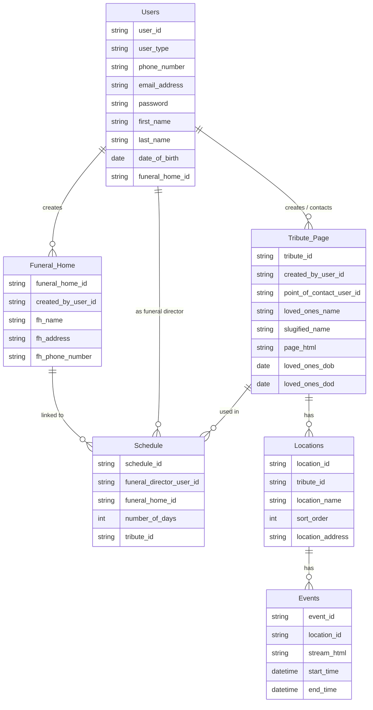

# WordPress Plugin Implementation Plan for Tributestream

Based on the information gathered, this document outlines a detailed plan for completing the WordPress plugin to make it production-ready. The plan focuses on implementing the missing endpoints for events, locations, tribute pages, and users, following the same pattern as the existing endpoints for funeral homes and schedules.

## Current State Analysis

The current WordPress plugin (`TributestreamAPI-Plugin-for-Wordpress.php`) provides:
- A namespace `funeral/v2` for all endpoints
- CRUD operations for funeral homes
- CRUD operations for schedules
- A single endpoint for retrieving tribute pages by slug (unauthenticated)
- JWT-based authentication for protected endpoints

## What's Missing

1. Complete CRUD operations for tribute pages
2. Complete CRUD operations for locations
3. Complete CRUD operations for events
4. User management endpoints
5. Data validation for all inputs
6. Proper error handling
7. Documentation and code organization

## Database Schema



## Implementation Plan

### 1. Plugin Structure Improvements

First, let's improve the overall structure of the plugin:

1. Rename the plugin to "Tributestream API" to better reflect its purpose
2. Update plugin metadata (description, version, author)
3. Add proper documentation for each endpoint
4. Organize code into logical sections

### 2. Implement Tribute Page Endpoints

The tribute page endpoints will provide CRUD operations for memorial tributes:

```
/funeral/v2/tribute-pages                  GET (list all), POST (create)
/funeral/v2/tribute-pages/(?P<id>\d+)      GET, PUT/PATCH, DELETE
/funeral/v2/tribute-pages/by-slug/(?P<slug>[a-zA-Z0-9-]+)  GET
```

### 3. Implement Location Endpoints

The location endpoints will manage physical locations associated with tributes:

```
/funeral/v2/locations                      GET (list all), POST (create)
/funeral/v2/locations/(?P<id>\d+)          GET, PUT/PATCH, DELETE
/funeral/v2/tribute-pages/(?P<id>\d+)/locations  GET (locations for a tribute)
```

### 4. Implement Event Endpoints

The event endpoints will manage scheduled events at locations:

```
/funeral/v2/events                         GET (list all), POST (create)
/funeral/v2/events/(?P<id>\d+)             GET, PUT/PATCH, DELETE
/funeral/v2/locations/(?P<id>\d+)/events   GET (events for a location)
/funeral/v2/tribute-pages/(?P<id>\d+)/events  GET (all events for a tribute)
/funeral/v2/events/active                  GET (events not ended yet)
```

### 5. Implement User Management Endpoints

The user endpoints will manage user accounts and authentication:

```
/funeral/v2/users                          GET (list all), POST (create)
/funeral/v2/users/(?P<id>\d+)              GET, PUT/PATCH, DELETE
/funeral/v2/users/me                       GET (current user)
```

### 6. Implement Data Validation

For each endpoint that accepts data (POST, PUT, PATCH), implement proper validation:

1. Required fields validation
2. Data type validation
3. Foreign key validation (ensure referenced records exist)
4. Sanitization of user input

### 7. Implement Error Handling

Improve error handling throughout the plugin:

1. Standardize error response format
2. Provide meaningful error messages
3. Use appropriate HTTP status codes
4. Log errors for debugging

### 8. Security Enhancements

Enhance security of the plugin:

1. Ensure all write operations require authentication
2. Implement role-based access control
3. Add rate limiting for API endpoints
4. Implement CSRF protection

## Detailed Implementation Steps

### Step 1: Plugin Structure Improvements

1. Update plugin metadata
2. Organize code into logical sections
3. Add proper documentation

### Step 2: Tribute Page Endpoints

1. Implement GET /funeral/v2/tribute-pages
   - Support pagination
   - Support filtering by user_id
   - Support search by loved_ones_name

2. Implement GET /funeral/v2/tribute-pages/(?P<id>\d+)
   - Retrieve a single tribute by ID
   - Include related data (locations, events)

3. Implement POST /funeral/v2/tribute-pages
   - Validate required fields: created_by_user_id, loved_ones_name
   - Generate slugified_name if not provided
   - Return created tribute ID and slug

4. Implement PUT/PATCH /funeral/v2/tribute-pages/(?P<id>\d+)
   - Update tribute details
   - Validate input data

5. Implement DELETE /funeral/v2/tribute-pages/(?P<id>\d+)
   - Delete tribute and related data
   - Check for dependencies before deletion

### Step 3: Location Endpoints

1. Implement GET /funeral/v2/locations
   - Support pagination
   - Support filtering by tribute_id

2. Implement GET /funeral/v2/locations/(?P<id>\d+)
   - Retrieve a single location by ID
   - Include related events

3. Implement POST /funeral/v2/locations
   - Validate required fields: tribute_id, location_name, location_address
   - Set default sort_order if not provided
   - Return created location ID

4. Implement PUT/PATCH /funeral/v2/locations/(?P<id>\d+)
   - Update location details
   - Validate input data

5. Implement DELETE /funeral/v2/locations/(?P<id>\d+)
   - Delete location
   - Check for dependencies (events) before deletion

6. Implement GET /funeral/v2/tribute-pages/(?P<id>\d+)/locations
   - Get all locations for a specific tribute
   - Order by sort_order

### Step 4: Event Endpoints

1. Implement GET /funeral/v2/events
   - Support pagination
   - Support filtering by location_id, start_time, end_time

2. Implement GET /funeral/v2/events/(?P<id>\d+)
   - Retrieve a single event by ID
   - Include related location data

3. Implement POST /funeral/v2/events
   - Validate required fields: location_id, start_time, end_time
   - Validate start_time is before end_time
   - Return created event ID

4. Implement PUT/PATCH /funeral/v2/events/(?P<id>\d+)
   - Update event details
   - Validate input data

5. Implement DELETE /funeral/v2/events/(?P<id>\d+)
   - Delete event

6. Implement GET /funeral/v2/locations/(?P<id>\d+)/events
   - Get all events for a specific location
   - Order by start_time

7. Implement GET /funeral/v2/tribute-pages/(?P<id>\d+)/events
   - Get all events for a specific tribute (across all locations)
   - Order by start_time

8. Implement GET /funeral/v2/events/active
   - Get events where end_time is greater than current time
   - Order by start_time

### Step 5: User Management Endpoints

1. Implement GET /funeral/v2/users
   - Support pagination
   - Support filtering by user_type
   - Admin access only

2. Implement GET /funeral/v2/users/(?P<id>\d+)
   - Retrieve a single user by ID
   - Admin access or self access only

3. Implement POST /funeral/v2/users
   - Validate required fields: email_address, password, user_type
   - Create WordPress user with custom meta fields
   - Return created user ID

4. Implement PUT/PATCH /funeral/v2/users/(?P<id>\d+)
   - Update user details
   - Validate input data
   - Admin access or self access only

5. Implement DELETE /funeral/v2/users/(?P<id>\d+)
   - Delete user
   - Admin access only

6. Implement GET /funeral/v2/users/me
   - Get current user details based on JWT token
   - Include user role and permissions

### Step 6: Data Validation

Implement validation functions for each data type:

1. `validate_tribute_data($data)`
2. `validate_location_data($data)`
3. `validate_event_data($data)`
4. `validate_user_data($data)`

### Step 7: Error Handling

Implement standardized error handling:

1. Create `handle_api_error($error, $status_code)` function
2. Use WordPress's `WP_Error` class consistently
3. Log errors for debugging

### Step 8: Security Enhancements

1. Ensure all write operations require authentication
2. Implement role-based access control
3. Add rate limiting for API endpoints

## Testing Plan

1. Test each endpoint with valid data
2. Test each endpoint with invalid data to verify error handling
3. Test authentication and authorization
4. Test pagination and filtering
5. Test relationships between entities

## Deployment Plan

1. Create a release version of the plugin
2. Install on staging environment for testing
3. Document installation and configuration steps
4. Deploy to production

## Timeline

1. Plugin Structure Improvements: 1 day
2. Tribute Page Endpoints: 2 days
3. Location Endpoints: 2 days
4. Event Endpoints: 2 days
5. User Management Endpoints: 2 days
6. Data Validation: 1 day
7. Error Handling: 1 day
8. Security Enhancements: 1 day
9. Testing: 2 days
10. Documentation and Deployment: 1 day

Total estimated time: 15 days

## Conclusion

This implementation plan provides a comprehensive roadmap for completing the WordPress plugin for the Tributestream application. By following this plan, we will create a production-ready plugin that provides all the necessary endpoints for the frontend application, with proper authentication, validation, and error handling.