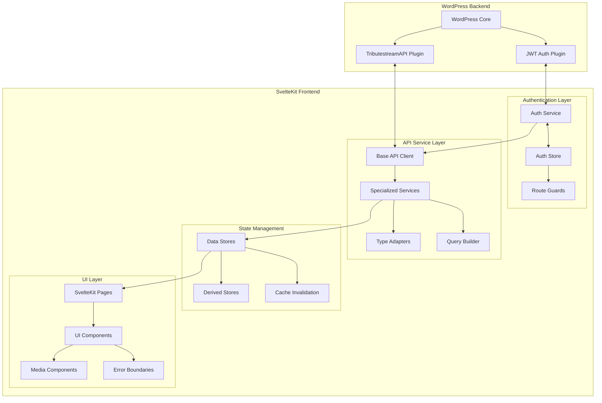

# WordPress REST API Integration for SvelteKit - Implementation Plan

## Overview

This document outlines the comprehensive plan for implementing a WordPress REST API integration with SvelteKit, focusing on secure authentication, full CRUD operations, and optimal performance. The integration will connect a SvelteKit frontend application with a WordPress backend running on separate servers.

## Architecture Overview



## 1. Authentication System

### 1.1 JWT Authentication Implementation

We'll implement JWT-based authentication with secure HttpOnly cookies using the JWT Authentication plugin on the WordPress side and a custom authentication service on the SvelteKit side.

#### Key Components:

- **Auth Service**: Handles login, logout, token validation, and session refresh
- **Auth Store**: Manages authentication state using Svelte's reactive stores
- **Route Guards**: Protects routes requiring authentication using SvelteKit hooks
- **Server Endpoints**: Handles cookie management for secure token storage

#### Authentication Flow:

1. User submits credentials to SvelteKit frontend
2. SvelteKit sends credentials to WordPress JWT endpoint
3. WordPress validates credentials and returns JWT token
4. SvelteKit stores token in HttpOnly cookie via server endpoint
5. Subsequent requests include the cookie automatically
6. SvelteKit validates token status and refreshes when needed

### 1.2 User Session Management

- Implement automatic token refresh mechanism
- Create session timeout handling
- Develop secure logout process that invalidates tokens

## 2. API Service Layer

### 2.1 Base API Client

A modular base client will handle common functionality:

- Authentication header management
- Request/response formatting
- Error handling
- Retry logic
- Request cancellation

### 2.2 Specialized Services

We'll create dedicated service classes for each WordPress entity:

- **Post Service**: Standard WordPress posts
- **Page Service**: WordPress pages
- **Media Service**: Media uploads and management
- **User Service**: User management
- **Comment Service**: Comment operations
- **Tribute Service**: Custom tribute pages
- **Location Service**: Custom locations
- **Event Service**: Custom events
- **Schedule Service**: Custom schedules

### 2.3 Type Adapters

TypeScript interfaces will ensure type safety:

- Define interfaces for all WordPress entities
- Create input/output type definitions
- Implement adapter functions to transform between API and application formats

### 2.4 Query Builder

A fluent query builder will simplify API requests:

- Pagination controls
- Filtering options
- Sorting capabilities
- Search functionality
- Parameter validation

## 3. State Management

### 3.1 Reactive Stores

We'll implement Svelte stores for each entity type:

- Use Svelte 5 runes for reactive state
- Implement optimistic UI updates
- Create loading and error states
- Develop pagination handling

### 3.2 Derived Stores

Computed data relationships will be handled through derived stores:

- Create relationships between entities (e.g., tributes with locations)
- Implement filtering and sorting logic
- Calculate derived properties

### 3.3 Cache Management

Efficient caching strategies will improve performance:

- Implement stale-while-revalidate pattern
- Create cache invalidation triggers
- Develop cache persistence options
- Implement background synchronization

## 4. Media Handling

### 4.1 File Upload Components

- Drag-and-drop upload interface
- Progress indicators
- File validation
- Error handling

### 4.2 Media Library Browser

- Grid and list views
- Search and filtering
- Pagination
- Selection interface

### 4.3 Image Optimization

- Responsive image component
- Lazy loading implementation
- Image format selection
- Size optimization

### 4.4 Media Type Support

- Image preview and editing
- Video player integration
- Document handling
- Audio player

## 5. Performance Optimization

### 5.1 Caching Strategy

- Implement stale-while-revalidate pattern
- Use browser cache for static assets
- Implement service worker for offline support

### 5.2 Server-Side Rendering

- Configure SSR for SEO-critical pages
- Implement hybrid rendering approach
- Optimize hydration

### 5.3 Request Optimization

- Implement request batching
- Create request deduplication
- Develop prefetching for anticipated actions

### 5.4 Code Optimization

- Implement code splitting
- Use dynamic imports for large components
- Optimize bundle size

## 6. Error Handling & Resilience

### 6.1 Error Boundaries

- Create component-level error boundaries
- Implement fallback UI components
- Develop error logging

### 6.2 Retry Mechanisms

- Implement exponential backoff
- Create retry limits
- Develop circuit breaker pattern

### 6.3 User Feedback

- Design toast notification system
- Implement inline error messages
- Create loading indicators

### 6.4 Offline Support

- Develop offline detection
- Implement queue for offline actions
- Create background synchronization

## Implementation Timeline

### Phase 1: Foundation (Week 1)
- Set up project structure
- Implement authentication system
- Create base API client
- Develop core type definitions

### Phase 2: Core Services (Week 2)
- Implement specialized services
- Create state management stores
- Develop basic UI components
- Implement route guards

### Phase 3: Advanced Features (Week 3)
- Implement media handling
- Create error handling system
- Develop performance optimizations
- Implement offline support

### Phase 4: Testing & Refinement (Week 4)
- Comprehensive testing
- Performance optimization
- Documentation
- Final refinements

## File Structure

```
src/
├── lib/
│   ├── api/
│   │   ├── base-api.client.ts
│   │   ├── query-builder.ts
│   │   └── services/
│   │       ├── post.service.ts
│   │       ├── page.service.ts
│   │       ├── media.service.ts
│   │       ├── user.service.ts
│   │       ├── comment.service.ts
│   │       ├── tribute.service.ts
│   │       ├── location.service.ts
│   │       ├── event.service.ts
│   │       └── schedule.service.ts
│   ├── auth/
│   │   ├── auth.service.ts
│   │   └── auth.store.ts
│   ├── components/
│   │   ├── ui/
│   │   │   └── ... (UI components)
│   │   └── media/
│   │       ├── media-upload.svelte
│   │       ├── media-browser.svelte
│   │       └── responsive-image.svelte
│   ├── stores/
│   │   ├── posts.store.ts
│   │   ├── pages.store.ts
│   │   ├── media.store.ts
│   │   ├── users.store.ts
│   │   ├── comments.store.ts
│   │   ├── tributes.store.ts
│   │   ├── locations.store.ts
│   │   ├── events.store.ts
│   │   ├── schedules.store.ts
│   │   └── derived-stores.ts
│   ├── types/
│   │   ├── post.types.ts
│   │   ├── page.types.ts
│   │   ├── media.types.ts
│   │   ├── user.types.ts
│   │   ├── comment.types.ts
│   │   ├── tribute.types.ts
│   │   ├── location.types.ts
│   │   ├── event.types.ts
│   │   └── schedule.types.ts
│   └── utils/
│       ├── error-handlers.ts
│       ├── cache-utils.ts
│       └── media-utils.ts
├── routes/
│   ├── +layout.svelte
│   ├── +layout.server.ts
│   ├── +page.svelte
│   ├── +page.server.ts
│   ├── api/
│   │   └── auth/
│   │       ├── +server.ts
│   │       └── refresh/+server.ts
│   ├── login/
│   │   ├── +page.svelte
│   │   └── +page.server.ts
│   ├── register/
│   │   ├── +page.svelte
│   │   └── +page.server.ts
│   └── (protected)/
│       ├── +layout.svelte
│       ├── +layout.server.ts
│       └── ... (protected routes)
└── hooks.server.ts
```

## Technical Considerations

### Authentication Security
- Use HttpOnly cookies for token storage
- Implement CSRF protection
- Set appropriate cookie security flags
- Validate tokens on both client and server

### Performance Optimization
- Implement code splitting for large components
- Use SSR for SEO-critical pages
- Optimize bundle size
- Implement lazy loading for images and components

### Error Handling
- Create comprehensive error boundaries
- Implement retry mechanisms
- Develop user-friendly error messages
- Log errors for debugging

### Offline Support
- Implement service worker for caching
- Create offline detection
- Develop queue for offline actions
- Implement background synchronization

## Conclusion

This implementation plan provides a comprehensive approach to integrating WordPress REST API with SvelteKit. By following this architecture, we'll create a secure, performant, and user-friendly application that leverages the strengths of both WordPress as a content management system and SvelteKit as a modern frontend framework.