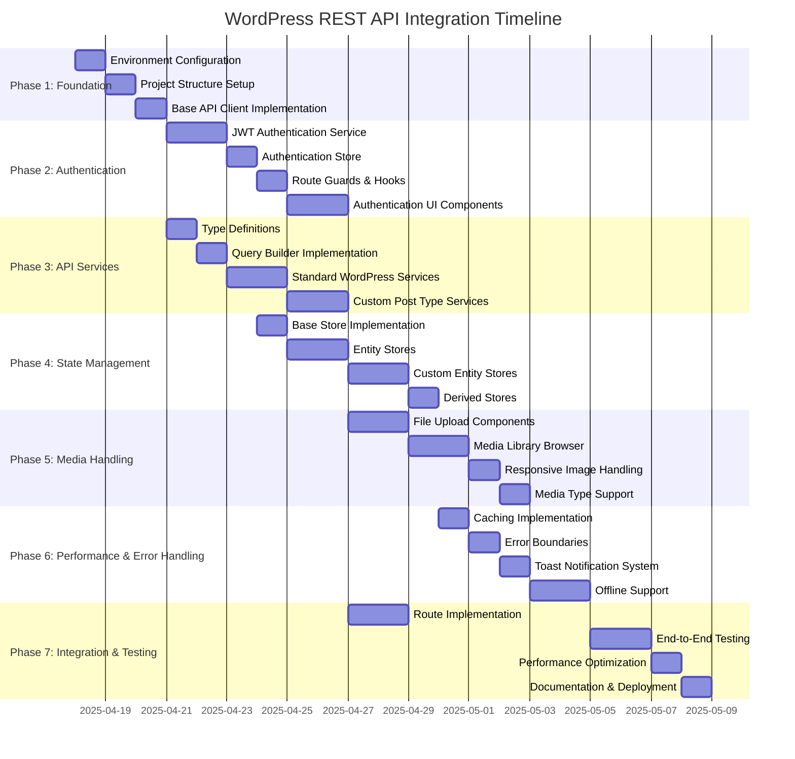

# WordPress REST API Integration - Discrete Implementation Steps

## Overview

This document breaks down the WordPress REST API integration with SvelteKit into discrete, actionable steps. Each step is designed to be completed independently, with clear deliverables and testing criteria.

## Phase 1: Project Setup & Foundation

### Step 1.1: Environment Configuration (1 day)
- [ ] Create environment variables configuration
  - [ ] Create `.env` and `.env.example` files
  - [ ] Define WordPress API URL variable
  - [ ] Define JWT secret key variable
  - [ ] Configure CORS settings
- [ ] Update TypeScript configuration for strict mode
- [ ] Configure ESLint and Prettier for code quality
- [ ] Set up testing environment with Vitest

### Step 1.2: Project Structure Setup (1 day)
- [ ] Create folder structure for API services
  - [ ] `/src/lib/api/`
  - [ ] `/src/lib/api/services/`
  - [ ] `/src/lib/types/`
  - [ ] `/src/lib/stores/`
  - [ ] `/src/lib/components/`
  - [ ] `/src/lib/utils/`
- [ ] Set up SvelteKit routes structure
  - [ ] `/src/routes/api/` for server endpoints
  - [ ] `/src/routes/(protected)/` for authenticated routes
  - [ ] `/src/routes/(public)/` for public routes

### Step 1.3: Base API Client Implementation (1 day)
- [ ] Create base API client class
  - [ ] Implement request method with error handling
  - [ ] Add HTTP methods (GET, POST, PUT, PATCH, DELETE)
  - [ ] Configure default headers
  - [ ] Add request/response interceptors
  - [ ] Implement request cancellation
- [ ] Create API error handling utilities
- [ ] Write unit tests for base client

## Phase 2: Authentication System

### Step 2.1: JWT Authentication Service (2 days)
- [ ] Create authentication service
  - [ ] Implement login method
  - [ ] Implement logout method
  - [ ] Add token validation method
  - [ ] Create session refresh functionality
- [ ] Create server endpoints for cookie management
  - [ ] `/src/routes/api/auth/+server.ts` for token storage
  - [ ] `/src/routes/api/auth/refresh/+server.ts` for token refresh
  - [ ] `/src/routes/api/auth/logout/+server.ts` for logout
- [ ] Write unit tests for authentication service

### Step 2.2: Authentication Store (1 day)
- [ ] Create authentication store using Svelte runes
  - [ ] Implement user state
  - [ ] Add authentication status
  - [ ] Create loading and error states
  - [ ] Add persistence with localStorage
- [ ] Create derived stores for user permissions
- [ ] Write unit tests for auth store

### Step 2.3: Route Guards & Hooks (1 day)
- [ ] Implement SvelteKit hooks for authentication
  - [ ] Create `hooks.server.ts` for server-side checks
  - [ ] Add authentication check to handle function
  - [ ] Implement redirect for unauthenticated users
- [ ] Create protected layout
  - [ ] `/src/routes/(protected)/+layout.svelte`
  - [ ] `/src/routes/(protected)/+layout.server.ts`
- [ ] Write tests for authentication hooks

### Step 2.4: Authentication UI Components (2 days)
- [ ] Create login form component
  - [ ] Implement form validation
  - [ ] Add error handling
  - [ ] Create loading state
- [ ] Create registration form component
- [ ] Implement password reset workflow
- [ ] Create user profile component
- [ ] Write tests for authentication components

## Phase 3: Core API Services

### Step 3.1: Type Definitions (1 day)
- [ ] Create TypeScript interfaces for WordPress entities
  - [ ] Post interface
  - [ ] Page interface
  - [ ] Media interface
  - [ ] User interface
  - [ ] Comment interface
- [ ] Create interfaces for custom post types
  - [ ] Tribute interface
  - [ ] Location interface
  - [ ] Event interface
  - [ ] Schedule interface
- [ ] Define input/output types for API operations

### Step 3.2: Query Builder Implementation (1 day)
- [ ] Create query builder class
  - [ ] Implement pagination methods
  - [ ] Add filtering capabilities
  - [ ] Create sorting functionality
  - [ ] Add search method
- [ ] Create parameter validation
- [ ] Write unit tests for query builder

### Step 3.3: Standard WordPress Services (2 days)
- [ ] Implement Post service
  - [ ] Create CRUD operations
  - [ ] Add specialized methods
  - [ ] Implement pagination
- [ ] Implement Page service
- [ ] Implement Media service
- [ ] Implement User service
- [ ] Implement Comment service
- [ ] Write unit tests for each service

### Step 3.4: Custom Post Type Services (2 days)
- [ ] Implement Tribute service
  - [ ] Create CRUD operations
  - [ ] Add specialized methods
  - [ ] Implement pagination
- [ ] Implement Location service
- [ ] Implement Event service
- [ ] Implement Schedule service
- [ ] Write unit tests for each service

## Phase 4: State Management

### Step 4.1: Base Store Implementation (1 day)
- [ ] Create base store class with common functionality
  - [ ] Implement loading state
  - [ ] Add error handling
  - [ ] Create pagination state
  - [ ] Add cache invalidation methods
- [ ] Create utility functions for optimistic updates
- [ ] Write unit tests for base store

### Step 4.2: Entity Stores (2 days)
- [ ] Implement Post store
  - [ ] Create state using Svelte runes
  - [ ] Add CRUD methods
  - [ ] Implement optimistic updates
  - [ ] Add cache invalidation
- [ ] Implement Page store
- [ ] Implement Media store
- [ ] Implement User store
- [ ] Implement Comment store
- [ ] Write unit tests for each store

### Step 4.3: Custom Entity Stores (2 days)
- [ ] Implement Tribute store
  - [ ] Create state using Svelte runes
  - [ ] Add CRUD methods
  - [ ] Implement optimistic updates
  - [ ] Add cache invalidation
- [ ] Implement Location store
- [ ] Implement Event store
- [ ] Implement Schedule store
- [ ] Write unit tests for each store

### Step 4.4: Derived Stores (1 day)
- [ ] Create derived stores for related entities
  - [ ] Tributes with locations
  - [ ] Locations with events
  - [ ] Active events
  - [ ] Upcoming events
- [ ] Implement computed properties
- [ ] Write unit tests for derived stores

## Phase 5: Media Handling

### Step 5.1: File Upload Components (2 days)
- [ ] Create drag-and-drop upload component
  - [ ] Implement file selection
  - [ ] Add drag-and-drop functionality
  - [ ] Create progress indicator
  - [ ] Add error handling
- [ ] Implement file validation
  - [ ] Size validation
  - [ ] Type validation
  - [ ] Security checks
- [ ] Write unit tests for upload components

### Step 5.2: Media Library Browser (2 days)
- [ ] Create media grid component
  - [ ] Implement thumbnail display
  - [ ] Add selection functionality
  - [ ] Create pagination
  - [ ] Implement search and filtering
- [ ] Create media detail component
  - [ ] Display media information
  - [ ] Add edit capabilities
  - [ ] Implement delete functionality
- [ ] Write unit tests for media browser components

### Step 5.3: Responsive Image Handling (1 day)
- [ ] Create responsive image component
  - [ ] Implement srcset for different sizes
  - [ ] Add lazy loading
  - [ ] Create placeholder for loading state
- [ ] Implement image optimization utilities
- [ ] Write unit tests for image components

### Step 5.4: Media Type Support (1 day)
- [ ] Implement video player component
- [ ] Create document viewer component
- [ ] Add audio player component
- [ ] Write unit tests for media type components

## Phase 6: Performance & Error Handling

### Step 6.1: Caching Implementation (1 day)
- [ ] Create cache service
  - [ ] Implement stale-while-revalidate pattern
  - [ ] Add cache invalidation strategies
  - [ ] Create cache persistence
- [ ] Implement request deduplication
- [ ] Write unit tests for caching

### Step 6.2: Error Boundaries (1 day)
- [ ] Create error boundary components
  - [ ] Implement fallback UI
  - [ ] Add retry functionality
  - [ ] Create error logging
- [ ] Implement global error handler
- [ ] Write unit tests for error boundaries

### Step 6.3: Toast Notification System (1 day)
- [ ] Create toast store
  - [ ] Implement add/remove methods
  - [ ] Add different toast types (success, error, info)
  - [ ] Create auto-dismiss functionality
- [ ] Implement toast component
  - [ ] Create animations
  - [ ] Add accessibility features
  - [ ] Implement responsive design
- [ ] Write unit tests for toast system

### Step 6.4: Offline Support (2 days)
- [ ] Implement offline detection
  - [ ] Create online/offline store
  - [ ] Add event listeners
  - [ ] Implement UI indicators
- [ ] Create request queue for offline actions
  - [ ] Store failed requests
  - [ ] Implement retry logic
  - [ ] Add conflict resolution
- [ ] Implement background synchronization
- [ ] Write unit tests for offline support

## Phase 7: Integration & Testing

### Step 7.1: Route Implementation (2 days)
- [ ] Create public routes
  - [ ] Home page
  - [ ] Login page
  - [ ] Registration page
  - [ ] Password reset page
- [ ] Implement protected routes
  - [ ] Dashboard
  - [ ] Profile page
  - [ ] Content management pages
- [ ] Add load functions for data fetching
- [ ] Write tests for routes

### Step 7.2: End-to-End Testing (2 days)
- [ ] Create test scenarios for authentication
  - [ ] Login flow
  - [ ] Registration flow
  - [ ] Password reset flow
- [ ] Implement tests for CRUD operations
  - [ ] Create content
  - [ ] Read content
  - [ ] Update content
  - [ ] Delete content
- [ ] Test media upload and management
- [ ] Test offline functionality

### Step 7.3: Performance Optimization (1 day)
- [ ] Implement code splitting
  - [ ] Add dynamic imports for routes
  - [ ] Create lazy-loaded components
- [ ] Optimize bundle size
  - [ ] Analyze bundle
  - [ ] Remove unused dependencies
  - [ ] Implement tree shaking
- [ ] Improve loading performance
  - [ ] Add preloading for critical resources
  - [ ] Implement prefetching for anticipated actions
- [ ] Run performance tests

### Step 7.4: Documentation & Deployment (1 day)
- [ ] Create documentation
  - [ ] API documentation
  - [ ] Component documentation
  - [ ] Usage examples
- [ ] Prepare deployment configuration
  - [ ] Configure environment variables
  - [ ] Set up build process
  - [ ] Create deployment scripts
- [ ] Perform final testing
- [ ] Deploy application

## Dependencies and Critical Path

## Deliverables for Each Step

Each step will produce the following deliverables:

1. **Source code** - Implemented features with TypeScript typing
2. **Unit tests** - Test coverage for implemented features
3. **Documentation** - Code comments and usage examples
4. **Demo** - Working example of the implemented feature

## Testing Criteria

Each step will be considered complete when:

1. All unit tests pass
2. Code meets ESLint and TypeScript standards
3. Feature works as expected in development environment
4. Documentation is complete and accurate

## Conclusion

This discrete step-by-step plan provides a clear roadmap for implementing the WordPress REST API integration with SvelteKit. Each step has specific deliverables and testing criteria, making it easier to track progress and ensure quality throughout the development process.

The plan is designed to be flexible, allowing for adjustments as needed while maintaining a clear path to completion. Dependencies between steps are minimized where possible, enabling parallel work on different aspects of the project when resources permit.