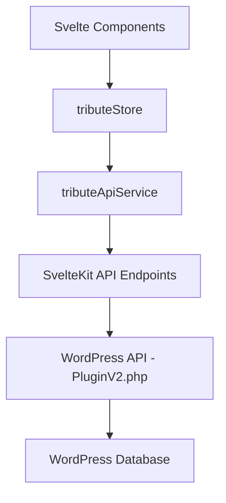

# Tribute API Status and Roadmap

## Current Implementation Status

After reviewing the codebase, I can confirm that the TributestreamDev-Version05 project is correctly using the `PluginV2.php` WordPress plugin for tribute CRUD operations, and NOT using the older `WordpressAPI.php` implementation.

### Architecture Overview

The current implementation follows a well-structured architecture:

### Key Components

1. **WordPress Plugin (`PluginV2.php`)**
   - Implements the WordPress REST API endpoints under the namespace `tributestream/v1`
   - Provides CRUD operations for tributes, extended tribute data, user registration, and user meta
   - Handles authentication, permissions, and data validation
   - Creates and manages the custom `wp_tributes` table in the WordPress database

2. **SvelteKit API Endpoints**
   - Located in `src/routes/api/wp/`
   - Proxy requests to the WordPress API
   - Handle authentication via JWT tokens stored in cookies
   - Format responses and errors consistently

3. **API Service (`tribute-api.service.ts`)**
   - Provides a TypeScript interface for interacting with the SvelteKit API endpoints
   - Handles error handling and response formatting
   - Used by the tribute store

4. **Tribute Store (`tribute.store.ts`)**
   - Implements a state management solution using Svelte 5 runes
   - Provides methods for loading, creating, updating, and deleting tributes
   - Manages loading states, errors, and pagination
   - Used by the Svelte components

5. **Svelte Components**
   - Tribute listing page (`/tributes/+page.svelte`)
   - Tribute detail page (`/tributes/[id]/+page.svelte`)
   - New tribute page (`/tributes/new/+page.svelte`)
   - Use the tribute store for data access and manipulation

### Confirmation of Correct Implementation

The following evidence confirms that the application is correctly using `PluginV2.php`:

1. **API Base URL Configuration**
   - In `wp-api.ts`, the base URL is set to `${WP_API_URL}/tributestream/v1`
   - This matches the namespace used in `PluginV2.php` (`tributestream/v1`)
   - The older `WordpressAPI.php` uses a different namespace (`funeral/v2`)

2. **Endpoint Structure**
   - The SvelteKit API endpoints match the structure defined in `PluginV2.php`
   - For example, `/api/wp/tributes`, `/api/wp/tributes/[id]`, `/api/wp/tribute/[slug]`, etc.

3. **Data Structure**
   - The TypeScript interfaces in `tribute.types.ts` match the data structure returned by `PluginV2.php`
   - Fields like `loved_one_name`, `slug`, `custom_html`, etc. match the database schema defined in `PluginV2.php`

## Current Functionality

The current implementation provides the following functionality:

1. **Tribute Management**
   - List tributes with pagination and search
   - View tribute details
   - Create new tributes
   - Update existing tributes
   - Delete tributes

2. **Extended Data Management**
   - Store and retrieve extended data for tributes
   - Update extended data

3. **User-specific Tributes**
   - Get tributes by user ID

## Potential Improvements and Next Steps

Based on the review, here are some potential improvements and next steps:

1. **Performance Optimization**
   - Implement server-side rendering (SSR) for the tribute listing page to improve initial load time
   - Add caching for frequently accessed tributes
   - Optimize the tribute store to minimize unnecessary re-renders

2. **Enhanced User Experience**
   - Add loading indicators and transitions for better feedback during API operations
   - Implement optimistic UI updates for faster perceived performance
   - Add confirmation dialogs for destructive actions like delete

3. **Feature Enhancements**
   - Add support for media uploads (images, videos) associated with tributes
   - Implement categorization or tagging for tributes
   - Add sorting options for the tribute listing page

4. **Code Quality and Maintainability**
   - Add comprehensive error handling and user-friendly error messages
   - Implement form validation using a form library like Felte or Superforms
   - Add unit and integration tests for the API service and store

5. **Security Enhancements**
   - Implement CSRF protection for API requests
   - Add rate limiting for API endpoints
   - Enhance permission checks for tribute operations

## Conclusion

The tribute API implementation is correctly using the `PluginV2.php` WordPress plugin as intended. The architecture is well-structured and follows best practices for SvelteKit applications. The current implementation provides a solid foundation for tribute management, with room for enhancements and optimizations as outlined above.