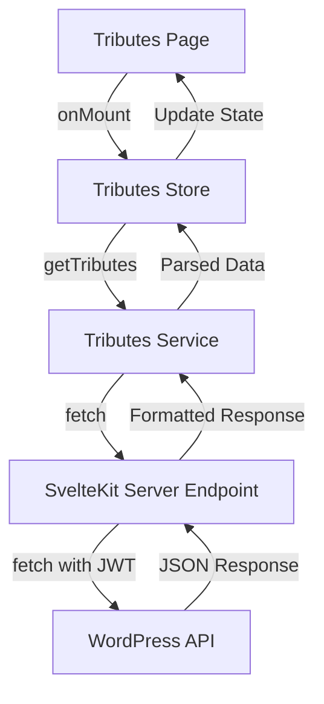

# Implementation Plan: Tribute Data Fetching with JWT Authentication

Based on analysis of the codebase, this document outlines the implementation of a data fetching mechanism for tributes that integrates with the WordPress API using JWT authentication.

## Step 1: Create Server Endpoint for Tributes

First, we need to create a server endpoint that will proxy requests to the WordPress API:

**File to create**: `src/routes/api/tributes/+server.ts`

This endpoint will:
- Extract the JWT token from cookies
- Forward requests to the WordPress API with proper authentication
- Handle pagination and query parameters
- Format the response for the client

## Step 2: Create Tribute Types (if needed)

The project already has most of the necessary types defined in `wordpress.types.ts`, but we may need to add or modify types specific to our implementation:

**File to check/modify**: `src/lib/types/wordpress.types.ts`

## Step 3: Create Tributes Service

Create a service class to handle tribute operations:

**File to create**: `src/lib/api/services/tributes.service.ts`

This service will:
- Provide methods to fetch tributes with pagination
- Handle single tribute fetching
- Implement CRUD operations for tributes
- Handle error cases appropriately

## Step 4: Create Tributes Store

Create a Svelte store to manage tribute state:

**File to create**: `src/lib/stores/tributes.store.ts`

This store will:
- Maintain the state of tributes data
- Handle loading states
- Manage error states
- Provide derived stores for convenience

## Step 5: Update Tributes Page

Modify the existing tributes page to use the new service and store:

**File to modify**: `src/routes/(protected)/tributes/+page.svelte`

Changes will include:
- Importing the tributes store
- Using store values for rendering
- Implementing pagination controls
- Handling loading and error states

## Step 6: Testing and Debugging

Test the implementation to ensure it works correctly:
- Verify authentication flow
- Test data fetching with different parameters
- Ensure error handling works as expected
- Check that the UI updates appropriately

## Data Flow Diagram

## Implementation Order

For the most efficient implementation, I recommend following this order:

1. Create the server endpoint first (`src/routes/api/tributes/+server.ts`)
2. Create the tributes service (`src/lib/api/services/tributes.service.ts`)
3. Create the tributes store (`src/lib/stores/tributes.store.ts`)
4. Update the tributes page (`src/routes/(protected)/tributes/+page.svelte`)
5. Test the implementation