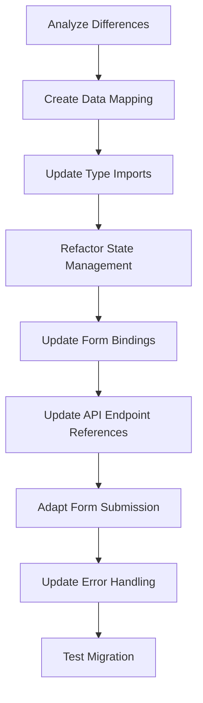

# Migration Guide: Refactoring Tribute Creation Page

This guide outlines the process of migrating the existing tribute creation page to use the new SvelteKit endpoints while maintaining the protected route structure, preserving authentication, and adopting Svelte 5 runes for state management.

## Migration Overview



## 1. Understanding Key Differences

### Data Structure Differences

| Existing Field | New Field |
|----------------|-----------|
| `created_by_user_id` | `user_id` |
| `loved_ones_name` | `loved_one_name` |
| `slugified_name` | `slug` |
| `page_html` | `custom_html` |
| `loved_ones_dob` | N/A (store in extended data) |
| `loved_ones_dod` | N/A (store in extended data) |

### API Endpoint Differences

| Existing Endpoint | New Endpoint |
|-------------------|--------------|
| `/api/tributes` | `/api/wp/tributes` |
| `/api/tributes/:id` | `/api/wp/tributes/:id` |
| N/A | `/api/wp/tribute-data/:tribute_id` |

### State Management Differences

- **Existing**: Uses Svelte's writable stores
- **New**: Uses Svelte 5 runes (`$state`, `$derived`, etc.)

## 2. Step-by-Step Migration Process

### Step 1: Update Type Imports

```typescript
// OLD
import { tributesStore } from '$lib/stores/tributes.store';

// NEW
import { tributeStore } from '$lib/stores/tribute.store';
import type { TributeCreateInput } from '$lib/types/tribute.types';
```

### Step 2: Refactor State Management with Svelte 5 Runes

```typescript
// OLD
let lovedOnesName = '';
let lovedOnesDob = '';
let lovedOnesDod = '';
let pageHtml = '';
let isSubmitting = false;
let error: string | null = null;

// NEW
// Form data using Svelte 5 runes
let formData = $state<TributeCreateInput>({
  user_id: $user?.id || 0,
  loved_one_name: '',
  slug: '',
  phone_number: '', // Required in new structure
  custom_html: '',
  number_of_streams: 0,
  extended_data: {
    loved_ones_dob: '',
    loved_ones_dod: ''
  }
});

// Form state
let isSubmitting = $state(false);
let error = $state<string | null>(null);

// For backward compatibility
let lovedOnesDob = $state('');
let lovedOnesDod = $state('');
```

### Step 3: Update Form Bindings

```svelte
<!-- OLD -->
<input
  type="text"
  name="loved-ones-name"
  id="loved-ones-name"
  bind:value={lovedOnesName}
  required
  class="mt-1 block w-full rounded-md border-gray-300 shadow-sm focus:border-blue-500 focus:ring-blue-500 sm:text-sm"
/>

<!-- NEW -->
<input
  type="text"
  name="loved-ones-name"
  id="loved-ones-name"
  bind:value={formData.loved_one_name}
  required
  class="mt-1 block w-full rounded-md border-gray-300 shadow-sm focus:border-blue-500 focus:ring-blue-500 sm:text-sm"
/>
```

### Step 4: Add Helper Functions for Data Mapping

```typescript
// Generate slug from name
function generateSlug() {
  if (formData.loved_one_name) {
    formData.slug = formData.loved_one_name
      .toLowerCase()
      .replace(/[^\w\s]/g, '')
      .replace(/\s+/g, '-');
  }
}

// Update extended data from date fields
function updateExtendedData() {
  formData.extended_data = {
    ...formData.extended_data,
    loved_ones_dob: lovedOnesDob || null,
    loved_ones_dod: lovedOnesDod || null
  };
}
```

### Step 5: Update Form Submission Logic

```typescript
// OLD
async function handleSubmit() {
  isSubmitting = true;
  error = null;
  
  try {
    // Create a slugified name from the loved one's name
    const slugifiedName = lovedOnesName
      .toLowerCase()
      .replace(/[^\w\s]/g, '')
      .replace(/\s+/g, '-');
    
    // Create the tribute data
    const tributeData = {
      created_by_user_id: $user?.id || 0,
      loved_ones_name: lovedOnesName,
      slugified_name: slugifiedName,
      page_html: pageHtml,
      loved_ones_dob: lovedOnesDob || null,
      loved_ones_dod: lovedOnesDod || null
    };
    
    // Create the tribute
    await tributesStore.createTribute(tributeData);
    
    // Redirect to the tributes list
    goto('/tributes');
  } catch (err) {
    console.error('Error creating tribute:', err);
    error = err instanceof Error ? err.message : 'Failed to create tribute';
  } finally {
    isSubmitting = false;
  }
}

// NEW
async function handleSubmit() {
  isSubmitting = true;
  error = null;
  
  try {
    // Ensure user ID is set
    formData.user_id = $user?.id || 0;
    
    // Generate slug if not provided
    if (!formData.slug) {
      generateSlug();
    }
    
    // Update extended data with date fields
    updateExtendedData();
    
    // Create the tribute
    const result = await tributeStore.createTribute(formData);
    
    // Redirect to the tributes list
    goto('/tributes');
  } catch (err) {
    console.error('Error creating tribute:', err);
    error = err instanceof Error ? err.message : 'Failed to create tribute';
  } finally {
    isSubmitting = false;
  }
}
```

## 3. Potential Pitfalls and Solutions

### Data Structure Mapping

**Pitfall**: The field names differ between implementations, which could lead to data loss or incorrect submissions.

**Solution**: 
- Create explicit mapping functions
- Store additional fields in the `extended_data` object
- Validate data before submission

```typescript
// Example validation function
function validateFormData(): boolean {
  if (!formData.loved_one_name) {
    error = "Loved one's name is required";
    return false;
  }
  
  if (!formData.phone_number) {
    error = "Phone number is required";
    return false;
  }
  
  return true;
}
```

### Authentication Handling

**Pitfall**: The new implementation might handle authentication differently.

**Solution**:
- Ensure JWT token is properly passed in request headers
- Maintain the existing authentication store
- Add error handling for authentication failures

```typescript
// Example authentication error handling
if (err.message.includes('Unauthorized') || err.message.includes('401')) {
  error = "You must be logged in to create a tribute";
  // Optionally redirect to login page
  goto('/login?redirect=/tributes/new');
}
```

### Form Validation

**Pitfall**: The new API might have different validation requirements.

**Solution**:
- Add client-side validation matching server requirements
- Provide clear error messages for validation failures
- Use HTML5 form validation where possible

```typescript
// Example phone number validation
function validatePhoneNumber(phone: string): boolean {
  // Basic phone validation regex
  const phoneRegex = /^\+?[0-9]{10,15}$/;
  return phoneRegex.test(phone);
}
```

### Reactivity with Runes

**Pitfall**: Svelte 5 runes handle reactivity differently than Svelte's writable stores.

**Solution**:
- Ensure all reactive state is properly declared with `$state`
- Use `$derived` for computed values
- Add `$effect` for side effects when state changes

```typescript
// Example of using $derived and $effect
let formIsValid = $derived(
  formData.loved_one_name !== '' && 
  formData.phone_number !== ''
);

$effect(() => {
  if (formData.loved_one_name && !formData.slug) {
    generateSlug();
  }
});
```

## 4. Complete Implementation Example

Here's a complete implementation of the migrated component:

```svelte
<script lang="ts">
  import { onMount } from 'svelte';
  import { goto } from '$app/navigation';
  import { authStore, user } from '$lib/stores/auth.store';
  import { tributeStore } from '$lib/stores/tribute.store';
  import type { TributeCreateInput } from '$lib/types/tribute.types';
  
  // Form data using Svelte 5 runes
  let formData = $state<TributeCreateInput>({
    user_id: $user?.id || 0,
    loved_one_name: '',
    slug: '',
    phone_number: '',
    custom_html: '',
    number_of_streams: 0,
    extended_data: {}
  });
  
  // For backward compatibility
  let lovedOnesDob = $state('');
  let lovedOnesDod = $state('');
  
  // Form state
  let isSubmitting = $state(false);
  let error = $state<string | null>(null);
  
  // Derived state
  let formIsValid = $derived(
    formData.loved_one_name !== '' && 
    formData.phone_number !== ''
  );
  
  // Generate slug from name
  function generateSlug() {
    if (formData.loved_one_name) {
      formData.slug = formData.loved_one_name
        .toLowerCase()
        .replace(/[^\w\s]/g, '')
        .replace(/\s+/g, '-');
    }
  }
  
  // Update extended data from date fields
  function updateExtendedData() {
    formData.extended_data = {
      ...formData.extended_data,
      loved_ones_dob: lovedOnesDob || null,
      loved_ones_dod: lovedOnesDod || null
    };
  }
  
  // Validate form data
  function validateFormData(): boolean {
    if (!formData.loved_one_name) {
      error = "Loved one's name is required";
      return false;
    }
    
    if (!formData.phone_number) {
      error = "Phone number is required";
      return false;
    }
    
    return true;
  }
  
  // Handle form submission
  async function handleSubmit() {
    isSubmitting = true;
    error = null;
    
    if (!validateFormData()) {
      isSubmitting = false;
      return;
    }
    
    try {
      // Ensure user ID is set
      formData.user_id = $user?.id || 0;
      
      // Generate slug if not provided
      if (!formData.slug) {
        generateSlug();
      }
      
      // Update extended data with date fields
      updateExtendedData();
      
      // Create the tribute
      await tributeStore.createTribute(formData);
      
      // Redirect to the tributes list
      goto('/tributes');
    } catch (err) {
      console.error('Error creating tribute:', err);
      
      // Handle authentication errors
      if (err.message.includes('Unauthorized') || err.message.includes('401')) {
        error = "You must be logged in to create a tribute";
      } else {
        error = err instanceof Error ? err.message : 'Failed to create tribute';
      }
    } finally {
      isSubmitting = false;
    }
  }
  
  // Handle cancel
  function handleCancel() {
    goto('/tributes');
  }
  
  // Side effects
  $effect(() => {
    if (formData.loved_one_name && !formData.slug) {
      generateSlug();
    }
  });
</script>

<svelte:head>
  <title>Create Tribute | TributeStream</title>
  <meta name="description" content="Create a new tribute" />
</svelte:head>

<!-- Rest of the component HTML remains largely the same, with updated bindings -->
```

## 5. Testing Strategy

### Unit Tests

Test individual form validation functions:

```typescript
// Example unit test for slug generation
import { describe, it, expect } from 'vitest';
import { generateSlug } from './slug-utils';

describe('generateSlug', () => {
  it('should convert spaces to hyphens', () => {
    expect(generateSlug('John Doe')).toBe('john-doe');
  });
  
  it('should remove special characters', () => {
    expect(generateSlug('John & Mary Doe!')).toBe('john-mary-doe');
  });
});
```

### Integration Tests

Test the form submission process:

```typescript
// Example integration test for form submission
import { describe, it, expect, vi } from 'vitest';
import { render, fireEvent, waitFor } from '@testing-library/svelte';
import TributeForm from './TributeForm.svelte';
import { tributeStore } from '$lib/stores/tribute.store';

vi.mock('$lib/stores/tribute.store', () => ({
  tributeStore: {
    createTribute: vi.fn().mockResolvedValue({ id: 1 })
  }
}));

describe('TributeForm', () => {
  it('should submit form with correct data', async () => {
    const { getByLabelText, getByText } = render(TributeForm);
    
    await fireEvent.input(getByLabelText("Loved One's Name"), {
      target: { value: 'John Doe' }
    });
    
    await fireEvent.input(getByLabelText("Phone Number"), {
      target: { value: '1234567890' }
    });
    
    await fireEvent.click(getByText('Create Tribute'));
    
    await waitFor(() => {
      expect(tributeStore.createTribute).toHaveBeenCalledWith(
        expect.objectContaining({
          loved_one_name: 'John Doe',
          slug: 'john-doe',
          phone_number: '1234567890'
        })
      );
    });
  });
});
```

### End-to-End Tests

Test the complete user flow:

```typescript
// Example E2E test with Playwright
import { test, expect } from '@playwright/test';

test('create tribute flow', async ({ page }) => {
  // Login first
  await page.goto('/login');
  await page.fill('input[name="username"]', 'testuser');
  await page.fill('input[name="password"]', 'password');
  await page.click('button[type="submit"]');
  
  // Navigate to create tribute page
  await page.goto('/tributes/new');
  
  // Fill the form
  await page.fill('#loved-ones-name', 'John Doe');
  await page.fill('#phone-number', '1234567890');
  await page.fill('#page-html', '<p>Rest in peace</p>');
  
  // Submit the form
  await page.click('button[type="submit"]');
  
  // Verify redirect to tributes list
  await expect(page).toHaveURL('/tributes');
  
  // Verify the new tribute appears in the list
  await expect(page.locator('text=John Doe')).toBeVisible();
});
```

## 6. Best Practices

1. **Type Safety**: Use TypeScript interfaces for all data structures
2. **Progressive Enhancement**: Implement form validation that works without JavaScript
3. **Error Handling**: Provide clear error messages to users
4. **Loading States**: Show loading indicators during form submission
5. **Accessibility**: Ensure form elements have proper labels and ARIA attributes
6. **Validation**: Implement both client-side and server-side validation
7. **Reactivity**: Use Svelte 5 runes correctly for reactive state
8. **Testing**: Thoroughly test all aspects of the form

## 7. Implementation Timeline

1. **Day 1**: Set up the new component structure and implement the form UI
2. **Day 2**: Implement form validation and submission logic
3. **Day 3**: Test and debug the implementation
4. **Day 4**: Deploy and monitor the new implementation

## 8. Conclusion

This migration guide provides a comprehensive approach to refactoring the tribute creation page to use the new SvelteKit endpoints. By following these steps and best practices, you can ensure a smooth transition while maintaining the existing functionality and user experience.