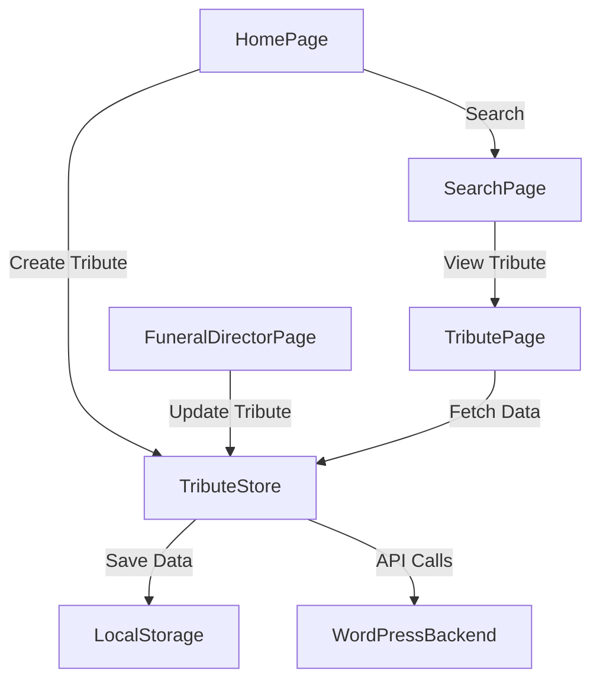

# Tribute System Implementation

## Overview

The Tribute System adds functionality for creating, searching, and viewing celebration of life tribute pages. It provides a way for users to create custom URLs for their loved ones and integrates seamlessly with the existing Master Store architecture.

This document outlines the implementation details of the Tribute System, including the store architecture, API integrations, and form actions.

---

## 1. Tribute Page Store

The Tribute Page Store (`src/lib/stores/tribute-page-store.svelte.ts`) manages tribute-specific state using Svelte 5 runes and follows the same patterns as the Master Store.

### Key Features:

- **Reactive State Management**: Uses `$state` for reactive property updates
- **Context API Integration**: Leverages Svelte's context API for global store access
- **localStorage Persistence**: Automatically saves and loads tribute data
- **CRUD Operations**: Contains methods for creating, reading, updating, and deleting tributes
- **Search Functionality**: Provides methods for tribute searching with pagination

### Core Structure:

```typescript
export class TributePageStore {
  // Current tribute being viewed or edited
  currentTribute = $state<Partial<Tribute>>({
    title: '',
    slug: '',
    custom_html: null
  });

  // Search state
  searchResults = $state<TributeSearchResults>({
    tributes: [],
    total_pages: 1,
    currentPage: 1,
    isLoading: false,
    error: null
  });

  // Recently created/updated tributes (for caching)
  recentTributes = $state<Tribute[]>([]);

  // Current JWT token
  authToken = $state<string | null>(null);
  
  // Key methods...
}
```

### Key Methods:

- `updateCurrentTribute()`: Updates the current tribute data
- `searchTributes()`: Searches tributes using the API
- `fetchTributeById()`: Retrieves a specific tribute by ID
- `fetchTributeBySlug()`: Retrieves a specific tribute by slug
- `createTribute()`: Creates a new tribute via the API
- `updateTribute()`: Updates an existing tribute
- `deleteTribute()`: Deletes a tribute
- `generateSlug()`: Creates a URL-friendly slug from a title
- `generateTributeUrl()`: Builds the full URL for a tribute page

---

## 2. API Integration

The API integration is implemented through enhanced API helper functions in `src/lib/utils/api-helpers.ts`.

### Key Features:

- **RESTful API Interaction**: Functions for CRUD operations on tributes
- **Search Functionality**: Searching tributes with pagination
- **Error Handling**: Consistent error handling patterns
- **Authentication**: JWT-based authentication for secure operations

### Core Functions:

```typescript
// Save a new tribute
export async function saveTribute(tributeData: TributeData, token: string): Promise<any>

// Search for tributes with pagination
export async function searchTributes(params: TributeSearchParams = {}): Promise<TributeSearchResults>

// Fetch a tribute by its slug
export async function getTributeBySlug(slug: string): Promise<any>

// Create a slug from a title
export function createTributeSlug(title: string): string

// Get a tribute URL from a slug or tribute data
export function getTributeUrl(slugOrTribute: string | TributeData): string

// Extract loved ones names from tributes
export function extractLovedOnesNames(tributes: TributeData[]): string[]
```

---

## 3. String Utility Functions

String utility functions for URL and slug generation are implemented in `src/lib/utils/string-helpers.ts`.

### Key Functions:

```typescript
// Creates a basic slug
export function createSlug(text: string): string

// Creates a tribute-specific slug with prefix
export function createTributeSlug(name: string): string

// Creates a full tribute page URL
export function createTributeUrl(slugOrName: string, isPrefixed: boolean = false): string
```

---

## 4. Form Actions Integration

The Tribute System integrates with SvelteKit form actions to handle server-side processing of tribute data.

### Home Page Integration:

- Enhanced the `createTribute` action in `src/routes/+page.server.ts`
- Added tribute slug generation
- Added API calls to save the tribute data
- Integrated with the Master Store flow

### Funeral Director Page Integration:

- Updated the `saveDirectorInfo` action in `src/routes/funeral-director/+page.server.ts`
- Added tribute creation alongside user registration
- Extended the data structure to include tribute-specific information
- Integrated with WordPress JWT authentication

### Search Page Implementation:

- Added a new `src/routes/search/+page.server.ts` file
- Implemented a `search` form action
- Integrated with the API search functionality
- Added pagination support

---

## 5. Custom URL Routing

The implementation provides support for custom "celebration of life" URLs:

- URLs follow the pattern: `/celebration-of-life-for-[name]`
- Slugs are automatically generated from loved one's names
- Integration with the WordPress backend via API
- Support for both client and server-side navigation

---

## 6. Integration with Master Store

The Tribute System seamlessly integrates with the existing Master Store:

- Tribute store is initialized alongside the Master Store
- Data is shared between stores when appropriate
- Form actions update both stores when needed
- Persistence mechanisms work in parallel

---

## 7. Data Flow



---

## 8. Implementation Challenges and Solutions

### Challenge: TypeScript Type Safety

**Solution**: Created proper interfaces for all tribute-related data structures and used type checking to ensure data consistency.

### Challenge: Integration with Existing Form Actions

**Solution**: Extended the action result interfaces to include tribute-specific data, allowing for seamless integration with the existing form action processing system.

### Challenge: Synchronization Between Stores

**Solution**: Implemented effects and context-based access to ensure both stores remain in sync when shared data changes.

---
 