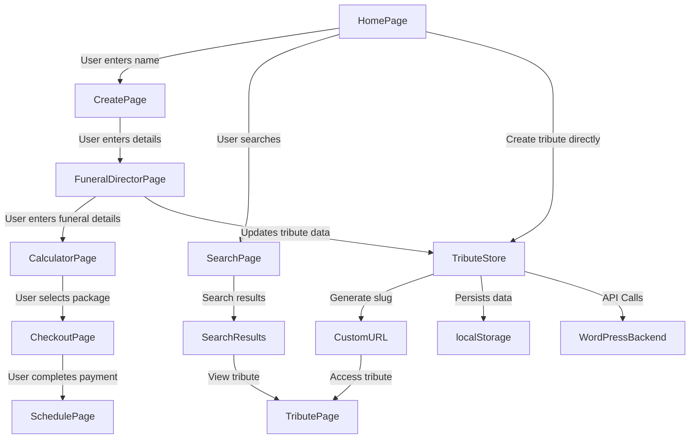

 # Implementation Details for Funeral Service Application
 
 ## **1. System Architecture**
 The Tributestream application follows a modular architecture with the following key components:
 
 - **Frontend (SvelteKit 5)**: Implements the UI and client-side logic.
 - **Backend (WordPress API)**: Provides authentication, tribute management, and data persistence.
 - **State Management (Master Store & Tribute Store)**: Manages application-wide and tribute-specific state.
 - **Form Actions**: Handles form submissions and integrates with the backend.
 - **Authentication (JWT-based)**: Secures API interactions.
 
 ### **Architecture Diagram**
 ```mermaid
 graph TD;
     UI[Frontend (SvelteKit 5)] -->|Form Actions| Server[WordPress API]
     UI -->|State Management| MasterStore[Master Store]
     UI -->|Tribute Data| TributeStore[Tribute Store]
     Server -->|Authentication| Auth[JWT Auth]
     Server -->|Data Persistence| Database[WordPress Database]
 ```
 
 ## **2. Data Flow and System Interactions**
 
 ### **Updated Data Flow Diagram**
 ```mermaid
 graph TD;
     User[User Interaction] -->|Form Submission| FormActions[Form Actions]
     FormActions -->|Validate & Process| Server[WordPress API]
     Server -->|Store Data| Database[WordPress Database]
     Server -->|Return Response| FormActions
     FormActions -->|Update State| MasterStore[Master Store]
     FormActions -->|Update Tribute Data| TributeStore[Tribute Store]
     TributeStore -->|Persist Data| LocalStorage[Local Storage]
     TributeStore -->|Fetch Tribute| TributePage[Tribute Page]
 ```
 
 This diagram illustrates how user interactions trigger form actions, which validate and process data before updating the state and interacting with the backend.
 
 ### **Form Actions and API Integration**
 - **Form Actions**: Handle form submissions, validate input, and send data to the backend.
 - **API Endpoints**:
   - `POST /api/tributes` - Creates a new tribute.
   - `GET /api/tributes/[id]` - Fetches tribute details.
   - `POST /api/auth` - Handles user authentication.
   - `POST /api/payment` - Processes payments.
 
We have implemented the following pages:
- **Home Page** (`src/routes/+page.svelte`)
- **Search Page** (`src/routes/search/+page.svelte`)
- **Create Page** (`src/routes/create/+page.svelte`)
- **Funeral Director Page** (`src/routes/funeral-director/+page.svelte`)
- **Calculator Page** (`src/routes/calculator/+page.svelte`)
- **Checkout Page** (`src/routes/checkout/+page.svelte`)
- **Schedule Page** (`src/routes/schedule/+page.svelte`)
- **Tribute Page** (`src/routes/celebration-of-life-for-[slug]/+page.svelte`)
- Schedule Page 
- Custom Tribute Page Template
- Login Page
- Family Dashboard

Each page interacts with two central stores:
- **Master Store** (`src/lib/stores/master-store.svelte.ts`) for user flow and service data
- **Tribute Store** (`src/lib/stores/tribute-page-store.svelte.ts`) for tribute-specific features

---

## **2. Data Flow and Page Implementation**

### **Home Page**
- **Elements:**
  - `lovedOnesFullName` input field (binds to `masterStore.lovedOneInfo.fullName`)
  - "Search" button (navigates to `/search` with the name as search parameter)
  - "Create" button (shows contact info form and generates custom URL)
  - Custom URL preview with editing capability
  - Contact information form when creating a tribute
- **Integration:**
  - Form submission creates a tribute entry in the API
  - Generates a custom URL following the pattern: `/celebration-of-life-for-{name}`
  - Updates both the master store and tribute store
  - Fowards the user the custom link through  SvleteKit's use :enhance and form actions. 

---

### **Search Page**
- **Elements:**
  - Search input field to search for loved one's names
  - Form submission with enhanced progressive enhancement
  - Pulls data from the tributes endpoint and stores it inot a list of tributes to be searched by loved ones name=
  - Results list showing matching tributes
  - Pagination controls for navigating through results
  - Links to view tribute pages 

- **Integration:**
  - Uses `searchTributes` API function for server-side searching\
  - Updates `tributeStore.searchResults` with results
  - Navigates to tribute page when selected
 
---

### **Create Page**
- **Elements:**
  - Inputs for:
    - `lovedOnesFullName` (pre-filled from `masterStore.lovedOneInfo.fullName`)
    - `usersFullName`
    - `usersEmailAddress`
    - `usersPhoneNumber`
  - "Next" button (navigates to `/celebration-of-life-for-[slug]`)

---

### **Funeral Director Page**
- **Elements:**
  - Inputs for:
    - `directorsFirstName`
    - `directorsLastName`
    - `funeralHomeName`
    - `funeralHomeAddress`
    - `lovedOnesFullName` (pre-filled)
    - `lovedOnesDOB`
    - `lovedOnesDateOfPassing`
    - `usersFullName` (pre-filled)
    - `usersEmailAddress` (pre-filled)
    - `usersDOB`
    - `usersPhoneNumber` (pre-filled)
    - `memorialLocationName`
    - `memorialLocationAddress`
    - `memorialStartTime`
    - `memorialDate`
  - "Next" button (navigates to `/celebration-of-life-for-[slug]`)
- **Integration:**
  - Updates user registration and tribute data simultaneously
  - Generates and displays the tribute URL
  - Stores memorial details in the tribute store
  - Creates or updates the tribute in the WordPress backend

---

### **Calculator Page**
- **Elements:**
  - Three package options: `Package A`, `Package B`, `Package C`
  - Pull this data from packages.js insde of /lib.
  - Editable fields:
    - `liveStreamDuration`
    - `liveStreamDate` (default: `memorialDate`)
    - `liveStreamStartTime` (default: `memorialStartTime`)
    - `funeralHomeName` (default: `funeralHomeName`)
    - `funeralDirectorName` (default: `directorsFirstName + directorsLastName`)
    - `memorialLocationName` (default: `funeralHomeName`)
    - `memorialLocationAddress` (default: `funeralHomeAddress`)
    - `numberOfLocations` (default: 1, allows up to 3)
    - `priceTotal` (computed based on package selection)
  - "Next" button (navigates to `/checkout`)

---

### **Checkout Page**
- **Elements:**
  - Summary of selections from Calculator Page
  - Inputs for:
    - `Billing first name`
    - `Billing last name`
    - `Billing Address`
    - `Billing Credit Card Form`
    - `isPaymentComplete`
  - "Complete Payment" button (marks `isPaymentComplete` as `true` and navigates to `/schedule`)

---

### **Schedule Page**
- **Elements:**
  - Displays  a simple booking form for the user, which registers them and sends them to the custom url. 

### **Family Dashboard**
- Understand the current layout and data display, and then refactor  so the data is displayed using our custom store and the layouts and tailwind css is unchanged. 
---

## **3. Functionality Breakdown**

### **Key Utility Files**
- `src/lib/utils/api-helpers.ts` - Handles API requests and responses.
- `src/lib/utils/auth-helpers.ts` - Manages authentication and JWT handling.
- `src/lib/utils/form-action-helper.ts` - Provides helper functions for form actions.
- `src/lib/utils/string-helper.ts` - Contains string manipulation utilities.

### **API Routes**
- `src/routes/api/auth/+server.ts` - Handles user authentication.
- `src/routes/api/tributes/+server.ts` - Manages tribute creation and retrieval.
- `src/routes/api/payment/+server.js` - Processes payments.
- `src/routes/api/logout/+server.ts` - Handles user logout.

These files and routes form the core of the application's backend interactions.

## **4. Store Integration**

### **Master Store Integration**
- **State Management:**
  - Uses `$state` for reactivity
  - Uses `$effect` to persist data to `localStorage`
  - Loads data from `localStorage` on initialization

- **Methods Implemented:**
  - `updateLovedOneInfo()`
  - `updateUserInfo()`
  - `updateDirectorInfo()`
  - `updateMemorialInfo()`
  - `updateLiveStreamInfo()`
  - `updatePackageInfo()`
  - `updateBillingInfo()`
  - `completePayment()`

### **Tribute Store Integration**
- **State Management:**
  - Uses `$state` for reactivity
  - Uses `$effect` to persist data to `localStorage`
  - Loads data from `localStorage` on initialization
  - Synchronizes with API endpoints

- **Methods Implemented:**
  - `updateCurrentTribute()`
  - `searchTributes()`
  - `fetchTributeById()`
  - `fetchTributeBySlug()`
  - `createTribute()`
  - `updateTribute()`
  - `deleteTribute()`
  - `generateSlug()`
  - `generateTributeUrl()`

---

## **5. Error Handling Mechanisms**

### **Client-Side Error Handling**
- `src/routes/+error.svelte` - Handles global errors and displays user-friendly messages.
- `src/lib/utils/api-helpers.ts` - Centralized error handling for API requests.

### **API Error Responses**
- **400 Bad Request** - Invalid input data.
- **401 Unauthorized** - Invalid or missing authentication token.
- **403 Forbidden** - User lacks necessary permissions.
- **500 Internal Server Error** - Unexpected server failure.

### **Example API Error Handling**
```typescript
try {
  const response = await fetch('/api/tributes');
  if (!response.ok) {
    throw new Error(`Error: ${response.status} ${response.statusText}`);
  }
  return await response.json();
} catch (error) {
  console.error('API request failed:', error);
}
```

## **6. Authentication & Authorization**

### **Authentication Flow**
1. User submits login credentials via `/api/auth`.
2. Server validates credentials and returns a JWT token.
3. Token is stored in local storage and used for subsequent API requests.
4. Protected routes verify the token before granting access.

### **Key Authentication Files**
- `src/lib/utils/auth-helpers.ts` - Manages JWT token storage and validation.
- `src/routes/api/auth/+server.ts` - Handles authentication requests.
- `src/routes/api/logout/+server.ts` - Manages user logout.

### **Example JWT Authentication**
```typescript
export async function login(email: string, password: string) {
  const response = await fetch('/api/auth', {
    method: 'POST',
    body: JSON.stringify({ email, password }),
    headers: { 'Content-Type': 'application/json' }
  });

  if (!response.ok) throw new Error('Login failed');

  const { token } = await response.json();
  localStorage.setItem('authToken', token);
}
```

## **7. Routing Structure**
```(NEEDS TO BE UDPATED)
src/routes/
  ├── +page.svelte (Home Page)
  ├── +page.server.ts (Server-side form actions)
  ├── search/
  │   ├── +page.svelte (Search Page)
  │   ├── +page.server.ts (Search form actions)
  ├── create/
  │   ├── +page.svelte (Create Page)
  │   ├── +page.server.ts (Create form actions)
  ├── funeral-director/
  │   ├── +page.svelte (Funeral Director Page)
  │   ├── +page.server.ts (Director form actions)
  ├── calculator/
  │   ├── +page.svelte (Calculator Page)
  │   ├── +page.server.ts (Calculator form actions)
  ├── checkout/
  │   ├── +page.svelte (Checkout Page)
  ├── schedule/
  │   ├── +page.svelte (Schedule Page)
  │   ├── +page.server.ts (Schedule form actions)
  ├── celebration-of-life-for-[slug]/
  │   ├── +page.svelte (Tribute Page)
  │   ├── +page.server.ts (Server-side tribute loading)
  │   ├── +page.js (Client-side tribute loading)
  ├── api/
  │   ├── tributes/
  │   │   ├── +server.ts (Tribute API endpoints)
  │   │   ├── [id]/
  │   │   │   ├── +server.ts (Single tribute API)
  │   │   ├── by-slug/
  │   │   │   ├── [slug]/
  │   │   │   │   ├── +server.ts (Tribute by slug API)
```

---

## **5. Data Flow Diagram**


 