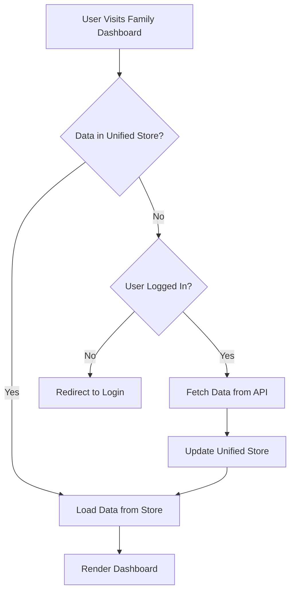

# Integrating Family Dashboard with Unified Store

## Overview
This guide outlines the steps to integrate the family dashboard with the unified store, ensuring that all data is fetched and managed efficiently.

## Steps

### 1. Modify `+page.server.ts`
- Import the unified store.
- Fetch user metadata and tributes from the store.
- If data is missing:
  - Check if the user is logged in.
  - Fetch data from:
    - `api/tributes/[id]/+server.ts` using `user_id`
    - `api/user-meta/+server.ts`
  - Store the fetched data in the unified store.

### 2. Update `+page.svelte`
- Replace direct data references with reactive store bindings.
- Ensure UI elements reflect loading states.
- Implement error handling for failed requests.

### 3. Ensure Proper Reactivity
- Use `$effect` to update the UI when store data changes.
- Ensure tribute selection updates the store correctly.

### 4. Implement a Step-by-Step Guide in Markdown
- Document the integration process.
- Provide code snippets and explanations.

## Mermaid Diagram

## Conclusion
This integration ensures that the family dashboard efficiently retrieves and manages data using the unified store, improving performance and maintainability.