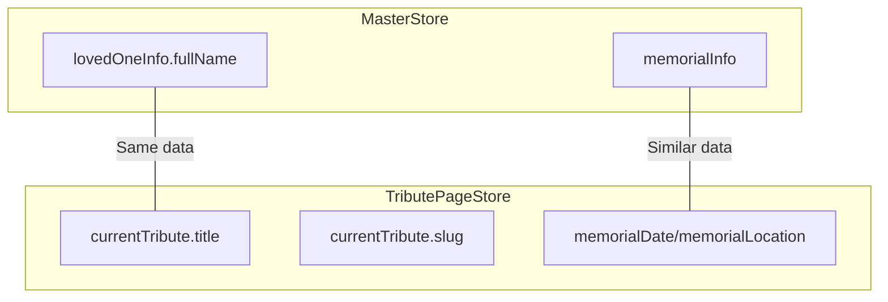
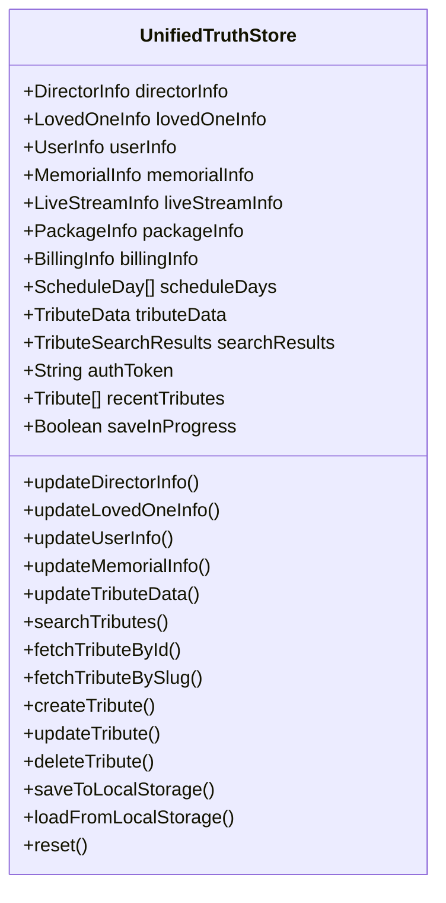

# Svelte Store Architecture Refactoring Plan: UnifiedTruth

## Objective

Create a single unified store that serves as the authoritative source of truth for all tribute data by consolidating the current `master-store.svelte.ts` and `tribute-page-store.svelte.ts` into a new `unified-truth-store.svelte.ts` file.

## Current Architecture Analysis

### Overlapping Data Points



Key redundancies identified:
- `lovedOneInfo.fullName` (master-store) ↔️ `currentTribute.title` (tribute-page-store)
- Memorial information appears in both stores but with different structures
- Both stores implement separate localStorage persistence mechanisms
- Both stores use context APIs with separate keys

### Unique Features in Each Store

**Master Store:**
- Comprehensive funeral service details
- Schedule days with extended memorial locations
- Package and billing information
- Multi-location support

**Tribute Page Store:**
- API integration (CRUD operations for tributes)
- Authentication token management
- Search functionality
- Slug generation logic

## Implementation Plan

### 1. Create New UnifiedTruth Store File

Create a new file `unified-truth-store.svelte.ts` that fully replaces both existing stores:



### 2. Define Consolidated Interfaces

Merge all interfaces from both stores, eliminating redundancy:

1. Maintain all existing interfaces from `master-store.svelte.ts`
2. Incorporate interfaces from `tribute-page-store.svelte.ts`
3. Eliminate the separate `title` property in tribute data, using `lovedOneInfo.fullName` instead
4. Ensure proper TypeScript typing throughout

### 3. Implement the UnifiedTruth Class

- Integrate all state properties from both stores
- Implement all methods from both stores
- Use Svelte 5 runes ($state, $derived, $effect) for reactive state management
- Ensure the new store serves as a direct replacement for both current stores

### 4. Data Consolidation Strategy

1. **Primary Source of Truth:**
   - Use `lovedOneInfo.fullName` as the single source of truth for tribute name/title
   - Create a derived property that maps `lovedOneInfo.fullName` to tribute title for backward compatibility

2. **Reactive Relationships:**
   ```typescript
   // Example of reactive relationship in the new store
   get tributeTitle() {
     return this.lovedOneInfo.fullName || '';
   }
   
   // When updating loved one info, also update derived properties
   updateLovedOneInfo(info: Partial<LovedOneInfo>) {
     this.lovedOneInfo = { ...this.lovedOneInfo, ...info };
     // Additional logic to ensure derived data is consistent
   }
   ```

### 5. Unified Persistence Mechanism

Implement a single localStorage persistence approach that:
1. Stores all data in a single structured object
2. Handles initial data loading from previous separate storage keys
3. Migrates data from old format to new format (one-time migration)

### 6. Context API Integration

1. Define a single context key for the UnifiedTruth store
2. Implement setter and getter functions for the context
3. Update all components to use the new context functions

### 7. Update masterSchema.ts

Update the schema file to include all tribute-related fields:

1. Add tribute-specific schema validations
2. Update existing schemas to reflect the unified structure
3. Update types to match the consolidated interfaces

### 8. Component Migration Strategy

Complete, immediate transition of all components to use only the UnifiedTruth store:

1. Identify all components using either store
2. Update all import statements to reference the new store
3. Replace all context getting/setting with new unified approach
4. Update all component code to use the new store properties and methods
5. Remove all references to old stores throughout the codebase

### 9. Testing Strategy

1. Create a comprehensive test suite that verifies:
   - All existing functionality works with the new store
   - Data synchronization operates correctly
   - CRUD operations function as expected
   - localStorage persistence works properly

2. Verify all components interact correctly with the new store

## Implementation Sequence

### Phase 1: Development (Day 1)

1. Create `unified-truth-store.svelte.ts` with all interfaces and basic class structure
2. Implement state properties and methods from both existing stores
3. Add data synchronization logic for overlapping properties
4. Implement unified localStorage persistence
5. Update `masterSchema.ts` with consolidated schema definitions

### Phase 2: Component Migration (Day 2)

1. Update all components that currently use `MasterStore` to use `UnifiedTruthStore`
2. Update all components that currently use `TributePageStore` to use `UnifiedTruthStore`
3. Fix any type errors or property access issues
4. Update all context usage throughout the codebase

### Phase 3: Verification and Cleanup (Day 3)

1. Run comprehensive tests to verify all functionality
2. Fix any bugs or issues discovered during testing
3. Remove the old store files once all components are migrated
4. Final code review and deployment

## Code Examples

### 1. New Store Definition

```typescript
// unified-truth-store.svelte.ts
import { setContext, getContext } from 'svelte';
import { saveTribute } from '$lib/utils/api-helpers';
import type { TributeData } from '$lib/utils/api-helpers';

// ---- Interfaces from Master Store ----
export interface DirectorInfo {
  firstName: string;
  lastName: string;
  funeralHomeName: string;
  funeralHomeAddress: string;
}

export interface LovedOneInfo {
  fullName: string;
  dateOfBirth?: string;
  dateOfPassing?: string;
}

// ... other interfaces ...

// ---- Interfaces from Tribute Page Store ----
export interface Tribute {
  id?: number | string;
  slug: string;
  description?: string;
  memorialDate?: string;
  memorialLocation?: string;
  custom_html?: string | null;
  created_at?: string;
  updated_at?: string;
  [key: string]: any;
}

export interface TributeSearchResults {
  tributes: Tribute[];
  total_pages: number;
  currentPage: number;
  isLoading: boolean;
  error: string | null;
}

// Unique symbol key for the unified context
const unifiedTruthKey = Symbol('unifiedTruth');

export class UnifiedTruthStore {
  // ---- State from Master Store ----
  directorInfo = $state<Partial<DirectorInfo>>({});
  lovedOneInfo = $state<Partial<LovedOneInfo>>({});
  userInfo = $state<Partial<UserInfo>>({});
  // ... other state properties ...
  
  // ---- State from Tribute Page Store ----
  currentTribute = $state<Partial<Tribute>>({
    slug: '',
    custom_html: null
  });
  searchResults = $state<TributeSearchResults>({
    tributes: [],
    total_pages: 1,
    currentPage: 1,
    isLoading: false,
    error: null
  });
  recentTributes = $state<Tribute[]>([]);
  authToken = $state<string | null>(null);
  
  // Flag to prevent infinite localStorage save loops
  private saveInProgress = $state(false);
  
  // ---- Computed Properties ----
  
  // Current tribute title derived from loved one's name
  get tributeTitle() {
    return this.lovedOneInfo.fullName || '';
  }
  
  // ---- Methods from Master Store ----
  updateDirectorInfo(info: Partial<DirectorInfo>) {
    this.directorInfo = { ...this.directorInfo, ...info };
  }
  
  // ... other methods ...
  
  // ---- Methods from Tribute Page Store ----
  updateCurrentTribute(tributeData: Partial<Tribute>): void {
    // Special handling for title - should not be stored separately
    const { title, ...rest } = tributeData;
    
    // If title is provided, update lovedOneInfo.fullName
    if (title) {
      this.updateLovedOneInfo({ fullName: title });
    }
    
    this.currentTribute = { ...this.currentTribute, ...rest };
  }
  
  // ... other methods ...
  
  // ---- Unified Persistence ----
  saveToLocalStorage() {
    if (typeof window !== 'undefined' && !this.saveInProgress) {
      this.saveInProgress = true;
      
      const data = {
        directorInfo: this.directorInfo,
        lovedOneInfo: this.lovedOneInfo,
        userInfo: this.userInfo,
        memorialInfo: this.memorialInfo,
        liveStreamInfo: this.liveStreamInfo,
        packageInfo: this.packageInfo,
        billingInfo: this.billingInfo,
        scheduleDays: this.scheduleDays,
        currentTribute: this.currentTribute,
        recentTributes: this.recentTributes,
        authToken: this.authToken
      };
      
      localStorage.setItem('unifiedTruthData', JSON.stringify(data));
      
      setTimeout(() => {
        this.saveInProgress = false;
      }, 100);
    }
  }
  
  loadFromLocalStorage(): boolean {
    if (typeof window !== 'undefined') {
      // Try to load from unified storage first
      const savedData = localStorage.getItem('unifiedTruthData');
      if (savedData) {
        try {
          const data = JSON.parse(savedData);
          this.directorInfo = data.directorInfo || {};
          this.lovedOneInfo = data.lovedOneInfo || {};
          // ... load other properties ...
          return true;
        } catch (e) {
          console.error('Failed to parse saved unified data:', e);
        }
      }
      
      // If unified data not found, try migrating from old storage
      return this.migrateFromOldStorage();
    }
    return false;
  }
  
  private migrateFromOldStorage(): boolean {
    const migratedAny = false;
    
    // Try loading from master store
    const masterData = localStorage.getItem('funeralServiceData');
    if (masterData) {
      try {
        const data = JSON.parse(masterData);
        this.directorInfo = data.directorInfo || {};
        this.lovedOneInfo = data.lovedOneInfo || {};
        // ... load other properties ...
        migratedAny = true;
      } catch (e) {
        console.error('Failed to migrate master store data:', e);
      }
    }
    
    // Try loading from tribute store
    const tributeData = localStorage.getItem('tributePageStore');
    if (tributeData) {
      try {
        const data = JSON.parse(tributeData);
        this.currentTribute = data.currentTribute || {};
        this.recentTributes = data.recentTributes || [];
        this.authToken = data.authToken || null;
        migratedAny = true;
        
        // Sync the title if needed
        if (this.currentTribute.title && !this.lovedOneInfo.fullName) {
          this.lovedOneInfo = { 
            ...this.lovedOneInfo, 
            fullName: this.currentTribute.title 
          };
        }
      } catch (e) {
        console.error('Failed to migrate tribute store data:', e);
      }
    }
    
    // If we migrated any data, save it in the new format
    if (migratedAny) {
      this.saveToLocalStorage();
    }
    
    return migratedAny;
  }
  
  // ... other methods ...
}

export function setUnifiedTruthContext() {
  const store = new UnifiedTruthStore();
  setContext(unifiedTruthKey, store);
  return store;
}

export function getUnifiedTruthContext(): UnifiedTruthStore {
  return getContext(unifiedTruthKey);
}
```

### 2. Updated masterSchema.ts

```typescript
import { z } from 'zod';

// Original schemas
const directorInfoSchema = z.object({
  firstName: z.string().min(1, "First name is required"),
  lastName: z.string().min(1, "Last name is required"),
  funeralHomeName: z.string().min(1, "Funeral home name is required"),
  funeralHomeAddress: z.string().min(1, "Funeral home address is required")
}).partial();

// ... other schemas ...

// New tribute-related schemas
const tributeSchema = z.object({
  id: z.union([z.number(), z.string()]).optional(),
  slug: z.string(),
  description: z.string().optional(),
  memorialDate: z.string().optional(),
  memorialLocation: z.string().optional(),
  custom_html: z.string().nullable().optional(),
  created_at: z.string().optional(),
  updated_at: z.string().optional()
}).partial();

const tributeSearchResultsSchema = z.object({
  tributes: z.array(tributeSchema),
  total_pages: z.number(),
  currentPage: z.number(),
  isLoading: z.boolean(),
  error: z.string().nullable()
});

// The unified schema combines all section schemas
export const unifiedSchema = z.object({
  directorInfo: directorInfoSchema,
  lovedOneInfo: lovedOneInfoSchema,
  userInfo: userInfoSchema,
  memorialInfo: memorialInfoSchema,
  liveStreamInfo: liveStreamInfoSchema,
  packageInfo: packageInfoSchema,
  billingInfo: billingInfoSchema,
  currentTribute: tributeSchema,
  searchResults: tributeSearchResultsSchema,
  recentTributes: z.array(tributeSchema),
  authToken: z.string().nullable()
});

// Export type for TypeScript usage
export type UnifiedSchema = z.infer<typeof unifiedSchema>;

export default unifiedSchema;
```

### 3. Component Migration Example

```svelte
<!-- Before -->
<script>
import { getMasterStoreContext } from '$lib/stores/master-store.svelte.ts';
const masterStore = getMasterStoreContext();
</script>

<h1>{masterStore.lovedOneInfo.fullName}</h1>

<!-- After -->
<script>
import { getUnifiedTruthContext } from '$lib/stores/unified-truth-store.svelte.ts';
const store = getUnifiedTruthContext();
</script>

<h1>{store.lovedOneInfo.fullName}</h1>
```

## Conclusion

This plan represents a complete and immediate transition to the UnifiedTruthStore architecture. It eliminates all redundancy while maintaining the functionality of both original stores. The implementation emphasizes a clean, straightforward approach with no backward compatibility layers or fallback mechanisms, as all components will immediately adopt the new unified store.