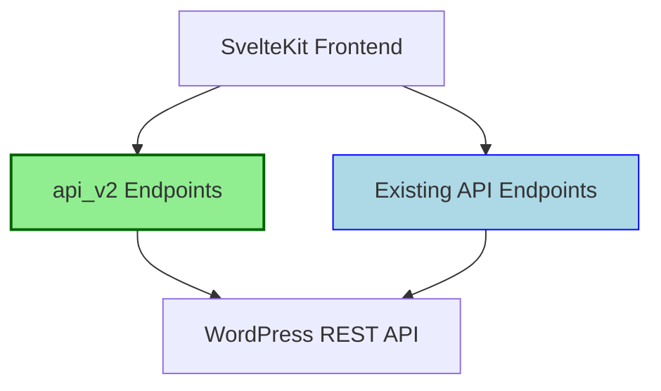

# API v2 Implementation Plan

This document outlines the plan for implementing the new `api_v2` endpoints that will serve as SvelteKit server proxies to the WordPress plugin's REST API endpoints.

## Overview

The `api_v2` endpoints will coexist with the current API endpoints while providing:

1. A more RESTful design
2. Better error handling with standardized responses
3. Comprehensive TypeScript interfaces for improved type safety
4. Enhanced validation with clear error messages
5. Client-side helper functions for easy integration



## Directory Structure

```
src/
└── routes/
    └── api/
        ├── v2/
        │   ├── types/
        │   │   ├── index.ts
        │   │   ├── auth.ts
        │   │   ├── roles.ts
        │   │   ├── users.ts
        │   │   ├── tributes.ts
        │   │   ├── events.ts
        │   │   └── locations.ts
        │   ├── utils/
        │   │   ├── error-handler.ts
        │   │   ├── response-formatter.ts
        │   │   └── validation.ts
        │   ├── auth/
        │   │   ├── +server.ts
        │   │   ├── logout/
        │   │   │   └── +server.ts
        │   │   └── register/
        │   │       └── +server.ts
        │   ├── users/
        │   │   ├── +server.ts
        │   │   ├── [id]/
        │   │   │   ├── +server.ts
        │   │   │   └── roles/
        │   │   │       └── +server.ts
        │   │   └── me/
        │   │       └── +server.ts
        │   ├── roles/
        │   │   ├── +server.ts
        │   │   └── [role]/
        │   │       └── +server.ts
        │   ├── tributes/
        │   │   ├── +server.ts
        │   │   ├── [id]/
        │   │   │   └── +server.ts
        │   │   └── by-slug/
        │   │       └── [slug]/
        │   │           └── +server.ts
        │   ├── locations/
        │   │   ├── +server.ts
        │   │   └── [id]/
        │   │       └── +server.ts
        │   └── events/
        │       ├── +server.ts
        │       └── [id]/
        │           └── +server.ts
        └── ... (existing API endpoints)
```

## API Endpoints

### Authentication Endpoints

| Endpoint | Method | Description | WordPress Endpoint |
|----------|--------|-------------|-------------------|
| `/api/v2/auth` | POST | Authenticate user and get JWT token | `/wp-json/jwt-auth/v1/token` |
| `/api/v2/auth/logout` | POST | Invalidate JWT token | N/A (Cookie management) |
| `/api/v2/auth/register` | POST | Register a new user | `/wp-json/wp/v2/users` |

### User Endpoints

| Endpoint | Method | Description | WordPress Endpoint |
|----------|--------|-------------|-------------------|
| `/api/v2/users` | GET | Get list of users | `/wp-json/wp/v2/users` |
| `/api/v2/users` | POST | Create a new user | `/wp-json/wp/v2/users` |
| `/api/v2/users/[id]` | GET | Get user by ID | `/wp-json/wp/v2/users/[id]` |
| `/api/v2/users/[id]` | PUT | Update user by ID | `/wp-json/wp/v2/users/[id]` |
| `/api/v2/users/[id]` | DELETE | Delete user by ID | `/wp-json/wp/v2/users/[id]` |
| `/api/v2/users/me` | GET | Get current user | `/wp-json/wp/v2/users/me` |
| `/api/v2/users/[id]/roles` | GET | Get user roles | `/tributestream/v1/users/[id]/role` |
| `/api/v2/users/[id]/roles` | PUT | Update user roles | `/tributestream/v1/users/[id]/role` |

### Role Endpoints

| Endpoint | Method | Description | WordPress Endpoint |
|----------|--------|-------------|-------------------|
| `/api/v2/roles` | GET | Get all available roles | `/wp-json/wp/v2/roles` |
| `/api/v2/roles/check` | GET | Check if user has role/capability | `/tributestream/v1/users/[id]/role` |

### Tribute Endpoints

| Endpoint | Method | Description | WordPress Endpoint |
|----------|--------|-------------|-------------------|
| `/api/v2/tributes` | GET | Get all tributes | `/funeral/v2/tribute-pages` |
| `/api/v2/tributes` | POST | Create a new tribute | `/funeral/v2/tribute-pages` |
| `/api/v2/tributes/[id]` | GET | Get tribute by ID | `/funeral/v2/tribute-pages/[id]` |
| `/api/v2/tributes/[id]` | PUT | Update tribute by ID | `/funeral/v2/tribute-pages/[id]` |
| `/api/v2/tributes/[id]` | DELETE | Delete tribute by ID | `/funeral/v2/tribute-pages/[id]` |
| `/api/v2/tributes/by-slug/[slug]` | GET | Get tribute by slug | `/funeral/v2/tribute-pages/by-slug/[slug]` |

### Location Endpoints

| Endpoint | Method | Description | WordPress Endpoint |
|----------|--------|-------------|-------------------|
| `/api/v2/locations` | GET | Get all locations | `/funeral/v2/locations` |
| `/api/v2/locations` | POST | Create a new location | `/funeral/v2/locations` |
| `/api/v2/locations/[id]` | GET | Get location by ID | `/funeral/v2/locations/[id]` |
| `/api/v2/locations/[id]` | PUT | Update location by ID | `/funeral/v2/locations/[id]` |
| `/api/v2/locations/[id]` | DELETE | Delete location by ID | `/funeral/v2/locations/[id]` |
| `/api/v2/tributes/[id]/locations` | GET | Get locations for a tribute | `/funeral/v2/tribute-pages/[id]/locations` |

### Event Endpoints

| Endpoint | Method | Description | WordPress Endpoint |
|----------|--------|-------------|-------------------|
| `/api/v2/events` | GET | Get all events | `/funeral/v2/events` |
| `/api/v2/events` | POST | Create a new event | `/funeral/v2/events` |
| `/api/v2/events/[id]` | GET | Get event by ID | `/funeral/v2/events/[id]` |
| `/api/v2/events/[id]` | PUT | Update event by ID | `/funeral/v2/events/[id]` |
| `/api/v2/events/[id]` | DELETE | Delete event by ID | `/funeral/v2/events/[id]` |
| `/api/v2/events/active` | GET | Get active events | `/funeral/v2/events/active` |
| `/api/v2/locations/[id]/events` | GET | Get events for a location | `/funeral/v2/locations/[id]/events` |
| `/api/v2/tributes/[id]/events` | GET | Get events for a tribute | `/funeral/v2/tribute-pages/[id]/events` |

## TypeScript Interfaces

### Base Interfaces (types/index.ts)

```typescript
// Base response interface
export interface ApiResponse<T = any> {
  success: boolean;
  data?: T;
  error?: ApiError;
  meta?: {
    pagination?: {
      total: number;
      page: number;
      per_page: number;
      total_pages: number;
    };
  };
}

// Error interface
export interface ApiError {
  code: string;
  message: string;
  details?: any;
  status: number;
}

// Authentication interfaces
export interface AuthToken {
  token: string;
  expires_at: string;
}
```

### Role-specific Interfaces (types/roles.ts)

```typescript
import type { ApiResponse } from './index';

export interface Role {
  name: string;
  display_name: string;
  capabilities: string[];
}

export interface UserRole {
  user_id: number;
  roles: string[];
  capabilities: Record<string, boolean>;
  user_type?: string;
}

export interface RoleCheckRequest {
  userId: number;
  role?: string;
  capability?: string;
}

export interface RoleCheckResponse extends ApiResponse {
  data?: {
    hasRole?: boolean;
    hasCapability?: boolean;
    roles?: string[];
    capabilities?: string[];
  };
}

export interface RoleAssignRequest {
  userId: number;
  role: string;
  userType?: string;
}

export interface RoleAssignResponse extends ApiResponse {
  data?: {
    userId: number;
    role: string;
    message: string;
  };
}
```

### User Interfaces (types/users.ts)

```typescript
import type { ApiResponse } from './index';

export interface User {
  id: number;
  username: string;
  name: string;
  email: string;
  display_name?: string;
  roles?: string[];
  capabilities?: Record<string, boolean>;
  user_type?: string;
}

export interface UserCreateRequest {
  username: string;
  email: string;
  password: string;
  name?: string;
  first_name?: string;
  last_name?: string;
  user_type?: string;
  role?: string;
}

export interface UserUpdateRequest {
  email?: string;
  name?: string;
  first_name?: string;
  last_name?: string;
  password?: string;
  user_type?: string;
}

export interface UserResponse extends ApiResponse {
  data?: User;
}

export interface UsersListResponse extends ApiResponse {
  data?: User[];
}
```

## Error Handling (utils/error-handler.ts)

```typescript
import type { ApiError } from '../types';
import { json } from '@sveltejs/kit';

export enum ErrorCode {
  UNAUTHORIZED = 'UNAUTHORIZED',
  FORBIDDEN = 'FORBIDDEN',
  NOT_FOUND = 'NOT_FOUND',
  VALIDATION_ERROR = 'VALIDATION_ERROR',
  INTERNAL_ERROR = 'INTERNAL_ERROR',
  BAD_REQUEST = 'BAD_REQUEST'
}

export class ApiException extends Error {
  code: string;
  status: number;
  details?: any;

  constructor(code: string, message: string, status: number = 500, details?: any) {
    super(message);
    this.code = code;
    this.status = status;
    this.details = details;
  }

  toJSON(): ApiError {
    return {
      code: this.code,
      message: this.message,
      status: this.status,
      details: this.details
    };
  }
}

export function handleApiError(error: unknown) {
  console.error('API Error:', error);
  
  if (error instanceof ApiException) {
    return json({
      success: false,
      error: error.toJSON()
    }, { status: error.status });
  }
  
  // Handle WordPress API errors
  if (error instanceof Response) {
    return json({
      success: false,
      error: {
        code: ErrorCode.INTERNAL_ERROR,
        message: 'WordPress API error',
        status: error.status
      }
    }, { status: error.status });
  }
  
  // Default error handling
  return json({
    success: false,
    error: {
      code: ErrorCode.INTERNAL_ERROR,
      message: error instanceof Error ? error.message : 'Unknown error occurred',
      status: 500
    }
  }, { status: 500 });
}
```

## Response Formatter (utils/response-formatter.ts)

```typescript
import type { ApiResponse } from '../types';
import { json } from '@sveltejs/kit';

export function formatResponse<T>(data: T, status: number = 200, meta?: any): Response {
  const response: ApiResponse<T> = {
    success: true,
    data,
    meta
  };
  
  return json(response, { status });
}
```

## Validation (utils/validation.ts)

```typescript
import { ErrorCode, ApiException } from './error-handler';

export function validateRequired(obj: any, fields: string[]) {
  const missing = fields.filter(field => obj[field] === undefined || obj[field] === null);
  
  if (missing.length > 0) {
    throw new ApiException(
      ErrorCode.VALIDATION_ERROR,
      `Missing required fields: ${missing.join(', ')}`,
      400,
      { missing }
    );
  }
}

export function validateNumeric(obj: any, fields: string[]) {
  const invalid = fields.filter(field => {
    const value = obj[field];
    return value !== undefined && value !== null && !/^\d+$/.test(String(value));
  });
  
  if (invalid.length > 0) {
    throw new ApiException(
      ErrorCode.VALIDATION_ERROR,
      `Fields must be numeric: ${invalid.join(', ')}`,
      400,
      { invalid }
    );
  }
}

export function validateEmail(email: string) {
  const emailRegex = /^[^\s@]+@[^\s@]+\.[^\s@]+$/;
  if (!emailRegex.test(email)) {
    throw new ApiException(
      ErrorCode.VALIDATION_ERROR,
      'Invalid email format',
      400
    );
  }
}

export function validatePassword(password: string, minLength: number = 8) {
  if (password.length < minLength) {
    throw new ApiException(
      ErrorCode.VALIDATION_ERROR,
      `Password must be at least ${minLength} characters long`,
      400
    );
  }
}
```

## Endpoint Implementation Examples

### 1. User Roles Endpoint (routes/api/v2/users/[id]/roles/+server.ts)

```typescript
import { json } from '@sveltejs/kit';
import type { RequestHandler } from './$types';
import { getTokenFromCookie } from '$lib/utils/cookie-auth';
import { handleApiError, ApiException, ErrorCode } from '../../../utils/error-handler';
import { formatResponse } from '../../../utils/response-formatter';
import { validateRequired } from '../../../utils/validation';
import type { RoleAssignRequest, UserRole } from '../../../types/roles';

// GET user roles
export const GET: RequestHandler = async ({ params, cookies, fetch }) => {
  try {
    const userId = params.id;
    const token = getTokenFromCookie(cookies);
    
    if (!token) {
      throw new ApiException(ErrorCode.UNAUTHORIZED, 'Authentication required', 401);
    }
    
    // Make request to WordPress API
    const response = await fetch(`/tributestream/v1/users/${userId}/role`, {
      method: 'GET',
      headers: {
        'Authorization': `Bearer ${token}`
      }
    });
    
    if (!response.ok) {
      const errorData = await response.json();
      throw new ApiException(
        ErrorCode.BAD_REQUEST,
        errorData.message || 'Failed to fetch user roles',
        response.status
      );
    }
    
    const data: UserRole = await response.json();
    
    return formatResponse(data);
  } catch (error) {
    return handleApiError(error);
  }
};

// PUT update user role
export const PUT: RequestHandler = async ({ params, request, cookies, fetch }) => {
  try {
    const userId = params.id;
    const token = getTokenFromCookie(cookies);
    
    if (!token) {
      throw new ApiException(ErrorCode.UNAUTHORIZED, 'Authentication required', 401);
    }
    
    // Parse request body
    const data: RoleAssignRequest = await request.json();
    
    // Validate required fields
    validateRequired(data, ['role']);
    
    // Make request to WordPress API
    const response = await fetch(`/tributestream/v1/users/${userId}/role`, {
      method: 'PUT',
      headers: {
        'Content-Type': 'application/json',
        'Authorization': `Bearer ${token}`
      },
      body: JSON.stringify({
        role: data.role,
        user_type: data.userType
      })
    });
    
    if (!response.ok) {
      const errorData = await response.json();
      throw new ApiException(
        ErrorCode.BAD_REQUEST,
        errorData.message || 'Failed to update user role',
        response.status
      );
    }
    
    const responseData = await response.json();
    
    return formatResponse({
      userId: Number(userId),
      role: data.role,
      message: 'Role updated successfully'
    });
  } catch (error) {
    return handleApiError(error);
  }
};
```

### 2. Authentication Endpoint (routes/api/v2/auth/+server.ts)

```typescript
import { json } from '@sveltejs/kit';
import type { RequestHandler } from './$types';
import { setAuthCookies } from '$lib/utils/auth-helpers';
import { handleApiError, ApiException, ErrorCode } from '../../utils/error-handler';
import { formatResponse } from '../../utils/response-formatter';
import { validateRequired, validateEmail, validatePassword } from '../../utils/validation';

export const POST: RequestHandler = async ({ request, cookies }) => {
  try {
    // Parse request body
    const data = await request.json();
    
    // Validate required fields
    validateRequired(data, ['username', 'password']);
    
    // Validate email if provided as username
    if (data.username.includes('@')) {
      validateEmail(data.username);
    }
    
    // Make request to WordPress JWT endpoint
    const response = await fetch('https://wp.tributestream.com/wp-json/jwt-auth/v1/token', {
      method: 'POST',
      headers: {
        'Content-Type': 'application/json'
      },
      body: JSON.stringify({
        username: data.username,
        password: data.password
      })
    });
    
    // Parse WordPress response
    const responseData = await response.json();
    
    if (!response.ok) {
      throw new ApiException(
        ErrorCode.UNAUTHORIZED,
        responseData.message || 'Authentication failed',
        response.status
      );
    }
    
    // Set auth cookies
    setAuthCookies(cookies, responseData);
    
    // Return success response (without token since it's now in the cookie)
    return formatResponse({
      name: responseData.user_display_name,
      display_name: responseData.user_display_name,
      email: responseData.user_email,
      roles: responseData.roles || [],
      capabilities: responseData.capabilities || {}
    });
  } catch (error) {
    return handleApiError(error);
  }
};
```

## Client-Side Helper Functions

To make it easier to interact with the new api_v2 endpoints, we'll create a set of helper functions:

```typescript
// src/lib/utils/api-v2-helpers.ts
import type { ApiResponse } from '../../routes/api/v2/types';
import type { UserRole, RoleAssignRequest, RoleCheckResponse } from '../../routes/api/v2/types/roles';
import type { User, UserCreateRequest, UserUpdateRequest } from '../../routes/api/v2/types/users';

/**
 * Generic API request function with type safety
 */
export async function apiRequest<T = any, R = any>(
  endpoint: string,
  method: 'GET' | 'POST' | 'PUT' | 'DELETE' = 'GET',
  body?: T,
  fetchFn: typeof fetch = fetch
): Promise<ApiResponse<R>> {
  try {
    const options: RequestInit = {
      method,
      headers: {
        'Content-Type': 'application/json'
      }
    };
    
    if (body) {
      options.body = JSON.stringify(body);
    }
    
    const response = await fetchFn(`/api/v2/${endpoint}`, options);
    const data: ApiResponse<R> = await response.json();
    
    if (!response.ok) {
      console.error('API Error:', data.error);
      return {
        success: false,
        error: data.error || {
          code: 'UNKNOWN_ERROR',
          message: 'Unknown error occurred',
          status: response.status
        }
      };
    }
    
    return data;
  } catch (error) {
    console.error('API Request Error:', error);
    return {
      success: false,
      error: {
        code: 'REQUEST_FAILED',
        message: error instanceof Error ? error.message : 'Request failed',
        status: 500
      }
    };
  }
}

/**
 * User role-related API helpers
 */
export const userRolesApi = {
  // Get user roles
  getUserRoles: (userId: number, fetchFn: typeof fetch = fetch) => 
    apiRequest<void, UserRole>(`users/${userId}/roles`, 'GET', undefined, fetchFn),
  
  // Assign role to user
  assignUserRole: (userId: number, role: string, userType?: string, fetchFn: typeof fetch = fetch) => 
    apiRequest<RoleAssignRequest, any>(
      `users/${userId}/roles`,
      'PUT',
      { userId, role, userType },
      fetchFn
    ),
  
  // Check if user has role
  checkUserRole: (userId: number, role: string, fetchFn: typeof fetch = fetch) => 
    apiRequest<void, RoleCheckResponse['data']>(
      `roles/check?userId=${userId}&role=${role}`,
      'GET',
      undefined,
      fetchFn
    )
};

/**
 * Authentication API helpers
 */
export const authApi = {
  // Login
  login: (username: string, password: string, fetchFn: typeof fetch = fetch) => 
    apiRequest<{ username: string; password: string }, any>(
      'auth',
      'POST',
      { username, password },
      fetchFn
    ),
  
  // Logout
  logout: (fetchFn: typeof fetch = fetch) => 
    apiRequest<void, any>('auth/logout', 'POST', undefined, fetchFn),
  
  // Register
  register: (userData: UserCreateRequest, fetchFn: typeof fetch = fetch) => 
    apiRequest<UserCreateRequest, any>('auth/register', 'POST', userData, fetchFn),
  
  // Get current user
  getCurrentUser: (fetchFn: typeof fetch = fetch) => 
    apiRequest<void, User>('users/me', 'GET', undefined, fetchFn)
};

/**
 * Users API helpers
 */
export const usersApi = {
  // Get all users
  getUsers: (page: number = 1, perPage: number = 10, fetchFn: typeof fetch = fetch) => 
    apiRequest<void, User[]>(`users?page=${page}&per_page=${perPage}`, 'GET', undefined, fetchFn),
  
  // Get user by ID
  getUser: (userId: number, fetchFn: typeof fetch = fetch) => 
    apiRequest<void, User>(`users/${userId}`, 'GET', undefined, fetchFn),
  
  // Create user
  createUser: (userData: UserCreateRequest, fetchFn: typeof fetch = fetch) => 
    apiRequest<UserCreateRequest, User>('users', 'POST', userData, fetchFn),
  
  // Update user
  updateUser: (userId: number, userData: UserUpdateRequest, fetchFn: typeof fetch = fetch) => 
    apiRequest<UserUpdateRequest, User>(`users/${userId}`, 'PUT', userData, fetchFn),
  
  // Delete user
  deleteUser: (userId: number, fetchFn: typeof fetch = fetch) => 
    apiRequest<void, any>(`users/${userId}`, 'DELETE', undefined, fetchFn)
};
```

## Implementation Plan

Here's the step-by-step plan for implementing the api_v2 endpoints:

1. **Create the TypeScript interfaces**
   - Define all necessary types for requests and responses
   - Ensure proper type safety and documentation

2. **Implement utility functions**
   - Error handling
   - Response formatting
   - Validation

3. **Create the API endpoints**
   - Authentication endpoints
   - User endpoints
   - Role management endpoints
   - Tribute endpoints
   - Location endpoints
   - Event endpoints

4. **Update client-side helpers**
   - Create new helper functions for the api_v2 endpoints
   - Ensure backward compatibility with existing code

5. **Documentation**
   - Create comprehensive API documentation
   - Include examples for each endpoint

6. **Testing**
   - Unit tests for utility functions
   - Integration tests for API endpoints
   - End-to-end tests for critical flows

## Benefits of the New api_v2 Endpoints

1. **Improved RESTful Design**
   - Consistent URL structure
   - Proper use of HTTP methods
   - Resource-oriented endpoints

2. **Better Error Handling**
   - Standardized error responses
   - Detailed error information
   - Proper HTTP status codes

3. **TypeScript Integration**
   - Type-safe requests and responses
   - Better IDE support
   - Reduced runtime errors

4. **Enhanced Validation**
   - Input validation
   - Proper error messages
   - Security improvements

5. **Maintainability**
   - Modular code structure
   - Consistent patterns
   - Comprehensive documentation