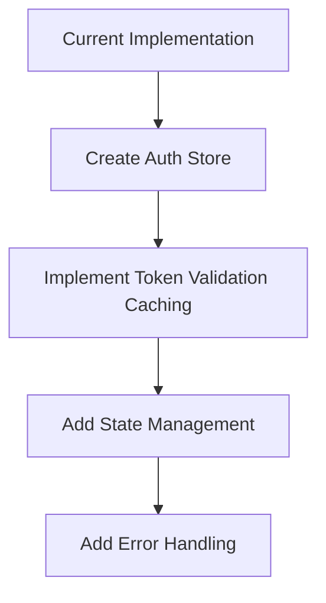
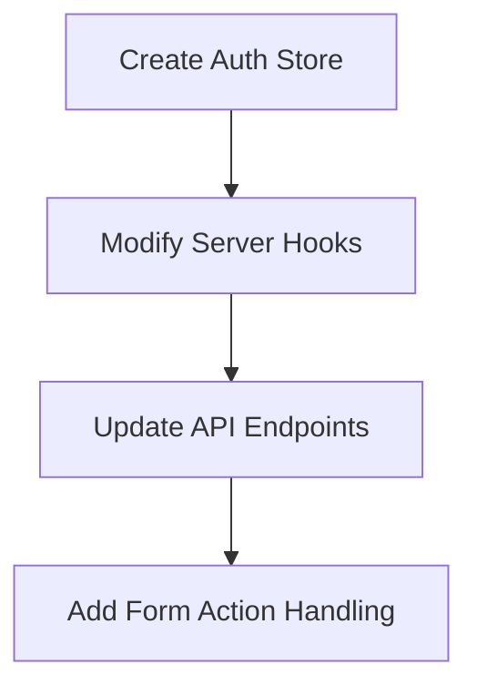
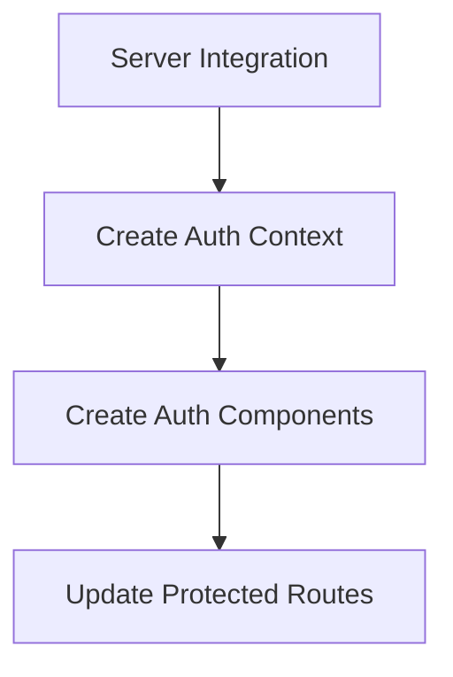
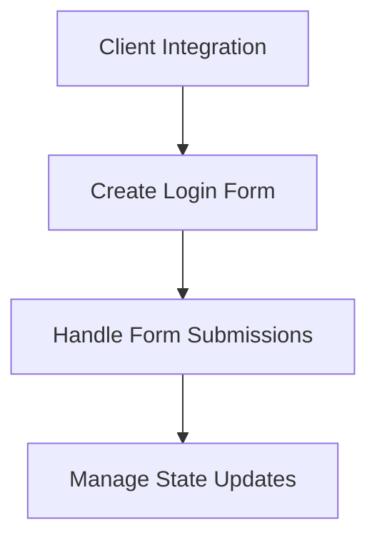
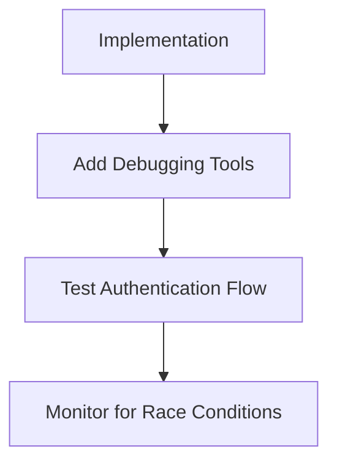

# Authentication Store Refactoring Plan

This document outlines a step-by-step plan to refactor the authentication system in our SvelteKit 5 application to address potential race conditions and improve state management.

## Background

The current implementation of `validateToken` in `cookie-auth.ts` has several potential race conditions:

1. Multiple concurrent validation requests to WordPress
2. Inconsistent authentication state across components
3. Issues with asynchronous operations in Svelte's reactivity system
4. Potential token expiration during validation
5. Cookie clearing conflicts

## Implementation Plan

### Phase 1: Create the Authentication Store



#### Step 1: Create the Basic Store Structure

Create a new file at `src/lib/stores/auth-store.ts`:

```typescript
// src/lib/stores/auth-store.ts
import { writable, derived } from 'svelte/store';
import type { User } from '$lib/utils/cookie-auth';

// Create the base store
const createAuthStore = () => {
  // Internal state
  const state = writable({
    token: null as string | null,
    user: null as User | null,
    isAuthenticated: false,
    isValidating: false,
    lastValidated: 0
  });

  // Derived state
  const isAuthenticated = derived(state, $state => $state.isAuthenticated);
  const user = derived(state, $state => $state.user);
  
  // Store API
  return {
    subscribe: state.subscribe,
    isAuthenticated,
    user,
    
    // Methods will be implemented in the next steps
  };
};

// Create and export the singleton store
export const authStore = createAuthStore();
```

#### Step 2: Implement Token Validation Caching

Add caching to prevent redundant validation requests:

```typescript
// Add to auth-store.ts
// Private state
const tokenValidationCache = new Map<string, { isValid: boolean, timestamp: number }>();
const CACHE_EXPIRY = 5 * 60 * 1000; // 5 minutes

// Add to the store API
validateToken: async (token: string) => {
  if (!token) {
    state.update(s => ({ ...s, isAuthenticated: false }));
    return false;
  }
  
  // Check cache first
  const cached = tokenValidationCache.get(token);
  const now = Date.now();
  
  if (cached && (now - cached.timestamp < CACHE_EXPIRY)) {
    state.update(s => ({ 
      ...s, 
      isAuthenticated: cached.isValid,
      lastValidated: cached.timestamp
    }));
    return cached.isValid;
  }
  
  // Mark as validating to prevent duplicate requests
  state.update(s => ({ ...s, isValidating: true }));
  
  try {
    const response = await fetch('https://wp.tributestream.com/wp-json/jwt-auth/v1/token/validate', {
      method: 'POST',
      headers: {
        'Authorization': `Bearer ${token}`
      }
    });
    
    const isValid = response.ok;
    
    // Cache the result
    tokenValidationCache.set(token, { isValid, timestamp: now });
    
    // Update state
    state.update(s => ({ 
      ...s, 
      isAuthenticated: isValid,
      isValidating: false,
      lastValidated: now
    }));
    
    return isValid;
  } catch (error) {
    console.error('Error validating token:', error);
    
    // Cache the negative result (but for less time)
    tokenValidationCache.set(token, { isValid: false, timestamp: now });
    
    // Update state
    state.update(s => ({ 
      ...s, 
      isAuthenticated: false,
      isValidating: false,
      lastValidated: now
    }));
    
    return false;
  }
}
```

#### Step 3: Add Cookie Initialization and Logout Methods

```typescript
// Add to the store API
// Initialize from cookies
initFromCookies: (token: string | null, userData: User | null) => {
  state.update(s => ({ ...s, token, user: userData }));
  
  // If we have a token, validate it
  if (token) {
    return authStore.validateToken(token);
  }
  
  return Promise.resolve(false);
},

// Log out
logout: () => {
  state.update(s => ({
    ...s,
    token: null,
    user: null,
    isAuthenticated: false
  }));
  
  // You would also need to clear cookies here or call an API
}
```

### Phase 2: Server-Side Integration



#### Step 1: Modify Server Hooks

Update `src/hooks.server.ts` to use the auth store:

```typescript
// src/hooks.server.ts
import { authStore } from '$lib/stores/auth-store';
import { getTokenFromCookie, getUserFromCookie, clearAuthCookies } from '$lib/utils/cookie-auth';

export async function handle({ event, resolve }) {
  const token = getTokenFromCookie(event.cookies);
  const user = getUserFromCookie(event.cookies);
  
  // Initialize the auth store with cookie data
  const isAuthenticated = await authStore.initFromCookies(token, user);
  
  // Set locals for use in server routes
  event.locals.authenticated = isAuthenticated;
  event.locals.user = user;
  event.locals.token = token;
  
  // If token is invalid, clear cookies
  if (token && !isAuthenticated) {
    clearAuthCookies(event.cookies);
  }
  
  return resolve(event);
}
```

#### Step 2: Update API Endpoints

Update the authentication check endpoint to use the auth store:

```typescript
// src/routes/api/auth/check/+server.ts
import { json } from '@sveltejs/kit';
import type { RequestHandler } from './$types';
import { authStore } from '$lib/stores/auth-store';
import { getTokenFromCookie, getUserFromCookie } from '$lib/utils/cookie-auth';

export const GET: RequestHandler = async ({ cookies }) => {
  console.log('🔍 [Auth Check API] Checking authentication status');
  
  // Get token and user from cookies
  const token = getTokenFromCookie(cookies);
  const user = getUserFromCookie(cookies);
  
  // Initialize the auth store with cookie data
  if (token && user) {
    try {
      const isAuthenticated = await authStore.initFromCookies(token, user);
      
      if (isAuthenticated) {
        console.log('✅ [Auth Check API] User is authenticated:', user.id);
        
        // Return user information
        return json({
          authenticated: true,
          user
        });
      }
    } catch (error) {
      console.error('❌ [Auth Check API] Error validating token:', error);
    }
  }
  
  console.log('❌ [Auth Check API] No authenticated user found or token invalid');
  return json({ authenticated: false }, { status: 401 });
};
```

#### Step 3: Add Form Action Handling

Create a login form action that uses the auth store:

```typescript
// src/routes/login/+page.server.ts
import { fail, redirect } from '@sveltejs/kit';
import type { Actions } from './$types';
import { setAuthCookie, formatUserData } from '$lib/utils/cookie-auth';
import { authStore } from '$lib/stores/auth-store';

export const actions: Actions = {
  default: async ({ request, cookies, fetch }) => {
    const formData = await request.formData();
    const username = formData.get('username')?.toString();
    const password = formData.get('password')?.toString();
    
    if (!username || !password) {
      return fail(400, { 
        error: true, 
        message: 'Username and password are required' 
      });
    }
    
    try {
      // Call WordPress login endpoint
      const response = await fetch('https://wp.tributestream.com/wp-json/jwt-auth/v1/token', {
        method: 'POST',
        headers: {
          'Content-Type': 'application/json'
        },
        body: JSON.stringify({ username, password })
      });
      
      const data = await response.json();
      
      if (!response.ok) {
        return fail(401, { 
          error: true, 
          message: data.message || 'Invalid credentials' 
        });
      }
      
      // Format user data
      const user = formatUserData(data);
      
      // Set cookies
      setAuthCookie(cookies, data.token, user);
      
      // Initialize auth store
      await authStore.initFromCookies(data.token, user);
      
      // Redirect to dashboard
      throw redirect(303, '/my-portal/dashboard');
    } catch (error) {
      console.error('Login error:', error);
      return fail(500, { 
        error: true, 
        message: 'An error occurred during login' 
      });
    }
  }
};
```

### Phase 3: Client-Side Integration



#### Step 1: Create Auth Context Components

Create a layout component that provides authentication context:

```svelte
<!-- src/routes/+layout.svelte -->
<script lang="ts">
  import { onMount } from 'svelte';
  import { authStore } from '$lib/stores/auth-store';
  import { page } from '$app/stores';
  
  // Use $derived to create reactive values from the store
  let isAuthenticated = $derived($authStore.isAuthenticated);
  let user = $derived($authStore.user);
  
  // Initialize auth state from SSR data
  onMount(async () => {
    // If we have auth data from SSR, use it
    if ($page.data.user) {
      await authStore.initFromCookies($page.data.token, $page.data.user);
    } else {
      // Otherwise, check auth status
      const response = await fetch('/api/auth/check');
      if (response.ok) {
        const data = await response.json();
        if (data.authenticated) {
          await authStore.initFromCookies(null, data.user);
        }
      }
    }
  });
</script>

<slot />
```

#### Step 2: Create Auth Components

Create reusable authentication components:

```svelte
<!-- src/lib/components/AuthGuard.svelte -->
<script lang="ts">
  import { authStore } from '$lib/stores/auth-store';
  import { goto } from '$app/navigation';
  
  export let redirect = '/login';
  
  // Use $derived to create reactive values from the store
  let isAuthenticated = $derived($authStore.isAuthenticated);
  let isLoading = $state(true);
  
  $effect(() => {
    // Wait for auth store to initialize
    if (isAuthenticated === false && !isLoading) {
      goto(redirect);
    }
  });
  
  onMount(() => {
    // Set loading to false after a short delay
    setTimeout(() => {
      isLoading = false;
    }, 100);
  });
</script>

{#if isLoading}
  <p>Loading...</p>
{:else if isAuthenticated}
  <slot />
{:else}
  <p>Redirecting to login...</p>
{/if}
```

#### Step 3: Update Protected Routes

Use the AuthGuard component in protected routes:

```svelte
<!-- src/routes/my-portal/dashboard/+page.svelte -->
<script lang="ts">
  import AuthGuard from '$lib/components/AuthGuard.svelte';
  import { authStore } from '$lib/stores/auth-store';
  
  // Use $derived to create reactive values from the store
  let user = $derived($authStore.user);
</script>

<AuthGuard>
  <h1>Welcome, {user?.display_name || 'User'}</h1>
  
  <button onclick={() => authStore.logout()}>Log Out</button>
  
  <!-- Dashboard content -->
</AuthGuard>
```

### Phase 4: Handling Form Actions and State Updates



#### Step 1: Create Login Form with Progressive Enhancement

```svelte
<!-- src/routes/login/+page.svelte -->
<script lang="ts">
  import { enhance } from '$app/forms';
  import { authStore } from '$lib/stores/auth-store';
  import { goto } from '$app/navigation';
  
  export let form;
  
  let isSubmitting = $state(false);
  
  // Handle client-side login
  async function handleClientLogin(event) {
    event.preventDefault();
    isSubmitting = true;
    
    const formData = new FormData(event.target);
    const username = formData.get('username')?.toString();
    const password = formData.get('password')?.toString();
    
    try {
      const response = await fetch('/api/auth/login', {
        method: 'POST',
        headers: {
          'Content-Type': 'application/json'
        },
        body: JSON.stringify({ username, password })
      });
      
      const data = await response.json();
      
      if (response.ok) {
        // Auth successful, redirect
        goto('/my-portal/dashboard');
      } else {
        // Auth failed, show error
        form = { error: true, message: data.message };
      }
    } catch (error) {
      console.error('Login error:', error);
      form = { error: true, message: 'An error occurred during login' };
    } finally {
      isSubmitting = false;
    }
  }
</script>

<h1>Login</h1>

{#if form?.error}
  <div class="error">
    {form.message}
  </div>
{/if}

<form method="POST" use:enhance={() => {
  isSubmitting = true;
  
  return {
    result: ({ result }) => {
      isSubmitting = false;
      
      // If login was successful, the server will have redirected
      // If we're still here, there was an error
      if (result.type === 'failure') {
        form = result.data;
      }
    }
  };
}}>
  <div>
    <label for="username">Username</label>
    <input id="username" name="username" type="text" required />
  </div>
  
  <div>
    <label for="password">Password</label>
    <input id="password" name="password" type="password" required />
  </div>
  
  <button type="submit" disabled={isSubmitting}>
    {isSubmitting ? 'Logging in...' : 'Log in'}
  </button>
</form>
```

#### Step 2: Handle Logout with Form Actions

```svelte
<!-- src/routes/logout/+page.server.ts -->
import { redirect } from '@sveltejs/kit';
import type { Actions } from './$types';
import { clearAuthCookies } from '$lib/utils/cookie-auth';

export const actions: Actions = {
  default: async ({ cookies }) => {
    // Clear auth cookies
    clearAuthCookies(cookies);
    
    // Redirect to home page
    throw redirect(303, '/');
  }
};
```

```svelte
<!-- src/lib/components/LogoutButton.svelte -->
<script lang="ts">
  import { enhance } from '$app/forms';
  import { authStore } from '$lib/stores/auth-store';
  
  let isLoggingOut = $state(false);
</script>

<form method="POST" action="/logout" use:enhance={() => {
  isLoggingOut = true;
  
  // Update local state immediately
  authStore.logout();
  
  return {
    result: () => {
      isLoggingOut = false;
    }
  };
}}>
  <button type="submit" disabled={isLoggingOut}>
    {isLoggingOut ? 'Logging out...' : 'Log out'}
  </button>
</form>
```

### Phase 5: Testing and Debugging



#### Step 1: Add Debugging Tools

Enhance the auth store with debugging capabilities:

```typescript
// Add to auth-store.ts
// Debug mode flag
let debugMode = import.meta.env.DEV;

// Add to the store API
// Enable/disable debug mode
setDebugMode: (enabled: boolean) => {
  debugMode = enabled;
},

// Debug log helper
debug: (message: string, ...args: any[]) => {
  if (debugMode) {
    console.log(`[AuthStore] ${message}`, ...args);
  }
}
```

#### Step 2: Add Timing Logs to Identify Race Conditions

```typescript
// Modify validateToken in auth-store.ts
validateToken: async (token: string) => {
  const startTime = performance.now();
  authStore.debug(`validateToken called for token: ${token.substring(0, 10)}...`);
  
  if (!token) {
    authStore.debug('No token provided, returning false');
    state.update(s => ({ ...s, isAuthenticated: false }));
    return false;
  }
  
  // Check cache first
  const cached = tokenValidationCache.get(token);
  const now = Date.now();
  
  if (cached && (now - cached.timestamp < CACHE_EXPIRY)) {
    authStore.debug(`Using cached validation result: ${cached.isValid}`);
    state.update(s => ({ 
      ...s, 
      isAuthenticated: cached.isValid,
      lastValidated: cached.timestamp
    }));
    return cached.isValid;
  }
  
  // Check if already validating
  const currentState = get(state);
  if (currentState.isValidating) {
    authStore.debug('Already validating, waiting for completion');
    // Wait for current validation to complete
    return new Promise(resolve => {
      const unsubscribe = state.subscribe(s => {
        if (!s.isValidating) {
          unsubscribe();
          authStore.debug(`Validation completed while waiting: ${s.isAuthenticated}`);
          resolve(s.isAuthenticated);
        }
      });
    });
  }
  
  // Mark as validating to prevent duplicate requests
  state.update(s => ({ ...s, isValidating: true }));
  authStore.debug('Starting token validation request');
  
  try {
    const response = await fetch('https://wp.tributestream.com/wp-json/jwt-auth/v1/token/validate', {
      method: 'POST',
      headers: {
        'Authorization': `Bearer ${token}`
      }
    });
    
    const isValid = response.ok;
    const endTime = performance.now();
    authStore.debug(`Validation request completed in ${endTime - startTime}ms: ${isValid}`);
    
    // Cache the result
    tokenValidationCache.set(token, { isValid, timestamp: now });
    
    // Update state
    state.update(s => ({ 
      ...s, 
      isAuthenticated: isValid,
      isValidating: false,
      lastValidated: now
    }));
    
    return isValid;
  } catch (error) {
    const endTime = performance.now();
    authStore.debug(`Validation request failed in ${endTime - startTime}ms:`, error);
    
    // Cache the negative result (but for less time)
    tokenValidationCache.set(token, { isValid: false, timestamp: now });
    
    // Update state
    state.update(s => ({ 
      ...s, 
      isAuthenticated: false,
      isValidating: false,
      lastValidated: now
    }));
    
    return false;
  }
}
```

## Special Considerations for Svelte 5

### Handling Asynchronous Operations in Effects

As noted in your feedback, Svelte 5's `$effect` rune has specific behavior with asynchronous operations:

1. **Asynchronous operations are not tracked as dependencies**
   
   ```svelte
   <script>
     let token = $state(null);
     let isAuthenticated = $state(false);
     
     // BAD: Changes to token after the async operation starts won't trigger a re-run
     $effect(() => {
       validateToken(token).then(valid => {
         isAuthenticated = valid;
       });
     });
     
     // GOOD: Use $derived for computed values
     let isAuthenticated = $derived.by(async () => {
       if (!token) return false;
       return await validateToken(token);
     });
   </script>
   ```

2. **Batched effect re-runs**
   
   Effects are batched and run after DOM updates, which means multiple state changes might trigger a single effect re-run. This is actually beneficial for our authentication store, as it prevents unnecessary validation requests.

3. **Conditional dependencies**
   
   ```svelte
   <script>
     // BAD: Dependencies change based on condition
     $effect(() => {
       if (isLoggedIn) {
         // Only tracks userProfile when isLoggedIn is true
         console.log(userProfile.name);
       }
     });
     
     // GOOD: Always access all potential dependencies
     $effect(() => {
       // Always track userProfile, even if we don't use it when not logged in
       const profile = userProfile;
       if (isLoggedIn) {
         console.log(profile.name);
       }
     });
   </script>
   ```

### Form Actions and State Updates

SvelteKit's form actions work well with our centralized auth store:

1. **Progressive Enhancement**
   
   The `use:enhance` directive allows forms to work without JavaScript, but enhances them when available. Our implementation uses this to provide a smooth user experience.

2. **Optimistic UI Updates**
   
   We update the auth store state immediately on logout, before the server response, to provide a responsive UI.

3. **Coordinating Server and Client State**
   
   The auth store serves as a bridge between server-side authentication (cookies) and client-side state, ensuring consistency.

## Conclusion

This refactoring plan addresses the race conditions in the current implementation by:

1. **Centralizing Authentication Logic**: All authentication-related operations go through a single store.
2. **Implementing Caching**: Prevents redundant validation requests.
3. **Coordinating Async Operations**: Prevents multiple concurrent validation requests.
4. **Providing Consistent State**: Ensures all components have the same authentication state.
5. **Adding Debugging Tools**: Helps identify and diagnose race conditions.

By following this plan, we'll create a more robust authentication system that avoids race conditions and provides a better user experience.