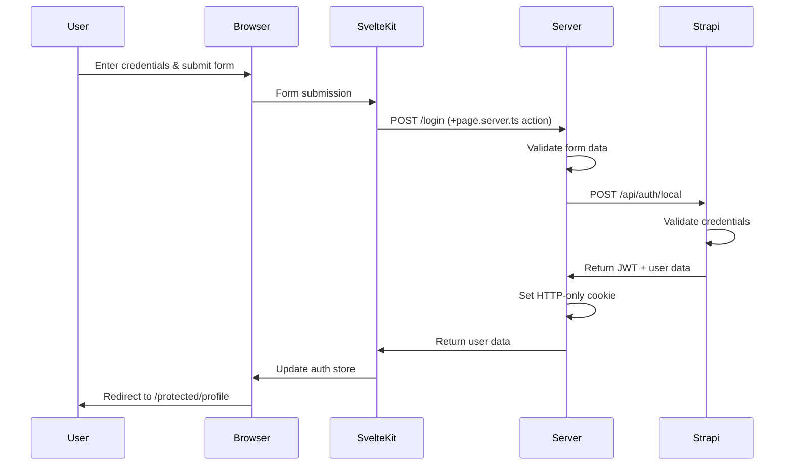
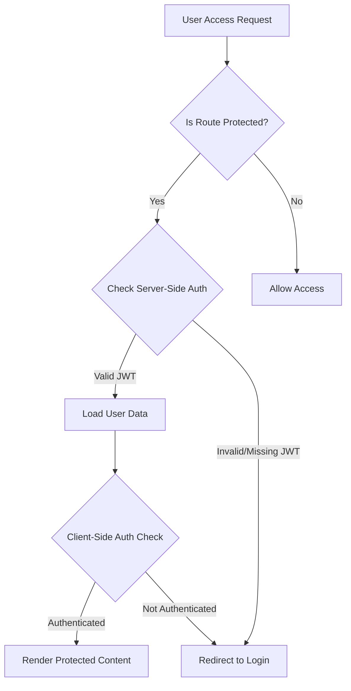
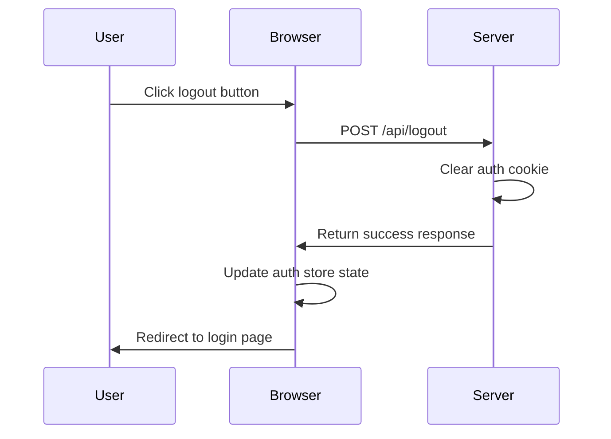

# Authentication Data Flow Analysis - Tributestream

This document provides a comprehensive analysis of the authentication system in the Tributestream application, including the login sequence, data transformation, session management, security implementations, and related configurations.

## 1. Login Flow Sequence

### Components Involved

The login flow incorporates several key components:
- **Login Form UI** (`/routes/login/+page.svelte`)
- **Login Form Handler** (`/routes/login/+page.server.ts`)
- **Authentication API** (`/routes/api/login/+server.ts`)
- **Authentication Store** (`/lib/stores/auth.store.svelte.ts`)
- **Auth Utilities** (`/lib/auth/utils.ts`)
- **SvelteKit Hooks** (`/hooks.server.ts`)

### Step-by-Step Flow

1. **User Initiates Login**
   - User navigates to `/login` and enters credentials in the form
   - Form is rendered by `/routes/login/+page.svelte`

2. **Form Submission Processing**
   - User submits the login form
   - SvelteKit's form enhancement intercepts the form submission
   - Data is processed by the form action in `/routes/login/+page.server.ts`
   - The action validates that email and password inputs are provided

3. **Server-Side Authentication Request**
   - The form action makes a POST request to the internal API endpoint `/api/login`
   - Passes the email and password in the request body as JSON

4. **API Authentication Handler**
   - `/routes/api/login/+server.ts` handles the request
   - Extracts email and password from request body
   - Makes an external authentication request to Strapi CMS at `/api/auth/local`
   - Passes email as "identifier" and the password to Strapi

5. **External Authentication**
   - Strapi validates the credentials against its database
   - Returns a response with JWT token and user data if valid
   - Returns an error message if invalid

6. **Response Processing and Cookie Setting**
   - If authentication is successful (response.ok && data.jwt):
      - The JWT token is stored in an HTTP-only cookie using `setAuthCookie()`
      - A success response is sent with user data (excluding the JWT token)
   - If authentication fails:
      - An error response with status 401 is returned
      - Includes the error message from Strapi if available

7. **Client-Side Response Handling**
   - The form action in `+page.server.ts` receives the API response
   - If the response indicates success:
      - The user data is returned to the client
   - If the response indicates failure:
      - The appropriate error message is returned to display in the UI

8. **Client-Side State Update and Redirection**
   - The `handleSubmit` function in `+page.svelte` processes the form action result
   - If login succeeded:
      - Updates the auth store with user data using `setUser()`
      - Sets the user's authentication status to true
      - Redirects to `/protected/profile`
   - If login failed:
      - Displays the error message in the form

## 2. Data Transformation Process

### Credential Processing

1. **Initial Form Data**
   - Raw form data is collected via `request.formData()`
   - Email and password are extracted and converted to strings
   - Basic validation ensures both fields are present

2. **API Request Transformation**
   - Credentials are converted to JSON for the internal API request
   - When forwarded to Strapi, the email is mapped to "identifier" field

3. **JWT Token Handling**
   - JWT token received from Strapi is never exposed to the client directly
   - Token is stored in an HTTP-only cookie, not in JavaScript memory or local storage
   - User data is separated from the token and sent to the client separately

### User Data Transformation

1. **Server-Side User Data Extraction**
   - Upon receiving a successful Strapi authentication response:
     - The JWT token is extracted and stored in a cookie
     - The user data object is separated and forwarded to the client

2. **User Data Normalization**
   - `setUser()` in the auth store standardizes the user data format
   - Ensures all required fields are present and consistently structured
   - Adds the `authenticated: true` flag to the user object

3. **JWT Payload Extraction**
   - `getUserFromToken()` utility decodes the JWT token's base64-encoded payload
   - Extracts user ID, email, and name from the payload
   - Validates token expiration by checking the `exp` claim

## 3. Session Management and Token Handling

### JWT Token Structure

The JWT token includes standard claims:
- `id`: User's unique identifier
- `email`: User's email address
- `name`: User's name (if available)
- `iat` (Issued At): Timestamp when the token was created
- `exp` (Expiration Time): Timestamp when the token expires

### Cookie Management

1. **Cookie Creation**
   - `setAuthCookie()` function creates a secure cookie with the JWT token
   - Cookie settings:
     - **Path**: `/` (accessible across the entire site)
     - **HttpOnly**: `true` (cannot be accessed by JavaScript)
     - **SameSite**: `strict` (prevents CSRF attacks)
     - **MaxAge**: `60 * 60 * 24 * 7` (1 week expiration)

2. **Cookie Removal**
   - `clearAuthCookie()` function invalidates the authentication cookie
   - Sets an empty token with immediate expiration (maxAge: 0)

### Token Validation Process

1. **Server-Side Validation**
   - `hooks.server.ts` extracts the JWT token from the cookie
   - `getUserFromToken()` validates the token and extracts user data
   - Checks token expiration by comparing `exp` claim against current time
   - Populates `event.locals.user` with user data or default unauthorized user

2. **Client-Side Access Control**
   - `AuthGuard` component checks authentication status via the auth store
   - If the user is not authenticated, redirects to the login page
   - Protected content is conditionally rendered only if authenticated

### Authentication Persistence

1. **Request-Level Authentication**
   - Each server request re-validates the authentication status
   - `hooks.server.ts` processes the JWT cookie on every request

2. **Client-Side State Management**
   - Authentication state is managed in the auth store
   - The store is initialized with user data from the server
   - State persists across client-side navigation

## 4. Security Implementations

### Token Storage Security

1. **HTTP-Only Cookies**
   - JWT token is stored in HTTP-only cookies, preventing access via JavaScript
   - Mitigates XSS attacks that attempt to steal authentication tokens

2. **Same-Site Cookie Policy**
   - Cookies use `SameSite: strict` setting
   - Prevents cookies from being sent in cross-origin requests
   - Protects against CSRF attacks

### Token Validation

1. **Expiration Validation**
   - Token expiration is checked on every request in `getUserFromToken()`
   - Expired tokens are rejected, forcing re-authentication

2. **Signature Verification (TODO)**
   - A note in the code indicates proper JWT library verification is needed
   - Currently only decoding and expiration checking is implemented

### Protected Route Security

1. **Server-Side Route Protection**
   - `hooks.server.ts` checks if routes starting with `/protected` are accessed
   - Redirects to login page if user is not authenticated
   - Provides mandatory protection even if client-side validation is bypassed

2. **Client-Side Component Protection**
   - `AuthGuard` component prevents rendering protected content
   - Redirects unauthenticated users attempting to access protected pages

### Credential Handling

1. **Transit Security**
   - Credentials are sent via POST requests with proper Content-Type headers
   - No credentials are stored in client-side storage

2. **API Isolation**
   - Authentication is handled by Strapi, an established CMS
   - Passwords are never stored in application code

## 5. Database Interactions

### Authentication Against Strapi CMS

1. **Login Request**
   - Application sends credentials to Strapi's `/api/auth/local` endpoint
   - Request format:
     ```json
     {
       "identifier": "user@example.com",
       "password": "userPassword"
     }
     ```

2. **Strapi Response Handling**
   - Successful response includes JWT token and user data
   - Failed authentication returns appropriate error messages
   - Application handles response status codes to determine success/failure

### User Data Retrieval

1. **Initial Data Load**
   - User data is retrieved during authentication
   - Includes user ID, email, and name (if available)

2. **Protected Data Access**
   - For API requests to Strapi that require authentication:
     - JWT token is attached as Bearer token in Authorization header
     - `createAuthFetchOptions()` adds the token to outgoing requests

## 6. Configuration Settings

### Cookie Configuration

- **Path**: `/` (accessible across the entire site)
- **HttpOnly**: `true` (cannot be accessed by JavaScript)
- **SameSite**: `strict` (prevents CSRF attacks)
- **MaxAge**: `60 * 60 * 24 * 7` (1 week expiration)

### API Endpoint Configuration

- **Strapi Base URL**: `http://localhost:1338` (hardcoded, should be moved to environment variables)
- **Authentication Endpoint**: `/api/auth/local`

### JWT Configuration

- No explicit JWT configuration for generation (handled by Strapi)
- Token validation is basic, with a TODO note indicating proper library implementation needed

## 7. Authentication Flow Diagrams

### Login Sequence Diagram



### Authentication Check Flow



### Logout Flow



## 8. Key Findings and Recommendations

### Strengths

1. **Multi-layered Authentication**
   - Server-side route protection via hooks
   - Client-side protection via AuthGuard component
   - HTTP-only cookies for token storage

2. **Clean Separation of Concerns**
   - Authentication API is isolated from form handling
   - Auth store manages client-side state
   - Utility functions handle token management

### Potential Improvements

1. **Token Verification**
   - Implement proper JWT signature verification as noted in TODO
   - Consider using a dedicated JWT library

2. **Configuration Management**
   - Move Strapi URL to environment variables
   - Consider configurable token expiration

3. **Refresh Token Mechanism**
   - Implement token refresh to extend sessions without requiring re-login
   - Consider silent refresh mechanism

4. **Error Handling**
   - Add more specific error messages for different failure scenarios
   - Implement logging for authentication failures for security monitoring

5. **Authorization**
   - Add role-based access control beyond simple authentication
   - Implement more granular permissions within protected routes