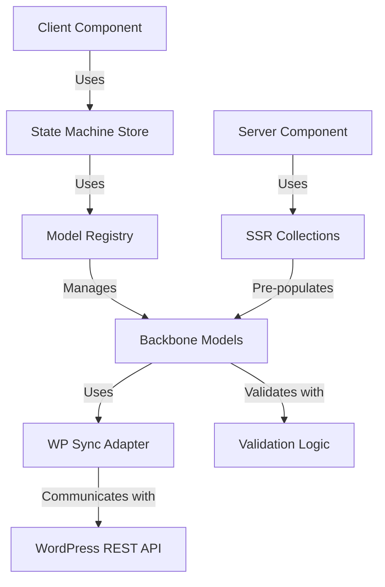

# Detailed Plan for Completing Backbone.js Enhancement Phase

Based on our progress journal and examination of the current codebase, I've created a detailed plan to complete the remaining tasks in the Backbone.js Enhancement phase.

## 1. Enhance Backbone Models

After reviewing the current `wp-backbone.ts` file, I can see that we need to update it to use our new components and improve SSR compatibility.

### Implementation Steps:

1. **Update Base Models with New Sync Adapter**
   - Replace the current sync implementation with our new WordPress sync adapter
   - Import the `createWPRESTSync` function from `wp-sync-adapter.ts`
   - Configure the sync adapter with appropriate headers and parameters

2. **Add Validation Methods to Models**
   - Import validation functions from `validation.ts`
   - Add validate methods to each model class
   - Implement error handling for validation failures

3. **Improve SSR Compatibility**
   - Enhance the server-side fallback implementation
   - Use our SSR-compatible collections instead of the current implementation
   - Ensure proper handling of model attributes during SSR

4. **Integrate with Model Registry**
   - Add methods to register models with the model registry
   - Implement caching for improved performance
   - Add helper methods for common operations

Here's a diagram of the enhanced model architecture:

## 2. Test Backbone Integration

We need to create comprehensive tests to ensure our implementation works correctly.

### Testing Steps:

1. **Create Test Files**
   - Create `wp-backbone.test.ts` for model tests
   - Create `model-registry.test.ts` for registry tests
   - Create `tribute-store.test.ts` for state machine tests

2. **Test Model Creation and Validation**
   - Test creating models with valid and invalid data
   - Verify validation error messages
   - Test model attribute getters and setters

3. **Test Collection Fetching and Filtering**
   - Test fetching collections with different parameters
   - Test filtering collections based on criteria
   - Test pagination functionality

4. **Test Synchronization with WordPress API**
   - Test creating, updating, and deleting models
   - Test error handling for API failures
   - Test authentication handling

5. **Test SSR Compatibility**
   - Test model and collection behavior during SSR
   - Verify data consistency between server and client
   - Test hydration of pre-populated data

6. **Test State Machine Store**
   - Test state transitions
   - Test error handling
   - Test integration with Backbone models

## 3. Prepare for API Streamlining Phase

The next phase in our refactoring plan is API Streamlining. We need to prepare for this phase by understanding its requirements and dependencies.

### Preparation Steps:

1. **Review API Streamlining Requirements**
   - Understand the goals of the API Streamlining phase
   - Identify dependencies on the Backbone.js Enhancement phase
   - Create a list of API endpoints to be streamlined

2. **Document Current API Usage**
   - Identify all places in the codebase that use API endpoints
   - Document the data flow between client and server
   - Identify redundant API calls that can be optimized

3. **Plan Direct WordPress API Client**
   - Design the interface for the direct WordPress API client
   - Identify required authentication mechanisms
   - Plan caching strategies for improved performance

4. **Plan Server Load Functions**
   - Identify pages that need server-side data loading
   - Design load functions that use the direct WordPress API client
   - Plan error handling and fallback strategies

5. **Plan Form Actions**
   - Identify forms that need server-side processing
   - Design form actions that use the direct WordPress API client
   - Plan validation and error handling

## Implementation Timeline

Here's a proposed timeline for completing the remaining tasks:

1. **Day 1: Enhance Backbone Models**
   - Update base models with new sync adapter
   - Add validation methods to models
   - Improve SSR compatibility
   - Integrate with model registry

2. **Day 2: Test Backbone Integration**
   - Create test files
   - Test model creation and validation
   - Test collection fetching and filtering
   - Test synchronization with WordPress API
   - Test SSR compatibility
   - Test state machine store

3. **Day 3: Prepare for API Streamlining Phase**
   - Review API Streamlining requirements
   - Document current API usage
   - Plan direct WordPress API client
   - Plan server load functions
   - Plan form actions

## Questions for Consideration

1. Are there any specific models or collections that need special handling?
2. Are there any performance concerns with the current implementation that we should address?
3. Are there any specific validation rules that need to be implemented beyond what we've already done?
4. How should we handle authentication failures in the sync adapter?
5. Should we implement any additional caching strategies for improved performance?