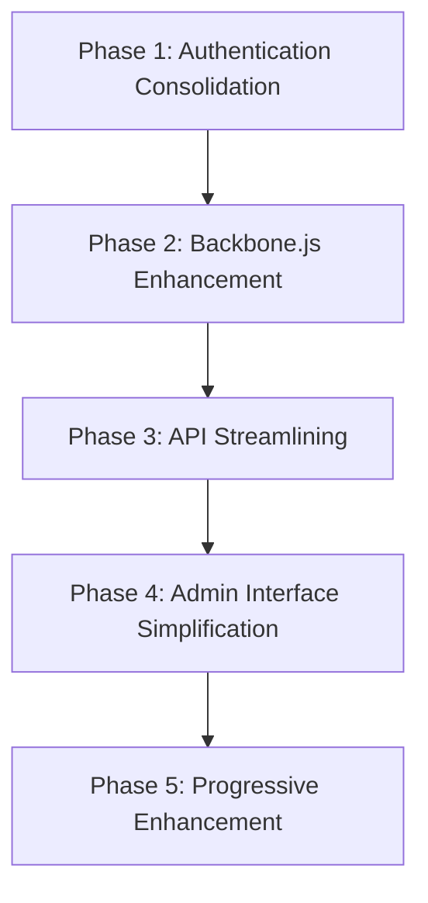
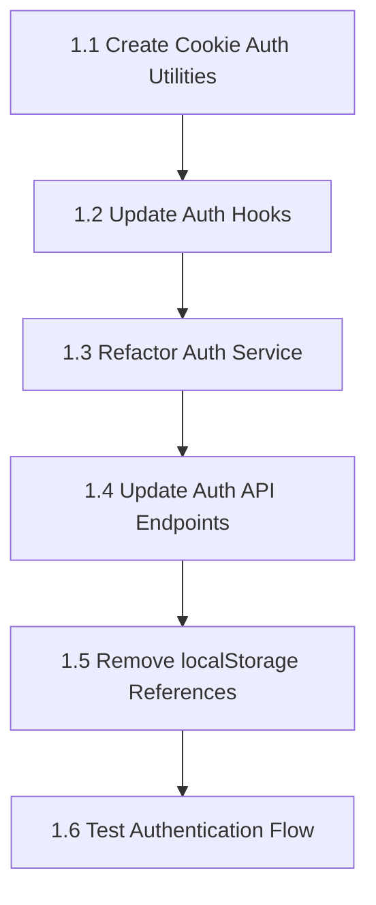
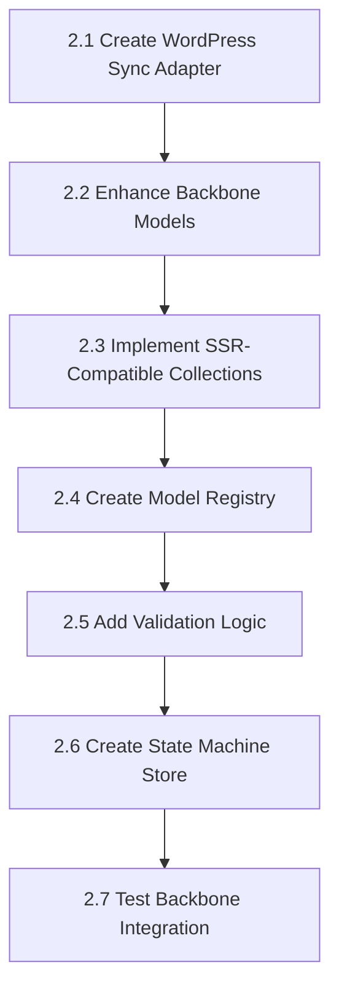
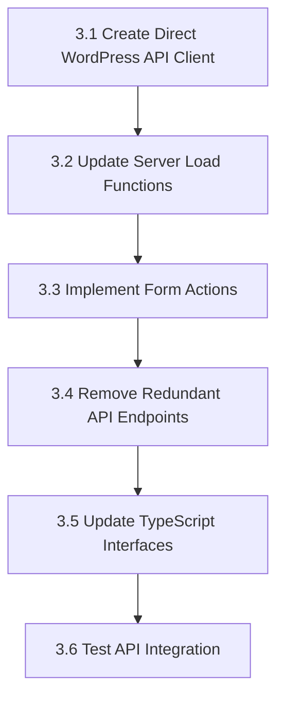
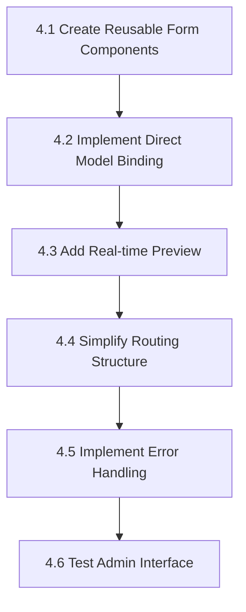
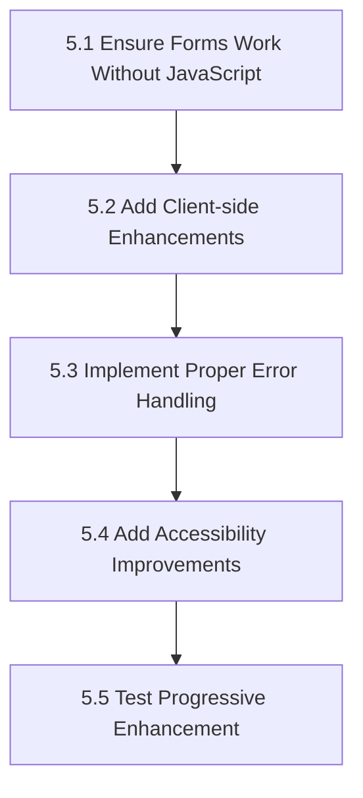

# TributeStream Architecture Refactoring Plan

This document outlines a detailed step-by-step refactoring plan for implementing the simplified TributeStream architecture with SvelteKit 5 and Backbone.js. Each phase is broken down into small, isolated tasks that can be developed independently.

## Overview



## Phase 1: Authentication Consolidation (Days 1-3)



### 1.1 Create Cookie Auth Utilities (0.5 day)

**Task:** Create utilities for cookie-based authentication.

**Steps:**
1. Create a new file `src/lib/utils/cookie-auth.ts`
2. Implement functions for setting, clearing, and validating JWT tokens in cookies
3. Add TypeScript interfaces for auth-related data structures

**Dependencies:** None

**Files to modify:**
- Create: `src/lib/utils/cookie-auth.ts`

### 1.2 Update Auth Hooks (0.5 day)

**Task:** Refactor server hooks to use cookie-based authentication.

**Steps:**
1. Update `hooks.server.ts` to use the new cookie auth utilities
2. Implement token validation in the handle function
3. Set user data in event.locals for use in server-side load functions

**Dependencies:** 1.1

**Files to modify:**
- Modify: `src/hooks.server.ts`

### 1.3 Refactor Auth Service (0.5 day)

**Task:** Update client-side auth service to use cookies as the single source of truth.

**Steps:**
1. Refactor `auth-service.ts` to remove localStorage usage
2. Update login, logout, and checkAuth methods to work with cookies
3. Ensure SSR compatibility

**Dependencies:** 1.1, 1.2

**Files to modify:**
- Modify: `src/lib/services/auth-service.ts`

### 1.4 Update Auth API Endpoints (0.5 day)

**Task:** Update API endpoints to set cookies instead of returning tokens.

**Steps:**
1. Modify `/api/auth/+server.ts` to set cookies on successful authentication
2. Update `/api/auth/check/+server.ts` to validate cookies
3. Create a logout endpoint that clears cookies

**Dependencies:** 1.1, 1.3

**Files to modify:**
- Modify: `src/routes/api/auth/+server.ts`
- Modify: `src/routes/api/auth/check/+server.ts`
- Create: `src/routes/api/auth/logout/+server.ts`

### 1.5 Remove localStorage References (0.5 day)

**Task:** Remove all localStorage references related to authentication.

**Steps:**
1. Search for and remove all localStorage references in components
2. Update any components that directly access localStorage for auth
3. Ensure all components use the auth store instead

**Dependencies:** 1.3

**Files to modify:**
- Various components that use localStorage for auth

### 1.6 Test Authentication Flow (0.5 day)

**Task:** Test the complete authentication flow.

**Steps:**
1. Test login functionality
2. Test token validation
3. Test logout functionality
4. Verify that authentication persists across page refreshes
5. Verify that protected routes are properly secured

**Dependencies:** 1.1, 1.2, 1.3, 1.4, 1.5

## Phase 2: Backbone.js Enhancement (Days 4-7)



### 2.1 Create WordPress Sync Adapter (0.5 day)

**Task:** Create a WordPress-specific sync adapter for Backbone.js.

**Steps:**
1. Create a new file `src/lib/backbone/wp-sync-adapter.ts`
2. Implement a custom Backbone.sync method that works with WordPress REST API
3. Add support for authentication via cookies
4. Ensure proper error handling

**Dependencies:** Phase 1

**Files to modify:**
- Create: `src/lib/backbone/wp-sync-adapter.ts`

### 2.2 Enhance Backbone Models (0.5 day)

**Task:** Improve Backbone models with better SSR compatibility and validation.

**Steps:**
1. Update `src/lib/models/wp-backbone.ts` with improved SSR compatibility
2. Add validation methods to models
3. Implement proper error handling
4. Add TypeScript interfaces for model attributes

**Dependencies:** 2.1

**Files to modify:**
- Modify: `src/lib/models/wp-backbone.ts`

### 2.3 Implement SSR-Compatible Collections (0.5 day)

**Task:** Create collections that work in both browser and server environments.

**Steps:**
1. Create a new file `src/lib/backbone/ssr-collection.ts`
2. Implement a factory function for creating SSR-compatible collections
3. Add methods for fetching, filtering, and manipulating collections
4. Ensure proper TypeScript typing

**Dependencies:** 2.2

**Files to modify:**
- Create: `src/lib/backbone/ssr-collection.ts`

### 2.4 Create Model Registry (0.5 day)

**Task:** Implement a centralized registry for Backbone models.

**Steps:**
1. Create a new file `src/lib/backbone/model-registry.ts`
2. Implement methods for creating, caching, and retrieving models
3. Add support for different model types (Tribute, Post, Page, User)
4. Ensure SSR compatibility

**Dependencies:** 2.2, 2.3

**Files to modify:**
- Create: `src/lib/backbone/model-registry.ts`

### 2.5 Add Validation Logic (0.5 day)

**Task:** Implement validation logic for WordPress models.

**Steps:**
1. Create a new file `src/lib/backbone/validation.ts`
2. Implement validation functions for different model types
3. Add error message formatting
4. Ensure TypeScript typing for validation results

**Dependencies:** 2.2

**Files to modify:**
- Create: `src/lib/backbone/validation.ts`

### 2.6 Create State Machine Store (1 day)

**Task:** Create a Svelte 5 state machine store for Backbone models.

**Steps:**
1. Create a new file `src/lib/stores/tribute-store.svelte.ts`
2. Implement a class with Svelte 5 runes for state management
3. Add methods for fetching, creating, updating, and deleting tributes
4. Ensure proper integration with Backbone models
5. Add derived state and effects

**Dependencies:** 2.1, 2.2, 2.3, 2.4, 2.5

**Files to modify:**
- Create: `src/lib/stores/tribute-store.svelte.ts`

### 2.7 Test Backbone Integration (0.5 day)

**Task:** Test the Backbone.js integration with WordPress.

**Steps:**
1. Test model creation and validation
2. Test collection fetching and filtering
3. Test synchronization with WordPress API
4. Verify SSR compatibility
5. Test state machine store functionality

**Dependencies:** 2.1, 2.2, 2.3, 2.4, 2.5, 2.6

## Phase 3: API Streamlining (Days 8-10)



### 3.1 Create Direct WordPress API Client (0.5 day)

**Task:** Create a direct client for the WordPress REST API.

**Steps:**
1. Create a new file `src/lib/api/wordpress.ts`
2. Implement functions for fetching tributes, posts, pages, and users
3. Add authentication support
4. Ensure proper error handling and TypeScript typing

**Dependencies:** Phase 1, Phase 2

**Files to modify:**
- Create: `src/lib/api/wordpress.ts`

### 3.2 Update Server Load Functions (0.5 day)

**Task:** Update SvelteKit load functions to use the direct WordPress API client.

**Steps:**
1. Modify load functions in `+page.server.ts` files to use the direct client
2. Add proper error handling
3. Implement data transformation if needed
4. Ensure TypeScript typing for load function returns

**Dependencies:** 3.1

**Files to modify:**
- Modify: `src/routes/tributes/[id]/+page.server.ts`
- Modify: `src/routes/tributes/+page.server.ts`
- Modify: `src/routes/dashboard/tributes/+page.server.ts`
- Modify: `src/routes/dashboard/tributes/[id]/+page.server.ts`

### 3.3 Implement Form Actions (1 day)

**Task:** Create SvelteKit form actions for data manipulation.

**Steps:**
1. Create form actions in `+page.server.ts` files for creating, updating, and deleting tributes
2. Implement validation using the validation logic from Phase 2
3. Add proper error handling and success messages
4. Ensure progressive enhancement support

**Dependencies:** 3.1, 3.2

**Files to modify:**
- Modify: `src/routes/dashboard/tributes/new/+page.server.ts`
- Modify: `src/routes/dashboard/tributes/[id]/edit/+page.server.ts`

### 3.4 Remove Redundant API Endpoints (0.5 day)

**Task:** Remove unnecessary API endpoints that are now bypassed.

**Steps:**
1. Identify API endpoints that are no longer needed
2. Remove or deprecate these endpoints
3. Update any components that still use these endpoints
4. Ensure no regressions in functionality

**Dependencies:** 3.1, 3.2, 3.3

**Files to modify:**
- Various API endpoint files in `src/routes/api/`

### 3.5 Update TypeScript Interfaces (0.5 day)

**Task:** Improve TypeScript interfaces for API responses and requests.

**Steps:**
1. Update interfaces in `src/lib/types/wp-models.ts`
2. Add more specific typing for API responses
3. Create interfaces for form submissions
4. Ensure consistency across the codebase

**Dependencies:** 3.1, 3.2, 3.3, 3.4

**Files to modify:**
- Modify: `src/lib/types/wp-models.ts`
- Create: `src/lib/types/forms.ts`

### 3.6 Test API Integration (0.5 day)

**Task:** Test the streamlined API integration.

**Steps:**
1. Test direct API client functions
2. Test load functions with the direct client
3. Test form actions for data manipulation
4. Verify error handling and validation
5. Test with and without JavaScript enabled

**Dependencies:** 3.1, 3.2, 3.3, 3.4, 3.5

## Phase 4: Admin Interface Simplification (Days 11-14)



### 4.1 Create Reusable Form Components (1 day)

**Task:** Create reusable form components with validation.

**Steps:**
1. Create a base form component with common functionality
2. Implement field components (text, textarea, select, checkbox, etc.)
3. Add validation support using the validation logic from Phase 2
4. Ensure accessibility and proper styling

**Dependencies:** Phase 2, Phase 3

**Files to modify:**
- Create: `src/lib/components/forms/form.svelte`
- Create: `src/lib/components/forms/text-field.svelte`
- Create: `src/lib/components/forms/textarea-field.svelte`
- Create: `src/lib/components/forms/select-field.svelte`
- Create: `src/lib/components/forms/checkbox-field.svelte`

### 4.2 Implement Direct Model Binding (1 day)

**Task:** Implement direct binding between forms and Backbone models.

**Steps:**
1. Create a model binding directive or component
2. Implement two-way data binding between forms and models
3. Add validation support
4. Ensure proper error handling and TypeScript typing

**Dependencies:** 4.1

**Files to modify:**
- Create: `src/lib/directives/model-binding.ts`
- Modify: `src/lib/components/forms/form.svelte`

### 4.3 Add Real-time Preview (0.5 day)

**Task:** Implement real-time preview for tribute editing.

**Steps:**
1. Create a preview component that shows the tribute as it will appear
2. Implement real-time updates as the user edits the form
3. Add a toggle to show/hide the preview
4. Ensure proper styling and layout

**Dependencies:** 4.1, 4.2

**Files to modify:**
- Create: `src/lib/components/tributes/tribute-preview.svelte`
- Modify: `src/routes/dashboard/tributes/[id]/edit/+page.svelte`
- Modify: `src/routes/dashboard/tributes/new/+page.svelte`

### 4.4 Simplify Routing Structure (0.5 day)

**Task:** Simplify the routing structure for the admin interface.

**Steps:**
1. Review and optimize the current routing structure
2. Implement a more intuitive navigation flow
3. Add breadcrumbs for better navigation
4. Ensure proper URL structure and SEO

**Dependencies:** 4.1, 4.2, 4.3

**Files to modify:**
- Modify: `src/routes/dashboard/+layout.svelte`
- Modify: `src/routes/dashboard/tributes/+page.svelte`
- Create: `src/lib/components/dashboard/breadcrumbs.svelte`

### 4.5 Implement Error Handling (0.5 day)

**Task:** Improve error handling in the admin interface.

**Steps:**
1. Create error components for different types of errors
2. Implement error boundaries
3. Add toast notifications for success/error messages
4. Ensure proper logging and debugging information

**Dependencies:** 4.1, 4.2, 4.3, 4.4

**Files to modify:**
- Create: `src/lib/components/ui/error-boundary.svelte`
- Create: `src/lib/components/ui/toast.svelte`
- Modify: `src/routes/dashboard/+error.svelte`

### 4.6 Test Admin Interface (0.5 day)

**Task:** Test the simplified admin interface.

**Steps:**
1. Test form components with validation
2. Test model binding with Backbone models
3. Test real-time preview functionality
4. Verify error handling and notifications
5. Test navigation and routing

**Dependencies:** 4.1, 4.2, 4.3, 4.4, 4.5

## Phase 5: Progressive Enhancement (Days 15-16)



### 5.1 Ensure Forms Work Without JavaScript (0.5 day)

**Task:** Make sure all forms work without JavaScript.

**Steps:**
1. Update form components to use the `<form>` element with proper attributes
2. Ensure all forms have a proper action and method
3. Add hidden fields for necessary data
4. Test form submission without JavaScript

**Dependencies:** Phase 4

**Files to modify:**
- Modify: `src/lib/components/forms/form.svelte`
- Modify: `src/routes/dashboard/tributes/new/+page.svelte`
- Modify: `src/routes/dashboard/tributes/[id]/edit/+page.svelte`

### 5.2 Add Client-side Enhancements (0.5 day)

**Task:** Add client-side enhancements for better user experience.

**Steps:**
1. Implement the `use:enhance` directive for form submissions
2. Add loading indicators
3. Implement optimistic UI updates
4. Add client-side validation

**Dependencies:** 5.1

**Files to modify:**
- Modify: `src/lib/components/forms/form.svelte`
- Create: `src/lib/components/ui/loading-indicator.svelte`

### 5.3 Implement Proper Error Handling (0.5 day)

**Task:** Improve error handling for progressive enhancement.

**Steps:**
1. Update form actions to return proper error responses
2. Implement error display in forms
3. Add focus management for errors
4. Ensure proper error messages for different scenarios

**Dependencies:** 5.1, 5.2

**Files to modify:**
- Modify: `src/routes/dashboard/tributes/new/+page.server.ts`
- Modify: `src/routes/dashboard/tributes/[id]/edit/+page.server.ts`
- Modify: `src/lib/components/forms/form.svelte`

### 5.4 Add Accessibility Improvements (0.5 day)

**Task:** Enhance accessibility for all components.

**Steps:**
1. Add proper ARIA attributes to components
2. Implement keyboard navigation
3. Add focus management
4. Test with screen readers

**Dependencies:** 5.1, 5.2, 5.3

**Files to modify:**
- Various component files

### 5.5 Test Progressive Enhancement (0.5 day)

**Task:** Test the progressive enhancement implementation.

**Steps:**
1. Test forms with JavaScript disabled
2. Test forms with JavaScript enabled
3. Test error handling in both scenarios
4. Verify accessibility
5. Test with different browsers and devices

**Dependencies:** 5.1, 5.2, 5.3, 5.4

## Conclusion

This detailed refactoring plan provides a step-by-step approach to implementing the simplified TributeStream architecture with SvelteKit 5 and Backbone.js. Each task is broken down into small, isolated steps that can be developed independently, with clear dependencies between tasks.

The plan follows the five phases outlined in the simplified architecture master plan:

1. Authentication Consolidation
2. Backbone.js Enhancement
3. API Streamlining
4. Admin Interface Simplification
5. Progressive Enhancement

By following this plan, you'll be able to refactor the TributeStream architecture in a systematic and manageable way, resulting in a more maintainable and performant application.
# Duplicate Code Removal and Architecture Streamlining

After analyzing the codebase, I've identified several areas with duplicate code and redundant approaches that need to be addressed before implementing the full architecture plan. Here's a systematic approach to remove these duplications:

## 1. Authentication Consolidation

### Current Duplication Issues:
- `auth-service.ts` uses localStorage for token storage
- `hooks.server.ts` uses cookies for token storage
- Token validation logic is duplicated

### Implementation Steps:

1. **Create a Cookie-Based Auth Utility**:
```typescript
// src/lib/utils/cookie-auth.ts
import type { Cookies } from '@sveltejs/kit';

export function setAuthCookie(cookies: Cookies, token: string, user: any): void {
  cookies.set('jwt_token', token, {
    path: '/',
    httpOnly: true,
    sameSite: 'strict',
    secure: import.meta.env.PROD,
    maxAge: 60 * 60 * 24 * 7 // 1 week
  });
  
  cookies.set('user', JSON.stringify(user), {
    path: '/',
    httpOnly: false,
    sameSite: 'strict',
    secure: import.meta.env.PROD,
    maxAge: 60 * 60 * 24 * 7
  });
}

export function clearAuthCookies(cookies: Cookies): void {
  cookies.delete('jwt_token', { path: '/' });
  cookies.delete('user', { path: '/' });
}

export function getTokenFromCookie(cookies: Cookies): string | null {
  return cookies.get('jwt_token') || null;
}

export function getUserFromCookie(cookies: Cookies): any | null {
  const userCookie = cookies.get('user');
  if (!userCookie) return null;
  
  try {
    return JSON.parse(userCookie);
  } catch (error) {
    console.error('Error parsing user cookie:', error);
    return null;
  }
}
```

2. **Update Auth Service to Use Cookies**:
```typescript
// src/lib/services/auth-service.ts
import { writable } from 'svelte/store';
import { browser } from '$app/environment';

interface AuthState {
  isAuthenticated: boolean;
  user: any | null;
}

function createAuthStore() {
  const { subscribe, set, update } = writable<AuthState>({
    isAuthenticated: false,
    user: null
  });
  
  return {
    subscribe,
    
    login: async (username: string, password: string): Promise<boolean> => {
      try {
        const formData = new FormData();
        formData.append('username', username);
        formData.append('password', password);
        
        const response = await fetch('/my-portal?/login', {
          method: 'POST',
          body: formData
        });
        
        const result = await response.json();
        
        if (result.type === 'success') {
          const success = await authStore.checkAuth();
          return success;
        } else {
          console.error('Login failed:', result.message);
          return false;
        }
      } catch (error) {
        console.error('Login error:', error);
        return false;
      }
    },
    
    logout: async (): Promise<void> => {
      try {
        await fetch('/my-portal?/logout', {
          method: 'POST',
          credentials: 'include'
        });
      } catch (error) {
        console.error('Error during logout:', error);
      }
      
      set({
        isAuthenticated: false,
        user: null
      });
    },
    
    checkAuth: async (): Promise<boolean> => {
      if (!browser) return false;
      
      try {
        const response = await fetch('/api/auth/check', {
          method: 'GET',
          credentials: 'include'
        });
        
        if (response.ok) {
          const data = await response.json();
          
          update(state => ({
            ...state,
            isAuthenticated: true,
            user: data.user || null
          }));
          
          return true;
        }
      } catch (error) {
        console.error('Error checking auth status:', error);
      }
      
      update(state => ({
        ...state,
        isAuthenticated: false,
        user: null
      }));
      
      return false;
    }
  };
}

export const authStore = createAuthStore();
```

3. **Update Auth API Endpoint**:
```typescript
// src/routes/api/auth/+server.ts
import { json } from '@sveltejs/kit';
import type { RequestHandler } from './$types';
import { setAuthCookie } from '$lib/utils/cookie-auth';

export const POST: RequestHandler = async ({ request, cookies }) => {
  // Parse request body
  const { username, password } = await request.json();
  
  if (!username || !password) {
    return json({ message: 'Username and password are required' }, { status: 400 });
  }
  
  try {
    // Make request to WordPress JWT endpoint
    const response = await fetch('https://wp.tributestream.com/wp-json/jwt-auth/v1/token', {
      method: 'POST',
      headers: {
        'Content-Type': 'application/json'
      },
      body: JSON.stringify({ username, password })
    });
    
    const data = await response.json();
    
    if (!response.ok) {
      return json({ message: data.message || 'Authentication failed' }, { status: response.status });
    }
    
    // Set auth cookies
    setAuthCookie(cookies, data.token, {
      id: data.user_id || data.id,
      name: data.user_display_name,
      email: data.user_email
    });
    
    // Return success response
    return json({
      success: true,
      user: {
        id: data.user_id || data.id,
        name: data.user_display_name,
        email: data.user_email
      }
    });
  } catch (error) {
    console.error('Error during authentication:', error);
    return json({ message: 'Internal server error' }, { status: 500 });
  }
};
```

## 2. API Streamlining

### Current Duplication Issues:
- The tributeService makes requests to SvelteKit API endpoints
- These endpoints then proxy to WordPress REST API
- Creates unnecessary indirection

### Implementation Steps:

1. **Create Direct WordPress API Client**:
```typescript
// src/lib/api/wordpress.ts
import { browser } from '$app/environment';

const API_BASE = 'https://wp.tributestream.com/wp-json/tributestream/v1';

export async function fetchTributes(params = {}) {
  if (!browser) return { tributes: [] };
  
  try {
    // Get token from cookie
    const token = document.cookie.match(/jwt_token=([^;]+)/)?.[1];
    
    // Prepare headers
    const headers: Record<string, string> = {
      'Content-Type': 'application/json'
    };
    
    if (token) {
      headers['Authorization'] = `Bearer ${token}`;
    }
    
    // Build URL with query parameters
    const url = new URL(`${API_BASE}/tributes`);
    Object.entries(params).forEach(([key, value]) => {
      url.searchParams.append(key, String(value));
    });
    
    // Make request
    const response = await fetch(url.toString(), { headers });
    
    if (!response.ok) {
      throw new Error(`Failed to fetch tributes: ${response.status}`);
    }
    
    return await response.json();
  } catch (error) {
    console.error('Error fetching tributes:', error);
    return { tributes: [] };
  }
}

export async function fetchTributeById(id: number) {
  if (!browser) return {};
  
  try {
    // Get token from cookie
    const token = document.cookie.match(/jwt_token=([^;]+)/)?.[1];
    
    // Prepare headers
    const headers: Record<string, string> = {
      'Content-Type': 'application/json'
    };
    
    if (token) {
      headers['Authorization'] = `Bearer ${token}`;
    }
    
    // Make request
    const response = await fetch(`${API_BASE}/tributes/${id}`, { headers });
    
    if (!response.ok) {
      throw new Error(`Failed to fetch tribute: ${response.status}`);
    }
    
    return await response.json();
  } catch (error) {
    console.error('Error fetching tribute:', error);
    throw error;
  }
}

export async function createTribute(tributeData: any) {
  if (!browser) return {};
  
  try {
    // Get token from cookie
    const token = document.cookie.match(/jwt_token=([^;]+)/)?.[1];
    
    if (!token) {
      throw new Error('Authentication required');
    }
    
    // Make request
    const response = await fetch(`${API_BASE}/tributes`, {
      method: 'POST',
      headers: {
        'Content-Type': 'application/json',
        'Authorization': `Bearer ${token}`
      },
      body: JSON.stringify(tributeData)
    });
    
    if (!response.ok) {
      throw new Error(`Failed to create tribute: ${response.status}`);
    }
    
    return await response.json();
  } catch (error) {
    console.error('Error creating tribute:', error);
    throw error;
  }
}

// Add similar functions for updateTribute and deleteTribute
```

2. **Update Backbone Models to Use Direct API**:
```typescript
// src/lib/models/wp-backbone.ts
import Backbone from 'backbone';
import { browser } from '$app/environment';
import { fetchTributes, fetchTributeById, createTribute } from '$lib/api/wordpress';

// Create a server-side fallback for Backbone when in SSR mode
const serverSideBackbone = {
  Model: {
    extend: () => class ServerModel {
      attributes: Record<string, any> = {};
      
      constructor(attributes = {}) {
        this.attributes = { ...attributes };
      }
      
      get(attr: string) {
        return this.attributes[attr];
      }
      
      set(attrs: Record<string, any>) {
        this.attributes = { ...this.attributes, ...attrs };
        return this;
      }
      
      toJSON() {
        return { ...this.attributes };
      }
      
      fetch() {
        return Promise.resolve(this);
      }
      
      save() {
        return Promise.resolve(this);
      }
      
      destroy() {
        return Promise.resolve(true);
      }
    }
  },
  Collection: {
    extend: () => class ServerCollection {
      models: any[] = [];
      
      constructor(models = []) {
        this.models = [...models];
      }
      
      toJSON() {
        return this.models.map(model => 
          typeof model.toJSON === 'function' ? model.toJSON() : model
        );
      }
      
      fetch() {
        return Promise.resolve(this);
      }
    }
  }
};

// Use real Backbone in browser, fallback in SSR
const BackboneImpl = browser ? Backbone : serverSideBackbone;

// Tribute model with direct API integration
export const TributeModel = BackboneImpl.Model.extend({
  idAttribute: 'id',
  
  defaults: {
    user_id: 0,
    loved_one_name: '',
    phone_number: '',
    status: 'draft',
    custom_html: '',
    number_of_streams: 0
  },
  
  validate(attrs: any) {
    const errors = [];
    
    if (!attrs.loved_one_name) {
      errors.push('Loved one name is required');
    }
    
    if (!attrs.phone_number) {
      errors.push('Phone number is required');
    }
    
    return errors.length ? errors.join(', ') : null;
  },
  
  // Override fetch to use direct API
  fetch: async function(options = {}) {
    if (!browser) return Promise.resolve(this);
    
    try {
      const data = await fetchTributeById(this.id);
      this.set(data);
      return this;
    } catch (error) {
      console.error('Error fetching tribute:', error);
      throw error;
    }
  },
  
  // Override save to use direct API
  save: async function(attributes = {}, options = {}) {
    if (!browser) return Promise.resolve(this);
    
    try {
      const isNew = !this.id;
      const data = isNew
        ? await createTribute({ ...this.attributes, ...attributes })
        : await updateTribute(this.id, { ...this.attributes, ...attributes });
      
      this.set(data);
      return this;
    } catch (error) {
      console.error('Error saving tribute:', error);
      throw error;
    }
  }
});

// Tributes collection with direct API integration
export const TributesCollection = BackboneImpl.Collection.extend({
  model: TributeModel,
  
  // Override fetch to use direct API
  fetch: async function(options = {}) {
    if (!browser) return Promise.resolve(this);
    
    try {
      const data = await fetchTributes(options.data || {});
      
      if (data.tributes) {
        this.reset(data.tributes);
      }
      
      return this;
    } catch (error) {
      console.error('Error fetching tributes:', error);
      throw error;
    }
  }
});
```

## 3. Component Refactoring

### Current Duplication Issues:
- Inconsistent data access patterns across components
- Backbone.js not fully utilized

### Implementation Steps:

1. **Update Tribute List Component**:
```typescript
// src/lib/components/tribute-list.svelte
<script lang="ts">
  import { onMount } from 'svelte';
  import { browser } from '$app/environment';
  import { TributesCollection } from '$lib/models/wp-backbone';
  import { authStore } from '$lib/services/auth-service';
  import type { Tribute } from '$lib/types/wp-models';

  // State with Svelte 5 runes
  let tributes = $state<Tribute[]>([]);
  let loading = $state(true);
  let error = $state<string | null>(null);
  
  // Derived state
  let tributeCount = $derived(tributes.length);
  let hasError = $derived(error !== null);

  // Initialize collection
  let collection: any;
  
  onMount(async () => {
    try {
      if (browser) {
        // Create collection
        collection = new TributesCollection();
        
        // Fetch tributes
        loading = true;
        await collection.fetch();
        
        // Update state
        tributes = collection.toJSON();
      }
    } catch (err) {
      console.error('Error fetching tributes:', err);
      error = err instanceof Error ? err.message : 'An unexpected error occurred';
    } finally {
      loading = false;
    }
  });

  // Function to handle tribute deletion
  async function deleteTribute(id: number) {
    if (confirm('Are you sure you want to delete this tribute?')) {
      try {
        // Find the model in the collection
        const model = collection.get(id);
        
        if (model) {
          // Delete the model
          await model.destroy();
          
          // Update state
          tributes = tributes.filter(tribute => tribute.id !== id);
        }
      } catch (err) {
        console.error('Error deleting tribute:', err);
        alert('Failed to delete tribute');
      }
    }
  }
</script>

<div class="tribute-list">
  <h2>Tributes</h2>
  
  {#if loading}
    <p>Loading tributes...</p>
  {:else if hasError}
    <p class="error">Error: {error}</p>
  {:else if tributeCount === 0}
    <p>No tributes found.</p>
  {:else}
    <ul>
      {#each tributes as tribute (tribute.id)}
        <li>
          <h3>{tribute.loved_one_name}</h3>
          <p>Created: {tribute.created_at ?
                      new Date(tribute.created_at).toLocaleDateString() :
                      'Date not available'}</p>
          
          <div class="actions">
            <a href="/celebration-of-life-for-{tribute.slug || ''}" class="btn-view">View</a>
            {#if $authStore.isAuthenticated}
              <a href="/dashboard/tributes/{tribute.id}/edit" class="btn-edit">Edit</a>
              <button
                class="btn-delete"
                on:click={() => deleteTribute(tribute.id)}
              >
                Delete
              </button>
            {/if}
          </div>
        </li>
      {/each}
    </ul>
  {/if}
  
  {#if $authStore.isAuthenticated}
    <div class="create-new">
      <a href="/dashboard/tributes/new" class="btn-create">Create New Tribute</a>
    </div>
  {/if}
</div>

<style>
  /* Styles remain the same */
</style>
```

2. **Create a State Machine Store**:
```typescript
// src/lib/stores/tribute-store.svelte.ts
import { browser } from '$app/environment';
import { TributesCollection, TributeModel } from '$lib/models/wp-backbone';
import type { Tribute } from '$lib/types/wp-models';

class TributeStore {
  // State
  tributes = $state<Tribute[]>([]);
  currentTribute = $state<Tribute | null>(null);
  isLoading = $state(false);
  error = $state<string | null>(null);
  
  // Private properties
  private collection: any = null;
  
  // Derived state
  get tributeCount() {
    return $derived(this.tributes.length);
  }
  
  get hasError() {
    return $derived(this.error !== null);
  }
  
  constructor() {
    if (browser) {
      // Initialize collection
      this.collection = new TributesCollection();
    }
  }
  
  /**
   * Fetch all tributes
   */
  async fetchTributes() {
    if (!browser) return;
    
    this.isLoading = true;
    this.error = null;
    
    try {
      await this.collection.fetch();
      this.tributes = this.collection.toJSON();
    } catch (err) {
      console.error('Error fetching tributes:', err);
      this.error = err instanceof Error ? err.message : 'Failed to fetch tributes';
    } finally {
      this.isLoading = false;
    }
  }
  
  /**
   * Fetch a single tribute by ID
   */
  async fetchTribute(id: number) {
    if (!browser) return;
    
    this.isLoading = true;
    this.error = null;
    
    try {
      const model = new TributeModel({ id });
      await model.fetch();
      this.currentTribute = model.toJSON();
    } catch (err) {
      console.error(`Error fetching tribute ${id}:`, err);
      this.error = err instanceof Error ? err.message : `Failed to fetch tribute ${id}`;
    } finally {
      this.isLoading = false;
    }
  }
  
  /**
   * Create a new tribute
   */
  async createTribute(tributeData: Partial<Tribute>) {
    if (!browser) return;
    
    this.isLoading = true;
    this.error = null;
    
    try {
      const model = new TributeModel(tributeData);
      await model.save();
      this.currentTribute = model.toJSON();
      return this.currentTribute;
    } catch (err) {
      console.error('Error creating tribute:', err);
      this.error = err instanceof Error ? err.message : 'Failed to create tribute';
      throw err;
    } finally {
      this.isLoading = false;
    }
  }
  
  /**
   * Update an existing tribute
   */
  async updateTribute(id: number, tributeData: Partial<Tribute>) {
    if (!browser) return;
    
    this.isLoading = true;
    this.error = null;
    
    try {
      const model = new TributeModel({ id, ...tributeData });
      await model.save();
      this.currentTribute = model.toJSON();
      return this.currentTribute;
    } catch (err) {
      console.error(`Error updating tribute ${id}:`, err);
      this.error = err instanceof Error ? err.message : `Failed to update tribute ${id}`;
      throw err;
    } finally {
      this.isLoading = false;
    }
  }
  
  /**
   * Delete a tribute
   */
  async deleteTribute(id: number) {
    if (!browser) return;
    
    this.isLoading = true;
    this.error = null;
    
    try {
      const model = new TributeModel({ id });
      await model.destroy();
      
      // Update tributes list if it exists
      if (this.tributes.length > 0) {
        this.tributes = this.tributes.filter(tribute => tribute.id !== id);
      }
      
      return true;
    } catch (err) {
      console.error(`Error deleting tribute ${id}:`, err);
      this.error = err instanceof Error ? err.message : `Failed to delete tribute ${id}`;
      throw err;
    } finally {
      this.isLoading = false;
    }
  }
}

// Export singleton instance
export const tributeStore = new TributeStore();
```

By implementing these changes, we'll eliminate the duplicate code and redundant approaches in the codebase, setting a solid foundation for the full architecture implementation according to the plan.