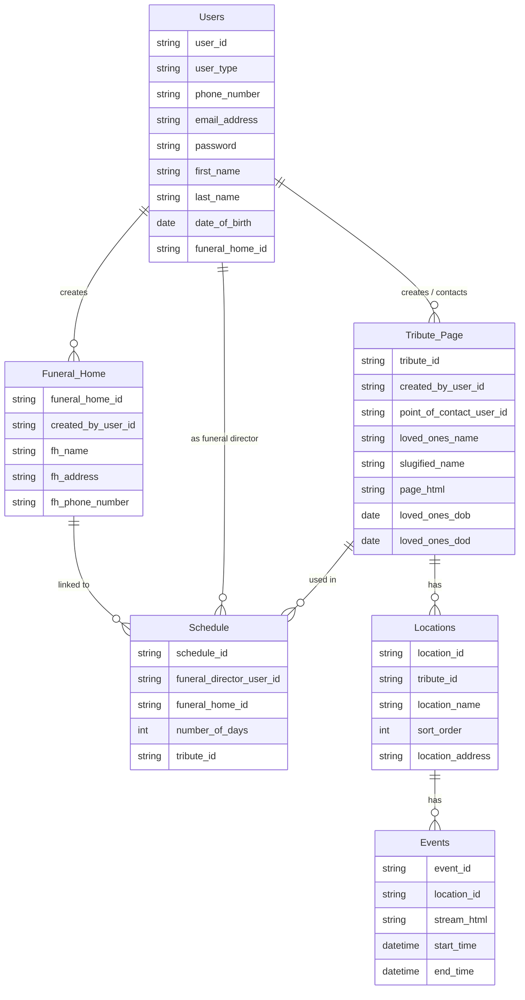
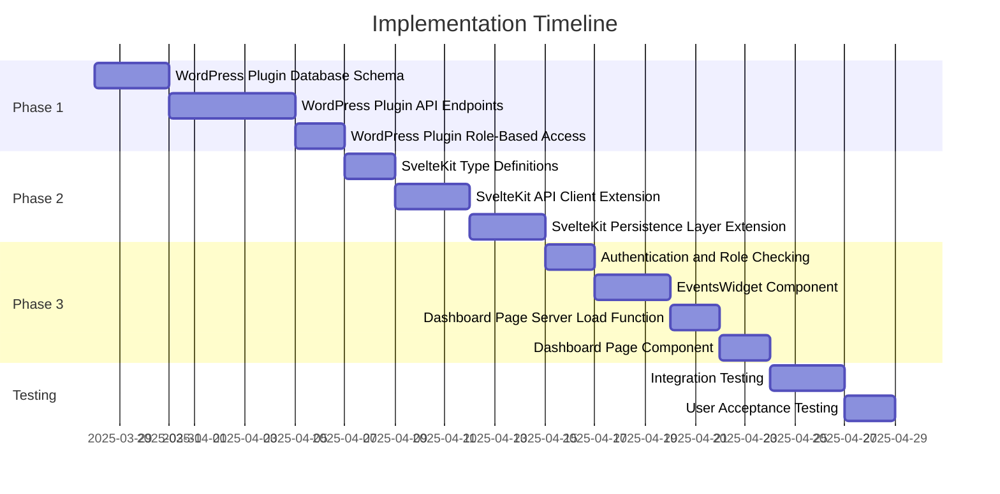

# Dashboard Enhancement Implementation Plan

## Project Overview

This document outlines the implementation plan for enhancing the dashboard in the my-portal section of the TributestreamDev-Version03 project. The enhancements include:

1. Implementing role-based access control
2. Displaying all tributes for admin users
3. Showing events that haven't ended yet in the memorial information section

## Database Schema



## Implementation Phases

The implementation is divided into three main phases:

1. WordPress Plugin Refactoring
2. SvelteKit API Integration
3. Dashboard Enhancement

## Phase 1: WordPress Plugin Refactoring

### 1.1 Database Schema Implementation

**Objective**: Implement the database schema according to the provided ER diagram.

**Steps**:

1. Create a new file `TributestreamAPI-Plugin-for-Wordpress-v2.php` based on the existing plugin
2. Add database creation code in the plugin activation hook
3. Add foreign key constraints for data integrity
4. Add upgrade mechanism for schema changes

**Key Code**:
```php
// Database creation function
function tributestream_create_tables() {
    global $wpdb;
    $charset_collate = $wpdb->get_charset_collate();

    // Users table
    $users_table = "CREATE TABLE IF NOT EXISTS `users` (
        `user_id` varchar(36) NOT NULL,
        `user_type` varchar(50) NOT NULL,
        // Additional fields...
        PRIMARY KEY (`user_id`)
    ) $charset_collate;";
    
    // Additional tables...
    
    require_once(ABSPATH . 'wp-admin/includes/upgrade.php');
    dbDelta($users_table);
    // Execute other table creation statements...
}
```

### 1.2 API Endpoints Implementation

**Objective**: Implement RESTful API endpoints for all tables in the schema.

**Steps**:

1. Define role constants
2. Create base API class with common functionality
3. Implement CRUD operations for each entity
4. Add proper error handling and validation

**Key Code**:
```php
// User role constants
define('TRIBUTESTREAM_ROLE_ADMIN', 'admin');
define('TRIBUTESTREAM_ROLE_FUNERAL_DIRECTOR', 'funeral_director');
// Additional roles...

// Events API class
class TributestreamEventsAPI extends TributestreamBaseAPI {
    public function register_routes() {
        // GET all events
        register_rest_route($this->namespace, '/events', [
            'methods' => 'GET',
            'callback' => [$this, 'get_events'],
            'permission_callback' => [$this, 'permission_check_public'],
        ]);
        
        // Additional routes...
    }
    
    // Implementation of callback methods...
}
```

### 1.3 Role-Based Access Control

**Objective**: Implement role-based access control using the user_type field.

**Steps**:

1. Add user type field to WordPress user registration
2. Include user_type in JWT token payload
3. Add role-specific endpoint access control to API classes

**Key Code**:
```php
// Add user_type to JWT token payload
function tributestream_add_user_type_to_jwt($payload, $user) {
    $user_type = get_user_meta($user->ID, 'tributestream_user_type', true);
    $payload['user_type'] = $user_type ?: TRIBUTESTREAM_ROLE_VIEWER;
    return $payload;
}
add_filter('jwt_auth_token_before_dispatch', 'tributestream_add_user_type_to_jwt', 10, 2);
```

## Phase 2: SvelteKit API Integration

### 2.1 Type Definitions

**Objective**: Create TypeScript interfaces for all entities.

**Steps**:

1. Create user roles type definition
2. Create user interface
3. Create event interface
4. Create location interface
5. Create tribute interface

**Key Code**:
```typescript
// src/lib/types/user-roles.ts
export const UserRoles = {
  ADMIN: 'admin',
  FUNERAL_DIRECTOR: 'funeral_director',
  VIEWER: 'viewer',
  PERSON_OF_CONTACT: 'person_of_contact',
  CONTRIBUTOR: 'contributor',
  VIDEOGRAPHER: 'videographer'
} as const;

export type UserRole = typeof UserRoles[keyof typeof UserRoles];

// src/lib/types/event.ts
export interface Event {
  event_id: string;
  location_id: string;
  stream_html: string;
  start_time: string;
  end_time: string;
  // Additional fields for UI display
  location_name?: string;
  location_address?: string;
  tribute_id?: string;
  tribute_name?: string;
}
```

### 2.2 API Client Extension

**Objective**: Extend the TributeApiClient to include methods for the new endpoints.

**Steps**:

1. Add event-related methods to TributeApiClient
2. Add user-related methods to TributeApiClient
3. Add tribute-related methods to TributeApiClient

**Key Code**:
```typescript
// src/lib/api/tribute-api-client.ts (extended)

/**
 * Get active events (not ended yet)
 * 
 * @returns List of active events
 */
async getActiveEvents(): Promise<ApiResponse<{ events: Event[] }>> {
  const now = new Date().toISOString();
  return this.request<{ events: Event[] }>(
    `${API_BASE_URL}/events?end_time_gt=${now}`
  );
}

/**
 * Get all tributes (admin only)
 * 
 * @returns All tributes
 */
async getAllTributes(): Promise<ApiResponse<{ tributes: Tribute[] }>> {
  return this.request<{ tributes: Tribute[] }>(
    `${API_BASE_URL}/tributes`
  );
}
```

### 2.3 Persistence Layer Extension

**Objective**: Extend the TributePersistence class to include methods for events.

**Steps**:

1. Add event-related properties and methods to TributePersistence
2. Implement caching for events
3. Create Svelte stores for reactive data

**Key Code**:
```typescript
// src/lib/persistence/tribute-persistence.ts (extended)

/**
 * Get active events with caching
 * 
 * @param options Options for cache handling
 * @returns Active events and success indicator
 */
async getActiveEvents(
  options: { 
    forceRefresh?: boolean;
    retry?: boolean;
  } = {}
): Promise<{ data: Event[] | null; success: boolean; error?: string }> {
  const cacheKey = 'active_events';
  
  // Check cache first unless force refresh requested
  if (!options.forceRefresh) {
    const cachedEntry = this.eventsCache.get(cacheKey);
    
    if (cachedEntry && (Date.now() - cachedEntry.timestamp) < CACHE_TTL) {
      this.updateEventsStore(cacheKey, cachedEntry.data);
      return { data: cachedEntry.data, success: true };
    }
  }
  
  // Fetch from API and update cache...
}
```

## Phase 3: Dashboard Enhancement

### 3.1 Authentication and Role Checking

**Objective**: Update the hooks.server.ts file to include role information.

**Steps**:

1. Extract user role from JWT token
2. Add role information to locals object
3. Add isAdmin flag to locals object

**Key Code**:
```typescript
// src/hooks.server.ts (modified)
if (userCookie) {
  try {
    const userData = JSON.parse(userCookie);
    event.locals.user = userData;
    
    // Add user role information
    if (userData.user_type) {
      event.locals.userRole = userData.user_type;
      event.locals.isAdmin = userData.user_type === UserRoles.ADMIN;
    }
  } catch (error) {
    console.error('Error parsing user cookie:', error);
  }
}
```

### 3.2 EventsWidget Component

**Objective**: Create a new component for displaying events.

**Steps**:

1. Create EventsWidget.svelte component
2. Implement event sorting and filtering
3. Add event status display
4. Add event details display

**Key Code**:
```svelte
<!-- src/lib/components/dashboard/EventsWidget.svelte -->
<script lang="ts">
  import { fade } from 'svelte/transition';
  import type { Event } from '$lib/types/event';
  import type { Tribute } from '$lib/types/tribute';
  
  export let events: Event[] = [];
  export let tributes: Tribute[] = [];
  
  // Check if event is currently live
  function isEventLive(event: Event): boolean {
    const now = new Date();
    const startTime = new Date(event.start_time);
    const endTime = new Date(event.end_time);
    return now >= startTime && now <= endTime;
  }
  
  // Additional helper functions...
</script>

<div class="bg-card rounded-lg p-6 shadow-sm" transition:fade={{ duration: 200 }}>
  <div class="flex justify-between items-center mb-4">
    <h3 class="text-xl font-semibold">Upcoming & Live Events</h3>
  </div>
  
  {#if events.length === 0}
    <div class="py-4 text-center text-muted-foreground">
      No upcoming or live events found.
    </div>
  {:else}
    <div class="space-y-4">
      {#each events as event}
        <!-- Event card markup -->
      {/each}
    </div>
  {/if}
</div>
```

### 3.3 Dashboard Page Server Load Function

**Objective**: Update the dashboard page server load function to fetch and process events.

**Steps**:

1. Check user role
2. Fetch appropriate tributes based on role
3. Fetch active events
4. Sort events by status and start time

**Key Code**:
```typescript
// src/routes/my-portal/dashboard/+page.server.ts (modified)
export const load: PageServerLoad = async ({ locals, fetch }) => {
  // Check if user is authenticated
  if (!locals.authenticated || !locals.token || !locals.user) {
    throw redirect(302, '/my-portal');
  }

  try {
    // Initialize the persistence layer with the JWT token
    const apiClient = new TributeApiClient(locals.token);
    tributePersistence.setApiClient(apiClient);
    
    // Check if user is an admin
    const isAdmin = locals.user.user_type === UserRoles.ADMIN;
    
    // Fetch tributes based on role
    let tributes = [];
    if (isAdmin) {
      // Fetch all tributes for admin users
      const allTributesResult = await tributePersistence.getAllTributes();
      if (allTributesResult.success) {
        tributes = allTributesResult.data || [];
      }
    } else {
      // For non-admin users, fetch only their tributes
      // Existing code...
    }
    
    // Fetch active events
    const eventsResult = await tributePersistence.getActiveEvents();
    const events = eventsResult.success ? eventsResult.data || [] : [];
    
    // Sort events: live first, then by start time
    const sortedEvents = events.sort((a, b) => {
      // Sorting logic...
    });
    
    return {
      user: locals.user,
      isAdmin,
      tributes,
      detailedTributes,
      hasMemorialData,
      memorialData,
      events: sortedEvents
    };
  } catch (error) {
    // Error handling...
  }
};
```

### 3.4 Dashboard Page Component

**Objective**: Update the dashboard page component to display events.

**Steps**:

1. Import EventsWidget component
2. Add isAdmin check
3. Conditionally display EventsWidget or UserDataWidget
4. Update tributes display based on user role

**Key Code**:
```svelte
<!-- src/routes/my-portal/dashboard/+page.svelte (modified) -->
<script lang="ts">
  import type { PageData } from './$types';
  import type { Tribute } from '$lib/types/tribute';
  import UserDataWidget from '$lib/components/dashboard/UserDataWidget.svelte';
  import EventsWidget from '$lib/components/dashboard/EventsWidget.svelte';
  import { UserRoles } from '$lib/types/user-roles';

  let { data } = $props<{ data: PageData }>();
  
  // Helper functions...
  
  // Check if user is admin
  function isAdmin(): boolean {
    return data.isAdmin || false;
  }
</script>

<div class="bg-gray-50 min-h-screen">
  <main class="container mx-auto px-4 py-8">
    <!-- Welcome section -->
    <div class="mb-8">
      <h1 class="text-3xl font-bold text-gray-900">Welcome, {getUserName()}</h1>
      <p class="text-gray-600 mt-2">
        {#if isAdmin()}
          Manage all memorial tributes and information from your admin dashboard.
        {:else}
          Manage your memorial tributes and information from your personal dashboard.
        {/if}
      </p>
    </div>

    <div class="grid md:grid-cols-2 gap-8">
      <!-- Tributes section -->
      <section class="bg-white rounded-lg shadow overflow-hidden">
        <!-- Tributes display -->
      </section>

      <!-- Memorial Information section -->
      {#if data.events && data.events.length > 0}
        <!-- Show events widget if there are events -->
        <EventsWidget events={data.events} tributes={data.tributes} />
      {:else}
        <!-- Show the regular UserDataWidget if no events -->
        <UserDataWidget userId={getUserId()} />
      {/if}
    </div>
  </main>
</div>
```

## Implementation Timeline



## Testing Checklist

- [ ] WordPress plugin activates without errors
- [ ] Database tables are created correctly
- [ ] API endpoints return expected responses
- [ ] Role-based access control works correctly
- [ ] Events are fetched and displayed correctly
- [ ] Admin users can see all tributes
- [ ] Events are sorted correctly (live first, then by start time)
- [ ] Event status is displayed correctly
- [ ] Dashboard layout is responsive
- [ ] Error handling works correctly

## Deployment Steps

1. Backup the existing WordPress database
2. Activate the new WordPress plugin
3. Verify database tables are created correctly
4. Deploy SvelteKit code changes
5. Test the dashboard with different user roles
6. Monitor for any errors or performance issues

## Conclusion

This implementation plan provides a comprehensive approach to enhancing the dashboard with role-based access control and event display. By following this plan, we can ensure a smooth implementation and a high-quality user experience.
