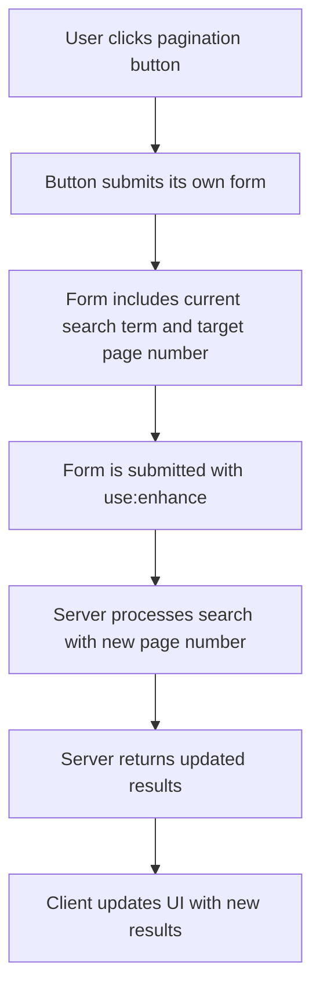

# Form Action Refactoring Plan for TributeStream

## Problem Statement

The current implementation of form actions in the TributeStream application has an issue with pagination functionality. Specifically:

- It takes two clicks to change pages
- The first click updates the state but doesn't properly trigger the form submission
- We need to maintain the current UI while fixing the implementation to follow SvelteKit's form action best practices

## Current Implementation Analysis

### Pagination Implementation

The current pagination implementation uses:

1. A hidden form with `use:enhance` directive:
```svelte
<form 
    id="pagination-form" 
    method="POST" 
    action="?/search" 
    use:enhance={() => {
        return ({ update }) => {
            update({ reset: false });
            isSearching = false;
        };
    }}
    class="hidden"
>
    <input type="hidden" name="searchTerm" value={searchTerm} />
    <input type="hidden" name="page" value={currentPage} />
</form>
```

2. A `goToPage` function that updates the state and tries to submit the form programmatically:
```typescript
function goToPage(page: number) {
    if (page < 1) return;
    
    // Update the current page
    currentPage = page;
    
    // Set UI state
    formState = 'searching';
    isSearching = true;
    
    // Submit the pagination form
    const paginationForm = document.getElementById('pagination-form') as HTMLFormElement;
    if (paginationForm) {
        paginationForm.requestSubmit();
    }
}
```

3. Pagination buttons that call this function:
```svelte
<button
    type="button"
    class="pagination-button"
    on:click={() => goToPage(form.currentPage - 1)}
    disabled={form.currentPage <= 1}
>
    Previous
</button>
```

### Issue Identification

The issue appears to be that the state update (`currentPage = page`) and the form submission (`paginationForm.requestSubmit()`) are not properly synchronized. When the user clicks a pagination button:

1. The `currentPage` state is updated
2. The form submission is attempted, but it might be using the previous value of `currentPage` because the DOM hasn't updated yet
3. This results in the need for a second click to actually submit the form with the updated page number

## Refactoring Plan

To fix this issue while maintaining the current UI and following SvelteKit's form action best practices, we'll implement the following changes:

### 1. Direct Form Submission Approach

Instead of using a hidden form with programmatic submission, we'll use individual forms for each pagination button. This approach ensures that each button has its own form with the correct page number.



### 2. Implementation Steps

#### Step 1: Replace Hidden Form with Individual Forms

For each pagination button, create a dedicated form:

```svelte
<!-- Previous page button -->
<form 
    method="POST" 
    action="?/search" 
    use:enhance={() => {
        // Pre-submission
        isSearching = true;
        
        return ({ update }) => {
            // Post-submission
            update({ reset: false });
            isSearching = false;
        };
    }}
>
    <input type="hidden" name="searchTerm" value={searchTerm} />
    <input type="hidden" name="page" value={form.currentPage - 1} />
    
    <button 
        type="submit"
        class="px-3 py-1 rounded-md bg-gray-700 text-white disabled:opacity-50 disabled:cursor-not-allowed"
        disabled={form.currentPage <= 1}
        aria-label="Previous page"
    >
        <svg xmlns="http://www.w3.org/2000/svg" class="h-5 w-5" viewBox="0 0 20 20" fill="currentColor">
            <path fill-rule="evenodd" d="M12.707 5.293a1 1 0 010 1.414L9.414 10l3.293 3.293a1 1 0 01-1.414 1.414l-4-4a1 1 0 010-1.414l4-4a1 1 0 011.414 0z" clip-rule="evenodd" />
        </svg>
    </button>
</form>
```

#### Step 2: Apply the Same Pattern to Page Number Buttons

For each page number button, create a similar form:

```svelte
<!-- Page number button -->
<form 
    method="POST" 
    action="?/search" 
    use:enhance={() => {
        isSearching = true;
        return ({ update }) => {
            update({ reset: false });
            isSearching = false;
        };
    }}
>
    <input type="hidden" name="searchTerm" value={searchTerm} />
    <input type="hidden" name="page" value={i + 1} />
    
    <button 
        type="submit"
        class="px-3 py-1 rounded-md {form.currentPage === i + 1 ? 'bg-[#D5BA7F] text-black font-bold' : 'bg-gray-700 text-white hover:bg-gray-600'}"
    >
        {i + 1}
    </button>
</form>
```

#### Step 3: Apply the Same Pattern to Next Page Button

```svelte
<!-- Next page button -->
<form 
    method="POST" 
    action="?/search" 
    use:enhance={() => {
        isSearching = true;
        return ({ update }) => {
            update({ reset: false });
            isSearching = false;
        };
    }}
>
    <input type="hidden" name="searchTerm" value={searchTerm} />
    <input type="hidden" name="page" value={form.currentPage + 1} />
    
    <button 
        type="submit"
        class="px-3 py-1 rounded-md bg-gray-700 text-white disabled:opacity-50 disabled:cursor-not-allowed"
        disabled={form.currentPage >= form.totalPages}
        aria-label="Next page"
    >
        <svg xmlns="http://www.w3.org/2000/svg" class="h-5 w-5" viewBox="0 0 20 20" fill="currentColor">
            <path fill-rule="evenodd" d="M7.293 14.707a1 1 0 010-1.414L10.586 10 7.293 6.707a1 1 0 011.414-1.414l4 4a1 1 0 010 1.414l-4 4a1 1 0 01-1.414 0z" clip-rule="evenodd" />
        </svg>
    </button>
</form>
```

#### Step 4: Remove the Hidden Form and goToPage Function

Since we're now using direct form submissions, we can remove:
- The hidden pagination form
- The `goToPage` function

#### Step 5: Update the Layout to Maintain UI Appearance

To maintain the current UI appearance with the new approach, we'll need to adjust the CSS to ensure the forms don't disrupt the layout:

```svelte
<div class="mt-4 flex justify-center items-center space-x-2">
    <!-- Forms will be styled to maintain the current layout -->
    <style>
        /* Make forms display inline */
        form {
            display: inline-block;
            margin: 0;
            padding: 0;
        }
        
        /* Ensure no extra spacing between forms */
        form + form {
            margin-left: 0.5rem;
        }
    </style>
</div>
```

### 3. Benefits of This Approach

1. **Direct Form Submission**: Each button submits its own form with the correct page number, eliminating the need for state synchronization.
2. **Progressive Enhancement**: Forms work even without JavaScript, following SvelteKit's best practices.
3. **Simplified Code**: Removes the need for the hidden form and programmatic submission.
4. **Maintainable UI**: Preserves the current UI appearance while fixing the functionality.
5. **Follows SvelteKit Patterns**: Uses the recommended form action patterns from SvelteKit.

### 4. Testing Plan

To ensure the refactored implementation works correctly, we'll test:

1. **Basic Pagination**: Verify that clicking pagination buttons changes pages with a single click.
2. **Edge Cases**: Test first page, last page, and navigation between non-adjacent pages.
3. **Search Context**: Ensure pagination maintains the current search term.
4. **UI Consistency**: Verify that the UI appearance remains unchanged.
5. **Progressive Enhancement**: Test that forms work without JavaScript.

## Implementation Details

### File Changes

The main file that needs to be modified is:
- `TributestreamDev-Version03/src/routes/+page.svelte`

### Code Changes

1. Remove the hidden pagination form (lines 358-373)
2. Remove the `goToPage` function (lines 146-162)
3. Replace pagination buttons with form-wrapped buttons as described above

### Timeline

This refactoring should be relatively straightforward and can be completed in a single implementation session:

1. Make the code changes (1-2 hours)
2. Test the implementation (1 hour)
3. Address any issues found during testing (1-2 hours)

## Conclusion

By implementing this plan, we'll fix the pagination issue while maintaining the current UI and following SvelteKit's form action best practices. The direct form submission approach ensures that each pagination button works correctly with a single click, providing a better user experience.