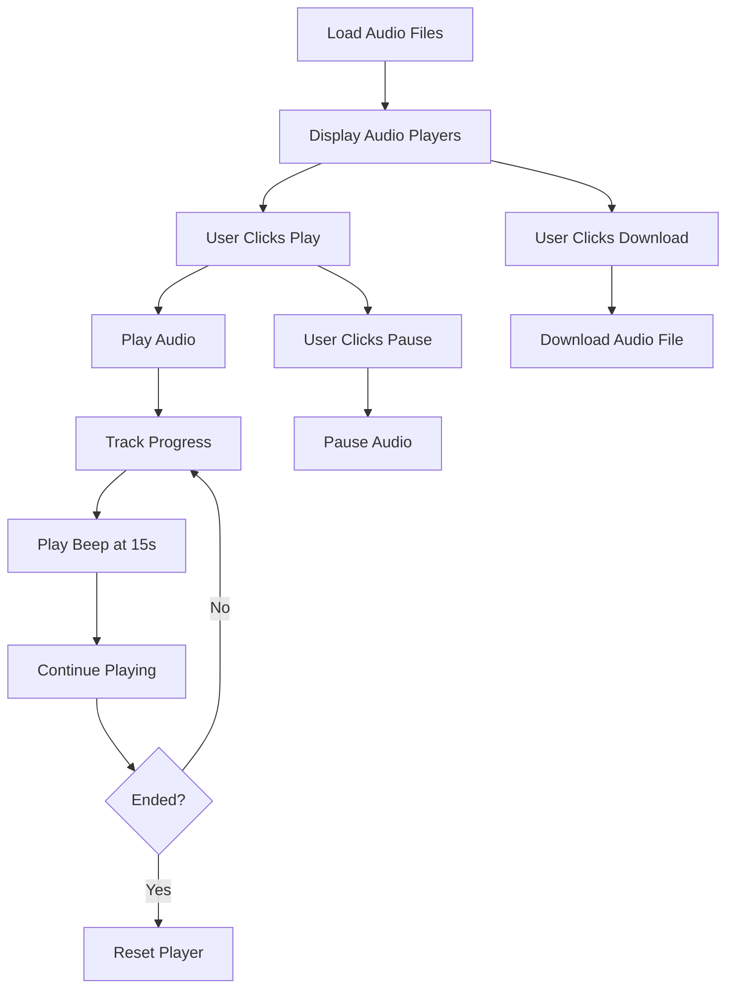
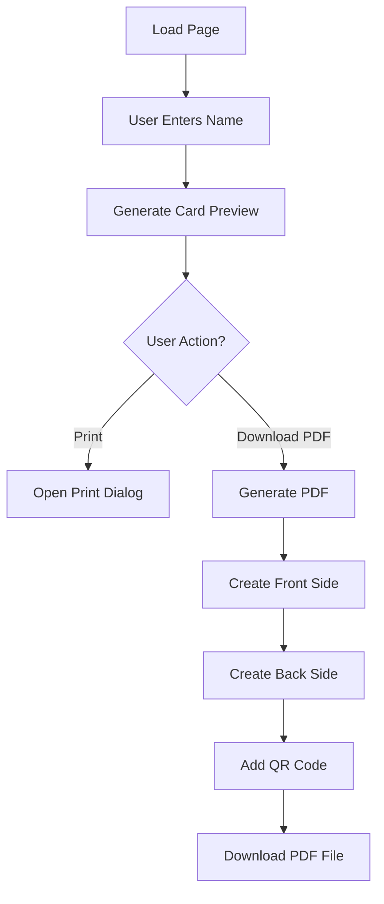
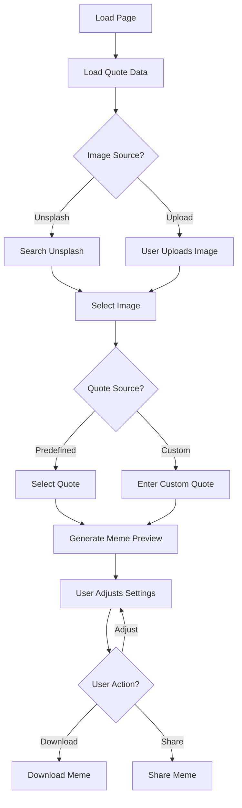
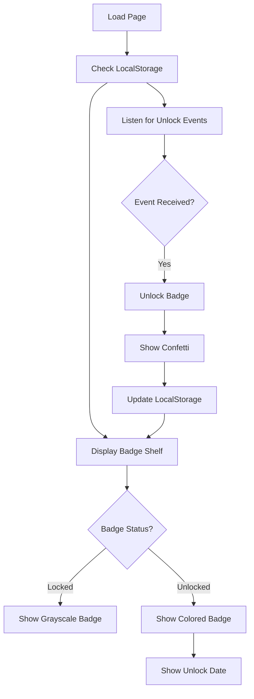
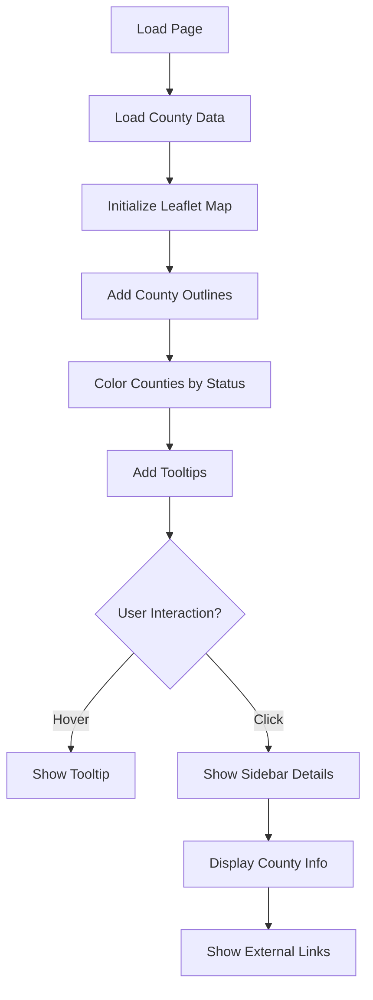

# Implementation Plan: Know Your Rights Interactive Features

Based on your requirements, I'll outline a detailed plan for implementing the six features as individual HTML pages with their own CSS and JavaScript files. All implementations will be client-side only with local storage for data persistence and basic accessibility considerations.

## Project Structure

```
know-your-rights/
├── index.html                  # Main landing page linking to all features
├── css/
│   ├── common.css              # Shared styles
│   ├── quiz.css                # Quiz-specific styles
│   ├── audio-drills.css        # Audio drills styles
│   ├── wallet-card.css         # Wallet card styles
│   ├── meme-maker.css          # Meme maker styles
│   ├── badges.css              # Badges styles
│   └── sheriff-map.css         # Interactive map styles
├── js/
│   ├── common.js               # Shared utilities
│   ├── quiz.js                 # Quiz functionality
│   ├── audio-drills.js         # Audio player functionality
│   ├── wallet-card.js          # Wallet card generator
│   ├── meme-maker.js           # Meme creator
│   ├── badges.js               # Achievement badges
│   ├── sheriff-map.js          # Interactive map
│   └── libs/                   # Third-party libraries
│       ├── jspdf.min.js        # Client-side PDF generation
│       ├── qrcode.min.js       # QR code generation
│       ├── leaflet.js          # Map library
│       └── canvas-confetti.js  # Confetti effects
├── data/
│   ├── quiz.json               # Quiz questions and answers
│   ├── rights-quotes.json      # Quotes for meme maker
│   └── counties.json           # County data for map
├── audio/
│   └── knock/                  # Audio drill files
│       ├── english.mp3
│       ├── spanish.mp3
│       ├── bilingual.mp3
│       └── beep.mp3
├── images/
│   ├── badges/                 # Achievement badge icons
│   ├── meme-templates/         # Background images for memes
│   └── nope.gif                # GIF for incorrect quiz answers
├── quiz.html                   # "Can ICE Do That?" Quiz
├── audio-drills.html           # "If ICE Knocks" Audio Drills
├── wallet-card.html            # Printable Wallet Card Generator
├── meme-maker.html             # Rights Meme Maker
├── badges.html                 # "Good Trouble" Achievement Badges
└── sheriff-map.html            # "Know Your Sheriff" Interactive Map
```

## Feature Implementation Details

### 1. "Can ICE Do That?" Quiz

**File: quiz.html**

```mermaid
graph TD
    A[Load Quiz Data] --> B[Display Question]
    B --> C[User Selects Answer]
    C --> D[Check Answer]
    D --> E{Correct?}
    E -->|Yes| F[Show Success Message]
    E -->|No| G[Show "Nope!" GIF]
    F --> H[Update Score]
    G --> H
    H --> I{Last Question?}
    I -->|No| J[Load Next Question]
    I -->|Yes| K[Show Final Results]
    J --> B
    K --> L[Trigger Badge Unlock]
    L --> M[Option to Restart]
    M --> A
```

**Implementation Approach:**
1. Create a simple card-based UI with front/back flip animation
2. Store quiz data in a JSON file with questions, options, correct answers, and explanations
3. Use CSS transitions for card flip animation
4. Implement progress dots to show quiz progress
5. Store quiz results in localStorage to trigger badge unlock
6. Use ARIA attributes for accessibility

**Key Technical Components:**
- JSON data structure for quiz questions
- CSS transitions for card flip animation
- Event listeners for answer selection
- Custom event dispatch for badge unlocking
- LocalStorage for score persistence

**HTML Structure:**
```html
<div class="quiz-container">
  <div class="progress-dots"><!-- Generated via JS --></div>
  
  <div class="quiz-card">
    <div class="card-front">
      <h2 id="question-text"></h2>
      <form id="quiz-form">
        <div class="options-container"><!-- Generated via JS --></div>
        <button type="submit" class="btn">Submit Answer</button>
      </form>
    </div>
    
    <div class="card-back">
      <h3 id="result-text"></h3>
      <p id="explanation-text"></p>
      <div id="result-gif"></div>
      <button id="next-question" class="btn">Next Question</button>
    </div>
  </div>
  
  <div id="result-banner" class="hidden">
    <h2>Quiz Complete!</h2>
    <p>You scored <span id="final-score">0</span> out of 5</p>
    <button id="restart-quiz" class="btn">Try Again</button>
  </div>
</div>
```

### 2. "If ICE Knocks" Audio Drills

**File: audio-drills.html**



**Implementation Approach:**
1. Create custom audio players with play/pause, progress bar
2. Implement transcript toggle functionality
3. Add download links for offline use
4. Automatically play a beep sound at 15 seconds to prompt speaking practice
5. Track audio play events for analytics (stored in localStorage)
6. Show transcripts by default in reduced-motion mode

**Key Technical Components:**
- HTML5 Audio API for playback control
- CSS for custom audio player styling
- JavaScript timing events for beep at 15 seconds
- Media query detection for reduced motion preference
- Download attribute for offline access

**HTML Structure:**
```html
<div class="audio-drills-container">
  <h2>If ICE Knocks: Audio Drills</h2>
  <p>Practice these responses to protect your rights. A beep will sound at the 15-second mark, prompting you to speak the line aloud.</p>
  
  <div class="audio-cards">
    <div class="audio-card">
      <h3>English Response</h3>
      <div class="audio-player">
        <button class="play-button" data-audio="english">Play</button>
        <div class="progress-bar">
          <div class="progress"></div>
        </div>
        <span class="time">0:00</span>
      </div>
      <button class="transcript-toggle">Show Transcript</button>
      <div class="transcript hidden">
        <p>I do not wish to speak with you, answer your questions, or sign or hand you any documents based on my 5th Amendment rights under the United States Constitution.</p>
        <!-- More transcript text -->
      </div>
      <a href="audio/knock/english.mp3" download class="btn">Download Audio</a>
    </div>
    
    <!-- Similar structure for Spanish and Bilingual cards -->
  </div>
</div>
```

### 3. Printable Wallet Card Generator

**File: wallet-card.html**



**Implementation Approach:**
1. Create a simple form for name input
2. Generate a preview of the wallet card with entered information
3. Use jsPDF for client-side PDF generation
4. Implement QR code generation with qrcode.js
5. Add print functionality with optimized print styles
6. Provide download option for the generated PDF

**Key Technical Components:**
- jsPDF library for client-side PDF generation
- QRCode.js for QR code generation
- CSS print media queries for print optimization
- Form handling for user input
- Blob creation and download for PDF files

**HTML Structure:**
```html
<div class="wallet-card-container">
  <h2>Printable Wallet Card Generator</h2>
  <p>Create a personalized wallet card with your rights information.</p>
  
  <form id="wallet-card-form">
    <div class="form-group">
      <label for="name">Your Name (Optional)</label>
      <input type="text" id="name" name="name" placeholder="First and Last Name">
    </div>
    
    <button type="submit" class="btn">Generate Card</button>
  </form>
  
  <div id="card-preview" class="hidden">
    <h3>Your Wallet Card</h3>
    
    <div class="card-container">
      <div class="card-front">
        <h4>Know Your Rights</h4>
        <p class="name-display"></p>
        <p>"I invoke my right to remain silent and the right to speak with an attorney."</p>
        <p>Emergency Hotline: 1-800-XXX-XXXX</p>
      </div>
      
      <div class="card-back">
        <ul>
          <li>I do not consent to a search.</li>
          <li>I wish to remain silent.</li>
          <li>I want to speak to an attorney.</li>
          <li>I do not wish to sign anything.</li>
        </ul>
        <div class="qr-code"></div>
      </div>
    </div>
    
    <div class="card-actions">
      <button id="print-card" class="btn">Print Card</button>
      <button id="download-pdf" class="btn">Download PDF</button>
    </div>
  </div>
</div>
```

### 5. Rights Meme Maker

**File: meme-maker.html**



**Implementation Approach:**
1. Create a canvas-based meme generator
2. Allow users to select from predefined quotes or enter their own
3. Provide option to use Unsplash images via their API or upload own image
4. Generate meme with semi-transparent text overlay
5. Implement download functionality
6. Add share capability using Web Share API where available
7. Include alt text input for accessibility

**Key Technical Components:**
- Canvas API for image manipulation
- File API for image uploads
- Fetch API for Unsplash integration
- Canvas toBlob for image download
- Web Share API for sharing (with fallback)
- LocalStorage for recently created memes

**HTML Structure:**
```html
<div class="meme-maker-container">
  <h2>Rights Meme Maker</h2>
  <p>Create shareable memes to spread awareness about your rights.</p>
  
  <div class="meme-editor">
    <div class="editor-controls">
      <div class="form-group">
        <label for="image-source">Choose Image Source</label>
        <select id="image-source">
          <option value="unsplash">Unsplash Images</option>
          <option value="upload">Upload Your Own</option>
        </select>
      </div>
      
      <!-- Image source controls (Unsplash search or file upload) -->
      
      <div class="form-group">
        <label for="quote-select">Choose a Quote</label>
        <select id="quote-select">
          <option value="random">Random Quote</option>
          <!-- Options populated from JSON -->
        </select>
      </div>
      
      <div class="form-group">
        <label for="custom-quote">Or Write Your Own</label>
        <textarea id="custom-quote" placeholder="Enter your own quote..."></textarea>
      </div>
      
      <div class="form-group">
        <label for="alt-text">Image Alt Text (for accessibility)</label>
        <input type="text" id="alt-text" placeholder="Describe your meme for screen readers">
      </div>
      
      <button id="generate-meme" class="btn">Generate Meme</button>
    </div>
    
    <div class="meme-preview">
      <canvas id="meme-canvas" width="1080" height="1080"></canvas>
      
      <div class="preview-actions hidden">
        <button id="download-meme" class="btn">Download</button>
        <button id="share-meme" class="btn">Share</button>
      </div>
    </div>
  </div>
</div>
```

### 7. "Good Trouble" Achievement Badges

**File: badges.html**



**Implementation Approach:**
1. Create a visual display of available badges
2. Store badge unlock status in localStorage
3. Listen for custom events from other features to trigger unlocks
4. Show locked badges in grayscale with reduced opacity
5. Display confetti animation when badges are unlocked
6. Add export functionality to share badge progress

**Key Technical Components:**
- LocalStorage for badge persistence
- Custom event listeners for badge unlocks
- Canvas-confetti for celebration effects
- CSS filters for grayscale/opacity effects
- HTML2Canvas for exporting badge sheet

**HTML Structure:**
```html
<div class="badges-container">
  <h2>Good Trouble Achievement Badges</h2>
  <p>Complete activities to unlock these badges and show your commitment to knowing your rights.</p>
  
  <div class="progress-bar">
    <div class="progress"></div>
    <p class="progress-text">2 actions left to level-up!</p>
  </div>
  
  <div class="badge-shelf">
    <div class="badge" data-badge="legal-eagle">
      
      <h3>Legal Eagle</h3>
      <p>Complete the "Can ICE Do That?" quiz</p>
      <span class="unlock-date"></span>
    </div>
    
    <div class="badge" data-badge="silent-star">
      
      <p>Listen to all 3 audio drills</p>
      <span class="unlock-date"></span>
    </div>
    
    <div class="badge" data-badge="warrant-watcher">
      
      <p>Create and print a wallet card</p>
      <span class="unlock-date"></span>
    </div>
  </div>
  
  <div class="badge-actions">
    <button id="export-badges" class="btn">Export My Badge Sheet</button>
    <button id="reset-badges" class="btn btn-secondary">Reset Progress</button>
  </div>
</div>
```

### 10. "Know Your Sheriff" Interactive Map

**File: sheriff-map.html**



**Implementation Approach:**
1. Use Leaflet.js for interactive map functionality
2. Load GeoJSON data for county outlines
3. Color counties based on ICE cooperation status
4. Implement hover tooltips with basic information
5. Show detailed sidebar when counties are clicked
6. Provide keyboard navigation for accessibility
7. Include a list view alternative for screen readers

**Key Technical Components:**
- Leaflet.js for map rendering
- GeoJSON for county data
- CSS for county coloring based on status
- IntersectionObserver for lazy loading
- Keyboard event handlers for accessibility
- Responsive design for mobile devices

**HTML Structure:**
```html
<div class="map-container">
  <h2>Know Your Sheriff Interactive Map</h2>
  <p>Explore which counties cooperate with ICE and which protect immigrant rights.</p>
  
  <div class="view-toggle">
    <button class="btn active" data-view="map">Map View</button>
    <button class="btn" data-view="list">List View</button>
  </div>
  
  <div class="map-view">
    <div id="county-map"></div>
    
    <div class="map-legend">
      <h3>Legend</h3>
      <ul>
        <li><span class="color-dot red"></span> Active 287(g) program</li>
        <li><span class="color-dot amber"></span> Past lawsuits</li>
        <li><span class="color-dot green"></span> No ICE cooperation</li>
      </ul>
    </div>
  </div>
  
  <div class="list-view hidden">
    <div class="county-list">
      <!-- Generated via JS -->
    </div>
  </div>
  
  <div class="county-sidebar hidden">
    <button class="close-btn">&times;</button>
    <h3 id="county-name"></h3>
    <div id="county-status"></div>
    <div id="county-details"></div>
    <div id="county-links"></div>
  </div>
</div>
```

## Integration Strategy

To connect these individual features while keeping them as standalone components:

1. **Common Navigation Bar**: Add a simple navigation bar to each page that links to all other features
2. **Shared Event System**: Implement a custom event system using localStorage to communicate between features
3. **Consistent Styling**: Use a common CSS file for shared styles to maintain visual consistency
4. **Badge Integration**: Add event dispatchers in each feature that the badges page listens for

```html
<!-- Example of the common navigation bar on each page -->
<nav class="main-nav">
  <a href="index.html">Home</a>
  <a href="quiz.html">ICE Quiz</a>
  <a href="audio-drills.html">Audio Drills</a>
  <a href="wallet-card.html">Wallet Card</a>
  <a href="meme-maker.html">Meme Maker</a>
  <a href="badges.html">Badges</a>
  <a href="sheriff-map.html">Sheriff Map</a>
</nav>
```

## Data Storage Strategy

Since we're using client-side only implementation with localStorage:

1. **Feature-specific data**: Store in namespaced localStorage keys
   ```javascript
   // Example for quiz
   localStorage.setItem('kyr_quiz_completed', 'true');
   localStorage.setItem('kyr_quiz_score', '4');
   localStorage.setItem('kyr_quiz_completion_date', new Date().toISOString());
   ```

2. **Badge progress**: Store in a structured JSON object
   ```javascript
   const badges = {
     'legal-eagle': { unlocked: true, date: '2025-04-17T12:00:00Z' },
     'silent-star': { unlocked: false, date: null },
     'warrant-watcher': { unlocked: false, date: null }
   };
   localStorage.setItem('kyr_badges', JSON.stringify(badges));
   ```

3. **User preferences**: Store settings like language preference
   ```javascript
   localStorage.setItem('kyr_preferences', JSON.stringify({
     language: 'en',
     highContrast: false,
     reducedMotion: false
   }));
   ```

## Accessibility Considerations

For basic accessibility:

1. **Semantic HTML**: Use proper heading hierarchy and semantic elements
2. **ARIA attributes**: Add aria-labels, aria-live regions for dynamic content
3. **Keyboard navigation**: Ensure all interactive elements are keyboard accessible
4. **Alternative text**: Provide alt text for all images
5. **Focus management**: Visible focus indicators for interactive elements
6. **Reduced motion**: Respect prefers-reduced-motion media query
7. **Color contrast**: Ensure sufficient contrast for text readability

## Implementation Timeline

| Feature | Estimated Time | Priority |
|---------|----------------|----------|
| Project Setup & Common Files | 1 day | High |
| "Can ICE Do That?" Quiz | 2 days | High |
| "If ICE Knocks" Audio Drills | 2 days | High |
| Printable Wallet Card Generator | 2 days | Medium |
| Rights Meme Maker | 3 days | Medium |
| "Good Trouble" Achievement Badges | 2 days | Low |
| "Know Your Sheriff" Interactive Map | 3 days | Low |
| Integration & Testing | 2 days | High |

## Required Third-Party Libraries

1. **jsPDF** (client-side PDF generation): https://github.com/parallax/jsPDF
2. **QRCode.js** (QR code generation): https://github.com/davidshimjs/qrcodejs
3. **Leaflet.js** (interactive maps): https://leafletjs.com/
4. **Canvas-Confetti** (celebration effects): https://github.com/catdad/canvas-confetti

All libraries are lightweight and can be included via CDN or downloaded and included in the project.