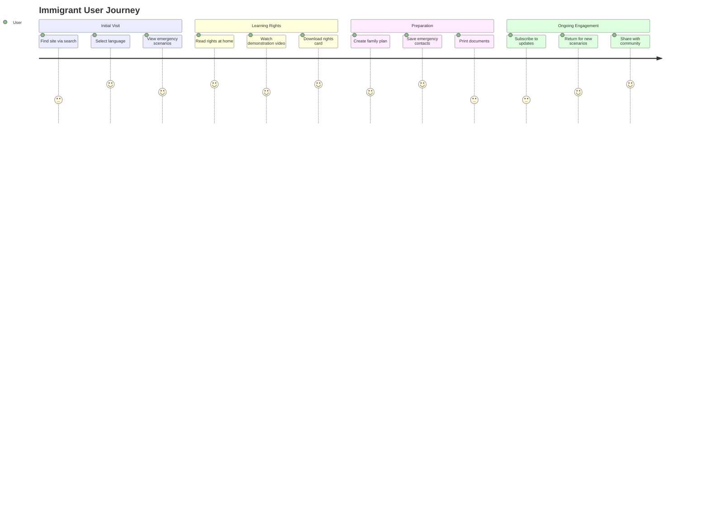
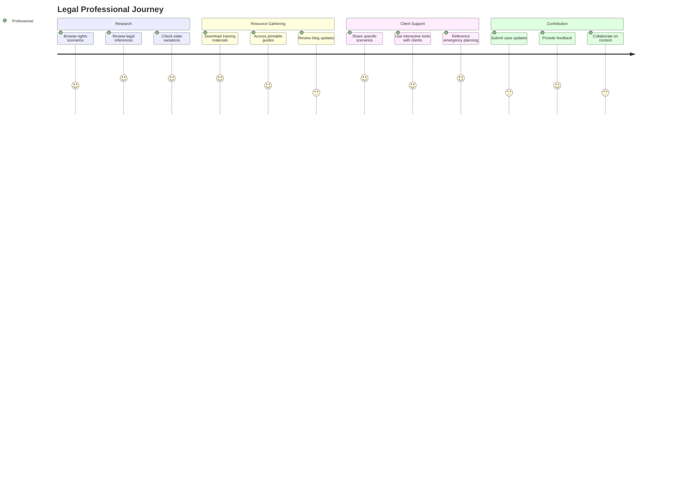
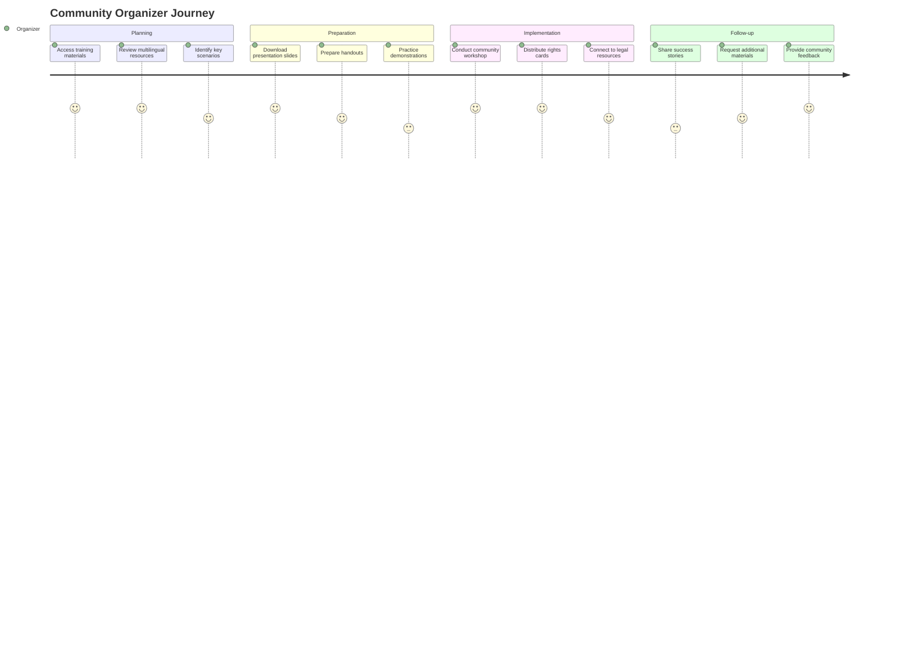

# Comprehensive Outline for "Know Your Rights" Website

Based on the content provided and your requirements, I've developed a detailed outline for a multi-page "Know Your Rights" website that serves immigrants, legal professionals, and community organizers in five languages (English, Spanish, Chinese, Arabic, and French).

## Website Structure Overview

```mermaid
graph TD
    A[Homepage] --> B[Rights by Scenario]
    A --> C[Emergency Planning]
    A --> D[Legal Resources]
    A --> E[Community Resources]
    A --> F[Blog]
    A --> G[About]
    
    B --> B1[Rights at Home]
    B --> B2[Rights in Public]
    B --> B3[Traffic Stops]
    B --> B4[Workplace Rights]
    B --> B5[Airport/Border Rights]
    
    C --> C1[Family Preparedness]
    C --> C2[Document Checklist]
    C --> C3[Emergency Contacts]
    
    D --> D1[Find Legal Help]
    D --> D2[Know Your Rights Cards]
    D --> D3[State-Specific Laws]
    
    E --> E1[Community Organizations]
    E --> E2[Hotlines & Help Centers]
    E --> E3[Training Materials]
    
    F --> F1[Rights Updates]
    F --> F2[Community Stories]
    F --> F3[Legal Developments]
```

## I. Detailed Page Structure

### 1. Homepage
- **Hero Section**
  - Prominent language selector (English, Spanish, Chinese, Arabic, French)
  - Clear statement of purpose: "Know and assert your constitutional rights"
  - Emergency hotline number (prominently displayed)
  
- **Quick Access Cards**
  - "What to do if ICE comes to your door" (most critical scenario)
  - "Create an emergency plan" (family preparedness)
  - "Find legal help near you" (resource locator)
  - "Download rights cards" (printable resources)
  
- **Latest Updates**
  - Recent blog posts or legal developments
  - Community alerts (if applicable)
  
- **Testimonials/Impact Stories**
  - Brief quotes from community members who successfully asserted their rights
  
- **Call to Action**
  - "Share this resource" buttons for social media
  - Email signup for rights updates and alerts

### 2. Rights by Scenario Section
Each scenario page follows a consistent structure:

- **Overview**
  - Brief explanation of the scenario and why knowing your rights matters
  
- **Your Rights**
  - Clear, bulleted list of specific rights in this scenario
  - Legal basis for these rights (with simple explanations)
  
- **What to Do**
  - Step-by-step instructions in chronological order
  - Specific phrases to say (highlighted in callout boxes)
  
- **What Not to Do**
  - Common mistakes to avoid
  - Potential consequences explained
  
- **Interactive Elements**
  - Scenario walkthrough (clickable steps)
  - Short video demonstration (with captions in all languages)
  
- **Printable Resources**
  - One-page PDF summary for this scenario
  - Wallet-sized rights card specific to this scenario
  
- **Related Scenarios**
  - Links to related rights situations

#### 2.1 Rights at Home
- Focused on ICE/police visits to homes
- Door interaction scripts
- Warrant verification guide (with visual examples)
- Family member protocols

#### 2.2 Rights in Public
- Street encounters with law enforcement
- Public transportation scenarios
- Documentation requests
- Recording interactions legally

#### 2.3 Traffic Stops
- Driver and passenger rights
- Documentation requirements by state
- Vehicle search limitations
- Post-stop reporting procedures

#### 2.4 Workplace Rights
- Workplace raids protocols
- Employer verification requirements
- Labor rights regardless of status
- Reporting workplace violations

#### 2.5 Airport/Border Rights
- Border zone definitions and maps
- CBP authority limitations
- Electronic device searches
- Re-entry procedures

### 3. Emergency Planning Section

#### 3.1 Family Preparedness
- Guardianship arrangements for children
- Power of attorney forms (downloadable)
- Communication plans during detention
- Property and finances management

#### 3.2 Document Checklist
- Essential documents to gather and secure
- Safe storage recommendations
- Digital backup guidelines
- Document organization system

#### 3.3 Emergency Contacts
- Template for creating contact lists
- Role assignments for emergency contacts
- Communication protocols
- School/childcare emergency plans

### 4. Legal Resources Section

#### 4.1 Find Legal Help
- Interactive map of legal service providers
- Pro bono/low-cost options
- Legal service types explained
- Verification tips for avoiding scams

#### 4.2 Know Your Rights Cards
- Downloadable, printable cards in all languages
- Custom card generator (select scenarios)
- Usage instructions with examples
- Distribution recommendations

#### 4.3 State-Specific Laws
- Interactive map showing state variations
- "Stop and identify" state requirements
- Sanctuary policies by location
- Local enforcement cooperation policies

### 5. Community Resources Section

#### 5.1 Community Organizations
- Searchable directory by location and service type
- Vetting criteria explained
- Service descriptions
- Contact information

#### 5.2 Hotlines & Help Centers
- 24/7 emergency resources
- Specialized hotlines (detention, raids, etc.)
- Reporting mechanisms
- Support services

#### 5.3 Training Materials
- Workshop guides for community educators
- Presentation slides (downloadable)
- Role-play scenarios
- Evaluation tools

### 6. Blog Section (WordPress Integration)

#### 6.1 Rights Updates
- Changes in enforcement policies
- New legal precedents
- Executive orders and impacts
- Agency directive analyses

#### 6.2 Community Stories
- First-person accounts (anonymous when needed)
- Success stories of rights assertions
- Community organizing highlights
- Impact narratives

#### 6.3 Legal Developments
- Court case summaries
- Legislative updates
- Regulatory changes
- Expert legal analyses

### 7. About Section
- Mission and values
- Content development process
- Legal review standards
- Organizational partners
- Content licensing information
- Contact information

## II. Technical Implementation Features

### 1. Multilingual Support
- Complete content parity across all five languages
- Language-specific URLs (e.g., /es/, /zh/, /ar/, /fr/)
- Language detection with user preference storage
- RTL support for Arabic
- Language-specific typography optimization
- Consistent terminology across translations

### 2. Accessibility Implementation
- WCAG 2.1 AA compliance throughout
- Screen reader optimization
- Keyboard navigation support
- Alternative text for all images
- Captions for all videos
- Reading level optimization (8th-grade level target)
- Color contrast compliance
- Text resizing support
- Focus indicators
- Reduced motion options

### 3. Interactive Elements
- Rights scenario simulators
- Printable resource generators
- Location-based resource finder
- Document checklist builder
- Emergency plan generator
- Interactive legal glossary
- Guided walkthrough tours

### 4. Content Distribution Strategy
- Progressive disclosure of complex information
- Scenario-based organization (problem-solution format)
- Consistent page structures for predictable navigation
- Mobile-first design for field access
- Offline access capabilities for critical content
- Print-optimized versions of all pages

### 5. WordPress Blog Integration
- Custom post types for different content categories
- Taxonomy system for rights topics and scenarios
- Author roles for different contributor types
- Editorial workflow for legal review
- Scheduled publishing for regular updates
- Social sharing optimization
- Comment moderation system
- Related content suggestions
- Email subscription integration

### 6. Call-to-Action Strategy
- Primary CTAs focused on emergency preparation
- Secondary CTAs for education and sharing
- Tertiary CTAs for deeper engagement
- Strategic placement at decision points
- Mobile-optimized tap targets
- Clear visual hierarchy
- Action confirmation feedback

## III. User Journey Maps

### 1. Immigrant User Journey

### 2. Legal Professional Journey

### 3. Community Organizer Journey

## IV. Content Hierarchy and Navigation

### 1. Primary Navigation
- Rights by Scenario
- Emergency Planning
- Legal Resources
- Community Resources
- Blog
- About

### 2. Utility Navigation
- Language Selector
- Search
- Emergency Hotline
- Print Page
- Share Page
- Accessibility Controls

### 3. Footer Navigation
- Contact Information
- Legal Disclaimer
- Privacy Policy
- Terms of Use
- Content Licensing
- Partner Organizations
- Feedback Form

### 4. Mobile Navigation
- Simplified menu with emergency resources prioritized
- Bottom navigation bar for key functions
- Persistent language selector
- One-touch emergency contacts

### 5. Contextual Navigation
- Related scenarios
- Next steps suggestions
- Recommended resources
- Common questions

## V. Technical Recommendations

### 1. Recommended Tech Stack
- **SvelteKit** for the main site framework
  - Static site generation for core content
  - Server-side rendering for dynamic features
  - Minimal JavaScript for core functionality
  - Progressive enhancement approach

- **WordPress Headless CMS** for the blog section
  - Custom post types for different content categories
  - Editorial workflow for legal review
  - API integration with the main site

- **Paraglide.js** for internationalization
  - Support for all five required languages
  - RTL support for Arabic
  - Language-specific formatting

- **Accessibility Features**
  - ARIA implementation
  - Keyboard navigation
  - Screen reader optimization

### 2. Performance Optimization
- Static pre-rendering of core content
- Critical CSS delivery
- Image optimization for all devices
- Lazy loading of non-critical resources
- Offline capability for essential content
- Print stylesheet optimization

### 3. Deployment Strategy
- CDN distribution for global access
- Edge caching for performance
- Automated deployment pipeline
- Content versioning system
- Staging environment for legal review

## VI. Content Management and Maintenance

### 1. Content Update Workflow
- Legal review process for all content
- Translation management system
- Version control for all resources
- Change notification system
- Content freshness indicators

### 2. Quality Assurance
- Legal accuracy verification
- Translation quality checks
- Accessibility compliance testing
- Cross-browser compatibility testing
- Mobile usability testing

### 3. Analytics and Improvement
- User journey tracking
- Content effectiveness metrics
- Resource download tracking
- Search term analysis
- Feedback collection and analysis

## VII. Implementation Phases

### Phase 1: Core Rights Content
- Homepage
- Top 3 critical scenarios
- Emergency planning basics
- Essential downloadable resources
- Basic multilingual support

### Phase 2: Expanded Rights Scenarios
- Complete all scenario pages
- Full emergency planning section
- Interactive elements
- Complete multilingual implementation
- Advanced accessibility features

### Phase 3: Community Resources
- Legal resource directory
- Community organization database
- Training materials
- State-specific information
- Enhanced interactive tools

### Phase 4: Blog and Ongoing Engagement
- WordPress blog integration
- Email subscription system
- Community story platform
- Legal updates framework
- Content contribution system