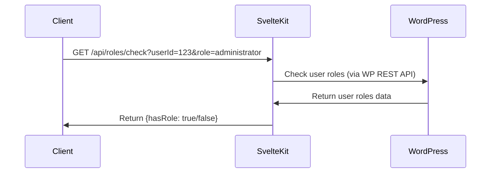
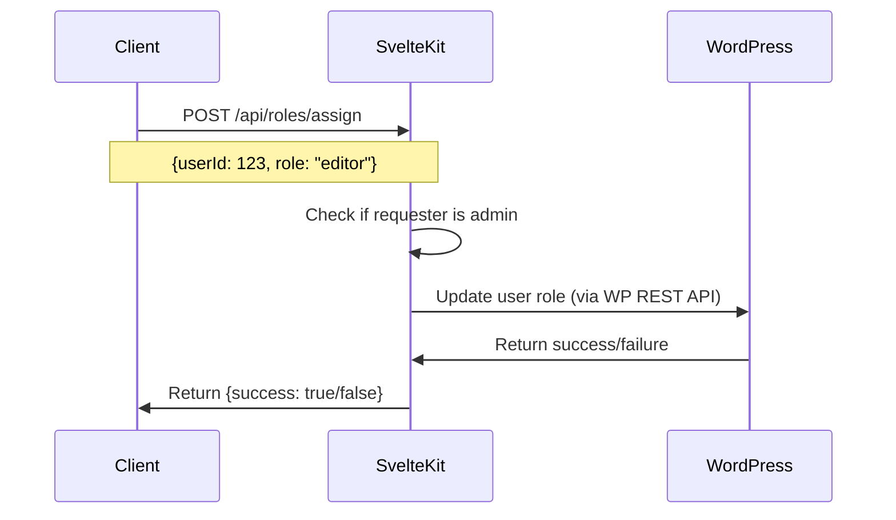

# Roles API Implementation Plan

## Understanding the Current System

From the code review, I can see:

1. The WordPress plugin (`01AA Tributestream API`) has user management functionality with different user types:
   - 'admin' → 'administrator' role
   - 'funeral_director' → 'editor' role
   - 'family_member' → 'author' role
   - 'guest' → 'subscriber' role

2. The SvelteKit application already has authentication endpoints that:
   - Authenticate users against WordPress
   - Store user data in cookies, including roles and capabilities
   - Check authentication status

3. The current system uses JWT tokens for authentication between SvelteKit and WordPress.

## Detailed Implementation Plan

### 1. Create API Endpoint to Check User Roles/Capabilities

We'll create a new endpoint at `/api/roles/check` that will:
- Accept a user ID and a role/capability to check
- Verify if the user has the specified role or capability
- Return a boolean result

### 2. Create API Endpoint to Assign Roles to Users

We'll create a new endpoint at `/api/roles/assign` that will:
- Accept a user ID and a role to assign
- Require administrator privileges to use
- Communicate with WordPress to update the user's role
- Return success/failure status

### 3. Technical Implementation Details

#### 3.1. Role Check Endpoint

Create a new file at `src/routes/api/roles/check/+server.ts`:
- Implement a GET handler that accepts `userId` and `role` or `capability` parameters
- Validate the parameters
- Make a request to WordPress to check the user's roles/capabilities
- Return the result as JSON

#### 3.2. Role Assignment Endpoint

Create a new file at `src/routes/api/roles/assign/+server.ts`:
- Implement a POST handler that accepts `userId` and `role` in the request body
- Verify the requester has admin privileges
- Make a request to WordPress to update the user's role
- Return the result as JSON

#### 3.3. WordPress Plugin Integration

Add a new endpoint to the WordPress plugin to handle role assignments:
- Register a new route at `/funeral/v2/users/(?P<id>\d+)/role`
- Implement permission checks to ensure only admins can assign roles
- Update the user's role in WordPress

### 4. Security Considerations

- Ensure proper authentication for all endpoints
- Implement strict permission checks for role assignment
- Validate all input parameters
- Use HTTPS for all API communications
- Log all role changes for audit purposes

### 5. Testing Strategy

- Unit tests for each endpoint
- Integration tests for the complete flow
- Security testing to ensure proper permission enforcement
- Edge case testing (invalid roles, non-existent users, etc.)

## Implementation Timeline

1. **Day 1**: Set up the WordPress plugin endpoint for role management
2. **Day 2**: Implement the SvelteKit API endpoints
3. **Day 3**: Testing and debugging
4. **Day 4**: Documentation and deployment