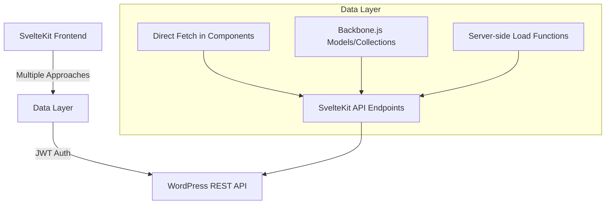
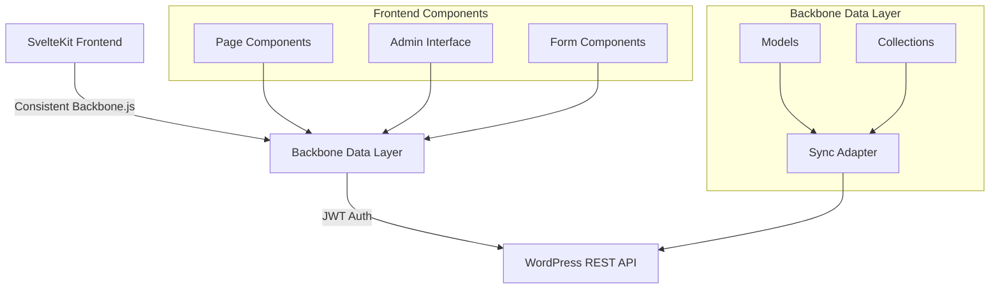

# Simplified Architecture Master Plan

## Introduction

This document outlines a comprehensive plan to simplify the TributeStream architecture while better leveraging Backbone.js for WordPress integration. The plan addresses connectivity with the backend database, routing architecture, and administrative interface for CRUD operations.

## Current Architecture Analysis



### Key Issues Identified

1. **Inconsistent Data Access Patterns**: Multiple approaches to data access
2. **Redundant API Layers**: Unnecessary proxying through SvelteKit endpoints
3. **Complex SSR Handling**: Special handling for Backbone.js in SSR
4. **Authentication Duplication**: Both cookies and localStorage used
5. **Underutilized Backbone.js**: Not fully leveraging Backbone's capabilities

## Proposed Simplified Architecture



## Implementation Plan

### Phase 1: Authentication Consolidation (Days 1-2)

- Refactor auth-service.ts to use cookies as single source of truth
- Simplify token validation in hooks.server.ts
- Update auth-helpers.ts for cookie management
- Remove localStorage references

### Phase 2: Backbone.js Enhancement (Days 3-5)

- Create WordPress-specific sync adapter
- Implement SSR-compatible models
- Add validation and business logic to models
- Create centralized model registry

### Phase 3: API Streamlining (Days 6-8)

- Create direct WordPress API client
- Update server components to use direct client
- Remove redundant API endpoints
- Improve TypeScript interfaces

### Phase 4: Admin Interface Simplification (Days 9-12)

- Create reusable form components with validation
- Implement direct Backbone model binding
- Add real-time preview capabilities
- Simplify routing structure

### Phase 5: Progressive Enhancement (Days 13-14)

- Ensure forms work without JavaScript
- Add client-side enhancements
- Implement proper error handling
- Add accessibility improvements

## Code Examples

### WordPress Sync Adapter

```typescript
// src/lib/backbone/wp-sync-adapter.ts
import Backbone from 'backbone';
import type { SyncOptions } from 'backbone';
import { browser } from '$app/environment';

export function initializeBackboneSync(): void {
  if (!browser) return;
  
  // Store original sync method
  const originalSync = Backbone.sync;
  
  // Replace with custom implementation
  Backbone.sync = function(method: string, model: any, options: SyncOptions = {}) {
    // Set up options for WordPress REST API
    options.credentials = 'include';
    options.headers = {
      ...options.headers,
      'Content-Type': 'application/json'
    };
    
    // Get JWT token from cookie
    const token = document.cookie.match(/jwt_token=([^;]+)/)?.[1];
    if (token) {
      options.headers['Authorization'] = `Bearer ${token}`;
    }
    
    // Call original sync with our modified options
    return originalSync.call(this, method, model, options);
  };
}
```

### Direct WordPress API Client

```typescript
// src/lib/api/wordpress.ts
import type { Tribute } from '$lib/types/wp-models';

const API_BASE = 'https://wp.tributestream.com/wp-json/tributestream/v1';

/**
 * Fetch a single tribute by ID
 */
export async function fetchTribute(id: number, token?: string): Promise<Tribute> {
  const headers: Record<string, string> = {
    'Content-Type': 'application/json'
  };
  
  if (token) {
    headers['Authorization'] = `Bearer ${token}`;
  }
  
  const response = await fetch(`${API_BASE}/tributes/${id}`, { headers });
  
  if (!response.ok) {
    throw new Error(`Failed to fetch tribute: ${response.status}`);
  }
  
  return await response.json();
}
```

### Enhanced Page Server Component

```typescript
// src/routes/tributes/[id]/+page.server.ts
import { error } from '@sveltejs/kit';
import type { PageServerLoad } from './$types';
import { fetchTribute } from '$lib/api/wordpress';
import { getTokenFromCookies } from '$lib/utils/auth-helpers';

export const load: PageServerLoad = async ({ params, cookies }) => {
  try {
    const tributeId = parseInt(params.id);
    
    if (isNaN(tributeId)) {
      throw error(400, 'Invalid tribute ID');
    }
    
    // Get token from cookies
    const token = getTokenFromCookies(cookies);
    
    // Use direct WordPress API client
    const tribute = await fetchTribute(tributeId, token);
    
    return { tribute };
  } catch (err) {
    console.error('Error in load function:', err);
    throw error(500, 'An unexpected error occurred');
  }
};
```

## Benefits

1. **Simplified Data Flow**: Direct connection between frontend and WordPress API
2. **Better Backbone.js Integration**: Properly leverages Backbone for WordPress
3. **Improved Performance**: Reduces redundant API calls and data transformations
4. **Enhanced Developer Experience**: Consistent patterns and clearer architecture
5. **Maintainable Code**: Reduced complexity and better separation of concerns

## Implementation Timeline

1. **Phase 1: Authentication Consolidation** (Days 1-2)
2. **Phase 2: Backbone.js Enhancement** (Days 3-5)
3. **Phase 3: API Streamlining** (Days 6-8)
4. **Phase 4: Admin Interface Simplification** (Days 9-12)
5. **Phase 5: Progressive Enhancement** (Days 13-14)

Total estimated time: 2-3 weeks
