# SvelteKit 5 Best Practices Review Plan

Based on my analysis of your codebase, I can see you're using SvelteKit 5 with a mix of modern and legacy patterns. You've adopted many Svelte 5 runes like `$state`, `$derived`, `$effect`, and `$props`, but there are still areas that need to be updated to fully align with SvelteKit 5 best practices.

This document outlines a comprehensive plan to review your codebase and ensure it follows SvelteKit 5 best practices.

## 1. Current State Assessment

### What's Working Well
- **Runes Adoption**: Many components are using Svelte 5 runes like `$state`, `$derived`, `$effect`, and `$props`
- **TypeScript Integration**: Components are using TypeScript with proper typing for props and state
- **Filesystem-based Routing**: Following SvelteKit's routing structure with `+page.svelte`, `+page.server.ts`, etc.

### Areas Needing Improvement
- **Event Handling**: Still using Svelte 4's `on:click` syntax instead of Svelte 5's `onclick`
- **Event Dispatching**: Using `createEventDispatcher` instead of callback props
- **Potential Reactivity Issues**: Need to verify correct usage of runes and reactivity patterns

## 2. Detailed Review Plan

```mermaid
flowchart TD
    A[Code Review Plan] --> B[Event Handling Audit]
    A --> C[Component Communication Review]
    A --> D[Reactivity Patterns Review]
    A --> E[Route Structure Review]
    A --> F[API Integration Review]
    A --> G[Performance Optimization]
    A --> H[Testing Strategy]
    
    B --> B1[Convert on:event to onclick]
    B --> B2[Implement event modifiers as functions]
    B --> B3[Update event bubbling patterns]
    
    C --> C1[Replace createEventDispatcher with callback props]
    C --> C2[Review component prop patterns]
    C --> C3[Update slot usage to snippets]
    
    D --> D1[Verify $state usage]
    D --> D2[Check $derived dependencies]
    D --> D3[Review $effect cleanup]
    D --> D4[Implement $inspect for debugging]
    
    E --> E1[Review route organization]
    E --> E2[Check load functions]
    E --> E3[Verify form actions]
    
    F --> F1[Review WordPress API integration]
    F --> F2[Check JWT authentication]
    F --> F3[Optimize API request patterns]
    
    G --> G1[Implement code splitting]
    G --> G2[Optimize asset loading]
    G --> G3[Review SSR strategy]
    
    H --> H1[Component testing]
    H --> H2[Integration testing]
    H --> H3[End-to-end testing]
```



## 3. Implementation Strategy

### Phase 1: Event Handling Modernization

1. **Event Syntax Update**
   - Convert all `on:click` to `onclick`, `on:input` to `oninput`, etc.
   - Create utility functions for event modifiers (e.g., `preventDefault`, `once`)
   - Update event delegation patterns

2. **Component Communication Refactoring**
   - Replace all `createEventDispatcher` usage with callback props
   - Update parent components to pass handlers instead of listening for events
   - Implement proper TypeScript typing for callback props

### Phase 2: Reactivity Patterns Optimization

1. **State Management Review**
   - Verify correct usage of `$state` for reactive variables
   - Ensure complex objects use deep reactivity appropriately
   - Check for any remaining Svelte 4 reactivity patterns

2. **Derived State Verification**
   - Review all `$derived` usage to ensure proper dependency tracking
   - Convert any manual derived state calculations to use `$derived`
   - Implement `$derived.by` for complex calculations

3. **Effect Cleanup**
   - Ensure all `$effect` functions with subscriptions or timers have proper cleanup
   - Verify that effects don't modify state directly (to avoid infinite loops)
   - Consider using `$effect.pre` where appropriate

### Phase 3: Route Structure and Data Loading

1. **Route Organization**
   - Review the organization of routes in `src/routes`
   - Ensure proper use of dynamic routes with parameters
   - Check for any redundant or overly complex routing patterns

2. **Load Functions**
   - Review all `load` functions in `+page.js` and `+page.server.js` files
   - Ensure proper separation of server-only and universal code
   - Optimize data loading patterns to minimize client-server roundtrips

3. **Form Actions**
   - Review all form actions in `+page.server.js` files
   - Ensure proper validation and error handling
   - Implement progressive enhancement for forms

### Phase 4: API Integration and Authentication

1. **WordPress API Integration**
   - Review all API endpoint proxies in `/src/routes/api/*`
   - Ensure proper error handling and response parsing
   - Implement caching where appropriate

2. **JWT Authentication**
   - Review JWT token handling and storage
   - Ensure secure token refresh mechanisms
   - Implement proper authorization checks

### Phase 5: Performance Optimization

1. **Code Splitting**
   - Implement dynamic imports for large components
   - Review bundle size and optimize imports
   - Consider using module preloading for critical paths

2. **Asset Loading**
   - Optimize image loading with responsive images
   - Implement lazy loading for below-the-fold content
   - Consider using asset preloading for critical resources

3. **SSR Strategy**
   - Review server-side rendering configuration
   - Implement appropriate hydration strategy
   - Consider using streaming for large pages

### Phase 6: Testing Strategy

1. **Component Testing**
   - Implement unit tests for critical components
   - Ensure proper testing of reactivity patterns
   - Test edge cases for user interactions

2. **Integration Testing**
   - Test component interactions and data flow
   - Verify form submissions and API interactions
   - Test authentication and authorization flows

3. **End-to-End Testing**
   - Implement end-to-end tests for critical user journeys
   - Test across different browsers and devices
   - Verify performance metrics

## 4. Implementation Tools and Resources

1. **Automated Migration Tools**
   - Consider using the Svelte 5 migration tool for automated updates
   - Implement ESLint rules to enforce Svelte 5 patterns
   - Create custom scripts for bulk updates

2. **Documentation and Training**
   - Create internal documentation for Svelte 5 best practices
   - Conduct knowledge sharing sessions for the team
   - Establish code review guidelines for Svelte 5 patterns

3. **Monitoring and Feedback**
   - Implement error tracking to catch runtime issues
   - Set up performance monitoring
   - Establish a feedback loop for user-reported issues

## 5. Timeline and Prioritization

1. **Immediate Priorities (1-2 weeks)**
   - Event handling modernization
   - Critical component communication refactoring
   - Fix any reactivity bugs

2. **Short-term Goals (2-4 weeks)**
   - Complete reactivity patterns optimization
   - Route structure and data loading improvements
   - API integration enhancements

3. **Medium-term Goals (1-2 months)**
   - Performance optimization
   - Testing strategy implementation
   - Documentation and training

4. **Long-term Vision**
   - Continuous improvement process
   - Regular code audits
   - Staying updated with SvelteKit releases

## 6. Success Metrics

1. **Code Quality Metrics**
   - Reduction in legacy patterns
   - Improved code maintainability scores
   - Reduced technical debt

2. **Performance Metrics**
   - Improved Lighthouse scores
   - Reduced bundle sizes
   - Faster page load times

3. **Developer Experience**
   - Reduced development time
   - Fewer bugs related to reactivity
   - Improved code review process

## 7. Specific Code Patterns to Update

### Event Handling

**From:**
```svelte
<button on:click={handleClick}>Click me</button>
```

**To:**
```svelte
<button onclick={handleClick}>Click me</button>
```

### Event Dispatching

**From:**
```svelte
<script>
  import { createEventDispatcher } from 'svelte';
  const dispatch = createEventDispatcher();
  
  function handleClick() {
    dispatch('custom', { data: 'value' });
  }
</script>

<button on:click={handleClick}>Click me</button>
```

**To:**
```svelte
<script>
  let { onCustom } = $props();
  
  function handleClick() {
    onCustom?.({ data: 'value' });
  }
</script>

<button onclick={handleClick}>Click me</button>
```

### Event Modifiers

**From:**
```svelte
<form on:submit|preventDefault={handleSubmit}>
  <!-- form content -->
</form>
```

**To:**
```svelte
<script>
  function preventDefault(fn) {
    return (event) => {
      event.preventDefault();
      fn(event);
    };
  }
</script>

<form onsubmit={preventDefault(handleSubmit)}>
  <!-- form content -->
</form>
```

### Slots to Snippets

**From:**
```svelte
<!-- Parent.svelte -->
<Child>
  <span slot="header">Header Content</span>
  <p>Default slot content</p>
  <div slot="footer">Footer Content</div>
</Child>

<!-- Child.svelte -->
<div>
  <header>
    <slot name="header">Default header</slot>
  </header>
  <main>
    <slot>Default content</slot>
  </main>
  <footer>
    <slot name="footer">Default footer</slot>
  </footer>
</div>
```

**To:**
```svelte
<!-- Parent.svelte -->
<Child>
  {#snippet header()}
    <span>Header Content</span>
  {/snippet}
  
  {#snippet children()}
    <p>Default slot content</p>
  {/snippet}
  
  {#snippet footer()}
    <div>Footer Content</div>
  {/snippet}
</Child>

<!-- Child.svelte -->
<script>
  let { header, children, footer } = $props();
</script>

<div>
  <header>
    {@render header?.() || 'Default header'}
  </header>
  <main>
    {@render children?.() || 'Default content'}
  </main>
  <footer>
    {@render footer?.() || 'Default footer'}
  </footer>
</div>