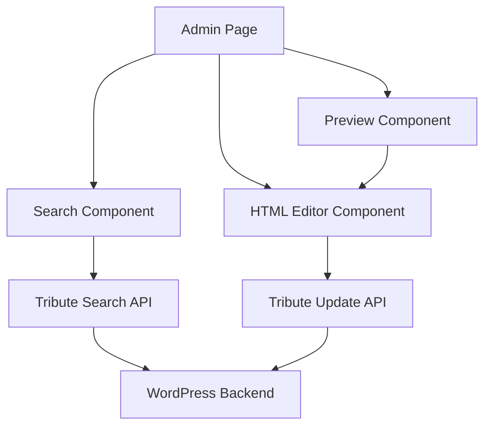

# Tributestream Admin - Tribute HTML Editor Implementation Plan

## Overview

This implementation plan outlines the creation of an admin interface that allows authorized users to:

1. Search for tributes by name
2. View and edit the HTML content of selected tributes
3. Preview how the HTML will render before saving
4. Save changes back to the WordPress backend via the existing API

## Architecture



## Implementation Details

### 1. File Structure

```
TributestreamDev-Version03/src/routes/admin/
├── +layout.svelte         # Admin layout with authentication check
├── +layout.server.ts      # Server-side authentication logic
├── +page.svelte           # Admin dashboard (redirect to tribute-editor)
├── tribute-editor/
│   ├── +page.svelte       # Main tribute editor interface
│   └── +page.ts           # Load function for tribute data
```

### 2. Authentication

We'll use the existing authentication mechanism from the project:
- Check for JWT token in cookies
- Verify admin role
- Redirect to login if not authenticated

### 3. API Endpoints

We need to implement two additional API endpoints:

1. **Search Tributes API**
   - Endpoint: `/api/tributes/search`
   - Method: GET
   - Parameters: `?query=<search term>`
   - Returns: List of tributes matching the search term

2. **Update Tribute HTML API**
   - Endpoint: `/api/tributes/[id]/html`
   - Method: PUT
   - Body: `{ custom_html: "<html content>" }`
   - Returns: Updated tribute object

### 4. Components

#### Admin Layout Component
- Simple layout with header and navigation
- Authentication check
- Consistent styling with the rest of the admin interface

#### Tribute Search Component
- Search input field
- Debounced search to avoid excessive API calls
- Display search results in a simple list
- Allow selecting a tribute to edit

#### HTML Editor Component
- Rich text editor for HTML content
- Toggle between code view and preview
- Save button
- Success/error notifications

#### Preview Component
- Renders the HTML content in a sandboxed iframe
- Updates in real-time as the HTML is edited
- Responsive design to show different viewport sizes
- Toggle between desktop and mobile views

## Technical Implementation

### 1. Admin Layout

```svelte
<!-- src/routes/admin/+layout.svelte -->
<script lang="ts">
  import { onMount } from 'svelte';
  import { goto } from '$app/navigation';
  
  // Check if user is logged in client-side
  onMount(() => {
    const user = document.cookie.includes('jwt_token=');
    if (!user) {
      goto('/login');
    }
  });
</script>

<div class="admin-layout">
  <header class="bg-primary text-white p-4">
    <h1 class="text-2xl font-bold">Tributestream Admin</h1>
  </header>
  
  <div class="flex">
    <aside class="w-64 bg-gray-100 min-h-screen p-4">
      <nav>
        <ul>
          <li class="mb-2"><a href="/admin" class="block p-2 hover:bg-gray-200 rounded">Dashboard</a></li>
          <li class="mb-2"><a href="/admin/tribute-editor" class="block p-2 hover:bg-gray-200 rounded">Tribute Editor</a></li>
        </ul>
      </nav>
    </aside>
    
    <main class="flex-1 p-6">
      <slot />
    </main>
  </div>
</div>
```

### 2. Server-side Authentication

```typescript
// src/routes/admin/+layout.server.ts
import type { LayoutServerLoad } from './$types';
import { redirect } from '@sveltejs/kit';

export const load: LayoutServerLoad = async ({ cookies, fetch }) => {
  const token = cookies.get('jwt_token');
  
  if (!token) {
    throw redirect(302, '/login');
  }
  
  try {
    // Verify user is admin
    const userResponse = await fetch('https://wp.tributestream.com/wp-json/wp/v2/users/me', {
      headers: {
        'Authorization': `Bearer ${token}`
      }
    });
    
    if (!userResponse.ok) {
      throw redirect(302, '/login');
    }
    
    const user = await userResponse.json();
    if (!user.roles.includes('administrator')) {
      throw redirect(302, '/login');
    }
    
    return {
      user
    };
  } catch (error) {
    throw redirect(302, '/login');
  }
};
```

### 3. Tribute Editor Page with Preview

```svelte
<!-- src/routes/admin/tribute-editor/+page.svelte -->
<script lang="ts">
  import { onMount } from 'svelte';
  import { fade } from 'svelte/transition';
  
  // State
  let searchQuery = $state('');
  let searchResults = $state([]);
  let selectedTribute = $state(null);
  let htmlContent = $state('');
  let isLoading = $state(false);
  let isSaving = $state(false);
  let notification = $state({ show: false, message: '', type: 'success' });
  let showPreview = $state(false);
  let previewViewport = $state('desktop'); // 'desktop' or 'mobile'
  
  // Debounced search
  let searchTimeout;
  
  $effect(() => {
    clearTimeout(searchTimeout);
    if (searchQuery.length > 2) {
      isLoading = true;
      searchTimeout = setTimeout(async () => {
        await searchTributes();
      }, 300);
    } else {
      searchResults = [];
    }
  });
  
  // Search tributes
  async function searchTributes() {
    try {
      const response = await fetch(`/api/tributes?search=${encodeURIComponent(searchQuery)}`);
      if (response.ok) {
        const data = await response.json();
        searchResults = data.tributes || [];
      } else {
        showNotification('Failed to search tributes', 'error');
      }
    } catch (error) {
      showNotification('An error occurred while searching', 'error');
    } finally {
      isLoading = false;
    }
  }
  
  // Select tribute
  async function selectTribute(tribute) {
    selectedTribute = tribute;
    isLoading = true;
    
    try {
      const response = await fetch(`/api/tributes/${tribute.id}`);
      if (response.ok) {
        const data = await response.json();
        htmlContent = data.custom_html || '';
      } else {
        showNotification('Failed to load tribute details', 'error');
      }
    } catch (error) {
      showNotification('An error occurred while loading tribute', 'error');
    } finally {
      isLoading = false;
    }
  }
  
  // Save HTML content
  async function saveHtmlContent() {
    if (!selectedTribute) return;
    
    isSaving = true;
    
    try {
      const response = await fetch(`/api/tributes/${selectedTribute.id}/html`, {
        method: 'PUT',
        headers: {
          'Content-Type': 'application/json'
        },
        body: JSON.stringify({ custom_html: htmlContent })
      });
      
      if (response.ok) {
        showNotification('Tribute HTML saved successfully', 'success');
      } else {
        showNotification('Failed to save tribute HTML', 'error');
      }
    } catch (error) {
      showNotification('An error occurred while saving', 'error');
    } finally {
      isSaving = false;
    }
  }
  
  // Toggle preview
  function togglePreview() {
    showPreview = !showPreview;
  }
  
  // Toggle preview viewport
  function toggleViewport() {
    previewViewport = previewViewport === 'desktop' ? 'mobile' : 'desktop';
  }
  
  // Show notification
  function showNotification(message, type = 'success') {
    notification = { show: true, message, type };
    setTimeout(() => {
      notification = { ...notification, show: false };
    }, 3000);
  }
</script>

<svelte:head>
  <title>Tribute HTML Editor</title>
</svelte:head>

<div class="container mx-auto">
  <h1 class="text-2xl font-bold mb-6">Tribute HTML Editor</h1>
  
  <!-- Search Section -->
  <div class="mb-8">
    <div class="flex items-center mb-4">
      <input
        type="text"
        bind:value={searchQuery}
        placeholder="Search tributes by name..."
        class="p-2 border rounded w-full max-w-md"
      />
      {#if isLoading && searchQuery.length > 2}
        <div class="ml-2">Loading...</div>
      {/if}
    </div>
    
    {#if searchResults.length > 0}
      <div class="bg-white shadow rounded p-4 max-h-60 overflow-y-auto">
        <ul>
          {#each searchResults as tribute}
            <li>
              <button
                on:click={() => selectTribute(tribute)}
                class="w-full text-left p-2 hover:bg-gray-100 rounded {selectedTribute?.id === tribute.id ? 'bg-blue-100' : ''}"
              >
                {tribute.loved_one_name}
              </button>
            </li>
          {/each}
        </ul>
      </div>
    {:else if searchQuery.length > 2 && !isLoading}
      <div class="text-gray-500">No tributes found matching "{searchQuery}"</div>
    {/if}
  </div>
  
  <!-- Editor Section -->
  {#if selectedTribute}
    <div class="bg-white shadow rounded p-6">
      <h2 class="text-xl font-semibold mb-4">Editing: {selectedTribute.loved_one_name}</h2>
      
      <!-- Editor/Preview Toggle -->
      <div class="flex justify-between mb-4">
        <div class="flex space-x-2">
          <button
            on:click={togglePreview}
            class="px-3 py-1 rounded border {!showPreview ? 'bg-blue-100 border-blue-300' : 'bg-gray-100'}"
          >
            {showPreview ? 'Edit HTML' : 'Code View'}
          </button>
          
          {#if showPreview}
            <button
              on:click={toggleViewport}
              class="px-3 py-1 rounded border bg-gray-100"
            >
              {previewViewport === 'desktop' ? 'Desktop View' : 'Mobile View'}
            </button>
          {/if}
        </div>
        
        <button
          on:click={saveHtmlContent}
          disabled={isSaving}
          class="bg-primary text-white px-4 py-2 rounded hover:bg-primary-dark disabled:opacity-50"
        >
          {isSaving ? 'Saving...' : 'Save Changes'}
        </button>
      </div>
      
      <!-- Editor/Preview Content -->
      <div class="border rounded">
        {#if showPreview}
          <div class="p-4 bg-gray-50">
            <div class="{previewViewport === 'mobile' ? 'max-w-sm mx-auto border shadow-md' : 'w-full'}">
              <iframe
                title="HTML Preview"
                srcdoc={htmlContent}
                class="w-full min-h-[500px] border-0"
                sandbox="allow-same-origin"
              ></iframe>
            </div>
          </div>
        {:else}
          <textarea
            bind:value={htmlContent}
            class="w-full h-96 p-3 border-0 font-mono text-sm"
            placeholder="Enter HTML content here..."
          ></textarea>
        {/if}
      </div>
    </div>
  {:else if searchQuery.length > 0}
    <div class="bg-gray-100 p-6 rounded text-center">
      <p>Select a tribute from the search results to edit its HTML content</p>
    </div>
  {:else}
    <div class="bg-gray-100 p-6 rounded text-center">
      <p>Search for a tribute by name to get started</p>
    </div>
  {/if}
  
  <!-- Notification -->
  {#if notification.show}
    <div
      transition:fade
      class="fixed bottom-4 right-4 p-4 rounded shadow-lg {notification.type === 'success' ? 'bg-green-500' : 'bg-red-500'} text-white"
    >
      {notification.message}
    </div>
  {/if}
</div>
```

### 4. API Endpoint for HTML Update

```typescript
// src/routes/api/tributes/[id]/html/+server.ts
import { json } from '@sveltejs/kit';
import type { RequestHandler } from './$types';

export const PUT: RequestHandler = async ({ params, request, fetch, cookies }) => {
  try {
    const id = params.id;
    const { custom_html } = await request.json();
    
    // Get auth token from cookies
    const token = cookies.get('jwt_token');
    if (!token) {
      return json({ error: true, message: 'Authentication required', status: 401 }, { status: 401 });
    }
    
    // Forward request to WordPress API
    const response = await fetch(`https://wp.tributestream.com/wp-json/tributestream/v1/tributes/${id}/html`, {
      method: 'PUT',
      headers: {
        'Content-Type': 'application/json',
        'Authorization': `Bearer ${token}`
      },
      body: JSON.stringify({ custom_html })
    });
    
    const responseData = await response.json();
    
    if (!response.ok) {
      return json({
        error: true,
        message: responseData.message || 'Failed to update tribute HTML',
        status: response.status
      }, { status: response.status });
    }
    
    return json(responseData);
  } catch (error) {
    return json({
      error: true,
      message: error instanceof Error ? error.message : 'An unexpected error occurred',
      status: 500
    }, { status: 500 });
  }
};
```

## Preview Feature Details

The preview feature allows administrators to see how the HTML content will render before saving changes. Key aspects of this feature include:

1. **Toggle Between Edit and Preview Modes**
   - A button to switch between HTML editing and preview
   - Maintains the same content between modes

2. **Responsive Preview**
   - Desktop view (full width)
   - Mobile view (constrained width)
   - Toggle button to switch between viewport sizes

3. **Sandboxed Rendering**
   - Uses an iframe with sandbox attributes for security
   - Real-time updates as HTML is edited

4. **Implementation Considerations**
   - The preview uses a sandboxed iframe to prevent any scripts in the HTML from affecting the admin page
   - The preview updates in real-time as the HTML content changes
   - The mobile view simulates how the content would appear on smaller screens

## Considerations and Enhancements

1. **HTML Editor Improvements**:
   - Consider using a rich text editor like TinyMCE or CKEditor for a better editing experience
   - Add HTML validation to prevent broken markup
   - Add syntax highlighting for better code readability

2. **Security**:
   - Ensure proper sanitization of HTML content to prevent XSS attacks
   - Implement proper CSRF protection
   - Validate user permissions for each tribute

3. **User Experience**:
   - Add confirmation before discarding unsaved changes
   - Implement auto-save functionality
   - Add keyboard shortcuts for common actions

4. **Performance**:
   - Implement pagination for search results if there are many tributes
   - Add caching for frequently accessed tributes
   - Optimize API calls to reduce latency

## Implementation Steps

1. Create the admin layout files
2. Implement the server-side authentication logic
3. Create the tribute editor page with search functionality
4. Implement the HTML editor component with preview toggle
5. Create the API endpoint for updating tribute HTML
6. Test the implementation thoroughly
7. Deploy to production

## Conclusion

This implementation plan provides a comprehensive approach to creating an admin interface for editing tribute HTML content with a preview feature. The plan leverages existing authentication mechanisms and API endpoints while adding new functionality to enhance the user experience.