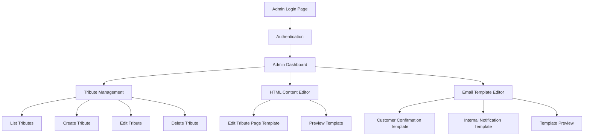
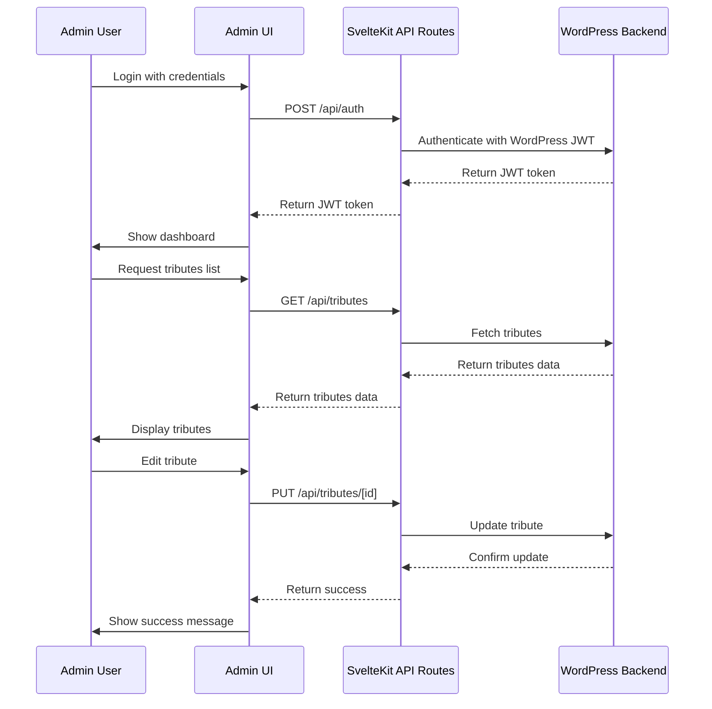

# Tributestream Admin Interface Implementation Plan

## Overview

We'll create a dedicated admin interface for Tributestream that allows administrators to manage tributes, edit HTML content for tribute pages, and modify email templates. The admin interface will be separate from the public-facing site, with its own login page using JWT authentication.

## Architecture



## Component Structure

```mermaid
graph TD
    A[src/routes/admin] --> B[+layout.svelte]
    A --> C[+page.svelte]
    A --> D[+layout.server.ts]
    A --> E[login/+page.svelte]
    A --> F[login/+page.server.ts]
    A --> G[tributes/]
    A --> H[html-content/]
    A --> I[email-templates/]
    
    G --> G1[+page.svelte]
    G --> G2[+page.server.ts]
    G --> G3[[id]/+page.svelte]
    G --> G4[[id]/+page.server.ts]
    
    H --> H1[+page.svelte]
    H --> H2[+page.server.ts]
    
    I --> I1[+page.svelte]
    I --> I2[+page.server.ts]
    I --> I3[[template-id]/+page.svelte]
    I --> I4[[template-id]/+page.server.ts]
```

## Data Flow



## Implementation Plan

### 1. Authentication System

1. Create admin login page at `/admin/login`
2. Implement JWT authentication using the existing WordPress JWT endpoint
3. Store JWT token in secure cookies or localStorage
4. Create authentication guards for admin routes
5. Implement session timeout and refresh token functionality

### 2. Admin Layout and Dashboard

1. Create a responsive admin layout with sidebar navigation
2. Implement dashboard with overview statistics
3. Add navigation links to different admin sections
4. Include user profile and logout functionality

### 3. Tribute Management

1. Create tributes list page with search and filtering
2. Implement tribute creation form
3. Build tribute editing interface
4. Add tribute deletion with confirmation
5. Connect to existing API endpoints for CRUD operations

### 4. HTML Content Editor

1. Create HTML editor component with code/visual toggle
2. Implement template variable support using {{variable_name}} syntax
3. Add preview functionality
4. Create save/publish workflow
5. Implement error handling and validation

### 5. Email Template Editor

1. Create email template editor with variable support
2. Implement template preview functionality
3. Create separate editors for customer confirmation and internal notification templates
4. Add template version history (if needed)
5. Connect to API endpoints for saving templates

### 6. API Endpoints

1. Extend existing API endpoints or create new ones as needed
2. Implement proper authentication and authorization checks
3. Create endpoints for HTML content and email template management
4. Ensure proper error handling and validation

### 7. UI Components

1. Create reusable UI components for forms, tables, and editors
2. Implement responsive design for all admin pages
3. Use Tailwind CSS for styling
4. Add loading states and error handling
5. Implement toast notifications for user feedback

## Technical Specifications

### Authentication

- Use JWT tokens for authentication
- Store tokens securely in HTTP-only cookies
- Implement token refresh mechanism
- Add authentication guards to protect admin routes

### Frontend

- Use SvelteKit for routing and server-side rendering
- Implement Svelte 5 runes for state management
- Use Tailwind CSS for styling
- Create reusable components for common UI elements
- Implement responsive design for all admin pages

### Backend

- Leverage existing API endpoints where possible
- Create new API endpoints as needed
- Implement proper error handling and validation
- Use SvelteKit's server-side capabilities for data fetching and processing

### HTML/Email Editor

- Implement a simple HTML editor with code/visual toggle
- Add support for template variables using {{variable_name}} syntax
- Create preview functionality
- Implement syntax highlighting for code view

## Implementation Timeline

1. **Week 1**: Setup admin routes, authentication, and basic layout
2. **Week 2**: Implement tribute management features
3. **Week 3**: Create HTML content editor and preview functionality
4. **Week 4**: Build email template editor and connect to API endpoints
5. **Week 5**: Testing, bug fixes, and refinements

## Required API Endpoints

1. **Authentication**
   - POST `/api/auth` - Authenticate admin user
   - POST `/api/auth/logout` - Logout admin user

2. **Tributes**
   - GET `/api/tributes` - Get list of tributes with pagination and filtering
   - GET `/api/tributes/[id]` - Get single tribute details
   - POST `/api/tributes` - Create new tribute
   - PUT `/api/tributes/[id]` - Update existing tribute
   - DELETE `/api/tributes/[id]` - Delete tribute

3. **HTML Content**
   - GET `/api/html-templates/[id]` - Get HTML template
   - PUT `/api/html-templates/[id]` - Update HTML template
   - POST `/api/html-templates/preview` - Generate preview of HTML template

4. **Email Templates**
   - GET `/api/email-templates` - Get list of email templates
   - GET `/api/email-templates/[id]` - Get single email template
   - PUT `/api/email-templates/[id]` - Update email template
   - POST `/api/email-templates/preview` - Generate preview of email template

## Security Considerations

1. Implement proper authentication and authorization
2. Validate all user inputs
3. Sanitize HTML content to prevent XSS attacks
4. Use CSRF protection for forms
5. Implement rate limiting for login attempts
6. Ensure secure storage of JWT tokens

## Testing Strategy

1. Unit tests for critical components and functions
2. Integration tests for API endpoints
3. End-to-end tests for critical user flows
4. Manual testing of UI components and responsive design
5. Security testing for authentication and authorization