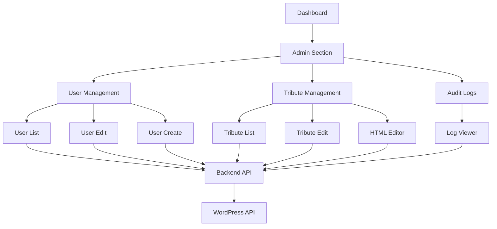

# Comprehensive Administrative Interface Implementation Plan

## Overview

This plan outlines the implementation of a comprehensive administrative interface using Backbone.js integrated with the current SvelteKit application. The interface will provide administrators with powerful tools to manage both user data and tribute content with a modern, user-friendly interface similar to phpMyAdmin but with enhanced usability.

The administrative interface will be integrated into the existing dashboard structure and will provide:

1. User management capabilities (view, edit, create, delete)
2. Enhanced tribute management with HTML editing capabilities
3. Simple role-based access control (admin role)
4. Audit logging for all administrative actions
5. Modern, intuitive UI with sortable tables and inline editing

## Architecture



## Implementation Plan

### 1. Backend API Enhancements

#### 1.1 User Management API

Create or extend API endpoints for user management:

- `GET /api/users` - List all users with pagination, sorting, and filtering
- `GET /api/users/:id` - Get a specific user's details
- `PUT /api/users/:id` - Update a user's information
- `POST /api/users` - Create a new user
- `DELETE /api/users/:id` - Delete a user

#### 1.2 Tribute HTML Management API

Extend the existing tribute API to handle HTML content:

- `GET /api/tributes/:id/html` - Get the HTML content of a tribute
- `PUT /api/tributes/:id/html` - Update the HTML content of a tribute

#### 1.3 Audit Logging API

Create API endpoints for audit logging:

- `POST /api/audit-logs` - Create a new audit log entry
- `GET /api/audit-logs` - List audit logs with pagination, sorting, and filtering

### 2. Backbone Model & Collection Enhancements

#### 2.1 User Model & Collection

Extend the existing `UserModel` and `UsersCollection` to support the new admin features:

```typescript
// Enhanced UserModel with admin-specific methods
export const AdminUserModel = UserModel.extend({
  // Additional validation for admin operations
  validateAdmin: function(attrs) {
    // Implement admin-specific validation
  },
  
  // Save with audit logging
  saveWithAudit: async function(attrs, options) {
    // Save and create audit log entry
  }
});

// Enhanced UsersCollection with admin-specific methods
export const AdminUsersCollection = UsersCollection.extend({
  // Additional methods for admin operations
});
```

#### 2.2 Tribute HTML Model

Create a new model for managing tribute HTML content:

```typescript
export const TributeHtmlModel = BackboneImpl.Model?.extend({
  urlRoot: function() {
    return `/api/tributes/${this.get('tribute_id')}/html`;
  },
  
  // Save with audit logging
  saveWithAudit: async function(attrs, options) {
    // Save and create audit log entry
  }
});
```

#### 2.3 Audit Log Model & Collection

Create new models for audit logging:

```typescript
export const AuditLogModel = BackboneImpl.Model?.extend({
  urlRoot: '/api/audit-logs',
  
  defaults: {
    timestamp: new Date().toISOString(),
    user_id: null,
    action: '',
    entity_type: '',
    entity_id: null,
    changes: {}
  }
});

export const AuditLogsCollection = BackboneImpl.Collection?.extend({
  model: AuditLogModel,
  url: '/api/audit-logs'
});
```

### 3. Frontend Components

#### 3.1 Admin Dashboard Integration

Update the sidebar to include admin section:

```svelte
<!-- Updated sidebar.svelte -->
<script lang="ts">
  import { page } from '$app/stores';
  import { authStore } from '$lib/services/auth-service';
  
  // Navigation items
  const navItems = [
    // Existing items...
    
    // Admin section - only visible to admins
    ...(($authStore.user?.roles || []).includes('administrator') ? [
      { 
        label: 'Admin', 
        href: '/dashboard/admin', 
        icon: '⚙️',
        active: (path: string) => path.startsWith('/dashboard/admin') 
      }
    ] : [])
  ];
</script>
```

#### 3.2 Admin Landing Page

Create a new admin landing page:

```svelte
<!-- /dashboard/admin/+page.svelte -->
<script lang="ts">
  import { onMount } from 'svelte';
  import { goto } from '$app/navigation';
  import { authStore } from '$lib/services/auth-service';
  
  // Check admin access
  onMount(async () => {
    if (!$authStore.isAuthenticated) {
      goto('/login?redirect=/dashboard/admin');
      return;
    }
    
    // Check if user has admin role
    if (!($authStore.user?.roles || []).includes('administrator')) {
      goto('/dashboard');
    }
  });
</script>

<svelte:head>
  <title>Admin Dashboard | TributeStream</title>
</svelte:head>

<div class="admin-dashboard">
  <h1>Admin Dashboard</h1>
  
  <div class="admin-cards">
    <div class="admin-card" on:click={() => goto('/dashboard/admin/users')}>
      <h2>User Management</h2>
      <p>Manage user accounts, roles, and permissions</p>
    </div>
    
    <div class="admin-card" on:click={() => goto('/dashboard/admin/tributes')}>
      <h2>Tribute Management</h2>
      <p>Manage tributes and their HTML content</p>
    </div>
    
    <div class="admin-card" on:click={() => goto('/dashboard/admin/audit-logs')}>
      <h2>Audit Logs</h2>
      <p>View system activity and changes</p>
    </div>
  </div>
</div>
```

#### 3.3 User Management Components

Create components for user management:

1. User List Component
2. User Edit Component
3. User Create Component

#### 3.4 Enhanced Tribute Management Components

Create components for enhanced tribute management:

1. Admin Tribute List Component
2. Tribute HTML Editor Component

#### 3.5 Audit Log Components

Create components for audit logging:

1. Audit Log List Component
2. Audit Log Detail Component

### 4. Routes Structure

```
/dashboard/admin/
  +page.svelte                 # Admin landing page
  +layout.svelte               # Admin layout with access control
  
  /users/
    +page.svelte               # User list
    /new/
      +page.svelte             # Create new user
    /[id]/
      +page.svelte             # User details
      /edit/
        +page.svelte           # Edit user
  
  /tributes/
    +page.svelte               # Admin tribute list
    /[id]/
      +page.svelte             # Tribute details
      /edit/
        +page.svelte           # Edit tribute
      /html/
        +page.svelte           # Edit tribute HTML
  
  /audit-logs/
    +page.svelte               # Audit log list
    /[id]/
      +page.svelte             # Audit log details
```

### 5. API Implementation

#### 5.1 User Management API

Implement the user management API endpoints:

```typescript
// /api/users/+server.ts
import { json } from '@sveltejs/kit';
import type { RequestHandler } from './$types';
import { getTokenFromCookie } from '$lib/utils/cookie-auth';

export const GET: RequestHandler = async ({ request, cookies, url }) => {
  // Implementation for listing users
};

export const POST: RequestHandler = async ({ request, cookies }) => {
  // Implementation for creating a user
};
```

```typescript
// /api/users/[id]/+server.ts
import { json } from '@sveltejs/kit';
import type { RequestHandler } from './$types';
import { getTokenFromCookie } from '$lib/utils/cookie-auth';

export const GET: RequestHandler = async ({ params, cookies }) => {
  // Implementation for getting a user
};

export const PUT: RequestHandler = async ({ params, request, cookies }) => {
  // Implementation for updating a user
};

export const DELETE: RequestHandler = async ({ params, cookies }) => {
  // Implementation for deleting a user
};
```

#### 5.2 Tribute HTML API

Implement the tribute HTML API endpoints:

```typescript
// /api/tributes/[id]/html/+server.ts
import { json } from '@sveltejs/kit';
import type { RequestHandler } from './$types';
import { getTokenFromCookie } from '$lib/utils/cookie-auth';

export const GET: RequestHandler = async ({ params, cookies }) => {
  // Implementation for getting tribute HTML
};

export const PUT: RequestHandler = async ({ params, request, cookies }) => {
  // Implementation for updating tribute HTML
};
```

#### 5.3 Audit Log API

Implement the audit log API endpoints:

```typescript
// /api/audit-logs/+server.ts
import { json } from '@sveltejs/kit';
import type { RequestHandler } from './$types';
import { getTokenFromCookie } from '$lib/utils/cookie-auth';

export const GET: RequestHandler = async ({ request, cookies, url }) => {
  // Implementation for listing audit logs
};

export const POST: RequestHandler = async ({ request, cookies }) => {
  // Implementation for creating an audit log
};
```

```typescript
// /api/audit-logs/[id]/+server.ts
import { json } from '@sveltejs/kit';
import type { RequestHandler } from './$types';
import { getTokenFromCookie } from '$lib/utils/cookie-auth';

export const GET: RequestHandler = async ({ params, cookies }) => {
  // Implementation for getting an audit log
};
```

### 6. UI Components

#### 6.1 Data Tables

Create a reusable data table component with sorting, filtering, and pagination:

```svelte
<!-- /lib/components/admin/data-table.svelte -->
<script lang="ts">
  export let data = [];
  export let columns = [];
  export let sortable = true;
  export let filterable = true;
  export let paginated = true;
  export let itemsPerPage = 10;
  
  // Sorting logic
  let sortField = '';
  let sortDirection = 'asc';
  
  // Filtering logic
  let filters = {};
  
  // Pagination logic
  let currentPage = 1;
  
  // Computed properties for filtered, sorted, and paginated data
  $: filteredData = applyFilters(data, filters);
  $: sortedData = applySort(filteredData, sortField, sortDirection);
  $: paginatedData = applyPagination(sortedData, currentPage, itemsPerPage);
  $: totalPages = Math.ceil(filteredData.length / itemsPerPage);
  
  // Functions for filtering, sorting, and pagination
  function applyFilters(data, filters) {
    // Implementation
  }
  
  function applySort(data, field, direction) {
    // Implementation
  }
  
  function applyPagination(data, page, itemsPerPage) {
    // Implementation
  }
  
  function handleSort(field) {
    // Implementation
  }
  
  function handleFilter(field, value) {
    // Implementation
  }
  
  function goToPage(page) {
    // Implementation
  }
</script>

<div class="data-table">
  <!-- Table header with sorting and filtering -->
  <div class="table-header">
    <!-- Implementation -->
  </div>
  
  <!-- Table body -->
  <div class="table-body">
    <!-- Implementation -->
  </div>
  
  <!-- Pagination controls -->
  {#if paginated && totalPages > 1}
    <div class="pagination">
      <!-- Implementation -->
    </div>
  {/if}
</div>
```

#### 6.2 Inline Editing

Create a reusable inline editing component:

```svelte
<!-- /lib/components/admin/inline-edit.svelte -->
<script lang="ts">
  export let value;
  export let onSave;
  export let type = 'text';
  export let options = [];
  
  let editing = false;
  let editValue = value;
  
  function startEdit() {
    editing = true;
    editValue = value;
  }
  
  function cancelEdit() {
    editing = false;
  }
  
  async function saveEdit() {
    try {
      await onSave(editValue);
      value = editValue;
      editing = false;
    } catch (error) {
      console.error('Error saving:', error);
      // Handle error
    }
  }
</script>

<div class="inline-edit">
  {#if editing}
    <!-- Edit mode -->
    {#if type === 'text'}
      <input type="text" bind:value={editValue} />
    {:else if type === 'textarea'}
      <textarea bind:value={editValue}></textarea>
    {:else if type === 'select'}
      <select bind:value={editValue}>
        {#each options as option}
          <option value={option.value}>{option.label}</option>
        {/each}
      </select>
    {/if}
    
    <div class="actions">
      <button on:click={saveEdit}>Save</button>
      <button on:click={cancelEdit}>Cancel</button>
    </div>
  {:else}
    <!-- Display mode -->
    <div class="display-value" on:click={startEdit}>
      {#if type === 'select'}
        {options.find(o => o.value === value)?.label || value}
      {:else}
        {value}
      {/if}
    </div>
  {/if}
</div>
```

#### 6.3 HTML Editor

Implement an HTML editor component using a library like TinyMCE or CKEditor:

```svelte
<!-- /lib/components/admin/html-editor.svelte -->
<script lang="ts">
  import { onMount, onDestroy } from 'svelte';
  
  export let value = '';
  export let onChange = (newValue) => {};
  
  let editor;
  let editorElement;
  
  onMount(() => {
    // Initialize editor (e.g., TinyMCE)
    // This is just a placeholder - actual implementation will depend on the chosen editor
    editor = window.tinymce.init({
      target: editorElement,
      plugins: 'code table lists link image',
      toolbar: 'undo redo | formatselect | bold italic | alignleft aligncenter alignright | bullist numlist | link image | code',
      height: 500,
      setup: (ed) => {
        ed.on('change', () => {
          value = ed.getContent();
          onChange(value);
        });
      },
      init_instance_callback: (ed) => {
        ed.setContent(value);
      }
    });
  });
  
  onDestroy(() => {
    // Clean up editor
    if (editor) {
      window.tinymce.remove(editor);
    }
  });
  
  // Update editor content when value changes externally
  $: if (editor && editor.setContent && value !== editor.getContent()) {
    editor.setContent(value);
  }
</script>

<div bind:this={editorElement}></div>
```

### 7. Audit Logging Implementation

#### 7.1 Audit Log Service

Create a service for audit logging:

```typescript
// /lib/services/audit-log-service.ts
import { AuditLogModel } from '$lib/models/wp-backbone';
import { authStore } from './auth-service';

export const auditLogService = {
  /**
   * Log an action
   */
  logAction: async (action: string, entityType: string, entityId: number | string, changes: any = {}) => {
    try {
      const user = authStore.user;
      
      if (!user) {
        console.error('Cannot log action: No authenticated user');
        return;
      }
      
      const auditLog = new AuditLogModel({
        user_id: user.id,
        action,
        entity_type: entityType,
        entity_id: entityId,
        changes: JSON.stringify(changes),
        timestamp: new Date().toISOString()
      });
      
      await auditLog.save();
      
      return auditLog.toJSON();
    } catch (error) {
      console.error('Error logging action:', error);
      throw error;
    }
  },
  
  /**
   * Get audit logs
   */
  getAuditLogs: async (params = {}) => {
    // Implementation
  }
};
```

#### 7.2 Integration with Models

Integrate audit logging with model operations:

```typescript
// Example integration with UserModel
saveWithAudit: async function(attrs, options) {
  // Get original attributes for comparison
  const originalAttrs = this.toJSON();
  
  // Save the model
  await this.save(attrs, options);
  
  // Calculate changes
  const changes = {};
  for (const key in attrs) {
    if (originalAttrs[key] !== attrs[key]) {
      changes[key] = {
        from: originalAttrs[key],
        to: attrs[key]
      };
    }
  }
  
  // Log the action
  await auditLogService.logAction(
    this.isNew() ? 'create' : 'update',
    'user',
    this.id,
    changes
  );
  
  return this.toJSON();
}
```

### 8. Role-Based Access Control

#### 8.1 Access Control Service

Create a service for role-based access control:

```typescript
// /lib/services/access-control-service.ts
import { authStore } from './auth-service';

export const accessControlService = {
  /**
   * Check if the current user has admin access
   */
  hasAdminAccess: () => {
    const user = authStore.user;
    
    if (!user) {
      return false;
    }
    
    // Check if user has administrator role
    return (user.roles || []).includes('administrator');
  },
  
  /**
   * Check if the current user can access a specific resource
   */
  canAccess: (resource: string, action: string) => {
    // For MVP, simply check if user is an admin
    return accessControlService.hasAdminAccess();
  }
};
```

#### 8.2 Admin Layout with Access Control

Create an admin layout with access control:

```svelte
<!-- /dashboard/admin/+layout.svelte -->
<script lang="ts">
  import { onMount } from 'svelte';
  import { goto } from '$app/navigation';
  import { authStore } from '$lib/services/auth-service';
  import { accessControlService } from '$lib/services/access-control-service';
  
  let loading = true;
  
  onMount(async () => {
    // Check authentication
    if (!$authStore.isAuthenticated) {
      const isAuthenticated = await authStore.checkAuth();
      
      if (!isAuthenticated) {
        goto('/login?redirect=/dashboard/admin');
        return;
      }
    }
    
    // Check admin access
    if (!accessControlService.hasAdminAccess()) {
      goto('/dashboard');
      return;
    }
    
    loading = false;
  });
</script>

{#if loading}
  <div class="loading">
    <p>Loading...</p>
  </div>
{:else}
  <div class="admin-layout">
    <div class="admin-header">
      <h1>Admin Dashboard</h1>
      <nav class="admin-nav">
        <a href="/dashboard/admin/users" class:active={$page.url.pathname.startsWith('/dashboard/admin/users')}>Users</a>
        <a href="/dashboard/admin/tributes" class:active={$page.url.pathname.startsWith('/dashboard/admin/tributes')}>Tributes</a>
        <a href="/dashboard/admin/audit-logs" class:active={$page.url.pathname.startsWith('/dashboard/admin/audit-logs')}>Audit Logs</a>
      </nav>
    </div>
    
    <div class="admin-content">
      <slot />
    </div>
  </div>
{/if}
```

## Implementation Timeline

The implementation can be broken down into the following phases:

### Phase 1: Foundation (Week 1)
- Set up admin routes and basic layout
- Implement role-based access control
- Create reusable UI components (data table, inline editing)

### Phase 2: User Management (Week 2)
- Implement user management API endpoints
- Create user management UI components
- Implement audit logging for user operations

### Phase 3: Tribute Management (Week 3)
- Implement tribute HTML API endpoints
- Create enhanced tribute management UI components
- Implement HTML editor integration
- Implement audit logging for tribute operations

### Phase 4: Audit Logging & Refinement (Week 4)
- Implement audit log API endpoints
- Create audit log UI components
- Refine UI/UX based on testing
- Implement any missing features

## Technical Considerations

1. **Performance**: The admin interface will handle potentially large datasets, so pagination, lazy loading, and efficient data fetching are crucial.

2. **Security**: Implement proper authentication and authorization checks on all admin routes and API endpoints.

3. **Error Handling**: Implement comprehensive error handling and user feedback for all admin operations.

4. **Responsive Design**: Ensure the admin interface works well on different screen sizes.

5. **Accessibility**: Maintain accessibility standards throughout the admin interface.

## Conclusion

This implementation plan provides a comprehensive approach to creating an administrative interface that meets all the specified requirements. The plan leverages the existing Backbone.js architecture while integrating it seamlessly with the SvelteKit frontend.

The resulting admin interface will provide a modern, user-friendly experience for administrators to manage users and tributes, with proper audit logging to track all changes.