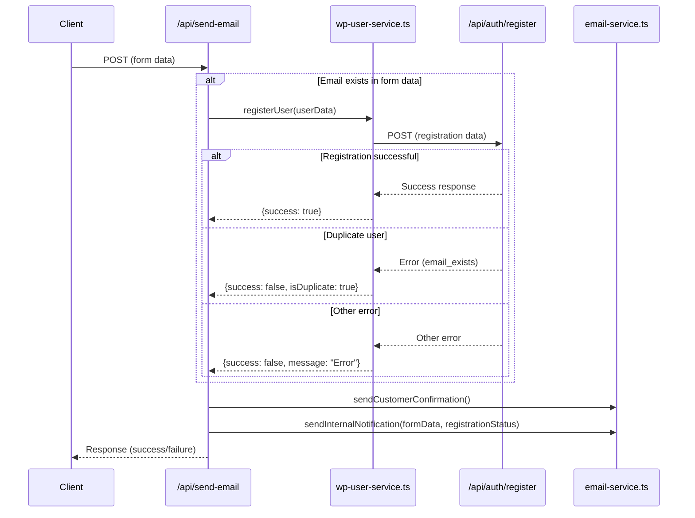

# Graceful WordPress Registration Error Handling

## Overview
This implementation allows duplicate users to submit forms successfully and trigger the email service, while documenting registration issues in admin emails.

## Key Components

### 1. WordPress User Registration Helper
- Create a helper function in `src/lib/server/wp-user-service.ts`
- Use the existing registration endpoint at `/api/auth/register`
- Handle different registration outcomes (success, duplicate user, other errors)
- Return structured response with status information

### 2. Email Service Update
- Modify `sendInternalNotification` in `src/lib/utils/email-service.ts` to accept registration status
- Include registration status only in internal admin emails, not customer emails
- Add a dedicated section in the email template for registration status

### 3. Email API Endpoint Integration
- Update `src/routes/api/send-email/+server.ts` to integrate registration logic
- Always attempt registration for submissions with email addresses
- Continue email process regardless of registration outcome
- Include registration status in API response

## Implementation Flow

## Benefits
- Improved user experience: Duplicate users can still submit forms
- Better admin visibility: Registration status documented in internal emails
- Graceful error handling: System continues to function even when registration fails
- Modular design: Registration logic encapsulated in a separate service
