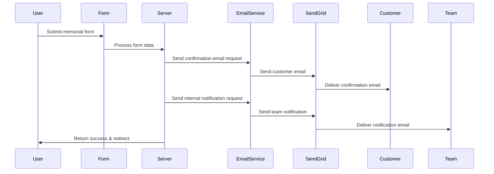
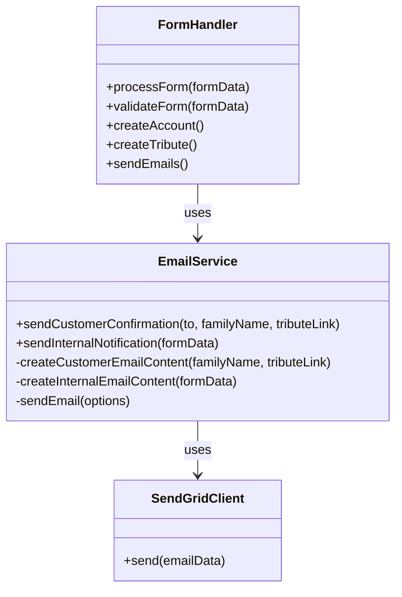

# SendGrid Dual Email Notification System for Form Submissions

## Overview
This document outlines the implementation plan for an automated dual email notification system using SendGrid. The system will send two distinct emails upon form submission:
1. A personalized confirmation email to the customer with branding and specific text
2. An internal notification email to the company team containing all form data

## Current System Analysis

- The application is built with SvelteKit and TypeScript
- Form data is collected through the Memorial Information Form (`/fd-form/`)
- SendGrid packages are already installed (`@sendgrid/mail` v8.1.4)
- The application currently attempts to send emails through a non-existent `/api/send-email` endpoint
- The SendGrid API key is already configured as environment variable `SENDGRID_API_KEY`

## Implementation Architecture

### Email Flow Diagram



### Component Diagram



## Detailed Implementation Plan

### 1. Create Email Service Module

Create a reusable email service to handle all email-related functionality:

**File: `src/lib/utils/email-service.ts`**

```typescript
import { SENDGRID_API_KEY } from '$env/static/private';
import sgMail from '@sendgrid/mail';

// Define interfaces for type safety
interface EmailOptions {
  to: string;
  subject: string;
  html: string;
  text?: string;
}

interface CustomerEmailData {
  familyLastName: string;
  tributeLink: string; 
}

// Initialize SendGrid with API key
sgMail.setApiKey(SENDGRID_API_KEY);

/**
 * Send a confirmation email to the customer
 * @param to Customer email address
 * @param data Personalization data
 * @returns Promise resolving to success status
 */
export async function sendCustomerConfirmation(to: string, data: CustomerEmailData): Promise<boolean> {
  try {
    const html = createCustomerEmailTemplate(data);
    const text = createCustomerEmailText(data);
    
    await sgMail.send({
      from: 'tributestream@tributestream.com',
      to,
      subject: 'Your Tributestream Memorial Service',
      html,
      text
    });
    
    return true;
  } catch (error) {
    console.error('Failed to send customer confirmation email:', error);
    return false;
  }
}

/**
 * Send internal notification email with all form data
 * @param formData Complete form submission data
 * @returns Promise resolving to success status
 */
export async function sendInternalNotification(formData: Record<string, any>): Promise<boolean> {
  try {
    const html = createInternalNotificationTemplate(formData);
    
    await sgMail.send({
      from: 'tributestream@tributestream.com',
      to: 'contact@tributestream.com',
      subject: 'New Memorial Service Form Submission',
      html
    });
    
    return true;
  } catch (error) {
    console.error('Failed to send internal notification email:', error);
    return false;
  }
}

/**
 * Create HTML template for customer confirmation email
 */
function createCustomerEmailTemplate(data: CustomerEmailData): string {
  return `
    <!DOCTYPE html>
    <html>
    <head>
      <meta charset="utf-8">
      <meta name="viewport" content="width=device-width, initial-scale=1">
      <style>
        body {
          font-family: Arial, sans-serif;
          line-height: 1.6;
          color: #333;
          max-width: 600px;
          margin: 0 auto;
          padding: 20px;
        }
        .header {
          text-align: center;
          margin-bottom: 20px;
        }
        .header img {
          max-width: 200px;
        }
        .footer {
          text-align: center;
          margin-top: 30px;
          font-size: 12px;
          color: #666;
        }
        .button {
          display: inline-block;
          background-color: #4A90E2;
          color: white;
          text-decoration: none;
          padding: 10px 20px;
          border-radius: 4px;
          margin: 20px 0;
        }
      </style>
    </head>
    <body>
      <div class="header">
        
      </div>
      
      <p>Dear ${data.familyLastName} Family,</p>
      
      <p>Tributestream wishes you our deepest sympathy for the passing of your loved one.
      We hope that our duty to share the coming memorial will bring greater comfort.</p>
      
      <p>Please follow the link below to finish the process. You will get a confirmation email and a shareable link to the website page that will broadcast the stream:</p>
      
      <p style="text-align: center;">
        <a href="${data.tributeLink}" class="button">View Memorial Page</a>
      </p>
      
      <p>You will be contacted within 24-48 hours to complete the process.</p>
      
      <p>We look forward to meeting you in the near term to offer our personal condolences.</p>
      
      <p>Respectfully,<br>
      Tributestream</p>
      
      <div class="footer">
        <p>© ${new Date().getFullYear()} Tributestream. All rights reserved.</p>
      </div>
    </body>
    </html>
  `;
}

/**
 * Create plain text version of customer email for clients that don't support HTML
 */
function createCustomerEmailText(data: CustomerEmailData): string {
  return `
Dear ${data.familyLastName} Family,

Tributestream wishes you our deepest sympathy for the passing of your loved one.
We hope that our duty to share the coming memorial will bring greater comfort.

Please follow the link below to finish the process. You will get a confirmation email and a shareable link to the website page that will broadcast the stream:

${data.tributeLink}

You will be contacted within 24-48 hours to complete the process.

We look forward to meeting you in the near term to offer our personal condolences.

Respectfully,
Tributestream
  `;
}

/**
 * Create HTML template for internal notification email with all form data
 */
function createInternalNotificationTemplate(formData: Record<string, any>): string {
  // Convert form data to HTML table rows
  const formDataRows = Object.entries(formData)
    .map(([key, value]) => {
      // Format the key by converting camelCase to Title Case with spaces
      const formattedKey = key
        .replace(/([A-Z])/g, ' $1') // Add space before capital letters
        .replace(/^./, (str) => str.toUpperCase()) // Capitalize first letter
        .trim();
      
      return `
        <tr>
          <td style="padding: 8px; border: 1px solid #ddd; font-weight: bold;">${formattedKey}</td>
          <td style="padding: 8px; border: 1px solid #ddd;">${value}</td>
        </tr>
      `;
    })
    .join('');

  return `
    <!DOCTYPE html>
    <html>
    <head>
      <meta charset="utf-8">
      <meta name="viewport" content="width=device-width, initial-scale=1">
      <style>
        body {
          font-family: Arial, sans-serif;
          line-height: 1.6;
          color: #333;
          max-width: 800px;
          margin: 0 auto;
          padding: 20px;
        }
        .header {
          text-align: center;
          margin-bottom: 20px;
          background-color: #f5f5f5;
          padding: 15px;
          border-radius: 4px;
        }
        table {
          width: 100%;
          border-collapse: collapse;
          margin: 20px 0;
        }
        th, td {
          padding: 8px;
          border: 1px solid #ddd;
          text-align: left;
        }
        th {
          background-color: #f2f2f2;
        }
        .section-header {
          background-color: #e9e9e9;
          font-weight: bold;
        }
      </style>
    </head>
    <body>
      <div class="header">
        <h2>New Memorial Service Form Submission</h2>
        <p>Received on: ${new Date().toLocaleString()}</p>
      </div>
      
      <p>A new memorial service form has been submitted with the following information:</p>
      
      <table>
        <tbody>
          ${formDataRows}
        </tbody>
      </table>
      
      <p><strong>Note:</strong> Please review this information and follow up with the family within 24-48 hours as per protocol.</p>
    </body>
    </html>
  `;
}
```

### 2. Create API Endpoint

Implement the API endpoint for email sending:

**File: `src/routes/api/send-email/+server.ts`**

```typescript
import { json } from '@sveltejs/kit';
import type { RequestHandler } from './$types';
import { 
  sendCustomerConfirmation, 
  sendInternalNotification 
} from '$lib/utils/email-service';

export const POST: RequestHandler = async ({ request }) => {
  try {
    const data = await request.json();
    
    // Validate request data
    if (!data || typeof data !== 'object') {
      return json(
        { success: false, message: 'Invalid request data' },
        { status: 400 }
      );
    }

    // Handle legacy email sending for backward compatibility
    if (data.to && data.subject && data.html) {
      // This is currently used in several places in the application
      // We'll implement a basic SendGrid send here to maintain compatibility
      try {
        const sgMail = await import('@sendgrid/mail');
        sgMail.default.setApiKey(process.env.SENDGRID_API_KEY!);
        await sgMail.default.send({
          to: data.to,
          from: 'tributestream@tributestream.com',
          subject: data.subject,
          html: data.html,
          text: data.text
        });
        return json({ success: true });
      } catch (error) {
        console.error('Error sending legacy email:', error);
        return json(
          { success: false, message: 'Failed to send email' },
          { status: 500 }
        );
      }
    }

    // Handle dual email sending
    if (data.type === 'dual' && data.formData) {
      // Extract necessary data from the form data
      const { 
        familyMemberLastName,
        email,
        slug 
      } = data.formData;

      // Prepare data for customer email
      const customerData = {
        familyLastName: familyMemberLastName || 'Valued',
        tributeLink: `https://tributestream.com/celebration-of-life-for-${slug}`
      };

      // Send customer confirmation
      const customerEmailResult = await sendCustomerConfirmation(
        email, 
        customerData
      );
      
      // Send internal notification with all form data
      const internalEmailResult = await sendInternalNotification(data.formData);
      
      // Return success if at least one email succeeded
      // This prevents blocking the user flow if one email fails
      if (customerEmailResult || internalEmailResult) {
        return json({
          success: true,
          customerEmailSent: customerEmailResult,
          internalEmailSent: internalEmailResult
        });
      } else {
        // Both emails failed
        return json(
          { success: false, message: 'Failed to send emails' },
          { status: 500 }
        );
      }
    }

    // If we reach here, request didn't match any expected format
    return json(
      { success: false, message: 'Invalid email request format' },
      { status: 400 }
    );
  } catch (error) {
    console.error('Error processing email request:', error);
    return json(
      { success: false, message: 'Server error processing email request' },
      { status: 500 }
    );
  }
};
```

### 3. Update Form Submission Handler

Modify the form submission handler to use the new dual email functionality:

**File: `src/routes/fd-form/+page.server.ts`**

```typescript
// Update the email sending part in the form submission handler
// Around line 240 in the existing code

// Replace the current email sending block:
try {
    await fetch('/api/send-email', {
        method: 'POST',
        headers: {
            'Content-Type': 'application/json'
        },
        body: JSON.stringify({
            to: data.email,
            subject: 'Your Tributestream Account',
            html: `
                <h2>Welcome to Tributestream</h2>
                <p>Your account has been created with the following credentials:</p>
                <p><strong>Username:</strong> ${data.email}</p>
                <p><strong>Password:</strong> ${password}</p>
                <p>Your tribute page is now available at: https://tributestream.com/celebration-of-life-for-${slug}</p>
            `
        })
    });
} catch (emailError) {
    console.warn('⚠️ Email notification failed, but process continues:', emailError);
}

// With this updated implementation:
try {
    // Create a comprehensive formData object with all relevant information
    const emailFormData = {
        // Director information
        directorFirstName: data.directorFirstName,
        directorLastName: data.directorLastName,
        
        // Family member information
        familyMemberFirstName: data.familyMemberFirstName,
        familyMemberLastName: data.familyMemberLastName,
        familyMemberDOB: data.familyMemberDOB,
        
        // Deceased information
        deceasedFirstName: data.deceasedFirstName,
        deceasedLastName: data.deceasedLastName,
        deceasedDOB: data.deceasedDOB,
        deceasedDOP: data.deceasedDOP,
        
        // Contact information
        email: data.email,
        phone: data.phone,
        
        // Memorial information
        locationName: data.locationName,
        locationAddress: data.locationAddress,
        memorialTime: data.memorialTime,
        memorialDate: data.memorialDate,
        
        // Account information (for internal use only)
        username: data.email,
        password: password,
        
        // Generated tribute information
        slug: slug,
        tributeLink: `https://tributestream.com/celebration-of-life-for-${slug}`,
        
        // Metadata
        submissionDate: new Date().toISOString(),
        ipAddress: request.headers.get('x-forwarded-for') || 'unknown'
    };

    // Send both emails using the new API endpoint
    await fetch('/api/send-email', {
        method: 'POST',
        headers: {
            'Content-Type': 'application/json'
        },
        body: JSON.stringify({
            type: 'dual',
            formData: emailFormData
        })
    });

    console.log('✅ Emails sent successfully');
} catch (emailError) {
    console.warn('⚠️ Email notification failed, but process continues:', emailError);
}
```

## Testing Plan

1. **Unit Testing**
   - Test email template generation with various inputs
   - Test validation functions
   - Test error handling

2. **Integration Testing**
   - Test the email service with mock SendGrid calls
   - Test the API endpoint with various request formats
   - Test form submission with email sending

3. **End-to-End Testing**
   - Submit actual form and verify both emails are received
   - Test with various form inputs including edge cases
   - Verify email content and formatting on different email clients

## Maintenance Considerations

1. **Monitoring**
   - Implement logging for all email sending attempts
   - Track success/failure rates
   - Consider setting up SendGrid event webhooks for delivery tracking

2. **Error Handling**
   - Ensure failed email sending doesn't block user flow
   - Implement retry mechanism for failed emails
   - Create alerts for repeated failures

3. **Performance**
   - Use asynchronous email sending to avoid blocking user experience
   - Consider implementing a queue system for high-volume scenarios
   - Monitor SendGrid API rate limits

4. **Security**
   - Sanitize all form data before inclusion in emails
   - Protect SendGrid API key with proper environment variable handling
   - Implement input validation on the API endpoint

## Future Enhancements

1. **Email Templates Management**
   - Move email templates to separate files or a content management system
   - Create a template versioning system

2. **Email Customization**
   - Allow customization of email templates by administrators
   - Support different templates for different form types

3. **Email Analytics**
   - Implement tracking of email opens and clicks
   - Create a dashboard for email analytics
