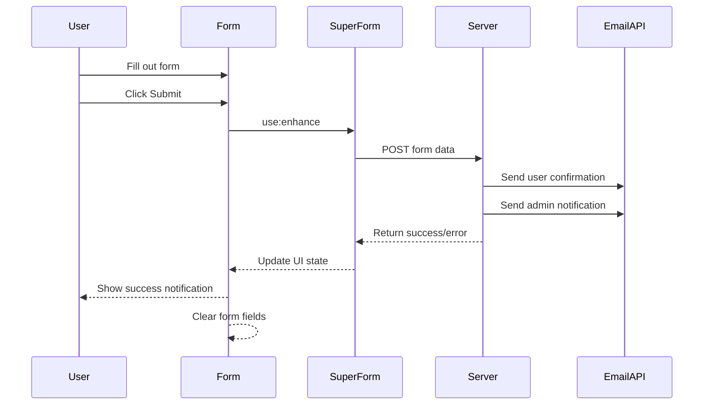

# Contact Form Enhancement Implementation Plan

Based on my analysis of the current codebase and your requirements, I'll now outline a detailed plan to enhance the contact form functionality. The goal is to clear the form after submission, show a green success notification, and ensure proper email delivery to both the user and the admin.

## Current State Analysis

The contact form is currently implemented using:
- SvelteKit form actions in `+page.server.ts`
- SuperForms for form validation and handling
- SendGrid for email delivery via an API endpoint

The form already has:
- Proper validation using Zod schema
- Email templates for both user and admin notifications
- Basic success message display

## Implementation Plan

### 1. Update the Contact Form Component

We'll modify the `+page.svelte` file to:
- Add a green success notification box at the top of the form section
- Ensure the form clears after successful submission
- Improve the user experience with transitions

### 2. Update the Form Action Handler

We'll enhance the `+page.server.ts` file to:
- Properly reset the form after submission
- Ensure proper email delivery to both the user and admin
- Handle errors more gracefully

### 3. Update the Email API Endpoint

We'll modify the `/api/send-email/+server.ts` endpoint to:
- Handle contact form emails properly
- Support direct email sending without requiring the "dual" type

## Detailed Implementation Steps

### Step 1: Update the Contact Form Component



We'll modify the `+page.svelte` file to:
1. Add a green success notification component
2. Update the SuperForm configuration to reset the form
3. Add transitions for better UX

### Step 2: Update the Form Action Handler

We'll enhance the `+page.server.ts` file to:
1. Properly reset the form after submission
2. Update the email sending logic to use the existing email service
3. Improve error handling and logging

### Step 3: Update the Email API Endpoint

We'll modify the `/api/send-email/+server.ts` endpoint to:
1. Add support for direct email sending for contact forms
2. Improve error handling and response formatting

## Code Changes

### 1. Update to +page.svelte

We'll add a green success notification box and ensure the form clears after submission by updating the SuperForm configuration:

```typescript
const { form, errors, constraints, message, enhance, submitting } = superForm(data.form, {
  // Form is valid but there was a server error
  onError: ({ result }) => {
    console.error('Error submitting form:', result);
  },
  // Form is valid and was successfully submitted
  onUpdate: ({ form }) => {
    console.log('Form updated:', form);
  },
  // Reset the form after successful submission
  resetForm: true,
  // Scroll to the top of the form after submission
  scrollToError: true
});
```

We'll also add a green notification box that appears when the form is successfully submitted:

```svelte
{#if $message}
  <div class="bg-emerald-900/30 p-4 rounded-md mb-6 border border-emerald-500/30 transition-all">
    <p class="text-emerald-300">{$message}</p>
  </div>
{/if}
```

### 2. Update to +page.server.ts

We'll enhance the form action handler to properly send emails and reset the form:

```typescript
export const actions = {
  default: async ({ request, fetch }) => {
    console.log('🚀 Starting contact-us form action.');
    
    try {
      // Validate the form data using superValidate
      const form = await superValidate(request, zod(contactSchema));
      
      // Check if form is valid
      if (!form.valid) {
        console.error('❌ Validation errors:', form.errors);
        return fail(400, { form });
      }
      
      // Prepare email data
      console.log('📧 Preparing email data...');
      
      // Send confirmation email to the user
      const userEmailResponse = await fetch('/api/send-email', {
        method: 'POST',
        headers: {
          'Content-Type': 'application/json'
        },
        body: JSON.stringify({
          to: form.data.email,
          subject: 'Thank you for contacting TributeStream',
          html: userEmailHtml,
          text: userEmailText
        })
      });
      
      const userEmailResult = userEmailResponse.ok;
      
      // Send notification email to the admin
      const adminEmailResponse = await fetch('/api/send-email', {
        method: 'POST',
        headers: {
          'Content-Type': 'application/json'
        },
        body: JSON.stringify({
          to: 'tributestream@tributestream.com',
          subject: 'New Contact Form Submission',
          html: adminEmailHtml,
          text: adminEmailText
        })
      });
      
      const adminEmailResult = adminEmailResponse.ok;
      
      // Check if both emails failed to send
      if (!userEmailResult && !adminEmailResult) {
        console.error('❌ Both emails failed to send');
        return message(form, 'Failed to send your message. Please try again or contact us directly.', {
          status: 'error'
        });
      }
      
      // Return success response with a message and reset the form
      return message(form, 'Your message has been sent. We will get back to you soon.', {
        status: 'success'
      });
      
    } catch (error) {
      console.error('💥 Unexpected error:', error);
      return fail(500, {
        error: true,
        message: 'An unexpected error occurred. Please try again or contact us directly.',
        formData: {}
      });
    }
  }
};
```

### 3. Update to /api/send-email/+server.ts

We'll update the email API endpoint to handle direct email sending for contact forms:

```typescript
export const POST: RequestHandler = async ({ request }) => {
  try {
    console.log('📨 Received request to send-email API endpoint');
    const data = await request.json();
    console.log('📦 Request data:', JSON.stringify(data, null, 2));
    
    // Validate request data
    if (!data || typeof data !== 'object') {
      return json(
        { success: false, message: 'Invalid request data' },
        { status: 400 }
      );
    }

    // Handle dual email sending (for memorial service forms)
    if (data.type === 'dual' && data.formData) {
      // Existing dual email sending logic...
    }
    // Handle direct email sending (for contact forms)
    else if (data.to && (data.html || data.text)) {
      console.log('📧 Processing direct email request to:', data.to);
      
      try {
        await sgMail.send({
          from: 'tributestream@tributestream.com',
          to: data.to,
          subject: data.subject || 'Message from TributeStream',
          html: data.html,
          text: data.text
        });
        
        console.log('✅ Email sent successfully to:', data.to);
        return json({ success: true });
      } catch (error) {
        console.error('❌ Failed to send email:', error);
        return json(
          { success: false, message: 'Failed to send email' },
          { status: 500 }
        );
      }
    }
    // If we reach here, request didn't match any expected format
    return json(
      { success: false, message: 'Invalid email request format' },
      { status: 400 }
    );
  } catch (error) {
    console.error('💥 Top-level error processing API request:', error);
    return json(
      { success: false, message: 'Server error processing request' },
      { status: 500 }
    );
  }
};
```

## Testing Plan

1. Test form submission with valid data
   - Verify the form clears after submission
   - Verify the green success notification appears
   - Verify both emails are sent correctly

2. Test form submission with invalid data
   - Verify appropriate validation errors are displayed
   - Verify no emails are sent

3. Test email sending functionality
   - Verify user confirmation email is received
   - Verify admin notification email is received
   - Verify email content is correct

## Summary

This implementation plan addresses all the requirements:
1. Clearing the form after submission
2. Showing a green success notification
3. Sending confirmation emails to both the user and admin

The changes are minimal and focused on enhancing the existing functionality without disrupting the current implementation. We're leveraging SvelteKit's form actions and SuperForms capabilities to provide a smooth user experience.
