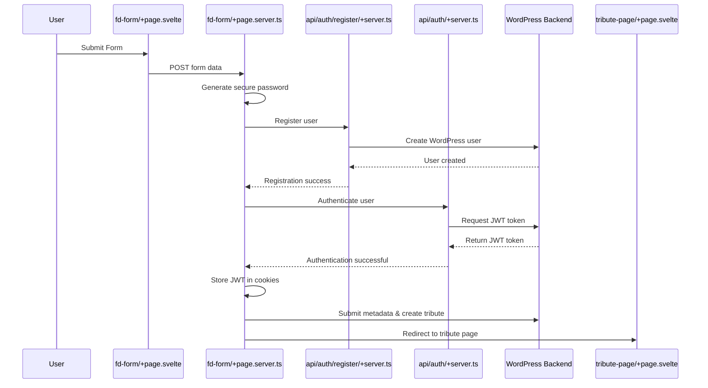

# Tributestream Seamless Form Submission Implementation Guide

## Overview

This guide outlines the implementation process for creating a seamless form submission system in Tributestream that handles user authentication and tribute creation in one unified flow.

**Key Requirements:**
1. Generate secure random passwords
2. Register users with validation
3. Authenticate users and establish sessions
4. Store JWT tokens securely
5. Submit tribute data with validation
6. Redirect to the new tribute page

## System Flow Diagram



## Implementation Steps

### 1. Create Registration API Endpoint

**File:** `src/routes/api/auth/register/+server.ts`

```typescript
import { json } from '@sveltejs/kit';
import type { RequestHandler } from './$types';

export const POST: RequestHandler = async ({ request, fetch }) => {
    console.log('🚀 [Register API] POST request received.');
    
    // Parse and validate input
    try {
        const requestBody = await request.json();
        const { username, email, password } = requestBody;
        
        // Basic validation
        if (!username || !email || !password) {
            return json({ 
                success: false,
                message: 'Username, email, and password are required' 
            }, { status: 400 });
        }
        
        if (!isValidEmail(email)) {
            return json({ 
                success: false,
                message: 'Invalid email format' 
            }, { status: 400 });
        }
        
        // Forward to WordPress registration endpoint
        const response = await fetch('https://wp.tributestream.com/wp-json/tributestream/v1/register', {
            method: 'POST',
            headers: { 'Content-Type': 'application/json' },
            body: JSON.stringify({ username, email, password })
        });
        
        const data = await response.json();
        
        if (!response.ok) {
            console.error('❌ [Register API] Registration failed:', data);
            return json({ 
                success: false,
                message: data.message || 'Registration failed' 
            }, { status: response.status });
        }
        
        console.log('✅ [Register API] Registration successful');
        return json({
            success: true,
            user_id: data.user_id,
            user_email: data.user_email,
            user_display_name: data.user_display_name
        }, { status: 200 });
    } catch (error) {
        console.error('🚨 [Register API] Error:', error);
        return json({ 
            success: false,
            message: 'Internal server error' 
        }, { status: 500 });
    }
};

// Validation helper
function isValidEmail(email: string): boolean {
    const emailRegex = /^[^\s@]+@[^\s@]+\.[^\s@]+$/;
    return emailRegex.test(email);
}
```

### 2. Create Server Hooks for Authentication

**File:** `src/hooks.server.ts`

```typescript
import type { Handle } from '@sveltejs/kit';

export const handle: Handle = async ({ event, resolve }) => {
    // Get JWT token from cookies
    const jwt = event.cookies.get('jwt');
    
    if (jwt) {
        try {
            // Validate token with WordPress endpoint
            const response = await fetch('https://wp.tributestream.com/wp-json/jwt-auth/v1/token/validate', {
                method: 'POST',
                headers: {
                    'Authorization': `Bearer ${jwt}`
                }
            });
            
            if (response.ok) {
                // If token is valid, set authenticated status in locals
                event.locals.authenticated = true;
                event.locals.token = jwt;
                
                // Also set user_id if available
                const userId = event.cookies.get('user_id');
                if (userId) {
                    event.locals.user_id = userId;
                }
            } else {
                // If token validation fails, clear the cookies
                event.cookies.delete('jwt', { path: '/' });
                event.cookies.delete('user_id', { path: '/' });
            }
        } catch (error) {
            console.error('Error validating JWT token:', error);
        }
    }
    
    // Continue with the request
    return await resolve(event);
};
```

### 3. Create Form Validation Utility

**File:** `src/lib/utils/form-validation.ts`

```typescript
export interface ValidationResult {
    isValid: boolean;
    errors: string[];
}

export function validateFuneralDirectorForm(data: any): ValidationResult {
    const errors: string[] = [];
    
    // Required fields
    if (!data.email) errors.push('Email address is required');
    if (!data.directorFirstName) errors.push('Director\'s first name is required');
    if (!data.directorLastName) errors.push('Director\'s last name is required');
    if (!data.locationName) errors.push('Memorial location name is required');
    if (!data.deceasedFirstName) errors.push('Deceased\'s first name is required');
    if (!data.deceasedLastName) errors.push('Deceased\'s last name is required');
    
    // Email validation
    if (data.email && !isValidEmail(data.email)) {
        errors.push('Invalid email format');
    }
    
    // Phone validation (if provided)
    if (data.phone && !isValidPhone(data.phone)) {
        errors.push('Invalid phone number format');
    }
    
    // Date validations (if provided)
    if (data.deceasedDOB && !isValidDate(data.deceasedDOB)) {
        errors.push('Invalid deceased date of birth');
    }
    
    if (data.deceasedDOP && !isValidDate(data.deceasedDOP)) {
        errors.push('Invalid deceased date of passing');
    }
    
    if (data.memorialDate && !isValidDate(data.memorialDate)) {
        errors.push('Invalid memorial date');
    }
    
    return {
        isValid: errors.length === 0,
        errors
    };
}

function isValidEmail(email: string): boolean {
    const emailRegex = /^[^\s@]+@[^\s@]+\.[^\s@]+$/;
    return emailRegex.test(email);
}

function isValidPhone(phone: string): boolean {
    const phoneRegex = /^[0-9\-\+\(\)\s]{7,20}$/;
    return phoneRegex.test(phone);
}

function isValidDate(date: string): boolean {
    const d = new Date(date);
    return !isNaN(d.getTime());
}
```

### 4. Update Form Server Action

**File:** `src/routes/fd-form/+page.server.ts`

```typescript
import { redirect, fail } from '@sveltejs/kit';
import type { Actions } from './$types';
import { generateSecurePassword, setAuthCookies } from '$lib/utils/auth-helpers';
import { validateFuneralDirectorForm } from '$lib/utils/form-validation';

// Function to generate a slug from the deceased's name
function generateSlug(firstName: string, lastName: string): string {
    return `${firstName.trim().toLowerCase()}_${lastName.trim().toLowerCase()}`.replace(/\s+/g, '_');
}

export const actions = {
    default: async ({ request, fetch, cookies }) => {
        console.log('🚀 Starting fd-form action.');

        try {
            // Step 1: Parse form data
            console.log('📝 Parsing form data...');
            const formData = await request.formData();
            const data = parseFormData(formData);
            
            // Step 2: Validate form data
            console.log('🔍 Validating form data...');
            const validation = validateFuneralDirectorForm(data);
            if (!validation.isValid) {
                console.error('❌ Validation errors:', validation.errors);
                return fail(400, { 
                    error: true, 
                    message: validation.errors.join('. ') 
                });
            }
            
            // Step 3: Generate a secure random password
            console.log('🔐 Generating a secure password.');
            const password = generateSecurePassword(16);
            console.log('✅ Password generated successfully');
            
            // Step 4: Register the user
            console.log('🔄 Registering user...');
            const registerResponse = await fetch('/api/auth/register', {
                method: 'POST',
                headers: { 'Content-Type': 'application/json' },
                body: JSON.stringify({
                    username: data.email,
                    email: data.email,
                    password: password
                })
            });

            const registerResult = await registerResponse.json();
            
            // Handle registration errors
            if (!registerResponse.ok) {
                console.error('❌ Registration failed:', registerResult);
                
                // Handle specific error scenarios
                if (registerResult.message?.includes('email already exists')) {
                    return fail(400, { 
                        error: true, 
                        message: 'An account with this email already exists. Please use a different email address.' 
                    });
                }
                
                return fail(registerResponse.status, { 
                    error: true, 
                    message: registerResult.message || 'Registration failed' 
                });
            }

            const userId = registerResult.user_id;
            console.log('✅ User registered with ID:', userId);

            // Step 5: Authenticate the user
            console.log('🔄 Authenticating user...');
            const authResponse = await fetch('/api/auth', {
                method: 'POST',
                headers: { 'Content-Type': 'application/json' },
                body: JSON.stringify({
                    username: data.email,
                    password: password
                })
            });

            // Handle authentication errors
            if (!authResponse.ok) {
                const authError = await authResponse.json();
                console.error('❌ Authentication failed:', authError);
                return fail(authResponse.status, { 
                    error: true, 
                    message: authError.message || 'Authentication failed after registration' 
                });
            }

            const authResult = await authResponse.json();
            console.log('✅ User authenticated. JWT token received');

            // Step 6: Store the JWT token in cookies
            console.log('🔐 Storing authentication tokens...');
            cookies.set('jwt', authResult.token, { 
                httpOnly: true, 
                secure: true, 
                path: '/',
                maxAge: 60 * 60 * 24 * 7 // 7 days 
            });
            
            cookies.set('user_id', userId, {
                httpOnly: true,
                secure: true,
                path: '/',
                maxAge: 60 * 60 * 24 * 7 // 7 days
            });

            // Step 7: Store user metadata
            console.log('📝 Writing user metadata...');
            const metaPayload = {
                user_id: userId,
                meta_key: 'memorial_form_data',
                meta_value: JSON.stringify({
                    director: {
                        firstName: data.directorFirstName,
                        lastName: data.directorLastName
                    },
                    familyMember: {
                        firstName: data.familyMemberFirstName,
                        lastName: data.familyMemberLastName,
                        dob: data.familyMemberDOB
                    },
                    deceased: {
                        firstName: data.deceasedFirstName,
                        lastName: data.deceasedLastName,
                        dob: data.deceasedDOB,
                        dop: data.deceasedDOP
                    },
                    contact: {
                        email: data.email,
                        phone: data.phone
                    },
                    memorial: {
                        locationName: data.locationName,
                        locationAddress: data.locationAddress,
                        time: data.memorialTime,
                        date: data.memorialDate
                    }
                })
            };
            
            const metaResponse = await fetch('https://wp.tributestream.com/wp-json/tributestream/v1/user-meta', {
                method: 'POST',
                headers: {
                    'Content-Type': 'application/json',
                    'Authorization': `Bearer ${authResult.token}`
                },
                body: JSON.stringify(metaPayload)
            });

            // Handle metadata errors
            if (!metaResponse.ok) {
                const metaError = await metaResponse.json();
                console.error('❌ Metadata write failed:', metaError);
                return fail(metaResponse.status, { 
                    error: true, 
                    message: metaError.message || 'Failed to save user metadata' 
                });
            }

            console.log('✅ Metadata written successfully.');

            // Step 8: Create the tribute record
            console.log('🚀 Creating tribute...');
            
            // Generate the slug
            const slug = generateSlug(data.deceasedFirstName, data.deceasedLastName);

            // Prepare the tribute payload
            const tributePayload = {
                loved_one_name: `${data.deceasedFirstName} ${data.deceasedLastName}`,
                slug,
                user_id: userId,
                phone_number: data.phone || '000-000-0000' // Ensure we have a phone number
            };
            
            console.log('📦 Sending tribute payload:', tributePayload);
            
            const tributeResponse = await fetch('https://wp.tributestream.com/wp-json/tributestream/v1/tributes', {
                method: 'POST',
                headers: {
                    'Content-Type': 'application/json',
                    'Authorization': `Bearer ${authResult.token}`
                },
                body: JSON.stringify(tributePayload)
            });
            
            // Handle tribute creation errors
            if (!tributeResponse.ok) {
                const tributeError = await tributeResponse.json();
                console.error('❌ Tribute creation failed:', tributeError);
                return fail(tributeResponse.status, { 
                    error: true, 
                    message: tributeError.message || 'Failed to create tribute' 
                });
            }
            
            const tributeResult = await tributeResponse.json();
            console.log('✅ Tribute created successfully:', tributeResult);
            
            // Optional: Send welcome email with credentials
            try {
                await fetch('/api/send-email', {
                    method: 'POST',
                    headers: {
                        'Content-Type': 'application/json'
                    },
                    body: JSON.stringify({
                        to: data.email,
                        subject: 'Your Tributestream Account',
                        html: `
                            <h2>Welcome to Tributestream</h2>
                            <p>Your account has been created with the following credentials:</p>
                            <p><strong>Username:</strong> ${data.email}</p>
                            <p><strong>Password:</strong> ${password}</p>
                            <p>Your tribute page is now available at: https://tributestream.com/celebration-of-life-for-${slug}</p>
                        `
                    })
                });
            } catch (emailError) {
                console.warn('⚠️ Email notification failed, but process continues:', emailError);
            }
            
            // Step 9: Redirect to the newly created tribute page
            console.log('🔀 Redirecting to created tribute page...');
            throw redirect(303, `/celebration-of-life-for-${slug}`);
            
        } catch (error) {
            // Only handle errors that aren't already handled (like redirect)
            if (error instanceof Response) throw error;
            
            console.error('💥 Unexpected error:', error);
            return fail(500, { 
                error: true, 
                message: 'An unexpected error occurred. Please try again.' 
            });
        }
    }
} satisfies Actions;

// Helper function to parse form data
function parseFormData(formData: FormData) {
    return {
        directorFirstName: formData.get('director-first-name') as string,
        directorLastName: formData.get('director-last-name') as string,
        familyMemberFirstName: formData.get('family-member-first-name') as string,
        familyMemberLastName: formData.get('family-member-last-name') as string,
        familyMemberDOB: formData.get('family-member-dob') as string,
        deceasedFirstName: formData.get('deceased-first-name') as string,
        deceasedLastName: formData.get('deceased-last-name') as string,
        deceasedDOB: formData.get('deceased-dob') as string,
        deceasedDOP: formData.get('deceased-dop') as string,
        email: formData.get('email-address') as string,
        phone: formData.get('phone-number') as string,
        locationName: formData.get('location-name') as string,
        locationAddress: formData.get('location-address') as string,
        memorialTime: formData.get('memorial-time') as string,
        memorialDate: formData.get('memorial-date') as string,
    };
}
```

### 5. Add Tribute Page Data Loading

**File:** `src/routes/celebration-of-life-for-[slug]/+page.server.ts`

```typescript
import type { PageServerLoad } from './$types';
import { error } from '@sveltejs/kit';

export const load: PageServerLoad = async ({ params, fetch }) => {
    try {
        const slug = params.slug;
        
        if (!slug) {
            throw error(404, 'Tribute not found');
        }
        
        const response = await fetch(`https://wp.tributestream.com/wp-json/tributestream/v1/tribute/${slug}`);
        
        if (!response.ok) {
            throw error(response.status, 'Failed to load tribute');
        }
        
        const tribute = await response.json();
        
        return {
            tribute
        };
    } catch (err) {
        console.error('Error loading tribute:', err);
        throw error(500, 'Error loading tribute data');
    }
};
```

## Security Considerations

### Password Security

- **Implementation Details:**
  - Use `generateSecurePassword()` from `auth-helpers.ts` with 16+ characters
  - Include uppercase, lowercase, numbers, and special characters
  - Never log or display passwords except in welcome emails

### Token Storage

- **Implementation Details:**
  - Store JWT tokens in HTTP-only cookies:
    ```typescript
    cookies.set('jwt', token, { 
        httpOnly: true, 
        secure: true, 
        path: '/',
        maxAge: 60 * 60 * 24 * 7 // 7 days 
    });
    ```
  - Validate tokens server-side in hooks.server.ts
  - Clear tokens on invalid/expired status

### Form Validation

- **Implementation Details:**
  - Use `validateFuneralDirectorForm()` from form-validation.ts
  - Validate inputs before API calls
  - Return specific error messages for each validation failure

## Testing Checklist

- [ ] Registration API works with valid credentials
- [ ] Registration API handles duplicate emails properly
- [ ] Password generation creates strong, random passwords
- [ ] JWT tokens are properly stored and retrieved
- [ ] Form validation catches all invalid inputs
- [ ] Tribute creation works with valid data
- [ ] Redirect to tribute page works correctly
- [ ] Error handling provides useful messages to users

## Implementation Timeline

1. **Day 1-2:** Registration API endpoint and form validation
2. **Day 3-4:** Auth hooks and token management
3. **Day 5-7:** Form submission refactoring
4. **Day 8:** Tribute page integration
5. **Day 9-10:** Testing and documentation

## API Reference

### Registration API

- **Endpoint:** `/api/auth/register`
- **Method:** POST
- **Body:**
  ```json
  {
    "username": "user@example.com",
    "email": "user@example.com",
    "password": "securePassword123!"
  }
  ```
- **Success Response:**
  ```json
  {
    "success": true,
    "user_id": "123",
    "user_email": "user@example.com",
    "user_display_name": "user"
  }
  ```

### Authentication API

- **Endpoint:** `/api/auth`
- **Method:** POST
- **Body:**
  ```json
  {
    "username": "user@example.com",
    "password": "securePassword123!"
  }
  ```
- **Success Response:**
  ```json
  {
    "token": "jwt_token_string",
    "user_id": "123",
    "user_display_name": "User Name",
    "user_email": "user@example.com"
  }
  ```

### WordPress User Meta API

- **Endpoint:** `https://wp.tributestream.com/wp-json/tributestream/v1/user-meta`
- **Method:** POST
- **Headers:** `Authorization: Bearer jwt_token`
- **Body:**
  ```json
  {
    "user_id": "123",
    "meta_key": "memorial_form_data",
    "meta_value": "{\"director\":{...},\"deceased\":{...}}"
  }
  ```

### WordPress Tribute API

- **Endpoint:** `https://wp.tributestream.com/wp-json/tributestream/v1/tributes`
- **Method:** POST
- **Headers:** `Authorization: Bearer jwt_token`
- **Body:**
  ```json
  {
    "loved_one_name": "John Doe",
    "slug": "john_doe",
    "user_id": "123",
    "phone_number": "555-123-4567"
  }

  Understanding our data strucutre: 
  

1. Data Structure and JSON Format
Your tribute entries include:
id: Unique identifier for the tribute.
user_id: References the user who created the tribute.
loved_one_name: The name of the loved one being honored.
slug: A unique, URL-friendly identifier.
created_at & updated_at: Timestamps for tracking creation and updates.
custom_html: Custom HTML content for the tribute.
phone_number: Contact or related phone number.
number_of_streams: Likely used for tracking views or streams.
A sample JSON for a tribute might look like this:
{
  "id": 123,
  "user_id": 45,
  "loved_one_name": "John Doe",
  "slug": "john-doe",
  "created_at": "2023-03-15T12:00:00Z",
  "updated_at": "2023-03-16T15:30:00Z",
  "custom_html": "<p>Celebrating John’s life...</p>",
  "phone_number": "+1234567890",
  "number_of_streams": 10
}


2. CRUD Operations
Create Tribute Link
Endpoint: POST /api/tributes
Flow:
Receive form data from the home page.
Sanitize and validate inputs (e.g., ensure the slug is unique, the HTML is safe, and the phone number is properly formatted).
Insert a new record into the tributes table.
Return the newly created tribute as JSON.
Convert this Json tribute into an object for our app. 
Read Tribute(s)
By Slug (Public Access):
Endpoint: GET /api/tributes/{slug}
Retrieve the tribute matching the given slug.
By User (Family Dashboard):
Endpoint: GET /api/users/{user_id}/tributes
Retrieve all tributes for the logged-in user by filtering on user_id.
 

3. Implementation Considerations
Authentication & Authorization
User Authentication:
 Use WordPress nonces and/or authentication mechanisms to ensure only authorized users can create or update tributes.
Role-based Permissions:
 Ensure that users can only update or delete tributes that they own. For instance, on the family dashboard, queries should filter by the authenticated user's user_id.
Input Validation and Sanitization
Sanitize Input Data:
 Clean data for custom_html, loved_one_name, and phone_number to prevent security issues.
Validate Uniqueness:
 Make sure the slug is unique for each tribute. Consider using WordPress functions to check and generate a unique slug if necessary. If we have a duplicate slug, lets just append an number at the end.
RESTful API Endpoints
Mapping HTTP Methods:
GET: For reading data (all tributes, single tribute by slug/user).
POST: For creating new tributes.
PUT/PATCH: For updating existing tributes.
DELETE: (Optional) If you plan to allow deletion, add an endpoint like DELETE /api/tributes/{id}.
Endpoint Naming Conventions:
 Use clear and RESTful naming (e.g., /api/tributes, /api/tributes/{slug}, /api/users/{user_id}/tributes).

4. Example Pseudocode for a WordPress Plugin Endpoint
Below is a simplified pseudocode example for creating a new tribute link:
// Register a custom REST API route in your plugin
add_action('rest_api_init', function () {
    register_rest_route('api/v1', '/tributes', array(
        'methods' => 'POST',
        'callback' => 'create_tribute',
        'permission_callback' => function () {
            return is_user_logged_in();
        }
    ));
});

function create_tribute(WP_REST_Request $request) {
    // Verify nonce if needed for additional security
    $params = $request->get_json_params();
    $user_id = get_current_user_id();
    
    // Sanitize and validate input fields
    $loved_one_name = sanitize_text_field($params['loved_one_name']);
    $slug = sanitize_title($params['slug']);
    $custom_html = wp_kses_post($params['custom_html']);
    $phone_number = sanitize_text_field($params['phone_number']);
    
    // Generate timestamps
    $created_at = current_time('mysql');
    $updated_at = current_time('mysql');
    
    global $wpdb;
    $table_name = $wpdb->prefix . 'tributes';
    
    // Insert new tribute into the database
    $result = $wpdb->insert(
        $table_name,
        array(
            'user_id' => $user_id,
            'loved_one_name' => $loved_one_name,
            'slug' => $slug,
            'custom_html' => $custom_html,
            'phone_number' => $phone_number,
            'created_at' => $created_at,
            'updated_at' => $updated_at,
            'number_of_streams' => 0  // default value
        ),
        array('%d', '%s', '%s', '%s', '%s', '%s', '%s', '%d')
    );
    
    if ($result === false) {
        return new WP_Error('db_insert_error', 'Failed to insert tribute', array('status' => 500));
    }
    
    $inserted_id = $wpdb->insert_id;
    $tribute = array(
        'id' => $inserted_id,
        'user_id' => $user_id,
        'loved_one_name' => $loved_one_name,
        'slug' => $slug,
        'custom_html' => $custom_html,
        'phone_number' => $phone_number,
        'created_at' => $created_at,
        'updated_at' => $updated_at,
        'number_of_streams' => 0
    );
    
    return rest_ensure_response($tribute);
}


5. Summary
Data Model:
 Your tribute link (or slug) is part of a broader tribute record with fields like loved_one_name, timestamps, and content.


CRUD Operations:
 Implement endpoints for creating, reading (by slug or user), and updating tributes, mapping each action to the appropriate HTTP method.


Security:
 Validate and sanitize all inputs. Use authentication checks to ensure users can only modify their own data.


RESTful Design:
 Stick to RESTful conventions for endpoint naming and method usage, and document these endpoints clearly for maintainability.


By following these guidelines, you’ll create a well-structured, secure, and efficient CRUD system for your tributes table that meets both public and user-specific needs.
Below is an example of a consolidated JSON structure that merges data from both the Funeral Director form and the Calculator page. In this design, we assume that tribute‐specific fields (like loved one’s full name) remain in the tribute table, and only additional, order/scheduling–related details are stored as a JSON string in usermeta. We’ve organized the data into clear, snake_case sections and removed duplicate entries (for instance, using a single set of funeral home details under funeral_details).
{
  "tribute_reference": 123,
  "user_details": {
    "full_name": "Jane Doe",
    "email_address": "jane@example.com",
    "phone_number": "+1234567890",
    "dob": "1990-01-01"
  },
  "funeral_details": {
    "director_first_name": "John",
    "director_last_name": "Doe",
    "funeral_home_name": "XYZ Funeral Home",
    "funeral_home_address": "123 Main St"
  },
  "loved_one_details": {
    "dob": "1945-06-15",
    "date_of_passing": "2023-03-16"
  },
  "memorial_details": {
    "location_name": "XYZ Memorial Hall",
    "location_address": "456 Memorial Dr",
    "date": "2023-03-16",
    "start_time": "15:30:00"
  },
  "livestream_details": {
    "duration": 60,
    "date": "2023-03-16",
    "start_time": "15:30:00"
  },
  "calculator_details": {
    "package_option": "package_a",
    "price_total": 99.99,
    "number_of_locations": 1,
    "locations": [
      {
        "location_name": "XYZ Memorial Hall",
        "location_address": "456 Memorial Dr",
        "start_time": "15:30:00",
        "duration": 60
      }
    ]
  },
  "billing_details": {
    "billing_first_name": "Jane",
    "billing_last_name": "Doe",
    "billing_address": "789 Billing Ave",
    "is_payment_complete": false
  }
}

Explanation
tribute_reference:
 Points to the unique tribute record (which holds the core tribute data).


user_details:
 Contains the registered user’s basic information. (Note that some of these values might be initially provided on the home page form.)


funeral_details:
 Consolidates data from the Funeral Director form. Here, we combine director information and funeral home details into one section to avoid duplicates.


loved_one_details:
 Captures additional details about the loved one (date of birth and date of passing) that aren’t duplicated in the tribute table.


memorial_details:
 Holds scheduling and location data for the memorial service. These values might be pre-populated or adjusted on the Calculator page.


livestream_details:
 Contains the livestream-specific scheduling details (duration, date, and start time).


calculator_details:
 Provides pricing and package information. If the user chooses multiple locations (beyond the default), the structure allows for an array of location objects with their own start times and durations.


billing_details:
 Stores checkout-related information.


This structure ensures a single source of truth for tribute-specific data (stored in the tribute table) while the additional scheduling and order data are maintained in a structured JSON format. Adjust field names or nesting as needed based on your exact requirements.
