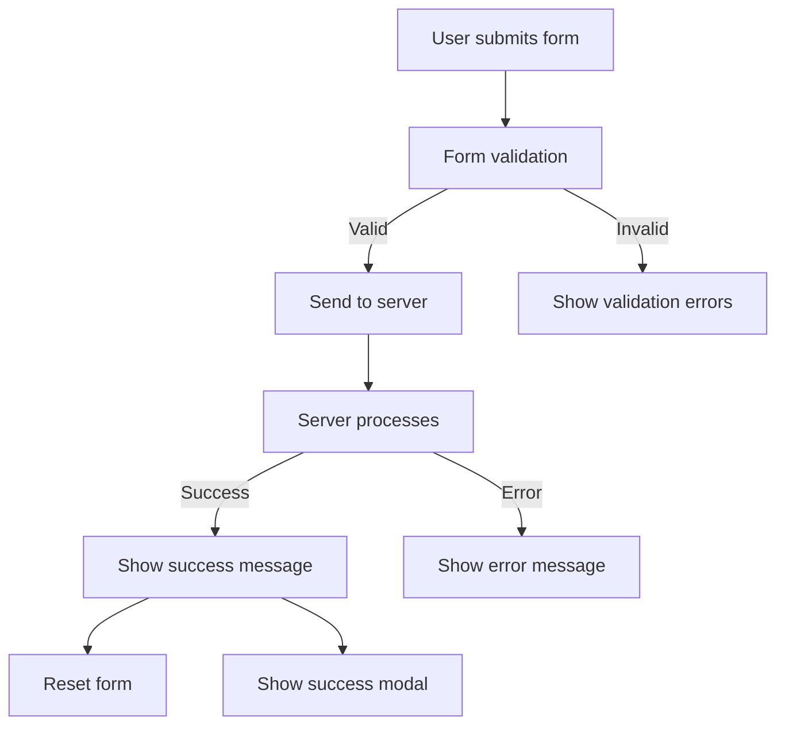

# Refactoring Plan for Schedule-Now Form Submission

Based on the improvements we made to the contact-us form, I'll create a detailed plan to refactor the schedule-now page to process form submissions similarly, with form clearing and success notifications.

## Current State Analysis

The schedule-now page currently:
1. Uses a named action called "submit" (which is correct, unlike the "default" name we had to fix)
2. Uses the "dual" email type for sending both customer and admin emails
3. Shows success messages in a modal component rather than inline
4. Has more complex form fields and validation
5. Doesn't reset the form after successful submission

## Refactoring Goals

1. Add form reset functionality after successful submission
2. Add a green success notification box at the top of the form (in addition to the modal)
3. Improve error handling and logging
4. Ensure consistent behavior with the contact-us form

## Detailed Implementation Plan

### 1. Update the SuperForm Configuration in +page.svelte



We'll modify the SuperForm configuration to:
- Add `resetForm: true` to clear the form after successful submission
- Improve the `onUpdate` handler to show both the inline message and the modal
- Add better error handling

### 2. Add Green Success Notification Box

We'll enhance the existing message display to:
- Use consistent styling with the contact-us form
- Add animations for better UX
- Ensure it's visible at the top of the form

### 3. Update the Form Action Handler in +page.server.ts

We'll improve the server-side action to:
- Add more detailed logging
- Ensure proper form reset after submission
- Use consistent message formatting

### 4. Improve Email Handling

While the schedule-now page already uses the "dual" email type, we'll ensure it's compatible with our updated email API endpoint.

## Code Changes

### 1. Update to +page.svelte

```typescript
// Update SuperForm configuration
const { form, errors, constraints, message, enhance, submitting } = superForm(data.form, {
  // Form is valid but there was a server error
  onError: ({ result }) => {
    console.error('Error submitting form:', result);
  },
  // Form is valid and was successfully submitted
  onUpdate: ({ form }) => {
    console.log('Form updated:', form);
    
    // Check if the form was successfully submitted
    if ($message) {
      successMessage = $message;
      showSuccessModal = true;
    }
  },
  // Reset the form after successful submission
  resetForm: true,
  // Scroll to the top of the form after submission
  scrollToError: true,
  onSubmit: ({ formData, cancel }) => {
    console.log('Form submission started with data:', Object.fromEntries(formData));
    
    // Add all form fields to the formData
    for (const [key, value] of Object.entries($form)) {
      if (value !== undefined && value !== null) {
        formData.set(key, value.toString());
      }
    }
    
    console.log('Enhanced form data:', Object.fromEntries(formData));
    // Don't cancel the submission
    return;
  },
  onResult: ({ result }) => {
    console.log('Form submission result:', result);
  }
});
```

### 2. Enhance the Message Display

```svelte
{#if $message}
  <div class="bg-emerald-900/30 p-4 rounded-md mb-6 border border-emerald-500/30 transition-all duration-300 animate-in fade-in slide-in-from-top-4">
    <p class="text-emerald-300">{$message}</p>
  </div>
{/if}
```

### 3. Update the Form Action Handler in +page.server.ts

```typescript
// Improve logging and error handling
try {
  // Existing code...
  
  console.log('📧 Sending emails...');
  console.log('📧 Email data being sent:', JSON.stringify(emailData, null, 2));
  
  // More detailed logging for email sending
  // ...
  
  // Return success response with a message
  return message(
    form,
    'Your consultation request has been sent successfully! We\'ll be in touch within 24 hours to discuss your livestreaming needs.',
    {
      status: 'success'
    }
  );
} catch (emailError) {
  console.error('❌ Email sending failed:', emailError);
  return message(form, 'Failed to send confirmation email. Please try again or contact us directly.', {
    status: 'error'
  });
}
```

## Testing Plan

1. Test form submission with valid data
   - Verify the form clears after submission
   - Verify the green success notification appears
   - Verify the success modal appears
   - Verify both emails are sent correctly

2. Test form submission with invalid data
   - Verify appropriate validation errors are displayed
   - Verify no emails are sent

3. Test email sending functionality
   - Verify user confirmation email is received
   - Verify admin notification email is received
   - Verify email content is correct

## Summary

This refactoring plan will enhance the schedule-now form to:
1. Clear the form after successful submission
2. Show a green success notification box at the top of the form
3. Improve error handling and logging
4. Maintain the existing success modal functionality

The changes are minimal and focused on enhancing the existing functionality without disrupting the current implementation. We're leveraging SvelteKit's form actions and SuperForms capabilities to provide a smooth user experience.