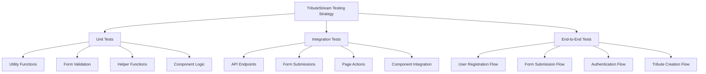
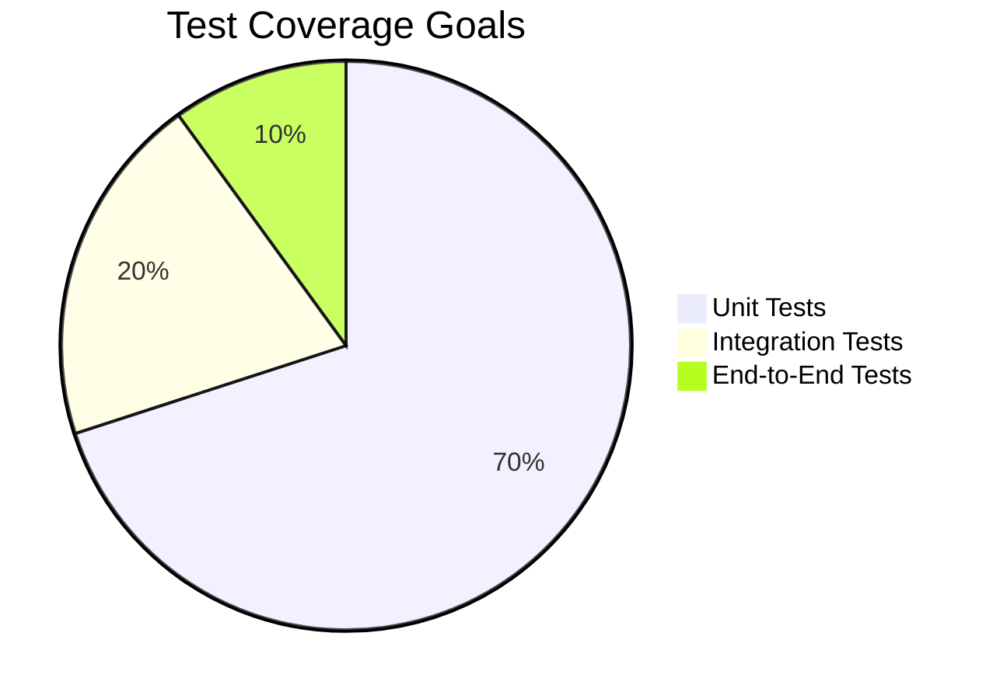

# Comprehensive Testing Plan for TributeStream Web Application

## 1. Executive Summary

This document outlines a comprehensive testing strategy for the TributeStream web application, covering unit, integration, and end-to-end tests with a focus on critical user journeys. The plan aims to establish a robust testing framework while minimizing the number of testing libraries and frameworks required.

## 2. Testing Framework Recommendations

To keep the testing stack minimal yet powerful, we recommend:

1. **Vitest** (already installed) - For unit and integration tests
   - Fast, Vite-native testing framework
   - Compatible with SvelteKit
   - Can be used for both utility functions and component testing

2. **Playwright** - For end-to-end tests
   - Comprehensive browser automation
   - Works well with SvelteKit applications
   - Supports multiple browsers (Chromium, Firefox, WebKit)

This two-library approach gives you full testing coverage while minimizing the learning curve and maintenance overhead.

## 3. Testing Structure Overview



## 4. Detailed Testing Plan

### 4.1 Unit Tests (Vitest)

#### 4.1.1 Utility Functions

| Function Category | Files to Test | Test Focus |
|-------------------|---------------|------------|
| Form Validation | `form-validation.ts` | Test validation functions for different input types |
| String Helpers | `string-helpers.ts` | Test slug generation and other string manipulation functions |
| Auth Helpers | `auth-helpers.ts` | Test password generation and cookie management functions |
| API Helpers | `api-helpers.ts` | Test API utility functions |
| Form Action Helpers | `form-action-helpers.ts` | Test form action utility functions |

**Example Test Structure:**
```typescript
// src/lib/utils/form-validation.test.ts
import { describe, it, expect } from 'vitest';
import { validateFuneralDirectorForm, validateSimplifiedMemorialForm } from './form-validation';

describe('validateFuneralDirectorForm', () => {
  it('should validate a valid form', () => {
    const validForm = {
      email: 'test@example.com',
      directorFirstName: 'John',
      directorLastName: 'Doe',
      deceasedFirstName: 'Jane',
      deceasedLastName: 'Smith',
      phone: '123-456-7890'
    };
    
    const result = validateFuneralDirectorForm(validForm);
    expect(result.isValid).toBe(true);
    expect(result.errors).toHaveLength(0);
  });
  
  it('should return errors for invalid form', () => {
    const invalidForm = {
      email: 'invalid-email',
      directorFirstName: '',
      directorLastName: 'Doe',
      deceasedFirstName: 'Jane',
      deceasedLastName: '',
      phone: '123'
    };
    
    const result = validateFuneralDirectorForm(invalidForm);
    expect(result.isValid).toBe(false);
    expect(result.errors.length).toBeGreaterThan(0);
  });
});
```

#### 4.1.2 Component Logic

| Component Category | Files to Test | Test Focus |
|--------------------|---------------|------------|
| Global Components | `Header.svelte`, `Footer.svelte` | Test props, events, and state management |
| Form Components | Form-related components | Test form state, validation, and submission logic |
| UI Components | `success-modal.svelte` | Test UI state and interactions |

**Example Test Structure:**
```typescript
// src/lib/components/success-modal.test.ts
import { describe, it, expect } from 'vitest';
import { render, fireEvent } from '@testing-library/svelte';
import SuccessModal from './success-modal.svelte';

describe('SuccessModal', () => {
  it('should render with the correct message', () => {
    const { getByText } = render(SuccessModal, { 
      props: { message: 'Test success message' } 
    });
    
    expect(getByText('Test success message')).toBeTruthy();
  });
  
  it('should emit close event when close button is clicked', async () => {
    const { component, getByRole } = render(SuccessModal, { 
      props: { message: 'Test message' } 
    });
    
    const closeButton = getByRole('button');
    let closeEventFired = false;
    
    component.$on('close', () => {
      closeEventFired = true;
    });
    
    await fireEvent.click(closeButton);
    expect(closeEventFired).toBe(true);
  });
});
```

### 4.2 Integration Tests (Vitest)

#### 4.2.1 API Endpoints

| API Endpoint | Files to Test | Test Focus |
|--------------|---------------|------------|
| Authentication | `api/auth/+server.ts` | Test login, token generation |
| User Registration | `api/auth/register/+server.ts` | Test user registration process |
| Email Sending | `api/send-email/+server.ts` | Test email sending functionality |
| Tribute Management | `api/tributes/+server.ts` | Test tribute creation, retrieval |

**Example Test Structure:**
```typescript
// src/routes/api/auth/auth.test.ts
import { describe, it, expect, vi, beforeEach } from 'vitest';
import { POST } from './+server.ts';

// Mock fetch
global.fetch = vi.fn();

describe('Auth API', () => {
  beforeEach(() => {
    vi.resetAllMocks();
  });
  
  it('should return 400 if username or password is missing', async () => {
    const request = new Request('http://localhost/api/auth', {
      method: 'POST',
      headers: { 'Content-Type': 'application/json' },
      body: JSON.stringify({ username: 'test' }) // Missing password
    });
    
    const response = await POST({ request });
    const data = await response.json();
    
    expect(response.status).toBe(400);
    expect(data.message).toContain('required');
  });
  
  it('should authenticate valid credentials', async () => {
    // Mock successful WordPress response
    global.fetch.mockResolvedValueOnce({
      ok: true,
      status: 200,
      json: async () => ({
        token: 'test-token',
        user_id: 123,
        user_display_name: 'Test User'
      })
    });
    
    const request = new Request('http://localhost/api/auth', {
      method: 'POST',
      headers: { 'Content-Type': 'application/json' },
      body: JSON.stringify({ username: 'test@example.com', password: 'password' })
    });
    
    const response = await POST({ request });
    const data = await response.json();
    
    expect(response.status).toBe(200);
    expect(data.token).toBe('test-token');
    expect(data.user_id).toBe(123);
  });
});
```

#### 4.2.2 Form Submissions

| Form | Files to Test | Test Focus |
|------|---------------|------------|
| Funeral Director Form | `fd-form/+page.server.ts` | Test form processing, validation, and submission |
| Contact Form | `contact-us/+page.server.ts` | Test contact form processing |
| Schedule Form | `schedule-now/+page.server.ts` | Test scheduling form processing |

**Example Test Structure:**
```typescript
// src/routes/fd-form/fd-form.test.ts
import { describe, it, expect, vi, beforeEach } from 'vitest';
import { actions } from './+page.server.ts';

// Mock dependencies
vi.mock('$lib/utils/auth-helpers', () => ({
  generateSecurePassword: () => 'secure-password',
  setAuthCookies: vi.fn()
}));

vi.mock('$lib/utils/form-validation', () => ({
  validateFuneralDirectorForm: vi.fn()
}));

describe('Funeral Director Form Actions', () => {
  beforeEach(() => {
    vi.resetAllMocks();
  });
  
  it('should validate form data and return errors if invalid', async () => {
    const validateFuneralDirectorForm = vi.mocked(import('$lib/utils/form-validation')).validateFuneralDirectorForm;
    validateFuneralDirectorForm.mockReturnValue({
      isValid: false,
      errors: ['Email address is required']
    });
    
    const formData = new FormData();
    formData.append('email-address', '');
    
    const result = await actions.default({
      request: { formData: () => Promise.resolve(formData) },
      fetch: vi.fn(),
      cookies: { set: vi.fn() }
    });
    
    expect(result.error).toBe(true);
    expect(result.message).toContain('Email address is required');
  });
  
  // Additional tests for successful submission, WordPress integration, etc.
});
```

### 4.3 End-to-End Tests (Playwright)

#### 4.3.1 Critical User Journeys

| User Journey | Test Focus |
|--------------|------------|
| User Registration | Test complete registration flow from form to confirmation |
| Funeral Director Form Submission | Test complete form submission flow |
| Authentication Flow | Test login, session management, and protected routes |
| Tribute Creation and Viewing | Test creating and viewing a tribute page |

**Example Test Structure:**
```typescript
// e2e/funeral-director-form.spec.ts
import { test, expect } from '@playwright/test';

test('Funeral director form submission flow', async ({ page }) => {
  // Navigate to the form page
  await page.goto('/fd-form');
  
  // Fill out the form
  await page.fill('input[name="director-first-name"]', 'John');
  await page.fill('input[name="director-last-name"]', 'Doe');
  await page.fill('input[name="deceased-first-name"]', 'Jane');
  await page.fill('input[name="deceased-last-name"]', 'Smith');
  await page.fill('input[name="email-address"]', 'test@example.com');
  await page.fill('input[name="phone-number"]', '123-456-7890');
  
  // Submit the form
  await page.click('button[type="submit"]');
  
  // Wait for redirect or success message
  await page.waitForURL(/celebration-of-life-for-/);
  
  // Verify we're on the tribute page
  expect(page.url()).toContain('celebration-of-life-for-');
  
  // Verify tribute content
  await expect(page.locator('h1')).toContainText('Jane Smith');
});
```

## 5. Test Directory Structure

```
TributestreamDev-Version03/
├── src/
│   ├── lib/
│   │   ├── utils/
│   │   │   ├── __tests__/           # Unit tests for utilities
│   │   │   │   ├── form-validation.test.ts
│   │   │   │   ├── string-helpers.test.ts
│   │   │   │   └── ...
│   │   ├── components/
│   │   │   ├── __tests__/           # Unit tests for components
│   │   │   │   ├── success-modal.test.ts
│   │   │   │   └── ...
│   ├── routes/
│   │   ├── api/
│   │   │   ├── __tests__/           # Integration tests for API endpoints
│   │   │   │   ├── auth.test.ts
│   │   │   │   └── ...
│   │   ├── fd-form/
│   │   │   ├── __tests__/           # Integration tests for form pages
│   │   │   │   ├── fd-form.test.ts
│   │   │   │   └── ...
├── tests/
│   ├── e2e/                         # End-to-end tests
│   │   ├── funeral-director-form.spec.ts
│   │   ├── authentication.spec.ts
│   │   └── ...
│   ├── fixtures/                    # Test fixtures and mock data
│   │   ├── forms.ts
│   │   └── ...
│   ├── helpers/                     # Test helper functions
│   │   ├── test-utils.ts
│   │   └── ...
├── playwright.config.ts             # Playwright configuration
└── vitest.config.ts                 # Vitest configuration
```

## 6. Implementation Strategy and Timeline

### 6.1 Phase 1: Setup and Foundation (Week 1)

#### Week 1 (Days 1-3): Environment Setup

| Task | Description | Timeline |
|------|-------------|----------|
| Configure Vitest | Set up Vitest configuration for unit and integration tests | Day 1 |
| Install Playwright | Install and configure Playwright for E2E tests | Day 1 |
| Create Directory Structure | Set up test directories and initial configuration files | Day 2 |
| Create Test Utilities | Develop common test utilities and helpers | Day 2-3 |
| Setup CI Pipeline | Configure basic CI pipeline for running tests | Day 3 |

#### Week 1 (Days 4-5): Initial Unit Tests

| Task | Description | Timeline |
|------|-------------|----------|
| Form Validation Tests | Write tests for form validation functions | Day 4 |
| String Helper Tests | Write tests for string manipulation functions | Day 4 |
| Auth Helper Tests | Write tests for authentication helper functions | Day 5 |
| API Helper Tests | Write tests for API utility functions | Day 5 |

### 6.2 Phase 2: Component and API Testing (Week 2-3)

#### Week 2 (Days 1-3): Component Testing

| Task | Description | Timeline |
|------|-------------|----------|
| Setup Component Testing | Configure component testing environment | Day 1 |
| Global Component Tests | Write tests for Header and Footer components | Day 1-2 |
| Success Modal Tests | Write tests for success-modal component | Day 2 |
| Form Component Tests | Write tests for form components | Day 3 |

#### Week 2 (Days 4-5) - Week 3 (Days 1-2): API Endpoint Testing

| Task | Description | Timeline |
|------|-------------|----------|
| Auth API Tests | Write tests for authentication endpoints | Week 2, Day 4-5 |
| Registration API Tests | Write tests for user registration endpoints | Week 3, Day 1 |
| Email API Tests | Write tests for email sending functionality | Week 3, Day 1 |
| Tribute API Tests | Write tests for tribute management endpoints | Week 3, Day 2 |

### 6.3 Phase 3: Integration and Form Tests (Week 3-4)

#### Week 3 (Days 3-5): Form Submission Tests

| Task | Description | Timeline |
|------|-------------|----------|
| Funeral Director Form Tests | Write tests for funeral director form processing | Day 3-4 |
| Contact Form Tests | Write tests for contact form processing | Day 4 |
| Schedule Form Tests | Write tests for scheduling form processing | Day 5 |

#### Week 4 (Days 1-3): Page Action Tests

| Task | Description | Timeline |
|------|-------------|----------|
| Page Load Tests | Write tests for page load functions | Day 1 |
| Form Action Tests | Write tests for form actions | Day 2 |
| Error Handling Tests | Write tests for error handling | Day 3 |

### 6.4 Phase 4: End-to-End Tests (Week 4-5)

#### Week 4 (Days 4-5) - Week 5 (Days 1-3): Critical User Journey Tests

| Task | Description | Timeline |
|------|-------------|----------|
| Setup E2E Environment | Configure E2E testing environment | Week 4, Day 4 |
| Registration Flow Tests | Write E2E tests for user registration flow | Week 4, Day 5 |
| Form Submission Flow Tests | Write E2E tests for form submission flows | Week 5, Day 1 |
| Authentication Flow Tests | Write E2E tests for authentication flow | Week 5, Day 2 |
| Tribute Creation Flow Tests | Write E2E tests for tribute creation and viewing | Week 5, Day 3 |

### 6.5 Phase 5: CI/CD Integration and Documentation (Week 5-6)

#### Week 5 (Days 4-5) - Week 6 (Days 1-2): CI/CD and Documentation

| Task | Description | Timeline |
|------|-------------|----------|
| Enhance CI Pipeline | Enhance CI pipeline with test reporting | Week 5, Day 4 |
| Setup Test Coverage | Configure and implement test coverage reporting | Week 5, Day 5 |
| Create Testing Documentation | Document testing approach and patterns | Week 6, Day 1 |
| Create Test Writing Guidelines | Create guidelines for writing new tests | Week 6, Day 2 |

#### Week 6 (Days 3-5): Review and Refinement

| Task | Description | Timeline |
|------|-------------|----------|
| Code Review | Review all test code for quality and consistency | Day 3 |
| Performance Optimization | Optimize test performance | Day 4 |
| Final Documentation | Finalize all documentation | Day 5 |
| Project Handover | Complete project handover | Day 5 |

## 7. Test Coverage Goals



- **Unit Tests**: 70% coverage of utility functions and component logic
- **Integration Tests**: 20% coverage focusing on API endpoints and form submissions
- **End-to-End Tests**: 10% coverage of critical user journeys

## 8. Mocking Strategy

### 8.1 External API Mocking

For testing components and functions that interact with external APIs (like the WordPress API), we'll implement a comprehensive mocking strategy:

1. **WordPress API Mocking**
   - Create mock responses for authentication endpoints
   - Create mock responses for user registration endpoints
   - Create mock responses for tribute management endpoints

   ```typescript
   // Example of WordPress API mocking
   vi.mock('global.fetch', () => ({
     fetch: vi.fn().mockImplementation((url) => {
       if (url.includes('wp-json/jwt-auth/v1/token')) {
         return Promise.resolve({
           ok: true,
           status: 200,
           json: () => Promise.resolve({
             token: 'mock-jwt-token',
             user_id: 123,
             user_display_name: 'Test User'
           })
         });
       }
       // Add more mock implementations for other endpoints
     })
   }));
   ```

2. **Email Service Mocking**
   - Create mock responses for email sending functionality
   - Verify email content and recipients without actually sending emails

   ```typescript
   // Example of email service mocking
   vi.mock('@sendgrid/mail', () => ({
     default: {
       setApiKey: vi.fn(),
       send: vi.fn().mockResolvedValue([
         { statusCode: 202, headers: {}, body: {} },
         {}
       ])
     }
   }));
   ```

### 8.2 Service Mocking

For internal services and utilities:

1. **Authentication Service Mocking**
   - Mock user authentication functions
   - Mock token generation and validation

2. **Data Service Mocking**
   - Create mock implementations of data access functions
   - Simulate database operations with in-memory data

   ```typescript
   // Example of service mocking
   vi.mock('$lib/server/wp-user-service', () => ({
     registerWordPressUser: vi.fn().mockResolvedValue({
       success: true,
       userId: 123
     })
   }));
   ```

### 8.3 Test Fixtures

To make tests more maintainable and consistent:

1. **Form Data Fixtures**
   - Create reusable test data for different form types
   - Include valid and invalid variations for testing validation

   ```typescript
   // Example of form fixtures
   export const validFuneralDirectorForm = {
     email: 'test@example.com',
     directorFirstName: 'John',
     directorLastName: 'Doe',
     deceasedFirstName: 'Jane',
     deceasedLastName: 'Smith',
     phone: '123-456-7890'
   };
   
   export const invalidFuneralDirectorForm = {
     email: 'invalid-email',
     directorFirstName: '',
     directorLastName: 'Doe',
     deceasedFirstName: 'Jane',
     deceasedLastName: '',
     phone: '123'
   };
   ```

2. **API Response Fixtures**
   - Create reusable mock API responses
   - Include success and error scenarios

   ```typescript
   // Example of API response fixtures
   export const authSuccessResponse = {
     token: 'mock-jwt-token',
     user_id: 123,
     user_display_name: 'Test User',
     user_email: 'test@example.com'
   };
   
   export const authErrorResponse = {
     code: 'invalid_username',
     message: 'Unknown username. Check again or try your email address.'
   };
   ```

## 9. Continuous Integration Recommendations

### 9.1 CI Pipeline Configuration

We recommend setting up a CI pipeline with the following stages:

1. **Lint and Type Check**
   - Run ESLint to check code quality
   - Run TypeScript type checking

2. **Unit and Integration Tests**
   - Run Vitest tests
   - Generate coverage reports

3. **End-to-End Tests**
   - Run Playwright tests
   - Generate test reports and screenshots

### 9.2 Test Execution Strategy

To optimize CI performance and developer feedback:

1. **Run Unit and Integration Tests on Every PR**
   - Fast feedback for developers
   - Prevent regressions

2. **Run E2E Tests on Main Branch Merges**
   - More comprehensive but slower tests
   - Ensure critical user journeys work end-to-end

3. **Generate Coverage Reports**
   - Track test coverage over time
   - Identify areas needing more tests

### 9.3 GitHub Actions Example

```yaml
name: Test Suite

on:
  push:
    branches: [ main ]
  pull_request:
    branches: [ main ]

jobs:
  lint-and-typecheck:
    runs-on: ubuntu-latest
    steps:
      - uses: actions/checkout@v3
      - uses: actions/setup-node@v3
        with:
          node-version: '18'
      - run: npm ci
      - run: npm run lint
      - run: npm run check

  unit-and-integration:
    runs-on: ubuntu-latest
    steps:
      - uses: actions/checkout@v3
      - uses: actions/setup-node@v3
        with:
          node-version: '18'
      - run: npm ci
      - run: npm run test:unit
      - name: Upload coverage reports
        uses: actions/upload-artifact@v3
        with:
          name: coverage-report
          path: coverage/

  e2e:
    runs-on: ubuntu-latest
    if: github.event_name == 'push' && github.ref == 'refs/heads/main'
    steps:
      - uses: actions/checkout@v3
      - uses: actions/setup-node@v3
        with:
          node-version: '18'
      - run: npm ci
      - name: Install Playwright browsers
        run: npx playwright install --with-deps
      - name: Run Playwright tests
        run: npm run test:e2e
      - name: Upload test results
        if: always()
        uses: actions/upload-artifact@v3
        with:
          name: playwright-report
          path: playwright-report/
```

## 10. Conclusion and Next Steps

This comprehensive testing plan provides a structured approach to implementing a robust testing strategy for the TributeStream web application. By following this plan, you will:

1. Establish a solid foundation of unit tests for core functionality
2. Ensure integration points work correctly with integration tests
3. Verify critical user journeys with end-to-end tests
4. Maintain high code quality and prevent regressions

### Next Steps:

1. Review and approve the testing plan
2. Set up the initial testing environment
3. Begin implementing tests according to the phased approach
4. Integrate testing into the development workflow

By implementing this testing strategy, you'll significantly improve the reliability and maintainability of the TributeStream application while minimizing the overhead of managing multiple testing frameworks.