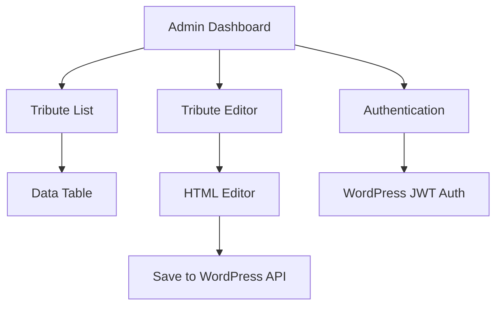
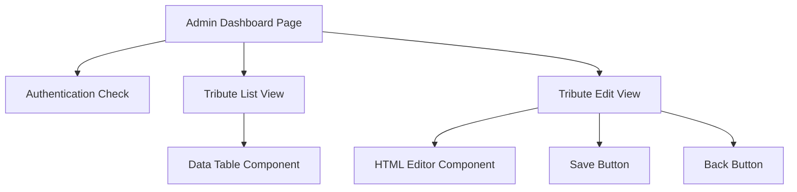
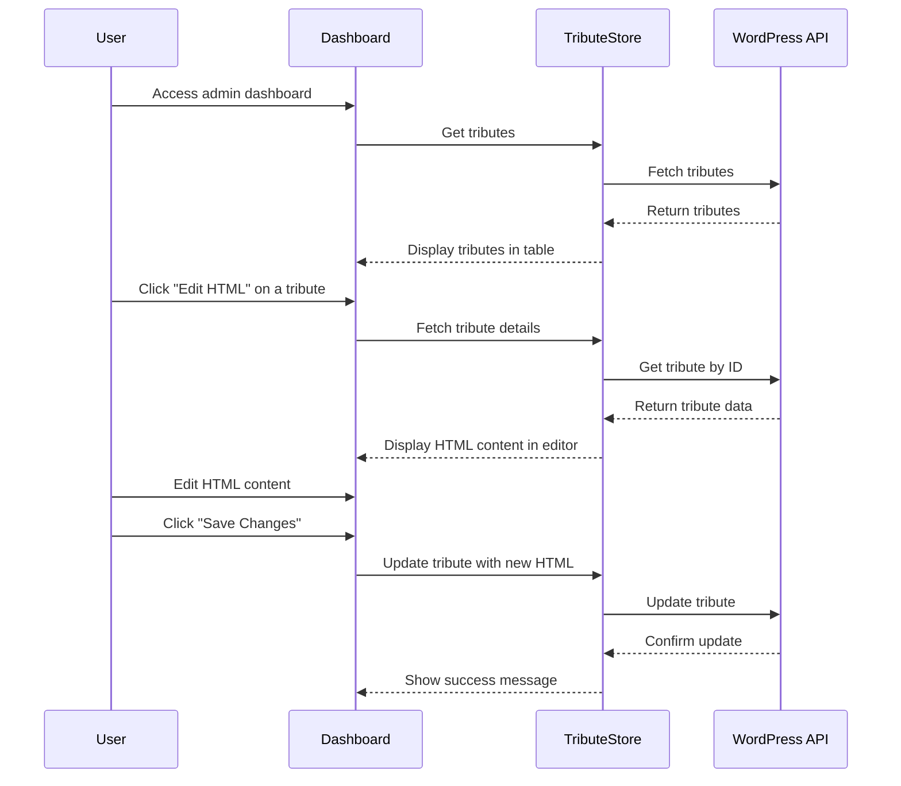

# WordPress REST API Admin Dashboard Implementation Plan

## Overview

We'll create a simple admin dashboard that allows administrators to edit the HTML content of tribute pages. The dashboard will focus solely on allowing admins to edit the HTML content stored in the `page_html` field of the tribute records in WordPress.

## Architecture



## Component Structure



## Implementation Steps

### 1. Create Server-Side Load Function

First, we'll create a server-side load function to check if the user is authenticated and has admin access:

```typescript
// +page.server.ts
import { redirect } from '@sveltejs/kit';
import { accessControlService } from '$lib/services/access-control-service';

export const load = async ({ cookies }) => {
  // Check if user has admin access
  if (!accessControlService.hasAdminAccessFromCookies(cookies)) {
    throw redirect(302, '/login?redirect=/my-portal/admin-dashboard');
  }
  
  // Return empty data object
  return {};
};
```

### 2. Create Admin Dashboard Page

Next, we'll create the admin dashboard page with two main views:
1. A list view showing all tributes
2. An edit view for editing the HTML content of a selected tribute

```svelte
<!-- +page.svelte -->
<script lang="ts">
  import { setTributeStoreContext } from '$lib/stores/tribute-store.svelte.ts';
  import DataTable from '$lib/components/admin/data-table.svelte';
  import HtmlEditor from '$lib/components/admin/html-editor.svelte';
  import { accessControlService } from '$lib/services/access-control-service';
  import { onMount } from 'svelte';
  
  // Initialize tribute store
  const tributeStore = setTributeStoreContext();
  
  // State
  let view = 'list';
  let selectedTributeId: number | null = null;
  let htmlContent = '';
  let isLoading = false;
  let isSaving = false;
  let errorMessage = '';
  let successMessage = '';
  
  // Table columns
  const columns = [
    { key: 'id', label: 'ID', sortable: true },
    { key: 'loved_ones_name', label: 'Name', sortable: true, filterable: true },
    { key: 'created_at', label: 'Created', sortable: true },
    { key: 'updated_at', label: 'Updated', sortable: true }
  ];
  
  // Table actions
  const actions = [
    {
      label: 'Edit HTML',
      variant: 'primary',
      onClick: (row) => {
        selectedTributeId = row.id;
        loadHtmlContent(row.id);
        view = 'edit';
      }
    }
  ];
  
  // Load tributes on mount
  onMount(async () => {
    await tributeStore.getTributes();
  });
  
  // Load HTML content for a tribute
  async function loadHtmlContent(tributeId: number) {
    isLoading = true;
    errorMessage = '';
    
    try {
      // Fetch the tribute
      const tribute = await tributeStore.fetchTribute(tributeId);
      
      if (tribute) {
        htmlContent = tribute.page_html || '';
      } else {
        errorMessage = 'Failed to load tribute';
      }
    } catch (error) {
      errorMessage = 'An error occurred while loading tribute';
      console.error(error);
    } finally {
      isLoading = false;
    }
  }
  
  // Save HTML content
  async function saveHtmlContent() {
    if (!selectedTributeId) return;
    
    isSaving = true;
    errorMessage = '';
    successMessage = '';
    
    try {
      // Update the tribute
      const result = await tributeStore.updateTribute(selectedTributeId, {
        page_html: htmlContent
      });
      
      if (result) {
        successMessage = 'HTML content saved successfully';
      } else {
        errorMessage = 'Failed to save HTML content';
      }
    } catch (error) {
      errorMessage = 'An error occurred while saving HTML content';
      console.error(error);
    } finally {
      isSaving = false;
    }
  }
  
  // Go back to list view
  function goBack() {
    view = 'list';
    selectedTributeId = null;
    htmlContent = '';
    errorMessage = '';
    successMessage = '';
  }
</script>

<div class="admin-dashboard">
  <header class="dashboard-header">
    <h1>Tribute Management</h1>
  </header>
  
  <main class="dashboard-content">
    {#if view === 'list'}
      <div class="list-view">
        <h2>Tributes</h2>
        <DataTable 
          data={tributeStore.searchResults.tributes}
          {columns}
          {actions}
          loading={tributeStore.isLoading}
          emptyMessage="No tributes found"
        />
      </div>
    {:else if view === 'edit' && selectedTributeId}
      <div class="edit-view">
        <div class="edit-header">
          <h2>Edit Tribute HTML</h2>
          <div class="actions">
            <button class="back-button" on:click={goBack}>Back to List</button>
            <button class="save-button" on:click={saveHtmlContent} disabled={isSaving}>
              {isSaving ? 'Saving...' : 'Save Changes'}
            </button>
          </div>
        </div>
        
        {#if errorMessage}
          <div class="error-message">{errorMessage}</div>
        {/if}
        
        {#if successMessage}
          <div class="success-message">{successMessage}</div>
        {/if}
        
        <div class="editor-container">
          {#if isLoading}
            <div class="loading">Loading content...</div>
          {:else}
            <HtmlEditor 
              bind:value={htmlContent}
              height={600}
              plugins="code table lists link image media preview"
              toolbar="undo redo | formatselect | bold italic | alignleft aligncenter alignright | bullist numlist | link image media | code preview"
            />
          {/if}
        </div>
      </div>
    {/if}
  </main>
</div>

<style>
  .admin-dashboard {
    display: flex;
    flex-direction: column;
    min-height: 100vh;
  }
  
  .dashboard-header {
    background-color: #2c3e50;
    color: white;
    padding: 1rem 2rem;
    box-shadow: 0 2px 4px rgba(0, 0, 0, 0.1);
  }
  
  .dashboard-header h1 {
    margin: 0;
    font-size: 1.5rem;
  }
  
  .dashboard-content {
    flex: 1;
    padding: 2rem;
    max-width: 1200px;
    margin: 0 auto;
    width: 100%;
  }
  
  .list-view, .edit-view {
    background-color: white;
    border-radius: 0.5rem;
    box-shadow: 0 1px 3px rgba(0, 0, 0, 0.1);
    padding: 1.5rem;
  }
  
  .edit-header {
    display: flex;
    justify-content: space-between;
    align-items: center;
    margin-bottom: 1.5rem;
  }
  
  .actions {
    display: flex;
    gap: 0.75rem;
  }
  
  .back-button {
    padding: 0.5rem 1rem;
    background-color: #e2e8f0;
    color: #4a5568;
    border: none;
    border-radius: 0.25rem;
    cursor: pointer;
    transition: background-color 0.2s;
  }
  
  .back-button:hover {
    background-color: #cbd5e0;
  }
  
  .save-button {
    padding: 0.5rem 1rem;
    background-color: #4a90e2;
    color: white;
    border: none;
    border-radius: 0.25rem;
    cursor: pointer;
    transition: background-color 0.2s;
  }
  
  .save-button:hover:not(:disabled) {
    background-color: #3a80d2;
  }
  
  .save-button:disabled {
    opacity: 0.5;
    cursor: not-allowed;
  }
  
  .error-message {
    padding: 0.75rem;
    background-color: #fed7d7;
    color: #c53030;
    border-radius: 0.25rem;
    margin-bottom: 1rem;
  }
  
  .success-message {
    padding: 0.75rem;
    background-color: #c6f6d5;
    color: #2f855a;
    border-radius: 0.25rem;
    margin-bottom: 1rem;
  }
  
  .editor-container {
    border: 1px solid #e2e8f0;
    border-radius: 0.25rem;
  }
  
  .loading {
    display: flex;
    align-items: center;
    justify-content: center;
    height: 400px;
    background-color: #f8f9fa;
    color: #a0aec0;
  }
</style>
```

## Data Flow



## Security Considerations

1. **Authentication**: We'll use the existing authentication system to ensure only authenticated users can access the dashboard.
2. **Authorization**: We'll use the access control service to ensure only administrators can access the dashboard.
3. **Input Validation**: We'll validate the HTML content before saving it to prevent XSS attacks.
4. **Error Handling**: We'll handle errors gracefully and display appropriate error messages to the user.

## Testing Plan

1. **Authentication Testing**
   - Verify that unauthenticated users are redirected to the login page
   - Verify that non-admin users cannot access the dashboard

2. **Tribute List Testing**
   - Verify that tributes are loaded correctly
   - Verify that the data table displays the tributes correctly

3. **HTML Editor Testing**
   - Verify that the HTML editor loads the tribute's HTML content correctly
   - Verify that the HTML editor allows editing the content
   - Verify that the save button updates the tribute's HTML content

## Timeline

1. **Setup Phase (1 day)**
   - Create the server-side load function
   - Create the basic admin dashboard page structure

2. **Implementation Phase (1-2 days)**
   - Implement the tribute list view
   - Implement the HTML editor view
   - Implement the save functionality

3. **Testing Phase (1 day)**
   - Test all functionality
   - Fix any issues
   - Refine the user interface